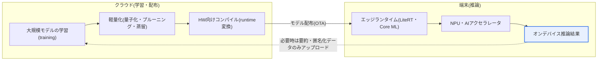
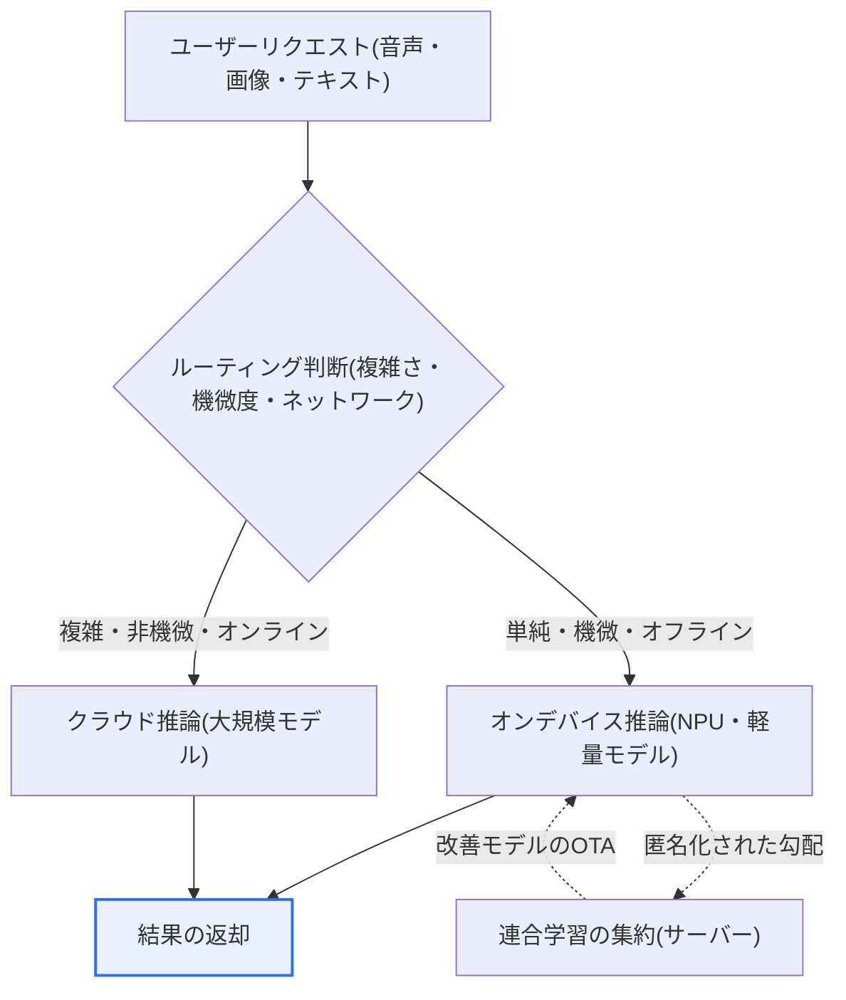

# オンデバイスAI(On-Device AI)

## 1. 概要

### A. 定義
> **オンデバイスAI**とは、クラウドサーバーではなく**スマートフォン・IoT機器などの端末(edge device)自体で直接AI推論(inference)を実行**する技術である。データを外部に送信せず、機器内でモデルを実行して結果を生成する。

オンデバイスAIの核心的な発想は、「**AIをデータのある場所へ持っていくこと**」である。これまで大半のAIサービスは、端末がデータをクラウドに送り、サーバーの強力な大規模モデルが処理して結果を返す**中央集権型(cloud-centric)**の構造であった。この構造にはデータセンターのGPU資源を存分に活用できるという利点があるが、必ずネットワークが必要であり、往復遅延(round-trip latency)が発生し、写真・音声・位置情報のような機微な個人データを外部に出さなければならないという根本的な限界を抱えている。オンデバイスAIは、AIモデルそのものを端末に内蔵(embedding)することで、この限界を正面から解消する。

その結果、三つの構造的な利点が生まれる。第一に、データが機器から離れないため**プライバシーが根本的に保護**される。第二に、サーバーとの往復がないため**ネットワークなしでも即座に反応(低遅延・オフライン)**する。第三に、推論が端末で行われるため**サーバーインフラのコストと帯域幅のコストが削減**される。スマートフォンの顔認証によるロック解除、リアルタイム通話翻訳、カメラのシーン・被写体認識、音声アシスタントのウェイクワード検知が代表的な事例である。ただし端末はデータセンターに比べて演算能力・電力・メモリが極度に制限されるため、重い大規模モデルをそのまま載せることはできない。したがって、モデルを小さく効率的に圧縮する**軽量化(model compression)**と、これを低消費電力で加速する**専用半導体(NPU)**が、オンデバイスAIの成否を分ける中核的な課題となる。

### B. 主な特徴
オンデバイスAIは、ローカル処理(データを送信しない)、低遅延・オフライン動作、パーソナライズ(端末に蓄積された個人のコンテキストの活用)、そして資源制約下での効率の最大化という特徴を持つ。これらの特徴は互いにかみ合っており、例えばローカル処理という特性がプライバシーとオフライン動作を同時に可能にする、といった具合である。

### C. 登場背景と必要性
オンデバイスAIが近年急浮上した背景には、互いにかみ合う四つの要因がある。まず**プライバシー規制の強化**である。EUのGDPRや韓国の個人情報保護法が個人データの国外・外部への移転を厳格に規律するようになり、データを端末の外に一切出さないローカル処理方式が、規制遵守の観点から魅力的な代替手段となった。第二に、**リアルタイム応答の要求**である。自動運転・産業安全・AR/VRのように数十msの遅延すら致命的となる用途では、クラウドとの往復遅延を許容できないため、端末処理が事実上必須である。

第三に、**クラウドコストとネットワーク依存の問題**である。生成AIの普及で推論リクエスト量が急増し、GPUサーバーの運用コストが指数関数的に増えたことで、単純・反復的な推論を端末へ分散(offloading)しようとする経済的インセンティブが大きくなった。第四に、何よりも**モバイルAI半導体(NPU)の性能向上**である。AppleのNeural Engine、QualcommのHexagon、SamsungのExynos NPUなどが世代を重ねるごとに数十TOPS(毎秒兆単位の演算)規模の低消費電力推論を可能にし、これがオンデバイスAIを「実験」から「商用」へと引き上げる決定的な契機となった。これら四つの要因は独立したものではなく相互に強化し合う関係にあり、規制・用途・経済・ハードウェアが同時にオンデバイスの方向を指しているという点が、この技術の持続可能性を裏付けている。

## 2. 全体構造と動作原理

オンデバイスAIシステムは大きく、**クラウドでの学習(training)**と**端末での推論(inference)**に二元化される。重い学習は依然としてデータセンターで大規模データを用いて行い、その成果物であるモデルを軽量化・コンパイルして端末に配布し、実際の推論のみを端末で処理するのが一般的なアーキテクチャである。以下の構造図は、学習〜軽量化〜配布〜推論へと続く全体の流れを示している。

この構造で注目すべき点は、**データの流れが最小化**されることである。元データは端末にとどまり、クラウドとの間ではモデル(ダウンロード)と匿名化された要約統計(選択的なアップロード)のみがやり取りされる。特に、複数の端末が元データを共有しないままローカルで学習した結果(勾配)だけをサーバーで統合する**連合学習(Federated Learning)**の手法と組み合わせれば、プライバシーを守りながらモデルを継続的に改善できる。すなわちオンデバイスAIは、単に「推論を端末へ移すこと」にとどまらず、学習・配布・再学習の全サイクルにおいてデータを局所化するアーキテクチャ思想として理解すべきである。

## 3. ハードウェアおよびソフトウェアの中核技術

### A. ハードウェア — NPUとヘテロジニアスコンピューティング
オンデバイスAIの物理的な土台は**NPU(Neural Processing Unit、ニューラルネットワーク処理装置)**である。CPUは汎用の逐次処理に、GPUは大規模な並列浮動小数点演算に強いが、いずれも電力あたりの効率(性能/W)の面で、モバイルでの常時推論には負担が大きい。NPUは、ニューラルネットワークの中核演算である行列の積和演算(MAC)を低精度・低消費電力で大量に実行するよう特化したアクセラレータであり、同じ推論をGPUに比べて数分の一の電力で処理する。AppleのNeural Engine、Qualcomm SnapdragonのHexagon NPU、SamsungのExynos NPUが代表的であり、最新のフラッグシップAPは数十TOPS級の性能を提供する。

実際の端末では一つのプロセッサだけを使うのではなく、CPU・GPU・NPUを処理の特性に応じて使い分ける**ヘテロジニアスコンピューティング(heterogeneous computing)**が一般的である。例えば前処理はCPU、画像フィルタはGPU、ニューラルネットワーク推論はNPUが担うといった具合である。ランタイムはモデルの各演算(operator)をどのハードウェアに配置するかを決定する**ハードウェアデリゲーション(delegation)**を行い、この配置の最適化が実際の体感性能とバッテリー消費を大きく左右する。

### B. モデル軽量化 — 量子化・プルーニング・知識蒸留
限られた端末資源でAIを動かすための最も重要なソフトウェア技術が**モデル軽量化**である。代表的な手法は三つある。第一に、**量子化(Quantization)**は重み・活性値の表現精度を下げる手法である。例えば32ビット浮動小数点(FP32)を8ビット整数(INT8)に変えるとモデルサイズは約4分の1に縮小し、整数演算に最適化されたNPU上ではるかに高速に動作する。ただし精度が下がった分だけ推論精度の損失が生じうるため、学習過程に量子化を反映するQAT(Quantization-Aware Training)で損失を最小化する。

第二に、**プルーニング(Pruning、枝刈り)**は寄与度の低い重み・ニューロン・チャネルを除去し、モデルを疎(sparse)にする手法である。人間の脳があまり使わないシナプスを整理するように、重要度の低い結合を切り落として演算量とメモリを削減する。第三に、**知識蒸留(Knowledge Distillation)**は、大きく高精度な教師モデル(teacher)の出力分布を小さな生徒モデル(student)が模倣するよう学習させ、小さなモデルが大きなモデルに近い性能を出せるようにする手法である。実務ではこの三つの手法を単独で使うよりも、**蒸留で構造を縮小し、プルーニングで疎化し、量子化で精度を下げるという形で組み合わせ**、目標精度を守りつつサイズ・遅延・電力を同時に最適化する。

### C. ソフトウェアフレームワークとランタイム
軽量化されたモデルを実際の端末で実行するには、端末のOS・チップセットに適合した**エッジランタイム**が必要である。Googleは長らく**TensorFlow Lite(TFLite)**を提供してきたが、2024年9月にこれを**LiteRT**へと改称した。改称の背景は、このランタイムがTensorFlowだけでなくPyTorch・JAX・Kerasで作られたモデルまで包括する汎用のオンデバイスランタイムへと成長したためであり、以後GPU・NPUアクセラレーションとLLM・拡散モデルのサポートを強化する方向で発展している。Apple陣営には**Core ML**、相互運用標準としては**ONNX Runtime**、QualcommのQNNなどチップセットベンダーごとのSDKがある。これらのフレームワークは、学習済みモデルを端末専用のフォーマットに変換し、デリゲート(delegate)を通じてNPU・GPUへ演算をオフロードする役割を担う。

| 区分 | 代表的な技術 | 役割・要点 |
|---|---|---|
| **ハードウェア** | NPU(Neural Engine・Hexagon・Exynos NPU)、AIアクセラレータ | 低消費電力・高効率なニューラルネットワーク推論、ヘテロジニアスコンピューティング |
| **モデル軽量化** | 量子化(FP32→INT8)、プルーニング、知識蒸留 | サイズ・遅延・電力の削減、精度損失の最小化 |
| **ランタイム/フレームワーク** | LiteRT(旧TFLite)、Core ML、ONNX Runtime、QNN | モデル変換・HWデリゲーション・推論実行 |
| **学習との連携** | 連合学習(Federated Learning) | 元データを共有しない状態での協調学習 |

## 4. クラウドAIとの比較 — 差異の理由と含意

オンデバイスAIとクラウドAIは優劣の問題ではなく、**資源の位置の違いから派生するトレードオフ**として理解すべきである。処理の場所がサーバーか端末かが、残りのすべての特性を決定する。クラウドは事実上無制限に近いGPU資源を使えるため超大規模モデルを動かせるが、データが外部に出て、ネットワーク遅延・コストが伴う。反対に端末は資源が限られ軽量モデルしか動かせないが、データが外に出ないため、プライバシー・遅延・オフラインの面で圧倒的に有利である。

| 区分 | クラウドAI | オンデバイスAI |
|---|---|---|
| **処理場所** | データセンターのサーバー | 端末(edge) |
| **プライバシー** | データを外部送信 → 漏えい・規制リスク | ローカル処理 → 根本的に保護 |
| **遅延/接続性** | ネットワーク往復遅延、接続必須 | 低遅延、オフライン動作 |
| **演算能力** | 強力(超大規模・大規模モデル) | 制限あり(軽量・小型モデル) |
| **コスト構造** | サーバー・帯域幅の運用費(変動費) | 端末資源の消費(固定費) |
| **モデル更新** | サーバーで即時反映 | OTA配布が必要、更新に遅延 |

この差異の実務上の含意は明確である。**精度が最優先でデータの機微度が低い対話型の生成タスク**はクラウドが、**プライバシー・リアルタイム性が最優先の常時検知・パーソナライズタスク**はオンデバイスが有利である。そのため現実の商用サービスは二者択一ではなく、**ハイブリッド(hybrid)**へと収斂する。例えばスマートフォンの音声アシスタントは、ウェイクワード検知や簡単なコマンドはオンデバイスで即座に処理し、複雑な質疑応答はクラウドに回すという形で役割を分担する。このとき「どの処理をどこで行うか」を決定する**オーケストレーション(ルーティング)ポリシー**が、サービス品質とコストを左右する中核的な設計変数となる。

以下のプロセス詳細図は、ハイブリッド環境において一つのリクエストがどのような経路で処理されるかを示している。ルーティングの判断は通常、リクエストの**複雑さ・データの機微度・ネットワーク状態**を総合して行われ、機微なデータやオフライン状況であるほどオンデバイスの経路が選択される。

この流れで重要なのは、端末が単なる「結果の消費者」ではなく、匿名化された学習シグナルを返してモデルを共に改善する**能動的な参加者**になるという点である。すなわちオンデバイス推論と連合学習・OTA更新が一つの循環ループを形成し、このループが適切に設計されるほど、プライバシーを守りながらもモデルが継続的に洗練されていく。

## 5. 深掘り — オンデバイス生成AI(sLLM)と最新動向

近年のオンデバイスAIにおける最大の話題は、**生成AIの端末への内在化**である。数十億〜数百億パラメータの大規模言語モデル(LLM)は端末にそのまま載せられないため、パラメータを大幅に削減し軽量化した**sLLM(small LLM)**を端末で動かす試みが本格化した。GoogleはAndroidに組み込まれる**Gemini Nano**でメッセージの要約・スマートリプライなどをオフラインで処理する方向を示し、Appleは**Apple Intelligence**で端末処理とプライベートクラウドを組み合わせるハイブリッド戦略を、Samsungは**Galaxy AI**でオンデバイスの通訳・要約を商用化した。こうした流れは、パーソナライズ・プライバシー・オフラインというオンデバイスの強みと、生成AIの爆発的な需要が交わる接点である。

技術面では三つの進展が際立っている。第一に、**低ビット量子化の高度化**により、4ビット(INT4)以下でも実用的な精度を維持する手法が広がっている。第二に、ランタイムのレベルで**複数チップセットのNPUを一貫したAPIで扱う統合アクセラレーション(unified NPU acceleration)**が導入され、開発者がベンダーごとの断片化に悩まされることなくNPUを活用できるようになった。第三に、**ハイブリッドオーケストレーションの精緻化**により、クエリの複雑さ・機微度・ネットワーク状態をリアルタイムに判断して端末とクラウドへ動的に振り分ける方式が発展している。ただしsLLMは大規模モデルに比べてハルシネーション(hallucination)・精度の限界が顕著であるため、どの処理まで端末に任せるかという慎重な境界設定が依然として課題として残っている。

具体的な応用事例としては**リアルタイム通訳・字幕**が挙げられる。クラウド往復方式は通信遅延にサーバー処理時間が加わるため会話の自然な流れを途切れさせやすいが、オンデバイスの音声認識・翻訳モデルはネットワーク往復をなくして体感遅延を大きく減らし、機内や海外ローミングのようなオフライン環境でも動作するという利点がある。もう一つの事例は**スマートフォンカメラのリアルタイムシーン解析**であり、撮影の瞬間に被写体・照明を認識して画質を補正する処理は、シャッター遅延をなくすために必ず端末上で行われなければならない。このように「遅延がそのまま使い勝手」となる用途であるほど、オンデバイスの価値は精度の損失を補って余りある。

## 6. 考慮事項と示唆

1. **軽量化と精度のバランス(trade-off)管理が鍵である。** モデルを小さくするほど端末での実行は容易になるが、精度は低下する。量子化・プルーニング・蒸留を組み合わせつつ、目標とする精度・遅延・電力を定量指標(KPI)として設定し、QATなどで損失を最小化する体系的な最適化が必要である。「小さく」が目的なのではなく、「十分に正確でありながら十分に小さく」が目的であることを忘れてはならない。

2. **プライバシー・規制対応の戦略的資産として活用すべきである。** データが端末から離れないという特性は、GDPR・個人情報保護法への対応において強力な武器となる。連合学習・差分プライバシー(differential privacy)と組み合わせれば「データを集めずにモデルを改善する」プライバシー保護型AIを実現できるため、規制リスクを設計段階で根本的に遮断するprivacy-by-designの観点からアプローチすべきである。

3. **ハイブリッドアーキテクチャとオーケストレーションの設計が成否を左右する。** 純粋なオンデバイスよりも端末とクラウドの協調が現実的な解決策であるため、処理の機微度・複雑さ・遅延要求に応じて処理場所を動的にルーティングするポリシーと、モデルを安全に更新するOTA配布・バージョン管理の体系を併せて設計すべきである。

4. **ハードウェアの断片化と配布・運用の負担を考慮すべきである。** 端末ごとにNPU性能・ランタイムのサポート状況がまちまちであるため、一つのモデルを多様な機器で一貫して動作させるには、相当な検証・最適化コストがかかる。統合アクセラレーションAPI・標準フォーマット(ONNX)の採用、機器グレード別のモデル分岐戦略によってこの断片化コストを管理し、配布後も性能・電力・精度を継続的にモニタリングするMLOps体制(エッジMLOps)を整えるべきである。

5. **エネルギー効率と発熱・バッテリーの制約を設計上の制約として扱うべきである。** 端末はバッテリーと放熱能力が限られるため、常時推論がバッテリー消費・発熱につながると使い勝手が急激に悪化する。推論頻度・モデルサイズ・NPU活用を電力予算(power budget)の範囲内で設計し、必要なときだけ推論をトリガーする方式で電力を管理すべきである。性能だけでなく、性能/ワットこそがオンデバイス設計の第一の指標であると認識すべきである。

6. **展望 — エッジ・クラウドの連続体(continuum)への進化。** オンデバイスAIは独立した技術ではなく、端末・エッジサーバー・クラウドが一つの連続したコンピューティング資源として統合される流れの一部である。今後sLLMの性能向上とNPUの発展に伴い、端末が担う知能の比重は増え続けるであろうし、これはパーソナライズ・プライバシー・エネルギー効率を同時に達成する持続可能なAI(sustainable AI)の観点からも重要な方向性である。

## 参考資料
- Google Developers Blog, "TensorFlow Lite is now LiteRT" — https://developers.googleblog.com/tensorflow-lite-is-now-litert/
- Google Developers Blog, "LiteRT: The Universal Framework for On-Device AI" — https://developers.googleblog.com/litert-the-universal-framework-for-on-device-ai/
- 9to5Google, "Google renames TensorFlow Lite to LiteRT" — https://9to5google.com/2024/09/04/tensorflow-lite-litert/

---

> **一言まとめ**: オンデバイスAIは*端末自体でAI推論を実行*することでプライバシー(ローカル処理)・低遅延・オフラインという強みを提供し、NPUベースのヘテロジニアスコンピューティングとモデル軽量化(量子化・プルーニング・蒸留)が中核であり、連合学習・sLLM(Gemini Nano・Apple Intelligence・Galaxy AI)とハイブリッドオーケストレーションを通じてエッジ〜クラウドの連続体へと進化している。
