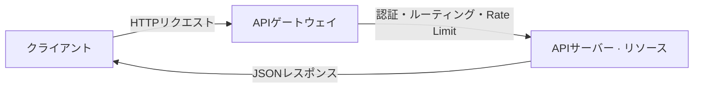

# オープンAPI(Open API)

## 1. 概要

### A. 定義
> 外部の開発者・サービスがアクセス・利用できるよう**公開された標準インターフェース**であり、組織が保有するデータ・機能を開放して、サービスの連携・拡張と**エコシステム(プラットフォーム)**を促進する。

### B. 登場背景と必要性
かつてのシステムは閉鎖的であり、外部とデータをやり取りするには毎回個別の連携を開発しなければならなかった。しかしデジタル経済では、**一つのサービスが複数のサービスと結合(マッシュアップ)**するときに価値が大きくなる。地図の上に配達・不動産情報を重ねるようにである。Open APIはこの結合を「標準化された契約」とし、誰もが定められた規格に従って機能を呼び出せるようにする。特に金融業界の**オープンバンキング・マイデータ**は、法・制度によってAPIの開放を義務付けており、Open APIが産業インフラとなった代表例である。

### C. 特徴

Open APIの特徴は、そのままその価値であり、同時に管理上の負担でもある。開放性・標準性・再利用性がエコシステムを拡大する一方で、誰でも呼び出せるため**認証・課金・トラフィック制御**が必ず伴う。

| 特徴 | 内容 |
|---|---|
| 開放性 | 認証された外部主体に機能・データを公開 |
| 標準性 | HTTP・REST・OpenAPI(Swagger)などの標準に準拠 |
| 再利用性 | マッシュアップ・プラットフォームエコシステムの拡張 |
| 管理の必要性 | 認証・課金・バージョン・トラフィック制御(APIゲートウェイ) |

## 2. SOAPとRESTの構成要素の比較

Open APIを実装する二つの方式がSOAPとRESTである。両者の根本的な違いは、SOAPが**厳格なXMLプロトコル**であるのに対し、RESTは**HTTPをそのまま活用するアーキテクチャスタイル**であるという点である。SOAPは標準が強固でWS-Security・トランザクションを備えているため、銀行間取引のように高い信頼性が必要な場面に適しているが、重い。RESTはリソースをURIで表現し、HTTPメソッド(GET・POSTなど)で操作するため軽量で、キャッシュ・拡張が容易であり、Web・モバイル・公開APIの事実上の標準となった。このため今日のOpen APIの大半は、REST(またはその代替であるGraphQL)で提供されている。

| 区分 | SOAP | REST |
|---|---|---|
| 概念 | XMLベースのプロトコル | HTTPベースのアーキテクチャスタイル |
| 構成要素 | Envelope・Header・Body、WSDL、UDDI | リソース(URI)・HTTPメソッド・表現(JSON)・ステートレス |
| メッセージ | XML | 主にJSON |
| 特徴 | 強固な標準・トランザクション・WS-Security | 軽量・拡張性・キャッシュ・Stateless |
| 適合領域 | エンタープライズ・高信頼 | Web・モバイル・公開API |

## 3. 脆弱性と対応策(OWASP API Top 10)

Open APIは外部に公開されるため、Webアプリケーションとは異なるAPI特有の脅威を受ける。その中で最も一般的かつ致命的なのが**BOLA(オブジェクトレベルの認可不備)**であり、認証は通過したものの「**他人のデータにアクセスする権限**」まで検証していないため、URLのIDを変えるだけで他人の情報が閲覧できてしまう欠陥である。例えば `/orders/1001` を `/orders/1002` に変えて他人の注文を見るといった具合である。したがってリクエストごとに**当該オブジェクトの所有権・権限をサーバーが検証**しなければならない。

| 脆弱性 | 原理 | 対応 |
|---|---|---|
| 認証・認可の不備(BOLA) | オブジェクト所有権の未検証 | OAuth 2.0・JWT + オブジェクトレベルの権限検証 |
| 過剰なデータ露出 | レスポンスに不要なフィールドを含む | レスポンスフィールドの最小化、スキーマ検証 |
| リソース枯渇(DoS) | 無制限の呼び出し・大量照会 | Rate Limiting・クォータ、ページネーション |
| インジェクション | 未検証の入力がクエリとして実行 | 入力検証、パラメータバインディング |
| 不適切な資産管理 | 放置・旧バージョンAPIの露出 | APIインベントリ・バージョン管理、廃止APIの遮断 |

## 4. API管理(ライフサイクル)

Open APIは一度公開すれば終わりではなく、外部の利用者が依存するため、**バージョン・廃止まで慎重に管理**しなければならない。突然APIを変更すると、それを利用していたすべてのサービスが壊れてしまうからである。そのため設計段階で**OpenAPI仕様によって契約を先に定め(契約優先)**、ゲートウェイ・ポータルで公開・運用し、廃止時には十分な猶予期間と移行案内を設ける。

| 段階 | 活動 |
|---|---|
| 設計 | OpenAPI仕様(契約優先)、標準化 |
| 公開 | APIゲートウェイ・開発者ポータルへの登録 |
| 運用 | 認証・課金・モニタリング・トラフィック制御 |
| 廃止 | バージョンの廃止・移行案内 |

## 5. 考慮事項と示唆
- **ゲートウェイ中心の統制**: 認証・トラフィック制限・バージョン・ロギングを個々のAPIごとに実装する代わりに、**APIゲートウェイ**で一元化し、セキュリティ・運用を一貫して適用する。
- **契約優先(Contract First)**: OpenAPI仕様を先に確定すれば、ドキュメント・モックサーバー・クライアントコードを自動生成でき、開発生産性と一貫性が向上する。
- **セキュリティ強化・展望**: 内部ネットワークも信頼しない**ゼロトラスト**と**mTLS**でAPI区間を保護し、Open APIはオープンバンキング・マイデータ・公共データ開放の基盤インフラとして拡大を続けている。

---

> **一言まとめ**: オープンAPIは、標準(REST/SOAP)ベースの公開インターフェースとしてマッシュアップ・プラットフォームエコシステムを拡張し、OAuth・オブジェクト権限検証・ゲートウェイ・Rate LimitingでOWASP APIの脆弱性(特にBOLA)に対応し、契約優先・ライフサイクル管理によって運用される、オープンバンキング・マイデータの基盤である。
