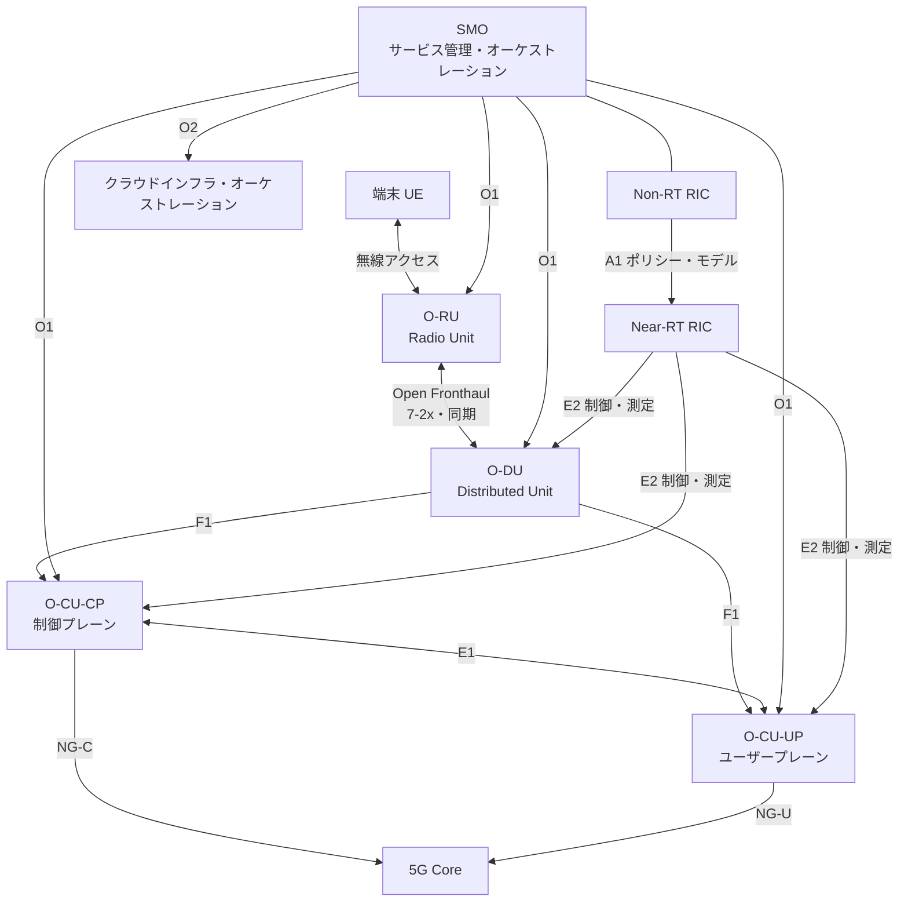
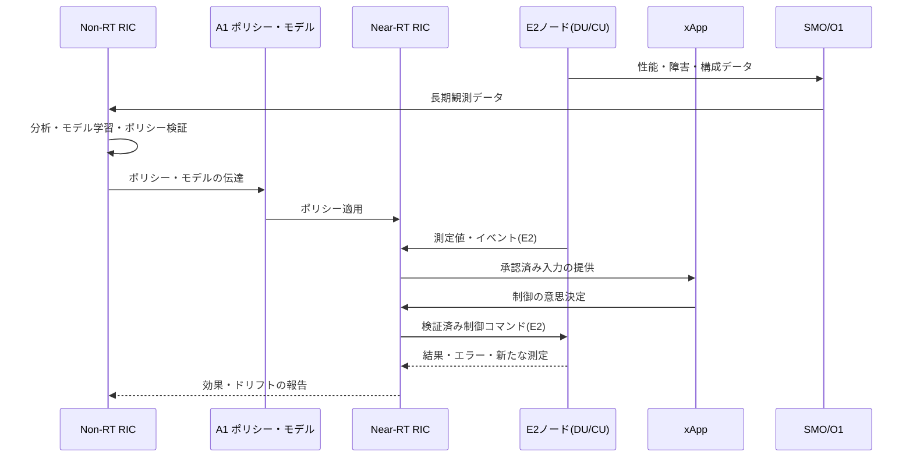

# Open RAN(オープン無線アクセスネットワーク)アーキテクチャとRICベースのインテリジェンス化

## 1. 概要

> **定義**: Open RAN(Open Radio Access Network)とは、無線アクセスネットワークの機能をRU・DU・CUなどに分離し、オープンな標準インターフェース・仮想化・インテリジェントな制御を適用することで、マルチベンダーの相互運用性と自動化を目指すRANアーキテクチャである。

移動通信の無線アクセスネットワーク(RAN)は、端末とコアネットワークの間で無線信号を処理し、セルリソース・モビリティ・品質を制御する中核領域である。従来の基地局は、無線装置、ベースバンド処理、制御ソフトウェアが特定ベンダーの装置とインターフェースに強く結合されている場合が多かった。一つのベンダーの装置を長期間使用すれば統合と運用は単純になりうるが、装置の置き換えや機能革新の選択肢が狭まり、ベンダーロックインとコスト構造の不透明性が大きくなりうる。

Open RANはこの問題を、単に「基地局をオープンソースにする」という方式で解決するものではない。RAN機能の分離点とインターフェースを標準化し、ハードウェアとソフトウェアの組み合わせの可能性を高め、集中・分散制御をソフトウェアで自動化する、産業アーキテクチャの変化である。したがってインターフェースが公開されても、適合性試験、性能最適化、運用責任とセキュリティが確保されなければ、実際の開放性は限定される。

中核的な構成は、O-RANのオープンフロントホールを通じて接続されるO-RUとO-DU、O-CU、そしてこれらを管理・オーケストレーションするSMO(Service Management and Orchestration)である。O-CUはさらに、制御プレーンを担当するO-CU-CPとユーザープレーンを担当するO-CU-UPに分けて説明できる。インテリジェンス化は、Non-RT RICとNear-RT RICがポリシーとリアルタイム制御を分担して実行する方式で実現される。

Open RANを設計する際には、四つの目標を併せて見る必要がある。第一に、ベンダー間の相互運用性である。第二に、汎用サーバーとクラウド技術を活用する柔軟性である。第三に、RICとアプリケーションによる自動化・最適化である。第四に、開放された接点とマルチベンダー構成を前提としたセキュリティ・性能・運用性である。どれか一つだけを達成して残りを犠牲にすれば、商用網で持続可能な構造とはなりにくい。

本答案では、Open RANの登場背景、機能分解とインターフェース、RICによるインテリジェンス化、構築手順、既存RAN・vRANとの比較、セキュリティと性能の考慮事項、および技術士の観点からの適用戦略を論述形式で整理する。

## 2. 登場背景と基本原理

### A. 従来型RANの構造的限界

従来のRANは、無線処理装置とベースバンド装置、制御ソフトウェアが一つの製品群として供給される構造が一般的であった。この構造には、一つのベンダーがハードウェア・ソフトウェア・試験・障害の責任を統合するという利点がある。反面、他ベンダーの装置を同一の無線網に混在させるには独自インターフェースと相互運用条件を別途合わせる必要があるため、置き換えコストと検証負担が大きくなる。

また、トラフィックとサービス要求が時間・地域ごとに異なっても、専用装置の容量を柔軟に再配置することは難しい。都心の特定の時間帯には容量が不足する一方で、他の地域では遊休リソースが余ることもある。ソフトウェアベースの機能と仮想化リソースを活用すればリソース配置と機能更新を柔軟にできるが、無線物理層の遅延・同期・スループットの制約も同時に満たさなければならない。

5G以降は、単純な音声・データ接続を超えて、ネットワークスライシング、超低遅延サービス、産業用プライベート網、大規模IoTといった多様な要求が生まれた。RANは静的な基地局設定を超え、ポリシーと観測データに基づいてリソースを調整しなければならない。この変化がオープンインターフェース、クラウドネイティブ運用、AI/MLベースの最適化と結びつき、Open RANの必要性が高まった。

### B. Open RANの中核原理

第一は**機能分離(disaggregation)**である。無線信号を送受信するRU、分散したベースバンド処理機能を担うDU、上位レイヤー処理とコアネットワーク連携を担うCUを論理的・物理的に分けることで、配置場所とベンダー構成を選択できる。ただし分離点ごとにデータ量、遅延、同期、伝送網の要求が異なるため、機能を分けること自体が常にコスト削減を意味するわけではない。

第二は**オープンインターフェース(open interface)**である。オープンインターフェースは、機能間の相互作用のメッセージ、手順、性能・セキュリティ要求を明確にし、異なる実装を接続できるようにする。インターフェース文書が公開されていても、実装ごとのオプション、プロファイル、試験方法が異なれば統合上の問題が残るため、適合性・相互運用性試験と運用上の可視性が併せて必要である。

第三は**仮想化とクラウド化**である。DU・CU機能を汎用サーバー、アクセラレータ、コンテナまたは仮想マシン上で実行すれば、ハードウェア調達と機能展開の選択肢が広がる。しかし一般的なITワークロードとは異なり、無線処理は厳格なタイミングとスループットを要求するため、CPUピンニング、NUMA配置、アクセラレータ、リアルタイムカーネル、高精度同期の設計を考慮しなければならない。

第四は**インテリジェントな制御(intelligence)**である。RANから収集した性能・障害・負荷のデータを活用してポリシーを策定し、アプリケーションがセル選択・負荷分散・省エネルギーといった制御を補助する。AIが制御ループの中に入るほど、データ品質、モデル検証、ポリシーの衝突、失敗時の安全なデフォルト値とロールバックが重要になる。

## 3. Open RANの機能構造とインターフェース

### A. 全体構成

O-RUは、無線周波数とアンテナに近い位置でデジタル無線信号を処理する。アンテナ付近に配置すればフロントホールの伝送距離を短縮できるが、現場装置の電力・温度・保守条件が重要になる。O-RUの機能と性能はDUとのオープンフロントホールの条件に適合していなければならず、相互運用試験では遅延と同期偏差を併せて検証する必要がある。

O-DUは、RANプロトコルスタックのうち時間制約の大きい下位レイヤー機能を分散した場所で処理する。O-DUはセル負荷と無線リソースに近いため遅延に敏感であり、汎用サーバーで実装する場合でもリアルタイム処理とアクセラレーションを保証しなければならない。中央クラウドに無条件に統合するのではなく、伝送網の遅延と障害の影響範囲を基準に配置場所を決定する。

O-CUは、上位レイヤー機能を中央または地域のクラウドに配置できるようにする。制御プレーンは接続・モビリティ制御を、ユーザープレーンはユーザーデータの転送を担当するよう分離できる。この分離はトラフィック経路の最適化とリソースの拡張に役立つが、CU内部およびCU-DU間の状態の一貫性とフェイルオーバーを運用設計に含めなければならない。

SMOは、RANリソースとクラウドリソースの展開・構成・監視・ライフサイクルを調整する管理レイヤーである。ネットワーク機能を配置するだけでなく、インベントリ、障害、性能、ソフトウェアバージョン、ポリシーと証明書を一貫して管理しなければならない。SMOがベンダーごとのツールの寄せ集めにとどまると、オープン構造の運用の複雑さはむしろ増大しうる。

### B. 主要インターフェースの役割

Open Fronthaulは、O-RUとO-DUの間の無線データ・制御・同期の伝送を担う。分離された装置間のデータ量が大きくタイミング制約が強いため、このインターフェースは伝送網の帯域幅、遅延、ジッタと正確な時刻同期を要求する。現場では装置の互換性だけでなく、ピークトラフィックと障害時の保護切り替えを試験しなければならない。

F1インターフェースはDUとCUの間の接続を提供し、分散・集中機能の分離を可能にする。E1はCU-CPとCU-UPの間の制御関係をサポートする。このようにレイヤーを分けると機能拡張と配置最適化が容易になるが、インターフェースが増えることで障害原因の分析とバージョン互換性の管理の重要性が高まる。

O1は管理・運用・保守の情報を交換するインターフェースであり、構成・性能・障害・ソフトウェア管理に活用される。O2は、SMOとクラウドインフラ・オーケストレーションレイヤーとの連携のための接点である。O1/O2の自動化レベルが低いと、事業者は複数ベンダーの装置ごとに別々の運用画面と手順を維持しなければならなくなる。

A1は、Non-RT RICとNear-RT RICの間でポリシー、インテリジェンス化の支援情報とモデル関連情報を伝達する。E2は、Near-RT RICとE2ノードであるCU・DUの間で測定と制御を結ぶ。O-RAN Allianceはこうした機能・インターフェースを技術文書として定義しており、実際の構築では当該文書のバージョンとサポートするプロファイルを明示しなければならない。

| 区分 | 接続対象 | 主な目的 | 設計時の要点 |
|---|---|---|---|
| Open Fronthaul | O-RU–O-DU | 無線データ・制御・同期 | 帯域幅・遅延・ジッタ・時刻同期 |
| F1 | O-DU–O-CU | 分散/集中機能の接続 | 状態管理・バージョン互換・切り替え |
| E1 | O-CU-CP–O-CU-UP | CUの制御・ユーザープレーン連携 | セッション状態・フェイルオーバー |
| O1 | SMO–RANノード | 構成・障害・性能・ソフトウェア管理 | 標準モデル・自動化・証跡 |
| O2 | SMO–クラウドインフラ | 仮想リソースのオーケストレーション | リソース・配置・ライフサイクル |
| A1 | Non-RT RIC–Near-RT RIC | ポリシー・モデル・意図の伝達 | ポリシー衝突・権限・検証 |
| E2 | Near-RT RIC–E2ノード | 測定・制御・最適化 | 遅延・安全性・アプリケーション分離 |

表のインターフェースは互いに代替関係にあるのではなく、それぞれ異なる抽象度と時間範囲を担当する。例えばO1の構成変更は管理ライフサイクルの中で処理されるが、E2の制御はセル負荷や無線リソースのような運用状態を短い周期で反映する。同じパラメータを複数の接点から変更できる場合は、権限の優先順位と衝突解決のルールを定めなければならない。

## 4. RICベースのインテリジェンス化と運用手順

### A. Non-RT RICとNear-RT RIC

Non-RT RICはSMOの中で、ポリシー・分析・モデル学習のような比較的長い周期の制御を行う。長期的な性能トレンド、エネルギー使用量、加入者の移動パターン、障害履歴を分析してポリシーやモデルを作成できる。ここで作成されたポリシーは現場制御の目標と制約を表現しなければならず、単に「最大化」という目的だけを与えてはならない。

Near-RT RICはE2ノードの測定情報を受け取り、比較的短い周期の制御を行う。負荷分散、デュアルコネクティビティの最適化、モビリティ支援、干渉緩和のようにリアルタイム性が必要な機能を、xApp形式のアプリケーションとして実装できる。複数のxAppが同じリソースを制御すると目標が衝突しうるため、実行の優先順位、ポリシーの範囲と承認された制御変数を管理しなければならない。

この構造においてAIモデルは、ネットワークを直接統制する万能モジュールではない。モデル入力の遅延・欠損・偏りを監視し、出力が許容範囲内かどうかをポリシーエンジンが検査した後にのみ、制御コマンドに変換しなければならない。モデルが不確実であったりデータ分布が変化したりした場合はルールベースの安全なデフォルトポリシーに切り替え、影響の大きいコマンドには人の承認を要求する方式が望ましい。

### B. インテリジェント制御の段階的手順

第一段階は、目的と制約を定義することである。「エネルギー使用量を最小化」という目標だけを置くと、サービス品質や緊急通信の優先順位が損なわれうる。したがってカバレッジ、スループット、遅延、スライスごとのSLA、緊急サービス、電力といった目的・制約を併せて数値化する。

第二は、データ収集と品質検証である。セル・装置・加入者グループごとの測定値の時間的整合、欠損、外れ値、ラベルの一貫性を確認する。測定データの出所と保存期間、個人情報の含有の有無を管理しなければ、インテリジェンス化がセキュリティ・個人情報のリスクを増大させかねない。

第三は、オフライン評価と限定的なオンライン検証である。過去データを用いた再現性評価とシミュレーションを行った後、一部のセル・時間帯にのみポリシーを適用して対照群と比較する。効果が平均的には良く見えても、特定の地域・端末・サービス群には不利に働く可能性があるため、セグメントごとの安全性と公平性を確認する。

第四は、展開・監視・撤回である。モデルとポリシーのバージョンをレジストリに登録し、承認者・学習データ・評価結果・適用範囲を記録する。運用中は目標指標だけでなく、制御コマンドの失敗率、ロールバック回数、例外の発生、データドリフトを監視し、基準を超えれば自動的に以前のバージョンやデフォルトポリシーへ戻す。

| 段階 | 主な活動 | 統制上の成果物 |
|---|---|---|
| 目的定義 | 目標・制約・影響範囲の設定 | 意図仕様、KPI/SLO、リスク許容度 |
| データ準備 | 収集・整合性・非識別化・品質点検 | データリネージ、品質レポート |
| 評価 | シミュレーション・対照群・例外試験 | 評価結果、承認記録 |
| 限定展開 | カナリアセル・段階的拡大 | 展開計画、ロールバック条件 |
| 運用 | 効果・ドリフト・障害の観察 | ダッシュボード、監査ログ |
| 改善・撤回 | 再学習・ポリシー調整・緊急切り替え | 変更記録、事後レビュー |

### C. SMOと自動化されたライフサイクル管理

SMOの自動化は装置を迅速に展開することで終わるのではなく、意図・構成・観測・変更・廃棄の全ライフサイクルをつなげなければならない。例えば新しいDUソフトウェアを展開する際は、互換性のあるRU・アクセラレータ・カーネルのバージョンを検証し、フロントホールの同期状態と性能基準を満たした後にのみトラフィックを流入させる。

構成管理は、あるべき状態(desired state)と実際の状態(actual state)の差分を示さなければならない。実際の状態が宣言と異なれば自動補正できるが、無条件に上書きすると現場の障害対応や緊急措置を元に戻してしまうリスクがある。変更の原因と承認、適用範囲、ロールバック方法を記録し、緊急変更は事後レビューで統制する。

運用者は、サービスカタログからセル・RU・DU・CU・RICアプリケーション・クラウドリソースの依存関係を確認できなければならない。障害が発生した場合、それが特定ベンダーの装置の問題なのか、フロントホール伝送網なのか、時刻同期なのか、RICポリシーなのかを迅速に切り分ける必要がある。この可観測性は、マルチベンダー環境においてSLA責任を判断する根拠となる。

## 5. 構築戦略と性能設計

### A. 段階的構築

第一段階では、事業目標とサービス範囲を定める。全国網全体を一度に開放するよりも、新規のプライベート網、特定の都市、企業専用網、実験セルのように影響範囲が限定された領域を選び、相互運用性と運用手順を検証する。既存網との連携点、障害時の復帰経路、周波数・規制条件を初期設計に含める。

第二は、マルチベンダー試験である。RU・DU・CU・SMO・RICの組み合わせを、機能試験、性能試験、障害試験、セキュリティ試験に分けて検証する。装置が接続できるかを確認するにとどまらず、セル境界での移動、ピーク負荷、パケットロス、時刻同期の逸脱、ソフトウェアアップグレードとベンダーの置き換えを試験しなければならない。

第三は、限定的な商用パイロットである。24時間の平均性能だけを見るのではなく、通勤時のピーク、イベント時のトラフィック、降雨・高温などの環境条件、特定の端末群とサービスごとの品質を観測する。パイロットの成功基準は単純なスループットの増加ではなく、障害復旧時間、運用者の処理時間、自動化の失敗率と総コストを含めなければならない。

第四は、拡大と標準化である。検証済みのリファレンス構成とベンダー適格基準、バージョン互換表、運用ランブック、セキュリティ基準を標準化する。地域・サービスを拡大する際に新たな組み合わせを毎回場当たり的に統合しないよう、自動適合性試験と展開パイプラインを構築する。

### B. 性能・同期・アクセラレータの考慮

Open RANの性能は、インターフェースが開放されたという事実だけでは保証されない。フロントホールの帯域幅と遅延、DUのスループット、ユーザー数、アンテナ数、スケジューラの実装、暗号化のオーバーヘッドとアクセラレータの使用が合わさって結果を生む。同じ装置でもプロファイルとトラフィックパターンによってCPU使用率と遅延分布が変わるため、平均値とテールレイテンシの両方を見る。

無線機能の分離には時刻同期が不可欠である。周波数同期と位相・時刻同期を区別し、GNSS・PTP・SyncEのような供給源と障害時のholdover動作を設計する。同期品質が低下した際に無条件にサービスを停止するのか、性能を下げて維持するのかというポリシーも事前に定めておかなければならない。

汎用サーバーの活用はリソース効率を高めうるが、CPUとメモリの競合によって無線処理の遅延が揺らぐことがある。CPUコアの分離、NUMAを意識した配置、DPDK系のパケット処理、FPGA・GPU・専用アクセラレータ、リアルタイムスケジューリングの組み合わせをワークロードごとに評価する。特定のアクセラレータに依存する場合は、開放性の利点とコスト構造を改めて点検しなければならない。

## 6. 既存RAN・vRAN・Open RANの比較

従来型RANは統合製品として試験と責任の境界が比較的単純である一方、ベンダー選択と機能置き換えの柔軟性が低い場合がある。vRANはRAN機能を仮想化・ソフトウェア化して汎用コンピューティング上で実行しようとするアプローチであり、Open RANはそこに機能分離、オープンインターフェース、マルチベンダー相互運用とRICによるインテリジェンス化の観点を加えたものと理解できる。実際の製品とビジネスモデルでは三つの用語の範囲が重なることがあるため、用語よりも適用したインターフェースと運用範囲を確認すべきである。

| 区分 | 従来型の統合RAN | vRAN | Open RAN |
|---|---|---|---|
| 機能の結合 | ベンダー装置に強く結合 | ソフトウェア化が中心 | 機能分離・オープンインターフェース |
| ハードウェア | 専用装置の比重が高い | 汎用サーバーを活用 | 汎用・アクセラレータ・専用の組み合わせ |
| ベンダー構成 | 単一ベンダー中心 | 実装により異なる | マルチベンダー相互運用を志向 |
| インテリジェンス化 | 装置ごとの管理・最適化 | 集中管理が可能 | RIC・アプリ・ポリシーベースの自動化 |
| 利点 | 統合された責任・検証の単純さ | リソースの柔軟性・ソフトウェア展開 | 選択権・イノベーション・自動化 |
| 主なリスク | ロックイン・置き換えコスト | 性能・仮想化オーバーヘッド | 統合・運用・セキュリティの複雑さ |

差異を単に開放性の多寡で評価してはならない。単一ベンダー構造は障害原因と責任の境界が明確でありうるし、Open RANはベンダー選択権が増える代わりに、一つの障害が複数のレイヤー・ベンダーにまたがって発生する。したがって導入の意思決定は、装置価格だけでなく、統合試験、運用人員、観測プラットフォーム、部品・ソフトウェアのライフサイクルと移行コストを含めたTCOで比較すべきである。

また、Open RANがすべての地域とサービスに一様に適しているわけでもない。トラフィック変動が大きく、自動化・ベンダー選択の価値が高い領域では効果が大きいかもしれないが、伝送網が限られていたりリアルタイム性能の余裕が小さかったりする環境では、分離点と配置場所を慎重に選択しなければならない。既存RANと段階的に連携するハイブリッド戦略も合理的な代替案である。

## 7. 事例:製造企業のプライベート5G網へのOpen RAN適用

ある製造企業が、工場内のAGV、画像検査、作業者端末のためのプライベート5G網を構築すると仮定する。AGVはモビリティと遅延に敏感であり、画像検査は高いアップリンクスループットを要求し、作業者端末はカバレッジと認証の利便性が重要である。一つのKPIで三つのサービスを評価すると、特定のサービスの改善が他のサービスの品質を損なう可能性がある。

まず、サービスごとのSLAと優先順位を定義する。AGVには遅延の上限・切り替え時間・可用性を、画像検査にはアップリンクスループット・パケットロス・ストレージ連携を、作業者端末には認証成功率・カバレッジ・復旧時間を割り当てる。このポリシーはRICアプリケーションとSMOの構成テンプレートに反映するが、安全に関わる制御はAIの自律的な判断だけでは変更しないようにする。

RUは生産ラインの近くに配置し、DUは工場のエッジに置いてフロントホールと無線制御の遅延を減らす。CUとSMOは、工場内のエッジクラスタと中央運用センターの役割を分けて配置する。工場ネットワークが切断されても安全運転と最低限の通信が維持されるよう、ローカル制御と中央管理の依存関係を分離する。

Near-RT RICはセル負荷とAGVの移動経路に基づいてハンドオーバー支援ポリシーを適用し、Non-RT RICは時間帯ごとの生産計画・障害履歴・電力データを分析して長期的なリソースポリシーを作成する。ポリシー適用前には特定の生産ラインでカナリア試験を実施し、AGVの停止・パケットロス・ハンドオーバー失敗がしきい値を超えれば、以前のポリシーへ自動的に復帰させる。

運用成果はスループットだけで判断しない。サービスごとの99パーセンタイル遅延、ハンドオーバー失敗率、障害の検知・復旧時間、エネルギー使用量、変更失敗率、マルチベンダー統合の作業時間、セキュリティパッチの遵守率を併せて測定する。そうしてはじめて、Open RANの導入が実際に生産性とレジリエンスを高めたかどうかを確認できる。

## 8. セキュリティ・信頼性・運用の考慮事項

Open RANはインターフェースとソフトウェア構成要素が増えるため、攻撃対象領域も広がりうる。O-RU・O-DU・O-CU・SMO・RIC・xAppとクラウドインフラ、ベンダーの開発・展開環境を資産目録と脅威モデルに含める。特に管理インターフェースとRICの制御経路が侵害されると、単なる情報漏えいを超えて無線リソースとサービス品質が操作されうる。

第一に、相互認証と通信保護を適用する。装置・プラットフォーム・アプリケーションごとにIDを発行し、証明書のライフサイクルと失効・更新の手順を自動化する。フラットなネットワーク上の信頼を前提とせず、インターフェース・コマンド・データに最小権限を適用する。

第二に、xAppとrAppのサプライチェーンを統制する。コード署名、SBOM、脆弱性検査、イメージの出所、実行権限、APIアクセス範囲、アップデートの検証をデプロイゲートに含める。アプリケーションが読み取れる測定データと実行できる制御コマンドを分離し、危険なコマンドはポリシーエンジンと承認手続きを通過させる。

第三に、ソフトウェアと構成の完全性を確認する。ブートチェーン、イメージ署名、ランタイムの完全性、変更履歴、脆弱性パッチとロールバックを管理する。マルチベンダー環境では各ベンダーのセキュリティ告知が異なる形式・時期で届くため、共通の深刻度・対応期限・検証基準を契約に明記する。

第四に、障害の分離と復旧を設計する。RICが停止しても基本的なRAN機能は安全に動作し、SMOがunavailableであってもすでに承認された構成が維持されなければならない。単一のクラスタ・単一の時刻源・単一の管理網に依存せず、制御ループごとのタイムアウトとデフォルト動作を定義する。

| 領域 | 代表的なリスク | 対応の方向性 |
|---|---|---|
| インターフェース | 改ざん、リプレイ、サービス妨害 | 相互認証・暗号化・リプレイ防止・レート制限 |
| RIC/xApp | 悪意あるポリシー・過剰な権限・モデルの誤り | 最小権限・ポリシー検証・サンドボックス・ロールバック |
| クラウド | 仮想リソースの奪取・分離の失敗 | ワークロード分離・イメージ検証・ランタイム観測 |
| サプライチェーン | 脆弱な構成要素・アップデートの偽造 | SBOM・署名・脆弱性SLA・出所検証 |
| 運用 | マルチベンダーでの責任の空白 | 共同ランブック・証跡・SLA・エスカレーション |
| 可用性 | 同期・伝送網・SMOの障害 | ローカル自律性・冗長化・holdover・復旧訓練 |

セキュリティ統制を別個の審査文書としてだけ残してはならない。通常の展開、ポリシー承認、障害対応、ベンダー変更といった運用フローに統制を組み込み、ログを相関分析して実際の制御コマンドとその結果を追跡しなければならない。技術士は、セキュリティ・性能・可用性の間のトレードオフと残余リスクを、経営陣が理解できる指標で説明しなければならない。

## 9. 深掘り:Open RANの標準化と産業適用の論点

O-RAN Allianceは、オープンでインテリジェント、仮想化され相互運用可能なRANを目標に技術文書を開発し、機能・インターフェース・プロセスを複数のワーキンググループで扱っている。標準文書は継続的に更新されるため、特定バージョンの機能サポートの有無と相互運用試験の範囲を提案書と契約書に明記しなければならない。「O-RAN準拠」という表現だけで、すべてのインターフェースとプロファイルの互換性が保証されると解釈してはならない。

産業適用の中核的な論点は、性能と統合コストである。専用装置が提供していた最適化が汎用サーバーとマルチベンダーの組み合わせでも同様に得られるか、障害をどのベンダーが分析・解決するか、ソフトウェアアップグレードの互換性を誰が保証するかを検証しなければならない。開放性に期待される便益を定量化するには、ベンダー置き換えの期間、機能リリースのサイクル、運用自動化率、障害の平均復旧時間のような指標をベースラインと比較する。

もう一つの論点は、インテリジェント制御の責任である。AIベースのポリシーが性能を改善したとしても、モデルがなぜ特定のセルを調整したのかを説明するのが難しかったり、まれな状況で危険なコマンドを出したりする可能性がある。したがってモデルカードと変更履歴、シミュレーション・カナリア試験、承認・撤回の条件、人間の介入経路を運用ガバナンスに含める。

今後、Open RANはプライベート5G、エッジコンピューティング、ネットワークAPI、エネルギー最適化、非地上系ネットワークと結びつく可能性がある。しかし機能の結合が増えるほど、データ・ポリシー・信頼境界の複雑さも増大する。技術士は技術の流行を追うのではなく、事業目的、サービス品質、サプライチェーンと規制、安全な故障モードを基準に適用範囲を定めなければならない。

## 10. 考慮事項と示唆

### A. 開放性と統合責任を併せて設計する

インターフェースを開けばベンダー選択権は増えるが、統合責任がなくなるわけではない。RANシステムインテグレータ、装置ベンダー、クラウド事業者、伝送網運用者の責任と共同試験の範囲を、契約・RACI・SLAに明記する。障害発生時に最初の通報者と最終的な解決責任者が食い違わないよう、エスカレーションを訓練する。

### B. 性能を平均ではなく最悪条件まで検証する

平均スループットや平均遅延だけでは、無線網の品質を説明できない。ピーク負荷、99パーセンタイル遅延、同期逸脱、パケットロス、モビリティ、障害時の切り替えとソフトウェアアップグレードの条件を含めて性能予算を立てる。機能分離によって得られる柔軟性が、フロントホールの増強費用と処理オーバーヘッドを上回るかどうかをTCOで評価する。

### C. RICの自動化に安全なデフォルト値を設ける

AI・ポリシーベースの自動化は運用者の反復作業を減らすが、誤った制御を急速に拡散させうる。制御範囲、変更率、適用セル数、サービスごとの影響上限を制限し、データドリフト・効果の低下・異常なコマンドが検知されれば自動的に撤回する。自動化率そのものが成果なのではなく、安全に自動化された業務の比率こそが成果でなければならない。

### D. マルチベンダーのセキュリティとサプライチェーンを全ライフサイクルで管理する

Open RANの構成要素は、ハードウェア・ソフトウェア・クラウド・アプリ・オープンソース・運用ツールへと広がる。SBOM、署名、脆弱性の公開、パッチ・サポート終了、再委託、データアクセス、緊急アップデートを調達条件と運用基準に含める。ベンダーの置き換えを可能にするには、データ・構成・ログを標準形式で返還させる移行条項も必要である。

### E. 既存網との共存・撤回の経路を保証する

商用網全体を一度に移行するのではなく、新規領域と限定されたセルで段階的に検証する。Open RANの障害時に既存網やローカルの基本機能へ復帰できる経路、設定のバックアップ、周波数・認証の連続性、運用者の訓練を準備する。移行可能性が設計に組み込まれていなければ、オープンな構造であっても新たなロックインへと変わりうる。

### F. 事業価値と規制・安全目標を併せて測定する

ベンダー数やオープンインターフェースの数は最終的な成果ではない。サービスごとの品質、カバレッジ、コスト、エネルギー、自動化、復旧性、セキュリティインシデントと規制遵守、ベンダー置き換え時間の変化をベースラインと比較する。製造・医療・交通のように安全への影響がある環境では、性能改善よりも安全な故障と検証可能な責任が優先されうる。

## 参考資料

- O-RAN Alliance, “O-RAN Specifications” — https://www.o-ran.org/specifications
- O-RAN Alliance, “60 New or Updated O-RAN Technical Documents Released since March 2025” — https://www.o-ran.org/blog/60-new-or-updated-o-ran-technical-documents-released-since-march-2025
- NTT DOCOMO, “Initiatives toward Intelligent RAN” — https://ssw.web.docomo.ne.jp/orex/en/technical/vol30_1_005en/
- O-RAN Alliance, “O-RAN Software Community” — https://www.o-ran.org/o-ran-software-community
- 3GPP, “3GPP Specifications” — https://www.3gpp.org/dynareport/SpecList.htm

---

> **一言まとめ**: Open RANは、RU・DU・CUの分離とオープンインターフェース、仮想化、RICによるインテリジェンス化を組み合わせて、RANのベンダー選択権と自動化を高めるアーキテクチャであり、実際の成功のためには相互運用試験・時刻同期・性能・セキュリティ・マルチベンダー運用責任を併せて設計しなければならない。
