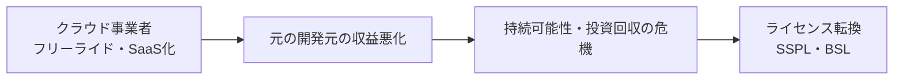

# オープンソースライセンス政策の変化(開放型 → 閉鎖型)

## 1. 概要

### A. 現象の定義
> MongoDB・Elastic・HashiCorp・Redisなどの主要なオープンソースプロジェクトが、商用利用・再配布が自由な**開放型ライセンス(MIT・BSD・Apache 2.0)から、ソースは公開しつつサービス型提供・競合的な利用を制限するライセンス(SSPL・BSL・Elastic License)へと転換**している近年の流れ。

この現象の本質は、「**ソースコードの公開**」と「**自由な商用利用の許容**」という、これまで一体のものとみなされてきた二つの価値が分離しつつある点にある。新しいライセンスはソースを引き続き公開しつつ(Source Available)、それをそのままマネージドサービスとして販売して元の開発元と競合する行為のみを制限する。このため、OSI(Open Source Initiative)はこれらを正統なオープンソースとして認めていない。

### B. ライセンス類型の比較
| 区分 | 開放型 | 閉鎖型(ソース公開・利用制限) |
|---|---|---|
| **例** | MIT, BSD, Apache 2.0 | SSPL, BSL, Elastic License |
| **特徴** | 商用利用・改変・再配布が自由 | ソースは公開、サービス型(SaaS)提供・競合利用を制限 |
| **OSI承認** | 承認(オープンソース) | 未承認(Source Available) |
| **転換事例** | — | Elasticsearch, MongoDB, Terraform, Redis |

二つの類型の根本的な違いは、「**他者がこのソフトウェアを使って自分と同じ事業を行うことを阻止できるか**」である。開放型はこれを一切制限しないため、クラウド事業者がそのままサービス化できるのに対し、SSPLはマネージドサービスとして提供する場合にサービススタック全体のソース公開を要求するため、事実上、商用の再販売を封じる。

## 2. 政策変更の背景

転換の根本原因は、**クラウド時代における価値配分の不均衡**である。開放型ライセンスが作られた時代には、ソフトウェアを各自がインストール・運用するのが一般的であったため、元の開発元と利用者の間に直接的な収益の衝突は少なかった。しかしハイパースケーラーがオープンソースをマネージドサービス(例:Amazon Elasticsearch Service)として手軽に提供するようになり、**開発は元の企業が行い、収益はクラウド事業者が持っていく**という構造が生まれた。開発元は継続的な開発資金を確保できなければプロジェクトそのものを維持できないため、ライセンス転換は生き残りのための選択となった。

| 背景 | 内容 | なぜ問題になったか |
|---|---|---|
| **クラウドのフリーライド** | ハイパースケーラーがOSSをマネージドサービスとして提供し収益を独占 | 開発への貢献なしに収益だけを得る |
| **収益化・持続可能性** | 開発継続のための資金確保が必要 | 資金がなければプロジェクトを維持できない |
| **競争防衛** | 同一サービスとしての商用再販売を制限 | 元の開発元のビジネスモデルを保護 |

## 3. ソフトウェア産業への影響

ライセンス転換は、直ちにコミュニティの反発と**フォーク(Fork)**を引き起こした。開放型であることを信頼して採用していたユーザー・企業にとって、突然の条件変更は裏切りと受け止められ、中立的な財団を中心に、最後の開放型バージョンから分岐した代替プロジェクトが急速に形成された。

| 影響 | 内容 | 代表例 |
|---|---|---|
| **コミュニティの反発・フォーク** | 最後の開放型バージョンから分岐、財団が中立を維持 | OpenSearch(ES)、Valkey(Redis)、OpenTofu(Terraform) |
| **企業利用のリスク** | ライセンス条項の精査負担、ベンダーロックイン・コスト増 | SaaS提供企業による再検討 |
| **オープンソースの信頼性論争** | 「オープンソース」の定義(OSI)と商用モデルの衝突 | Source Available論争 |
| **財団化・代替品** | 中立的な財団への移管、代替プロジェクトの活性化 | Linux Foundation傘下への移管 |

例えばElasticsearchがSSPLに転換すると、AWSが最後のApache 2.0バージョンをフォークして**OpenSearch**を作り、Redisのライセンス変更直後にはLinux Foundation主導で**Valkey**が発足した。これは「開放型のエコシステムは、条件が悪化すれば開放型の代替品へと離脱する」という、オープンソース特有の自己修正メカニズムを示している。

## 4. 企業の対応策

導入企業は、ライセンス変更が**アーキテクチャ・調達・法務のリスク**へと波及する前に、先制的に管理しなければならない。自社がどのOSSをどのような条件で使っているかさえ把握できていなければ対応そのものが不可能であるため、可視性の確保が出発点となる。

| 対応 | 内容 | 目的 |
|---|---|---|
| **ライセンスインベントリ** | 使用OSS・ライセンス条項の把握(SCA・SBOM) | 影響範囲の可視化 |
| **リスク評価** | 変更の可能性・自社のSaaS提供への該当有無を検討 | 実際の影響の判別 |
| **代替手段の確保** | フォーク・代替品・商用契約の検討 | ロックイン・中断リスクの分散 |

ここで**SBOM(Software Bill of Materials)**がなぜ中核となるかといえば、ソフトウェア構成要素の一覧とライセンスを標準形式で管理しておけば、ライセンスが変更されたときに影響を受けるシステムを即座に特定して対応できるからである。

## 5. 考慮事項と示唆
- **開放性と持続可能性のバランス**: 開発資金のない純粋な開放は持続不可能であり、過度な閉鎖はコミュニティの離脱を招く。この両者の均衡点を見出すことがオープンソースビジネスの中核的な課題であり、近年は「**オープンコア(中核は開放、付加機能は商用)**」や、一定期間が経過すると開放型に移行するBSLのような折衷モデルが広がっている。
- **採用企業の戦略的判断**: 特定のOSSに深く依存する前に、ライセンス変更リスクをアーキテクチャ・調達の決定にあらかじめ反映し、代替の可能性を残しておくことが安全である。
- **継続的なモニタリング**: OSI承認の有無、フォークエコシステムの活性度、主要プロジェクトのライセンス動向を常時観察し、転換の兆候に早期に対応する。
- **示唆**: この変化は、オープンソースが理念から持続可能なビジネスモデルの問題へと成熟していく過程であり、企業はOSSを「無料」ではなく「条件付きの資産」として管理しなければならない。

---

> **一言まとめ**: クラウド事業者の*フリーライドによる収益性の悪化*がMongoDB・Elastic・Redisなどの*開放型からSSPL・BSLといった閉鎖型への転換*を引き起こし、これがOpenSearch・Valkeyなどのフォークと「オープンソースの定義」をめぐる論争を生んだ。企業はSBOM・リスク評価・代替品の確保で対応し、開放性と持続可能性のバランスを管理しなければならない。
