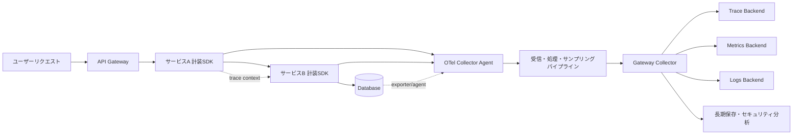
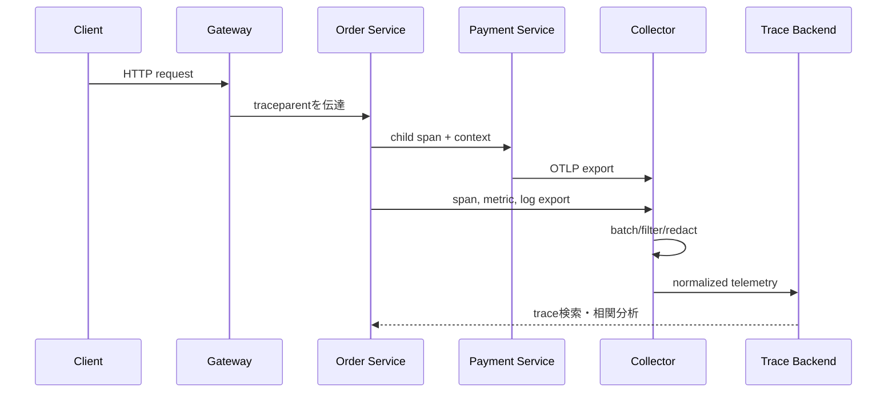

# OpenTelemetryベースの分散トレーシングと統合可観測性

## 1. 概要

> **定義**: OpenTelemetry(OTel)は、アプリケーションとインフラにおいてtraces、metrics、logsのようなテレメトリを計装・生成・収集・変換・送信するための、ベンダー中立なオープンソースの可観測性フレームワークである。

マイクロサービスとクラウドネイティブなシステムでは、一つのユーザーリクエストがAPIゲートウェイ、複数のサービス、メッセージブローカー、キャッシュ、データベースを逐次または並列に通過する。
一つのサービスのログだけを見る従来の方式では、リクエスト全体がどこで遅延したのか、どの呼び出しが失敗を引き起こしたのか、同じ障害がどの顧客とリージョンに影響を与えたのかを迅速に説明することは難しい。
特にサービスがコンテナとオートスケーリンググループの間を移動すると、ホスト名とプロセスIDだけでリクエストの全経路を再構成することも難しい。

可観測性とは、単にモニタリングツールをインストールする作業ではない。
外部から観察した出力と内部シグナルに基づいて、システムの状態と原因を推論できるようにする設計能力である。
OpenTelemetryは計装コードと特定バックエンドとの結合を減らし、複数の言語とランタイムで共通のデータモデル・API・送信方式を使えるようにする。
したがって運用組織は、計装を書き直すことなく保存・検索・可視化のバックエンドを替えたり、複数のバックエンドへデータを分岐したりできる。

OpenTelemetryの核心は、シグナルを個別に収集するにとどまらず、共通のコンテキストで結びつける点にある。
トレースは一つのリクエストの因果経路を示し、メトリクスはサービスレベルのトレンドとしきい値を示し、ログは個々の事象の詳細な事実を残す。
三つのシグナルをtrace ID、span ID、resource、セマンティック属性で結びつければ、「エラー率が上昇した」から「特定APIの特定のデータベース呼び出しで遅延が発生し、該当spanのログにタイムアウトの原因が記録されている」へと分析を絞り込むことができる。

本稿は、OpenTelemetryの構成要素、シグナルモデル、コンテキスト伝播、Collectorパイプライン、設計・運用上の考慮事項を、技術士の論述形式の観点から整理する。
目標は製品ごとの使い方を暗記することではなく、可観測性の要件をシグナル・収集経路・保存ポリシー・セキュリティ統制へと変換する思考手順を提示することである。

## 2. 導入背景と設計目標

### 2.1 従来のモニタリングの限界

ホスト中心のモニタリングは、CPU、メモリ、ディスク、ネットワークといったインフラの状態をよく示す。
しかしインフラリソースが正常でも、特定のテナントのリクエストだけが失敗したり、一つのデータベースクエリがp99レイテンシを生み出したりすることがある。
アプリケーションログを別途保存すると、事象の時刻・ホスト・リクエストIDを人手で突き合わせる必要があるため、分析時間が長くなる。

分散トレーシングは、リクエストを一つのtraceにまとめ、各処理段階をspanとして表現する。
各spanには、開始・終了時刻、作業名、親子関係、属性、イベント、ステータスを含めることができる。
この構造を利用すれば、サービス間呼び出しのボトルネック、並列実行の待ち、リトライと外部依存の遅延を呼び出しグラフ上で確認できる。
ただしすべてのリクエストを完全に追跡すると保存量と処理コストが大きくなるため、サンプリングポリシーが必ず伴わなければならない。

### 2.2 OpenTelemetryが解決する問題

第一に、計装APIと収集・送信経路を標準化する。
アプリケーションは共通のAPIとSDKを通じてテレメトリを生成し、Collectorに受信・処理・エクスポートを担わせることができる。
バックエンドが替わっても、アプリケーションコードに特定ベンダーの保存APIが深く入り込まないため、置き換えコストとロックインのリスクを減らせる。

第二に、シグナル間の相関分析を可能にする。
trace IDとspan IDがログに含まれていれば、ログ検索から関連するトレースへ移動できる。
メトリクスの外れ値にtraceを結びつけるexemplar、resource属性、共通のセマンティック規則を使えば、サービス・デプロイ・リージョン単位での原因探索を一貫して行える。

第三に、収集ポイントを集約して運用ポリシーを適用する。
Collectorは、バッチ化、リトライ、メモリ制限、フィルタリング、属性変換、サンプリング、複数の送信先へのエクスポートを実行できる。
機微な属性の削除やデータ保存期間に合わせたルーティングを中央のポリシーとして管理すれば、各サービスがばらばらに処理するリスクを下げられる。

### 2.3 目標と非目標

OpenTelemetryの目標は、すべての障害を自動的に診断することではない。
一貫したシグナルを十分なコンテキストとともに確保し、運用者が仮説を立てて検証する時間を短縮することが核心である。
したがって計装の成功基準は、ダッシュボードの数よりも、検知時間、原因分析時間、復旧時間、データ品質とコストのバランスで定義すべきである。

反対に、OpenTelemetryはログストア、時系列データベース、トレースUIそのものではない。
CollectorとSDKはデータを生成し伝達する役割を担い、実際の保存・検索・可視化と長期保存は、選択したバックエンドと運用ポリシーの責任である。
この区別を理解していなければ、「標準を導入したから可観測性は完成した」という誤った結論に至る。

## 3. 全体アーキテクチャと中核構成要素



アプリケーション層には、API、SDK、自動計装ライブラリ、手動計装コードがある。
自動計装は、HTTPサーバー、クライアント、データベース、メッセージライブラリといった共通経路のspanを迅速に生成する。
手動計装は、業務ルール、決済承認、在庫引当、モデル推論のように、自動計装だけでは意味がわからない箇所を表現する。
二つの方式を組み合わせる際は、重複span、名前の不一致、機微情報の記録を検討しなければならない。

OpenTelemetry APIは、計装コードが使用する抽象インターフェースである。
APIのみに依存するライブラリは、SDKがなくてもアプリケーション機能を実行でき、実行環境がSDKを接続すれば実際の収集を有効化できる。
SDKは、サンプラー、プロセッサ、exporter、resource検出といった実行ポリシーを提供する。
この分離は、ライブラリ作成者とアプリケーション運用者の責任を分ける重要な設計原則である。

Collectorは、レシーバー(receiver)、プロセッサ(processor)、エクスポーター(exporter)、パイプライン(pipeline)で構成される。
レシーバーはOTLP、Prometheus、Jaegerなどの入力形式を受け付け、プロセッサはバッチ化・フィルタ・属性変換・メモリ保護などを行う。
エクスポーターは、OTLPまたは特定バックエンドの形式でデータを送り出す。
単一のCollectorにすべての責任を持たせるよりも、エージェントとゲートウェイを分離することで、障害ドメインとスケーリング単位を設計できる。

| 構成要素 | 主な責任 | 設計時に確認すべき問い |
|---|---|---|
| API | 計装呼び出しの標準インターフェース | ライブラリがベンダーSDKに直接結合されていないか? |
| SDK | サンプリング・処理・エクスポートの実行 | メモリとCPUの予算、終了時のflushは保証されているか? |
| 自動計装 | 共通フレームワークの迅速な計装 | 重複spanとバージョン互換性を管理しているか? |
| 手動計装 | 業務上の意味と重要イベントの表現 | どの業務属性が低カーディナリティとして定義されているか? |
| Collector | 収集・変換・ルーティング・保護 | 収集経路の障害時にバックプレッシャーとリトライが動作するか? |
| バックエンド | 保存・検索・可視化・アラート | 保存・照会性能・コスト・アクセス権限は適切か? |

表の構成要素は独立した製品リストではなく、一つのデータフローを成している。
例えばSDKで生成したspanをCollectorが受け取っても、resource属性が欠落していれば、どのサービスのデータなのかがわかりにくい。
逆にデータが豊富でも、サンプリングと保存のポリシーがなければ保存コストと検索遅延が増大する。
技術士は、各構成要素を選択する理由と、失敗時の代替経路まで答案で結びつけなければならない。

## 4. シグナルモデルとコンテキスト伝播

### 4.1 Tracesとspans

Traceは、一つの論理的なリクエストまたは業務フローを構成するspanの集合である。
Spanはサービス内部の作業や外部呼び出しを表し、親spanとの関係によって呼び出しツリーを形成する。
分散環境では、単純なツリーだけでなく、非同期メッセージ、バッチ、fan-in・fan-outを表現するlinkが必要になることがある。

span名は検索と集計の基準となるため、URL全体やユーザー入力のように値が変わり続ける文字列をそのまま入れてはならない。
`GET /orders/{orderId}` のようにテンプレート化した名前を使い、実際の識別子は制限された属性またはログのマスキング済みフィールドで管理する。
エラーspanにはステータス、例外イベント、エラー種別、外部依存の情報を残すが、カード番号やトークンのような秘密値は記録しない。

### 4.2 Metricsとlogs

メトリクスは、時間に沿った数値の集計である。
リクエスト数、エラー数、レイテンシのヒストグラム、アクティブ接続数、キュー長といったメトリクスは、SLIとアラートの基盤となる。
カウンタ・ゲージ・ヒストグラム・サマリーなどの計装タイプを業務上の意味に合わせて選択し、同じ意味のメトリクス名と単位を組織標準として定める。

ログは、特定の時点の事象を記録する。
構造化ログはJSONや共通フィールドで記録してパース・検索を容易にし、trace IDとspan IDを入れて関連するspanを見つけられるようにする。
ログにすべてのリクエストボディを入れる方式は可観測性が高いように見えるが、個人情報とコストのリスクを高めるため、事象の原因分析に必要な最小限のフィールドだけを残すべきである。

### 4.3 Resourceとセマンティック規則

Resourceは、テレメトリを生成したサービス・ホスト・コンテナ・クラウドリソースの同一性を表現する。
`service.name`、デプロイ環境、バージョン、リージョン、クラスタのような属性が一貫して埋められていてはじめて、異なるインスタンスのデータを同じサービスとして集計できる。
サービス名がデプロイのたびに変わると同一サービスのエラー率トレンドが途切れ、逆にあまりに多くの識別子をサービス名に入れると集計が断片化する。

セマンティック規則は、HTTP、データベース、メッセージングのような共通作業の属性名と意味を統一する。
チームごとに `url`、`request_url`、`httpUrl` をばらばらに使うと、複数サービスのデータを結合するのが難しくなる。
標準規則に従いつつ、既存ログとの互換性、属性の安定性、個人情報の最小化の有無を併せて検討しなければならない。

### 4.4 コンテキスト伝播

分散トレーシングでは、サービスAがサービスBへtrace contextを伝達してはじめて、一つのtraceがつながる。
HTTPリクエストのヘッダ、メッセージのメタデータ、非同期処理の受け渡しオブジェクトが伝播媒体となる。
伝播が途切れると、各サービスのspanは生成されても別々のtraceとして見えるため、フレームワーク・プロキシ・メッセージブローカーの境界ごとにテストしなければならない。

W3C Trace Context系のヘッダを使う際は、外部入力を信頼して権限判断を行ってはならない。
trace IDは相関付けのための識別子であって認証・認可のトークンではなく、baggageに入れた値は下流に伝播しうるため、秘密情報を入れてはならない。
信頼境界の外から入ってきたbaggageとtrace情報は、許可リスト・サイズ制限・削除ポリシーで保護する。



上記のシーケンスにおいて、業務リクエストのcontext伝播とテレメトリの送信は別個のフローである。
リクエスト処理中に生成されたspanはSDKのprocessorとexporterを経てCollectorへ送信され、Collectorはデータをバッチにまとめてバックエンドに送る。
したがって業務リクエストが成功したからといって、テレメトリの送信も成功したと断定することはできない。
終了時のflush、送信失敗時のリトライ、Collector障害時のバッファとドロップのポリシーを、運用要件として定義しなければならない。

## 5. OTLPとCollectorパイプラインの設計

OTLPは、OpenTelemetryのテレメトリを中間ノードとバックエンドの間で伝達するプロトコルである。
gRPCとHTTPによる送信をサポートし、trace・metric・logのペイロードとリクエスト・レスポンスの方式を規定する。
組織はプロトコルの選択よりも先に、ネットワーク経路、認証、TLS、最大メッセージサイズ、リトライ、圧縮、障害時のデータ損失許容量を定めるべきである。

エージェント型のCollectorは、アプリケーションやノードの近くに配置され、短い経路とローカルバッファを提供する。
ゲートウェイ型のCollectorは、複数のエージェントのデータを中央でサンプリング・整形・ルーティングし、バックエンドの認証情報と外部接続を集中管理する。
二つの階層を使う場合は、エージェントが無限にリトライしてアプリケーションのリソースを圧迫しないよう、キューとメモリの上限を設ける。

パイプラインはシグナルごとに分離できる。
トレースではtail samplingとエラー優先の保存が重要であり、メトリクスでは時系列の集計とカーディナリティ管理が重要であり、ログでは個人情報のマスキングと保存期間が重要である。
すべてのシグナルに同じプロセッサを適用すると、ログに必要なマスキングがメトリクスには不適切であったり、トレースのサンプリングが監査ログを取りこぼしたりしうる。

```yaml
receivers:
  otlp:
    protocols:
      grpc: {}
      http: {}
processors:
  memory_limiter:
    limit_mib: 512
  batch:
    timeout: 5s
  attributes/redact:
    actions:
      - key: user.email
        action: delete
exporters:
  otlp/backend:
    endpoint: telemetry-backend.example.internal:4317
service:
  pipelines:
    traces:
      receivers: [otlp]
      processors: [memory_limiter, attributes/redact, batch]
      exporters: [otlp/backend]
```

上記の例は概念を示すための最小構成であり、本番環境にそのままコピーすべき設定ではない。
実際の環境では、TLS証明書と認証情報、exporterのキュー、リトライ間隔、health check、self-metrics、ネットワークポリシーを追加しなければならない。
また、属性削除のプロセッサだけで機微情報がすべて除去されると仮定せず、アプリケーションの計装段階とバックエンドのアクセス権限でも防御すべきである。

Collector自体も観測対象である。
受信の成功・失敗、スループット、キュー長、メモリ使用量、exporterのリトライ、ドロップされたデータ、処理遅延をメトリクスでモニタリングする。
Collectorが飽和しているのにアプリケーションだけを見ていると、計装データが失われた事実を障害原因と誤認したり、そもそも検知できなかったりする。
データ損失が許されない監査・セキュリティイベントについては、別途の送信経路と永続キューを検討する。

## 6. サンプリング・カーディナリティ・コストの統制

すべてのtraceを保存することは分析上の利便性は高いが、トラフィックの大きいサービスでは保存・送信コストが急激に増加する。
head samplingはリクエストの初期段階で保存の可否を決めるためコストを早期に削減できるが、後でエラーが発生することを事前に知るのは難しい。
tail samplingはtraceがある程度集まった後にエラー、遅延、特定のポリシーを見て判断するため、重要なtraceを保存しやすいが、Collectorのメモリと待ち時間が必要となる。

実務では、正常なリクエストを低い比率でサンプリングし、エラー・高レイテンシ・新バージョンのtraceを優先的に保存する混合ポリシーを用いる。
サンプリングの判断がサービスごとに異なると、同じtraceの一部のspanだけが残って呼び出し経路が途切れることがあるため、分散伝播とサンプリングフラグの意味を確認する。
規制・監査の対象となる取引は、一般的な可観測性のサンプリングとは別に元のイベントを保存する。

カーディナリティとは、属性値の種類がどれだけ多いかを意味する。
`service.name`、`http.method`、`region` は比較的低カーディナリティであるが、無制限のユーザーID・注文ID・URLクエリ文字列は非常に高い。
高カーディナリティの属性をメトリクスのlabelに入れると、時系列の数とメモリが爆発的に増え、検索コストが大きくなりうる。
業務分析に必要な識別子はログやtrace spanの制限された属性として送り、メトリクスは集計可能な次元で設計する。

簡単なコスト見積もりは、毎秒のイベント数、イベントあたりの平均バイト数、サンプリング率、レプリカ数、保存期間から始める。
例えば毎秒2,000個のspanを平均2KBで送信すると、生の送信量は毎秒約4MBとなり、さらに圧縮・バッチ化・属性の増加・レプリケーション・インデックスのコストを考慮しなければならない。
平均値だけで容量を決めず、デプロイ直後、障害時の急増、トラフィックのピーク、リトライの急増といった最悪条件を別途算定する。

## 7. 他の可観測性アプローチとの比較

既存のツールをすべて廃棄してOpenTelemetryに置き換えることが、常に最善とは限らない。
すでに運用中のPrometheus、ログコレクタ、APMを維持しつつOpenTelemetry Collectorをブリッジとして使い、サービスごとに段階的に計装を拡大することもできる。
重要なのは製品名ではなく、データモデルと運用責任が一貫しているかどうかである。

| 比較対象 | 強み | 限界 | OpenTelemetryとの関係 |
|---|---|---|---|
| ホストモニタリング | インフラリソースとノード状態に強い | 業務フローと呼び出し原因の把握に弱い | resourceメトリクスと結合 |
| 従来型のログ収集 | 事象の詳細と監査記録に強い | 呼び出し関係と標準フィールドが不均一になりうる | ログAPI・ブリッジ・相関IDで接続 |
| 単一ベンダーのAPM | 迅速な初期画面と統合機能 | コスト・フォーマット・エージェントへの依存の可能性 | OTel exporterまたは並行収集 |
| Prometheus中心のメトリクス | 強力な時系列集計とエコシステム | trace・logとの因果関係は別扱い | OTLP・exemplarで接続 |
| 手動のログ相関分析 | 特定システムにすぐ適用可能 | 人への依存と漏れ、運用負荷 | 自動・標準計装で補完 |

OpenTelemetryは、単一バックエンドの機能をすべて置き換える万能ツールではない。
特定のAPMのプロファイリングやセッション分析が必要であればその機能を併用でき、既存のメトリクスルールが安定していれば変更のリスクを計算しなければならない。
ただし標準APIとOTLPを境界に置けば、計装と保存・可視化を分離できるため、長期的な選択肢が広がる。

## 8. 設計手順と品質検証

第一に、障害対応の問いを定義する。
「ユーザーの決済はなぜ遅いのか」「どのリージョンでエラーが増加したのか」「デプロイ後にどの依存先が失敗したのか」のように実際の問いを定め、答えに必要なシグナルと属性を逆算して設計する。
ツールを先にインストールすると、使われないデータばかりが蓄積されやすい。

第二に、サービスマップと信頼境界を描く。
同期呼び出し、メッセージ、バッチ、外部SaaS、データベース、ユーザー・管理者の境界を示し、contextがどこで生成・伝播・削除されるかを決定する。
外部境界を通過するbaggage、ヘッダ、ログ属性には、許可リストとサイズ制限を設ける。

第三に、計装標準を作成する。
サービス名の規則、span名のテンプレート、エラー分類、resource属性、ログフィールド、メトリクスの単位、個人情報の禁止リストを文書化する。
標準は中央チームが一方的に定めるルールではなく、開発・運用・セキュリティ・個人情報の各担当者が共同で検討する契約であるべきである。

第四に、Collectorとバックエンドの容量を試験する。
通常負荷だけでなく、トラフィックの急増、バックエンドの停止、ネットワーク遅延、exporterのリトライ、Collectorの再起動を注入する。
障害中も中核業務を妨げず、許容したデータ損失率と復旧後の再送時間が基準を満たすかを確認する。

第五に、可観測性そのもののSLOを定める。
例えば中核リクエストの99%がtrace IDを生成し、Collectorのexportの95%が定められた時間内に完了し、セキュリティイベントが別途の保存経路に残る、というように測定する。
計装データのないサービスは正常に見えてしまうことがあるため、データの空白と計装の失敗をアラート条件に含める。

## 9. 事例:注文プラットフォームにおける決済遅延の分析

ある注文プラットフォームで、決済成功率は正常なのに顧客の注文完了時間が増加したと仮定する。
インフラのCPUは50%以下で、アプリケーションのエラーログも多くないため、ホストダッシュボードだけでは原因を見つけにくい。

OpenTelemetryのtraceを照会すると、API Gatewayのspanは正常だが注文サービスの在庫確認spanがp95で800msに増えており、一部のtraceではデータベースのロック待ちが現れている。
同じtraceの構造化ログには特定のインデックス変更のデプロイ後にクエリプランが変わったというイベントがあり、メトリクスでは在庫DBの接続待ち時間が上昇している。
三つのシグナルが同じresourceとtrace contextで結びついているため、問題を「決済サービスが遅い」ではなく「在庫DBの特定経路が注文全体の前段を遅延させている」へと絞り込むことができる。

運用チームは当該デプロイをロールバックし、エラーtraceと高レイテンシtraceを優先的に保存するサンプリングポリシーで再現の有無を確認する。
同時に在庫照会と決済呼び出しのspanを分離し、どの段階がユーザーのタイムアウトを占めているかを検証する。
事後には、クエリプランの検証をデプロイパイプラインに組み込み、サービス・バージョン・リージョン別のレイテンシメトリクスとtrace exemplarをダッシュボードに追加する。

この事例で重要なのは、特定ツールの画面ではなく相関関係の品質である。
trace IDだけがあってサービスバージョンやデータベースシステムの属性がなければ、原因の候補を絞り込むのは難しい。
属性が多すぎたりユーザー入力をそのまま含んだりすると、コスト・セキュリティの問題が生じる。
したがって可観測性の設計とは「多く記録すること」ではなく、分析上の問いに必要な最小限のコンテキストを安定して記録することである。

## 10. 深掘り:クラウドネイティブと生成AIの可観測性

クラウド環境ではサービスインスタンスが頻繁に生成・削除されるため、resource属性のライフサイクルとサービスバージョンを正確に記録しなければならない。
デプロイシステム、オーケストレータ、クラウドリソース検出器が提供する属性を組み合わせつつ、同じ意味のフィールドが衝突する場合は優先順位を定める。
マルチリージョン環境では、リージョン間の伝播遅延とデータ主権を考慮してCollectorとバックエンドの配置を設計する。

サービスメッシュがすでに通信メトリクスとtraceを生成していても、アプリケーションの業務spanが自動的に生成されるわけではない。
プロキシによる計装はネットワーク経路とレスポンスコードには強いが、「在庫引当」や「クーポン検証」のような業務上の意味は知らない。
プロキシ・SDK・手動計装の重複を減らし、各層の責任を文書化しなければならない。

生成AIアプリケーションでは、モデル呼び出し、検索・拡張の段階、ツール呼び出し、トークン使用量、安全性フィルタの結果が一つのリクエストフローに含まれうる。
これらの情報をtrace spanのイベントと制限された属性で表現すれば、遅延と失敗を段階ごとに比較できる。
しかしユーザーのプロンプト、モデルの応答、文書の内容には個人情報・機密・著作権のある情報が含まれうるため、原文を無条件にテレメトリに残してはならない。
トークン数やモデル名のように運用に必要な集計情報と原文の保存ポリシーを分離し、アクセス権限と保存期間を別々に設定する。

現在のOpenTelemetry公式仕様は、traces、metrics、logs、context、resource、semantic conventions、OTLPを併せて扱う方向へと発展している。
こうした標準が存在することは、すべての言語SDKの機能成熟度が同じであることを意味しないため、導入時には言語ごとのAPI・SDK・自動計装の状況と、運用に必要な機能を確認しなければならない。
標準のバージョンと実装のバージョンを構成管理し、実験的な機能に中核の監査・決済経路をすぐに依存させないことが安全である。

## 11. 考慮事項と示唆

### 11.1 正確性とコストのバランス

可観測性データは多ければよいというものではなく、問いに答えられるだけ正確でなければならない。
サンプリング率、属性数、ログ本文、保存期間をコストモデルと併せて決定し、障害・デプロイ・監査データの優先順位を差別化する。
コスト削減のためにエラーtraceを捨てたり、逆にすべての正常リクエストを無期限に保存したりする極端を避ける。

### 11.2 データ品質と計装ガバナンス

サービス名と属性の規則が崩れると、ダッシュボードとアラートの信頼性が低下する。
スキーマ変更をコードレビューとバージョン管理に含め、標準違反・欠落・高カーディナリティを自動的に点検する。
新しいサービスの運用受け入れ条件に最低限のtrace・metric・logの品質を盛り込み、計装を事後作業として残さないようにする。

### 11.3 個人情報とセキュリティ

trace、log、baggageはリクエスト経路に沿って複数のシステムへ伝播しうるため、一般的なログよりも広い影響範囲を持つ。
収集前のマスキング、許可リスト、暗号化通信、バックエンドのアクセス権限、保存・削除ポリシーを設計し、秘密値はテストデータとしても入れない。
可観測性システム自体が機微な運用・顧客情報を集めるため、管理者アカウントの多要素認証と監査ログも必要である。

### 11.4 障害分離とバックプレッシャー

Collectorやバックエンドの障害が業務リクエストのスレッドとメモリを枯渇させないよう、非同期送信、bounded queue、memory limiter、timeout、リトライ上限を設ける。
テレメトリのドロップは隠してはならず、どのシグナルがどの比率で失われたかをself-metricsとアラートで示さなければならない。
監査・セキュリティイベントには、一般的なデバッグログと同じ損失ポリシーを適用しない。

### 11.5 組織運営とコスト責任

可観測性はプラットフォームチームだけのインフラではなく、各サービスチームが品質に責任を持つ運用契約である。
プラットフォームチームがSDK・Collector・標準ダッシュボードを提供し、サービスチームが業務span・エラー分類・機微情報のレビュー・SLOに責任を持つ構造が効果的である。
バックエンドのコストをサービス・環境・シグナルごとに配賦すれば、不要な高カーディナリティや過剰な保存を改善しやすくなる。

### 11.6 技術士の観点からの適用戦略

技術士はOpenTelemetryの導入を、製品置き換えプロジェクトではなく、可観測性アーキテクチャの標準化と運用能力の改善課題として提示しなければならない。
現状診断、目標とするシグナルモデル、context伝播の境界、Collectorのトポロジ、セキュリティ統制、コスト算定、段階的な移行、成功指標を設計成果物として結びつける。
既存ツールとの共存・移行戦略を含め、ベンダー中立性が実際の選択権につながるかどうかをバックエンドの置き換え試験で検証する。
結局のところ、優れた可観測性とは障害を予言する魔法ではなく、システムの状態を信頼できる証拠で説明し、迅速な意思決定を可能にする工学的基盤である。

## 参考資料

- OpenTelemetry Documentation, “Documentation”: https://opentelemetry.io/docs/
- OpenTelemetry Specification, “OpenTelemetry Specification”: https://opentelemetry.io/docs/specs/otel/
- OpenTelemetry Specification, “Overview”: https://opentelemetry.io/docs/specs/otel/overview/
- OpenTelemetry Specification, “OTLP Specification”: https://opentelemetry.io/docs/specs/otlp/
- OpenTelemetry Specification, “General semantic conventions”: https://opentelemetry.io/docs/specs/semconv/general/
- OpenTelemetry Documentation, “OpenTelemetry Logs”: https://opentelemetry.io/docs/concepts/signals/logs/
- W3C, “Trace Context”: https://www.w3.org/TR/trace-context/

---

> **一言まとめ**: OpenTelemetryは、標準API・SDK・Collector・OTLPと共通コンテキストによってtraces・metrics・logsを結びつけ、分散システムの原因分析を迅速にする可観測性の基盤であるが、サンプリング・セキュリティ・コスト・運用ガバナンスを併せて設計してはじめて完成する。
