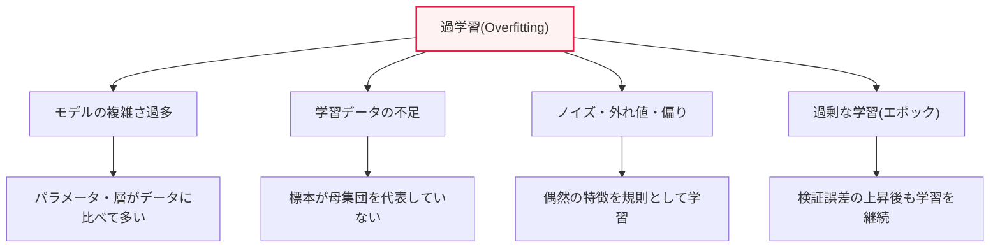
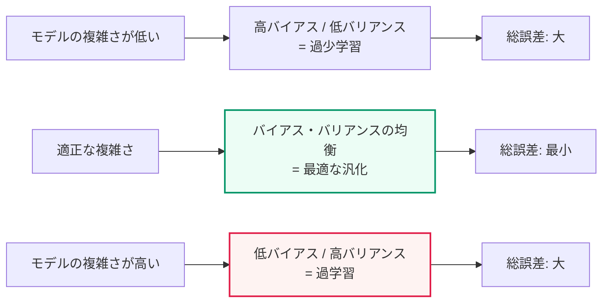

# 過学習(Overfitting)の発生理由と解決策

## 1. 概要

### A. 定義
> **過学習(Overfitting)** とは、機械学習モデルが**学習データに過度に適合し、新しいデータ(テスト・実運用データ)に対する予測性能が低下する**現象である。モデルがデータに含まれる一般的な規則(signal)ではなく、特定の標本にのみ存在するノイズ(noise)・特殊性まで併せて学習してしまった状態をいう。

過学習の本質は、「**暗記することと理解することの違い**」である。学習(training)の真の目標は、データに含まれる一般的な規則を学び、初めて見るデータもうまく予測すること、すなわち**汎化(generalization)**である。ところがモデルが複雑すぎたり学習が過剰であったりすると、規則を理解する代わりに学習データを丸ごと暗記してしまう。試験問題の原理を理解した学生と、答えだけを覚えた学生の違いと同じである。答えだけを覚えた学生は、見たことのある問題(学習データ)は完璧に解けるが、数字だけが変わった問題(新しいデータ)には歯が立たない。過学習したモデルも、学習データでは精度が非常に高いが、実際のデータでは性能が急落する。

反対側には**過少学習(Underfitting)**がある。モデルが単純すぎたり学習が不足していたりして、データのパターンすら十分に学べていない状態である。過少学習のモデルは、学習データでも新しいデータでも性能が低い。結局、機械学習のモデリングは過少学習と過学習の間の**適正な複雑さ(sweet spot)**を探っていく過程であり、良いモデルは学習性能と検証性能がともに高く、その差が小さい地点に存在する。この「均衡点」を定量的に説明する理論が、後述する**バイアス-バリアンスのトレードオフ**である。

### B. なぜ重要か — 実務上の必要性
過学習が重要なのは、学習段階での高い精度が実際のサービス性能をまったく保証しないからである。例えば学習データで精度99%を記録した画像分類モデルが、実際の運用環境では70%台に落ちることは珍しくない。これは、モデルが学習標本の照明・背景のような偶然の特徴まで「規則」と誤認した結果である。特にパラメータ数が数百万〜数十億に及ぶディープラーニング・大規模言語モデル(LLM)は、学習データを事実上暗記できるだけの表現力を持つため、過学習の制御がモデル品質の成否を分ける。

また過学習は、**データリーケージ(data leakage)**や**評価方法の誤り**と結びついたときにより危険となる。検証・テストデータが学習に漏れ込むと、過学習を検知できないまま「偽りの高い性能」を信頼することになり、これが運用デプロイ後の大規模な障害へとつながる。したがって過学習は単なるアルゴリズムの問題ではなく、データ分割・評価設計・MLOpsの全過程にわたる管理対象である。

### C. 過学習と過少学習の症状の対比
二つの現象を実務で素早く見分けるには、学習性能と検証性能の組み合わせを見ればよい。過少学習は学習・検証の性能がともに低いのに対し、過学習は学習性能だけが高く検証性能が低い。この単純な目印が診断の出発点であり、処方の方向(複雑さを上げるか下げるか)を正反対に導くという点で、正確な判別が重要である。

| 区分 | 過少学習(Underfitting) | 過学習(Overfitting) |
|---|---|---|
| **学習性能** | 低い | 高い |
| **検証性能** | 低い | 低い |
| **バイアス/バリアンス** | バイアスが大きい | バリアンスが大きい |
| **原因** | モデルが単純・学習不足 | モデルが複雑・データ不足・過剰学習 |
| **処方の方向** | 複雑さ↑・学習↑・特徴追加 | 複雑さ↓・データ↑・正則化 |

## 2. 過学習の発生理由

過学習は一つの原因ではなく、「モデルの複雑さ」と「データの品質・量」の不均衡から生じる。以下の構造図は、四つの主要な原因がどのように過学習へと収斂するかを示している。

**第一に、モデルの複雑さ過多**が最も根本的な原因である。モデルのパラメータ数や層(layer)がデータの持つ情報量に比べて多すぎると、余った表現力がノイズの学習に使われる。多項式回帰で次数を際限なく上げると、すべての学習点を通る曲がりくねった曲線が作られるが、その曲線は新しい点に対してひどい予測をする。ディープラーニングのように表現力の大きいモデルほど、このリスクは大きくなる。

**第二に、学習データの不足と非代表性**である。データが少ないと、モデルが学べる「一般的な規則」の根拠が乏しくなり、偶然観測されたパターンを規則と誤認しやすい。標本が母集団を代表していない偏り(sampling bias)があると、モデルは偏った世界観をそのまま学習し、実際のデータで崩れる。例えば特定の病院のデータだけで学習した診断モデルは、他の病院の装置・患者群では性能が急落する。

**第三に、ノイズ・外れ値・ラベルの誤り**である。学習データに測定誤差・外れ値・誤ったラベルが混ざっていると、表現力の大きいモデルはこの誤りまで忠実に学習する。ノイズは本質的に再現不可能なランダム成分であるため、これを学習するほど新しいデータでの性能は低下する。**第四に、過剰な学習(エポック過多)**である。学習を繰り返すほど学習誤差は減り続けるが、ある時点から検証誤差はむしろ増加し始める。この転換点を過ぎても学習を続けると、モデルが学習データに特化して過学習する。

## 3. 過学習の解決策

### A. データの観点からの対応
最も根本的かつ効果的な解決策は、「**より多く多様なデータを確保すること**」である。データが十分であれば、モデルがノイズを規則と誤認する余地が減り、真の一般的な規則を学習する根拠が強まる。ただし実務ではデータの確保がコスト・時間・規制(個人情報)の制約を受けるため、**データ拡張(Data Augmentation)**が現実的な代替策となる。画像では回転・反転・クロップ・色変換によって、テキストでは同義語置換・逆翻訳によって、音声ではノイズ付加・速度変換によって、学習標本の多様性を人為的に増やす。

データ品質の管理も重要である。外れ値・ラベルの誤りをクレンジング(cleansing)し、クラス不均衡を補正(オーバー・アンダーサンプリング、SMOTE)し、標本が母集団を均等に代表するよう収集設計を改善する。近年は**合成データ(synthetic data)**や生成モデルベースの拡張も活用されているが、元の分布を歪めるとかえって性能を損ないうるため注意が必要である。

### B. モデル・学習の観点からの対応
モデル側では、複雑さを抑制する**正則化(Regularization)**が中核である。**L2正則化(重み減衰、weight decay)**は重みの二乗和にペナルティを課して重みを全体的に小さく保つことでモデルを滑らかにし、**L1正則化(Lasso)**は重みの絶対値にペナルティを課して不要な特徴の重みを0にし、自動的な特徴選択の効果をもたらす。ペナルティの強さ(λ)が大きすぎれば過少学習、小さすぎれば過学習となるため、λそのものがチューニングの対象となる。

ディープラーニングでは**ドロップアウト(Dropout)**が広く使われる。学習時に各層のニューロンの一部を確率的に(例:0.5)ランダムに無効化し、特定のニューロンの組み合わせへの過度な依存を防ぎ、複数の部分ネットワークのアンサンブル効果をもたらす。**早期終了(Early Stopping)**は、検証誤差がそれ以上改善せず上昇し始める時点で学習を止める手法であり、過剰な学習による過学習を直接遮断する。このほか、バッチ正規化(Batch Normalization)、層・パラメータを減らす**モデルの単純化**、事前学習モデルを活用する**転移学習(Transfer Learning)**も、データが少ないときに過学習を大きく減らす。

### C. 検証・評価の観点からの対応
過学習は「診断」できてはじめて対応できるため、信頼できる検証体制が不可欠である。**交差検証(Cross-Validation)**、特にk分割交差検証は、データをk個に分けて交互に検証に用いることで、特定の分割に偶然よく合ったのではない「汎化された性能」を推定する。**アンサンブル(Ensemble)**手法のうちバギング(Bagging)・ランダムフォレストは、複数モデルの予測を平均してバリアンスを減らし、過学習を緩和する。データ分割時に学習・検証・テストを厳格に分離し、ハイパーパラメータのチューニングは検証セットでのみ行ってテストセットの汚染を防ぐことも、過学習を誠実に評価するための原則である。

| 方策 | 系統 | 中核原理 |
|---|---|---|
| **データ拡張・確保** | データ | 標本の多様性↑ → ノイズ学習の抑制 |
| **正則化(L1・L2)** | モデル | 重みのペナルティで複雑さを抑制 |
| **ドロップアウト** | モデル(ディープラーニング) | ニューロンのランダムな除去、アンサンブル効果 |
| **早期終了** | 学習 | 検証誤差の上昇時点で学習を中断 |
| **交差検証** | 評価 | 汎化性能を信頼性高く推定 |
| **モデルの単純化** | モデル | パラメータ・層・特徴の削減 |
| **アンサンブル(バギング)** | モデル | 複数モデルの平均でバリアンスを低減 |
| **転移学習** | モデル | 事前学習の知識で少量データを補完 |

## 4. バイアス-バリアンスのトレードオフ(原理の深掘り)

過学習と過少学習を一つの理論で貫くのが、**バイアス-バリアンスのトレードオフ(Bias-Variance Trade-off)**である。モデルの期待予測誤差は、大きく**バイアス(Bias)²+バリアンス(Variance)+還元不能誤差(irreducible error)**に分解される。バイアスはモデルの単純化の仮定によって真の関係を捉えられないことから生じる系統的な誤差であり、バリアンスは学習データが少し変わるだけでモデルが大きく揺らぐ感度である。

上の図が示すように、モデルの複雑さを上げるとバイアスは減るがバリアンスは大きくなる。**過学習はバリアンスが大きい状態**(学習データの変化に過敏)であり、**過少学習はバイアスが大きい状態**(パターンを学べない)である。総誤差は二つの成分の和であるため、バイアスが減る利得とバリアンスが大きくなる損失が均衡する地点で最小となる。前述の解決策をこの観点から再解釈すると明確になる。正則化・ドロップアウト・早期終了・アンサンブルはいずれも「バリアンスを減らす」処方であり、データ拡張はバリアンスを減らしつつバイアスをあまり犠牲にしない方法である。

ただし、この伝統的なトレードオフが常に成立するわけではないという最新の観察もある。非常に大きなディープラーニングモデルでは、パラメータ数がデータ数を超えた後にも検証誤差が再び減少する**二重降下(Double Descent)**現象が報告されている。これは過学習を「複雑さだけの関数」と断定しにくくしており、大規模モデルの時代において過学習の理解がなお進化の途上にあることを示唆している。実務では、断定するよりも検証セットの性能を根拠に判断する方が安全である。

## 5. 深掘り:実務事例と診断・対応戦略

実際のプロジェクトでは、過学習は**学習曲線(learning curve)**で診断するのが定石である。エポックごとの学習誤差と検証誤差を併せて描いたとき、学習誤差は下がり続けるのに検証誤差がある時点から上昇し、両者の差(generalization gap)が開いていけば、それは過学習の明確なシグナルである。例えば学習精度98%・検証精度75%であれば、23%ポイントの差そのものが過学習の証拠であり、このときは早期終了の時点をその転換点に設定するか、正則化を強化する。

代表的な実務事例として、**医用画像診断モデル**が挙げられる。特定の病院の少量のデータだけで学習した肺炎判別モデルが、実際には肺の病変ではなく、その病院のX線装置のウォーターマークや撮影角度といった付随的な特徴を学習しており、他の病院では性能が急落した事例が複数の研究で報告されている。これは「データの代表性不足+ノイズの学習」が組み合わさった典型的な過学習であり、多施設データの確保とドメイン汎化の手法で対応する。別の事例として、**金融の信用評価・株価予測モデル**は、過去の特定期間の市場パターンに過学習すると市場局面が変わったときに予測が崩れるため、時系列の特性を考慮したウォークフォワード(walk-forward)検証と正則化が必須である。

**大規模言語モデル・推薦システム**においても、過学習の管理は中核的である。LLMは学習データを部分的に暗記(memorization)し、学習コーパスの内容をそのまま出力してしまう問題が知られており、これはプライバシー・著作権のリスクにもつながる。これに対しては、データの重複排除(deduplication)、ドロップアウト・重み減衰、早期終了、そして膨大なデータによって表現力に見合ったデータ量を確保する方式で対応する。推薦システムでは、少数の人気アイテムに過学習して多様性が失われる問題を、正則化・アンサンブルで緩和する。

## 6. 考慮事項と示唆(技術士の観点)

1. **過学習への対応は、単一の手法ではなく組み合わせの戦略でアプローチすべきである。** データの確保(根本)、正則化・ドロップアウト(モデル)、早期終了(学習)、交差検証(評価)を状況に応じて組み合わせるのが定石である。データが少なければ転移学習・拡張を、ディープラーニングであればドロップアウト・バッチ正規化を、実運用へのデプロイ前には交差検証で汎化を検証するといった、階層的な処方が必要である。

2. **データの確保と品質こそが根本的な解決策であり、アルゴリズムによる処方は補助手段である。** 代表性のあるデータを十分に確保することが過学習を防ぐ最も確実な方法であるため、データの収集・クレンジング・ラベリングのパイプラインへの投資を優先すべきである。正則化の強さだけを上げると過少学習という逆の落とし穴にはまりうるため、トレードオフを定量的に管理しなければならない。

3. **評価設計とデータリーケージの防止が診断の前提である。** 学習・検証・テストを厳格に分離し、ハイパーパラメータのチューニングを検証セットでのみ行わなければ、過学習を検知できないまま偽りの性能を信頼することになる。MLOpsの観点から、データ分割・リーケージ点検・検証の自動化をパイプラインに組み込むべきである。

4. **運用段階のデータドリフトまで考慮した継続的な管理が必要である。** デプロイ時点で汎化がうまくいっていても、時間の経過とともに入力分布が変わると(concept/data drift)、実質的な過学習状態となる。したがって運用中の性能モニタリング・定期的な再学習・A/Bテストによって汎化性能を継続的に管理することが、技術士の観点から見た完成された対応である。

5. **大規模モデルの時代には、過学習に対する理解も再検討が必要である。** 二重降下などの最新の観察は、「複雑さ=過学習」という単純な図式が常に正しいわけではないことを示している。特定の理論に断定するよりも、検証セットの性能と学習曲線という実証的な根拠に基づいて、正則化の強さ・モデル規模・データ量を調整する実用的な判断が求められる。

## 参考資料
- Google Developers, "Machine Learning Crash Course — Overfitting": https://developers.google.com/machine-learning/crash-course/overfitting/overfitting
- scikit-learn, "Underfitting vs. Overfitting": https://scikit-learn.org/stable/auto_examples/model_selection/plot_underfitting_overfitting.html
- Belkin et al., "Reconciling modern machine-learning practice and the bias-variance trade-off (Double Descent)": https://www.pnas.org/doi/10.1073/pnas.1903070116

---

> **一言まとめ**: 過学習とは、*モデルが学習データのノイズ・特殊性まで暗記し、新しいデータで性能が急落する(バリアンスが大きい)*現象であり、モデルの複雑さ過多・データ不足・ノイズ・過剰な学習が原因である。データ拡張・正則化(L1/L2)・ドロップアウト・早期終了・交差検証・アンサンブルを組み合わせ、バイアス-バリアンスの均衡点を見出すことで汎化性能を確保する。
