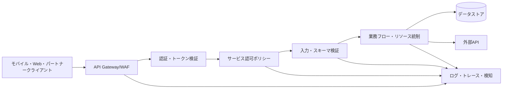
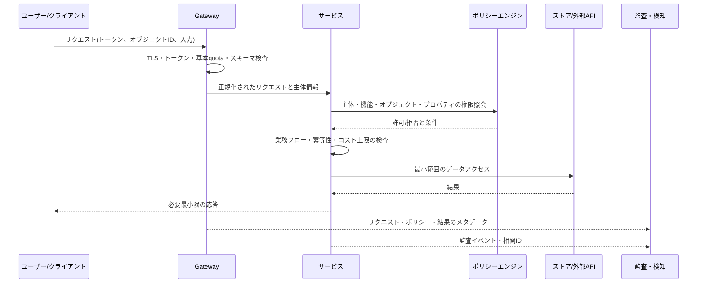

# OWASP API Security Top 10(2023)に基づくAPIセキュリティの設計と運用

## 1. 概要

> **定義**: APIセキュリティとは、アプリケーション間の呼び出し境界において、認証・認可・入力検証・リソース統制・記録・提供者の信頼を一貫して適用し、データと業務機能の機密性・完全性・可用性を保護する活動である。

APIはWeb画面よりも多くの機能とデータを直接露出させる。モバイルアプリ、パートナーポータル、社内マイクロサービス、バッチジョブが同じAPIを呼び出すため、一つのエンドポイントが複数チャネル共通の攻撃面となる。画面上でボタンを隠すだけではAPI呼び出しを防げず、毎リクエストのサーバ側で主体と対象オブジェクト、実行機能、データ属性を改めて判定しなければならない。

OWASP API Security Top 10は、API特有の失敗パターンを整理したリスク認識の基準である。本ノートは[OWASP API Security Top 10 2023公式リスト](https://owasp.org/API-Security/editions/2023/en/0x11-t10/)を中心に説明する。2023年版は2019年の初版に続く第2版であり、単純な認証脆弱性だけでなく、業務フローの悪用や第三者APIの信頼問題までを扱う。

APIリスクの核心は、四つの境界が同時に崩れる点にある。第一は呼び出し元を確認する認証境界、第二は呼び出し元が何をできるかを決める認可境界である。第三はどれだけのコストとリソースを消費できるかを定めるリソース境界、第四はどのバージョン・ホスト・外部提供者と接続されているかを管理する運用境界である。

したがってAPIセキュリティは、APIゲートウェイを一つ導入するプロジェクトではない。設計段階の脅威モデル、サービスコードでのポリシー執行、CI/CDでの契約検査、ランタイムでの検知と対応、廃止段階での資産整理をつなぐライフサイクル管理の問題である。

技術士の答案では、リスク一覧を列挙するよりも「オブジェクト・プロパティ・機能」レベルの認可を分離し、正常な呼び出しと自動化された業務悪用を区別し、認証・認可・制限・可観測性を一つの統制体系として束ねて説明することが重要である。

## 2. APIセキュリティの脅威モデルと全体構造

APIリクエストは一般に、クライアント、APIゲートウェイ、サービス、データストア、外部APIの順に通過する。各層は異なるセキュリティ責任を持つ。ゲートウェイは共通ポリシーの一貫性を高めるが、オブジェクトごとの権限や業務ルールをすべて把握することはできないため、サービス内部の検証を代替できない。

認証は「誰であるか」を確認するが、認可は「この主体がこのオブジェクトのこのプロパティに対してこの機能を実行できるか」を判断する。二つの問いをトークンの有無一つにまとめてしまうと、水平的権限昇格と垂直的権限昇格を見落としやすい。

入力検証は悪意ある文字列を除去する作業に限定されない。ページサイズ、ソートフィールド、フィルタの深さ、アップロードサイズ、URLの宛先、列挙型の値、数値範囲を検証しなければならない。検証ルールがOpenAPI契約とサービス実装とで異なれば、攻撃者はより緩い経路を探す。

リソース統制は、ネットワークリクエスト数を数えるだけでは不十分である。一回の呼び出しがデータベース結合、大容量ファイル変換、SMS送信、決済承認、外部AI呼び出しを誘発するなら、コスト単位ごとの制限が必要である。APIセキュリティはセキュリティチームの専有物ではなく、サービスオーナーとプラットフォームチームの共同責任である。

次の表は層ごとの責任を要約したものである。表の項目は統制の位置を示しており、実際の理由と例外処理は各サービスの文章による設計として残すべきである。

| 層 | 主な責任 | 代表的な失敗 |
|---|---|---|
| 資産・契約 | ホスト、バージョン、エンドポイント、スキーマの識別 | 忘れられたデバッグAPIと旧バージョンの露出 |
| 認証 | トークン・セッション・キーの発行、検証、失効 | 偽造・再利用・有効期限の不備 |
| 認可 | オブジェクト・プロパティ・機能・業務ルールの判定 | 他ユーザーのオブジェクト参照・管理API呼び出し |
| 入力・出力 | スキーマ、型、範囲、機微フィールドの統制 | 過剰な応答・マスアサインメント |
| リソース・業務 | 速度、同時実行、コスト、機微フローの統制 | DoS・在庫の先取り・クーポン濫用 |
| 連携・運用 | 外部API検証、設定、ロギング、対応 | SSRF・第三者データの過信・追跡不能 |

## 3. OWASP API Security Top 10 リスク別解説

### 3.1 API1:2023 Broken Object Level Authorization

オブジェクトレベル認可(BOLA)の不備とは、リクエストのパスまたはボディに含まれるオブジェクト識別子を書き換えて、他ユーザーのリソースを読み取ったり変更したりする問題である。`/users/100/orders/9`の`9`が現在のユーザーの注文かどうかを確認せずに照会すると、ログインと認証が正常であっても機密性が崩れる。

脆弱性の原因は、識別子を信頼するデータアクセスコードである。開発者はURLに数値IDがあることを「すでに権限を確認した状態」と誤解しやすい。しかし識別子はルーティング情報にすぎず、権限の証明ではない。すべてのオブジェクトの照会・変更・削除経路で、主体、テナント、オブジェクトの所有権と共有状態を併せて検査しなければならない。

実務では、グローバルIDをUUIDに置き換えるだけでは解決しない。UUIDは推測を難しくするだけであり、漏えいしたり応答から観測されたりすれば同じ問題が残る。サービス層で`authorize(subject, action, resource)`を呼び出し、データベースクエリにもテナント条件を併せて含めることで多層防御を構成すべきである。

例えば教育プラットフォームの受講生Aが自分の成績APIを呼び出す際に`studentId=B`へ変更しても、結果が返ってはならない。最も安全な形は、リクエストのstudentIdを権限判断の基準とせず、認証主体から得たユーザーとテナントの範囲で照会することである。

### 3.2 API2:2023 Broken Authentication

認証の脆弱性は、トークンの窃取だけでなく、トークンの発行・有効期間・ローテーション・失効ポリシーが杜撰な状態を包括する。パスワードリセットトークンが長く生存していたり、refresh tokenが端末とセッションに紐付けられていなかったり、認証失敗に制限がなかったりすると、攻撃者は正規のAPIを通じてアカウントを乗っ取ることができる。

アクセストークンは短い有効期間で運用し、refresh tokenには再利用検知とローテーションポリシーを適用する。署名アルゴリズムを許可リストで固定し、issuer・audience・nonce・発行時刻と有効期限を検証する。JWTの署名が正しいかどうかだけを確認する実装は、他サービスで発行されたトークンを受け入れる混同を生み得る。

APIキーは、ユーザー認証とアプリケーション識別を同等に保証するものではない。パートナーキーを持つ者がどのエンドユーザーであるかを追跡すべきサービスであれば、別途のユーザー認証と行為者の帰属が必要である。キーはソースコードやURLに残さずボールトから注入し、露出時には即座に失効できなければならない。

ログイン、パスワード変更、決済承認のようにリスクの大きい操作には、再認証や段階的認証を要求する。認証の成功率と失敗率、地域・端末の変化、refresh tokenの再利用を併せて観測すべきであり、無条件のIP遮断はモバイルユーザーやNAT環境での誤検知を増やし得る。

### 3.3 API3:2023 Broken Object Property Level Authorization

プロパティレベル認可とは、オブジェクト自体へのアクセス権限があっても、オブジェクト内部の各フィールドに対する読み取り・書き込み権限は異なり得るという観点である。2023年版は、従来の過剰なデータ露出とマスアサインメントの問題を、共通の原因であるプロパティ権限の欠陥として一つにまとめている。

応答オブジェクトをデータベースモデルのままシリアライズすると、内部メモ、コスト、認証情報、管理者フラグが一緒に露出し得る。逆に、クライアントが送ったJSONをそのままオブジェクトにマージすると、`role`、`approved`、`price`のような保護フィールドを変更できてしまう。入力DTOと出力DTOを分離し、フィールドごとの許可リストを明示すべきである。

例えば一般の販売者は商品の`name`と`description`は変更できても、`sellerId`、`settlementRate`、`approved`は変更できてはならない。画面で該当の入力欄を隠すことと、サーバでプロパティ権限を検証することは全く別の統制である。

マスキングは表示制御であり、認可はアクセス決定である。住民登録番号の下位桁をマスキングして返すよりも、業務上必要のない主体にはそもそも当該フィールドを照会しないほうが、ログ・キャッシュ・分析パイプラインへの拡散を減らせる。

### 3.4 API4:2023 Unrestricted Resource Consumption

無制限なリソース消費とは、リクエスト頻度だけでなく、一件のリクエストが誘発するあらゆる有限リソースの枯渇を意味する。CPUとメモリだけでなく、データベース接続、ストレージ容量、メール・SMSの送信量、決済手数料、外部AI呼び出しコストもリソースとして捉えるべきである。

固定の秒間リクエスト数だけを適用すると、安価な照会と高価なレポート生成APIを同一に扱ってしまう。エンドポイントごとの重み付け、ユーザー・テナントごとの予算、同時実行数、リクエストボディのサイズと処理時間の制限を設計しなければならない。制限超過時には429と再試行の案内を一貫して提供しつつ、無限の再試行を誘発する応答は避ける。

ページサイズやソート・フィルタ条件の上限はサーバで強制する。大容量エクスポートは同期APIで処理せず、ジョブキューに登録したうえで進捗とダウンロードの有効期限を提供すれば、リクエストスレッドとWebタイムアウトの連鎖障害を減らせる。

実例として、画像変換APIが無制限の原本サイズを許容すると、攻撃者は正規の認証で大型ファイルを繰り返し送信し、CPUとストレージを同時に消耗させることができる。ファイルサイズ・ピクセル数・解凍後のサイズ・ユーザーごとの1日上限を併せて管理すべきである。

### 3.5 API5:2023 Broken Function Level Authorization

機能レベル認可(BFLA)の不備は、一般ユーザー向け機能と管理者向け機能の境界が崩れる問題である。`/admin/export`、`/users/{id}/suspend`のようにURLに管理者を示す語が含まれていても、サーバがロールとポリシーを検査しなければ、隠されたメニューが攻撃面となる。

ロールベースアクセス制御(RBAC)は素早く始めるのに適しているが、ロール数が増えると例外が爆発的に増える。属性ベースアクセス制御(ABAC)やポリシーベースアクセス制御(PBAC)を導入すれば、主体のロール、組織、リソースの状態、リクエストの文脈を併せて判断できる。重要なのはモデルの名称よりも、すべての機微な機能にポリシー検査が実際に接続されているかどうかである。

HTTPメソッドだけで権限を推定してはならない。`GET`も個人情報の大量抽出機能であり得るし、`POST`も単なる検索であり得る。API仕様のoperationIdと実際のポリシーIDをマッピングし、機能単位の権限テストを自動化することが望ましい。

マイクロサービス環境では、ゲートウェイのロール検査とサービス内部の業務権限検査が食い違うことがある。ゲートウェイは共通認証と粗いポリシーを担当し、最終サービスはリソースと業務状態を知る主体としてきめ細かな決定を下すべきである。

### 3.6 API6:2023 Unrestricted Access to Sensitive Business Flows

機微な業務フローへの無制限アクセスは、従来型のコーディングエラーがなくても発生する。ユーザーが商品購入、座席予約、コメント投稿、クーポン発行といった正常な機能を自動化して事業上の結果を歪めると、APIは技術的には正常に動作していても、ビジネスセキュリティは失敗している。

このリスクは「リクエスト回数」よりも「業務上の意味」をモデル化しなければならない点でAPI4と異なる。同一アカウントが短時間に複数のIPから新規アカウントを作成してクーポンを使い尽くしたり、在庫確保と決済取消を繰り返したりする場合には、業務ルールとリスクシグナルを併せて評価すべきである。

対策はCAPTCHA一つで完結しない。ユーザー・端末・決済手段・住所・在庫・時間枠を結び付けたレート制限、重複リクエスト防止、予約の期限切れ、段階的検証、異常検知、人手による審査を組み合わせる。自動化が正当なパートナーには、別途のquotaと契約に基づく許容量を付与する。

例えば公演チケットAPIでは、ログインと権限が正常であっても、一つのアカウントが短時間に座席の確保と取消を繰り返せば、他の顧客の機会を侵害する。座席ロックの時間制限、同一決済手段での同時予約の上限、冪等キー、ボットリスクスコアを併せて適用すべきである。

### 3.7 API7:2023 Server Side Request Forgery

SSRFは、サーバがユーザー提供のURLを取得する機能を悪用し、内部ネットワーク、メタデータサービス、管理用ポートへリクエストを送らせる攻撃である。URLの形式が正しいことと、宛先が安全であることは別である。

許可リストに基づく外部ドメインポリシーを優先し、DNSリバインディングやリダイレクトで検査を回避されないようにする。プライベートIP、ループバック、リンクローカルアドレス、予約済みアドレス帯を、名前解決結果と接続段階の両方で遮断し、HTTPクライアントのリダイレクトとプロトコルを制限する。

ネットワーク分割はアプリケーション検証の代替ではない。アプリケーションが内部の認証情報サービスにアクセスできる構造であれば、一度のSSRFで被害が拡大し得るため、メタデータエンドポイントを別ポリシーで保護し、最小権限のネットワークを構成すべきである。

画像プレビューやWebhook検証機能は代表的な事例である。リクエストURLを保存するだけなのか実際にサーバが取得するのか、リダイレクトに追従するのか、応答本文を外部ユーザーに返すのかを、データフローとして分析しなければならない。

### 3.8 API8:2023 Security Misconfiguration

セキュリティ設定ミスは、デフォルトアカウント、過度なCORS、デバッグ応答、詳細なスタックトレース、本番環境のテストエンドポイント、検証されていないHTTPメソッドなど多様な形で現れる。APIと、APIを取り巻くプロキシ・コンテナ・クラウドの設定を併せて点検しなければならない。

環境ごとの設定をコードから分離しつつ、分離そのものが統制の不在を意味してはならない。安全なデフォルト値、必須環境変数の検証、設定スキーマ、変更承認、シークレット値の検知、デプロイ前のポリシーテストを構成する。本番環境に開発用ドキュメントやサンプルアカウントが残っていないかを定期的に確認する。

CORSはブラウザのクロスオリジンアクセス制御であり、API自体の認証・認可ではない。許可オリジンをワイルドカードで開放し、かつ資格情報を許可する構成は、意図しないブラウザからの呼び出しを生み得る。非ブラウザクライアントまで保護するには、トークンとサーバ側の権限検査が必ず必要である。

エラー応答はデバッグに必要な情報を開発者に提供するが、本番の応答に内部ホスト名・SQL・トークン・スタックを含めれば攻撃者の偵察資料となる。外部には相関IDと一般化したエラーを返し、詳細はアクセスが統制されたログに残す。

### 3.9 API9:2023 Improper Inventory Management

不適切な資産管理とは、APIがどこに存在し、どのバージョンでデプロイされているかを把握していない状態である。本番ホストだけでなく、テスト・ステージング・パートナー専用ホスト、GraphQLスキーマ、非同期コールバック、サーバーレス関数も一覧に含めるべきである。

APIインベントリはドキュメントファイルだけでは維持されない。ゲートウェイログ、DNSと証明書、サービスレジストリ、OpenAPIリポジトリ、コードのルート、クラウドのデプロイ一覧を相互に突き合わせ、実際の露出面を発見する。各資産にオーナー、データ等級、バージョン、認証方式、廃止予定日を付与する。

旧バージョンAPIを即座に削除することが難しい場合は、終了スケジュールを公開し、新規ユーザーの遮断・機能縮小・レスポンスヘッダでの廃止案内・呼び出し量の監視を段階的に適用する。単に`/v1`を`/v2`に変えるだけでは、旧バージョンの脆弱なポリシーが残っていればリスクを移転するにすぎない。

例えば開発用の`api-dev.example`に本番データベースが接続された状態であれば、公式ドキュメントに記載がないという事実は保護にならない。外部攻撃面の検証と内部資産の照合を定期的に実施し、発見された未登録APIを所有チームのライフサイクルに組み込むべきである。

### 3.10 API10:2023 Unsafe Consumption of APIs

安全でないAPIの利用は、内部の開発者が第三者APIの応答をユーザー入力よりも信頼することから始まる。外部の応答が悪意ある値、過大なサイズ、誤った型、遅延やエラーを含み得るにもかかわらず、それをそのまま保存・レンダリング・コマンド生成に使えば、サプライチェーンの攻撃面となる。

外部APIは別個の信頼境界としてモデル化する。TLSと証明書の検証、タイムアウト、再試行の上限、サーキットブレーカー、応答スキーマの検証、サイズ制限、許可するコンテンツタイプ、出力エンコーディングを適用する。第三者の値でSQL・HTML・シェルコマンド・プロンプトを組み立てる際には、内部入力と同一の検証ルールを適用しなければならない。

契約テストと提供者の変更監視を運用する。応答フィールドが追加されたり意味が変わったりしても利用側が安全に失敗するよう、未知のフィールドは無視し、必須フィールドの欠落は保守的に処理する。提供者ごとに資格情報を分離し、一つの提供者の障害がサービス全体の障害へ波及しないよう隔離する。

天気・住所・決済・AIのAPIを組み合わせるサービスがあるとしよう。住所APIの応答を検証なしにHTMLへ挿入すれば蓄積型XSSとなり得るし、AI APIの結果を業務コマンドとして直ちに実行すれば間接プロンプトインジェクションの経路となる。「第三者の応答も非信頼入力である」という原則が核心である。

## 4. リスク間の比較と統合的統制

API1とAPI5はいずれも権限の欠陥であるが、判断対象が異なる。API1は特定オブジェクトの所有・テナント範囲を見落とす問題であり、API5は特定の機能そのものを実行する権限を見落とす問題である。あるユーザーが他ユーザーの注文を読むのはAPI1の典型であり、一般ユーザーが管理者の一括削除機能を呼び出すのはAPI5の典型である。

API3は、オブジェクトは許可したもののフィールドレベルの露出・変更を統制できない場合である。したがって、オブジェクト、機能、プロパティという三つの軸をテストケースで分離すべきである。「ログイン済みユーザーだからアクセス可能」という単一条件で三つの軸を表現すると、欠陥の位置を特定しにくい。

API4とAPI6も区別する必要がある。API4の中心はリソースとコストの枯渇であり、API6の中心は正常な機能が事業上の結果を歪めることである。SMS送信APIの無制限な呼び出しはAPI4であり、一人がイベントの座席を繰り返し先取りするのはAPI6である。二つのリスクは同時に発生し得るため、技術的なquotaと業務ポリシーを連携させる。

API9とAPI8は運用統制の観点が異なる。API9は存在する資産を知らない問題であり、API8は把握している資産の設定が安全でない問題である。インベントリがなければ設定点検の対象も定義されないため、資産発見を先に実施し、その後に標準設定と例外承認を管理する。

| 比較軸 | オブジェクト認可 | 機能認可 | リソース統制 | 業務フロー統制 |
|---|---|---|---|---|
| 問い | このオブジェクトを見られるか? | この機能を実行できるか? | どれだけ消費できるか? | この行動は事業を歪めるか? |
| 主な主体 | ユーザー・テナント・所有者 | ロール・ポリシー・管理者 | ユーザー・キー・IP・テナント | アカウント・端末・決済手段・行動履歴 |
| 失敗の結果 | 情報露出・改ざん | 権限昇格・管理機能の悪用 | DoS・コスト急増 | 在庫・クーポン・評判の毀損 |
| 核心の検証 | オブジェクト照会時の所有権 | operationごとのポリシー | 重み付けquota・同時実行 | 速度・重複・リスクベースのポリシー |

統合設計では、次の多層防御フローを用いる。

図のように、ゲートウェイの検査は迅速な共通遮断を担い、サービスは業務の文脈を用いる。ポリシーエンジンを中央集約しても、ポリシー入力の構成を誤れば中央で誤った決定が繰り返されるため、サービスごとのポリシーテストと承認手続きが必要である。

## 5. 実装・検証・運用の手順

第一段階は、資産とデータフローを識別することである。API一覧にホスト・バージョン・認証方式・機微データ・オーナー・外部依存関係を記録し、各エンドポイントの行為者とオブジェクトを定義する。ドキュメントと実トラフィックの差異は別のリスクとして登録する。

第二段階は脅威モデルの作成である。オブジェクトIDの改ざん、ロールの変更、大量のページリクエスト、URLリダイレクト、旧バージョンの呼び出し、第三者応答の汚染を悪用シナリオとして作成する。個人情報・決済・管理機能については、被害規模と検知可能性を併せて評価する。

第三段階は、契約とポリシーのコード化である。OpenAPIスキーマ、JSON Schema、ポリシーファイル、機微フィールドの分類、quota定義をバージョン管理する。レビュアーがドキュメントを見るだけで許可主体と拒否条件を理解できるようにし、未定義のデフォルト値は拒否側に倒す。

第四段階は自動検証である。認証トークンの有効期限・issuer・audience、オブジェクトIDの交差アクセス、ロール別の機能呼び出し、プロパティのマスアサインメント、制限超過、SSRFアドレスの遮断、旧バージョンの露出をCIで検査する。テストでは401と403を区別し、認証失敗と認可失敗を混同しないようにする。

第五段階は運用の可観測性である。リクエストID、主体・テナント・APIバージョン・operationId・ポリシー決定・応答コード・遅延・リソースコストを構造化して記録しつつ、トークンや機微な本文はマスキングする。異常なオブジェクトIDパターン、403の急増、旧バージョンの呼び出し、quota超過、外部APIのスキーマ変化にアラートを設定する。

第六段階はインシデント対応と廃止である。トークン・キーをローテーションし、攻撃アカウント・端末・ネットワークを段階的に制限し、影響を受けたオブジェクトとテナントを算出する。APIバージョンの廃止時には、顧客への告知、呼び出し元の移行、遮断時期、監査ログの保存、ロールバック計画を運用ランブックとして管理する。

## 6. 事例: マルチテナントのコマースAPI

コマースシステムが商品照会、カート、注文、クーポン、決済、配送照会のAPIを提供すると仮定する。注文照会で`orderId`のみを検証すればAPI1が発生し、`isAdmin`プロパティを入力JSONから受け入れればAPI3が発生する。一般ユーザーが`/admin/refund`を呼び出せればAPI5となる。

クーポン発行はAPI6の代表的なフローである。あるユーザーが正当な発行権限を持っていても、アカウント・端末・決済手段ごとの発行回数、キャンペーン在庫、時間枠を併せて判定しなければならない。リクエストが再送されても一度だけ処理されるよう、冪等キーとサーバ側の状態遷移を用いる。

商品画像のURLをサーバが取得するプレビュー機能はAPI7を誘発し得る。許可された画像ドメインのみを照会し、内部アドレスとリダイレクトを遮断し、別のネットワークサンドボックスで処理する。画像応答のサイズと形式も検証し、リソース枯渇を防ぐ。

配送業者APIの応答をそのまま画面に挿入すればAPI10の問題となる。配送業者の応答を内部DTOに変換して許可フィールドのみを保存し、障害・遅延・スキーマ変更を隔離する。決済・配送・クーポンの提供者ごとにキーとquotaを分離し、一社のインシデントがアカウント全体へ拡大しないようにする。

事例から分かるように、リスクは互いに独立したチェックリストではない。注文照会の認可、クーポンの業務ルール、画像のURL検証、配送業者の応答検証が一つの取引フローで結合しているため、API別の担当者を超えて、ドメインオーナーがエンドツーエンドの統制に責任を負うべきである。

## 7. 深掘り: APIセキュリティプログラムと出題連携

OWASPのリストは脆弱性診断結果を示す分類表であると同時に、設計レビューの質問リストとして使うこともできる。しかし、Top 10に準拠したという文言だけで安全を保証することはできない。公式リストはリスク認識の基準であり、組織は資産・脅威・規制・ビジネス影響に応じた統制水準を追加しなければならない。

最新のAPI環境では、RESTエンドポイントだけでなく、GraphQL、gRPC、イベントコールバック、Webhook、AIモデル呼び出しも同じ原理で解釈する。GraphQLではフィールド選択とクエリ深度の制限が必要であり、gRPCではサービス・メソッド・メッセージフィールドの権限を点検しなければならない。Webhookでは送信元認証、リプレイ防止、署名検証、順序と冪等性を管理する。

APIセキュリティの成熟度は、発見、予防、検知、対応、学習の循環で評価できる。発見段階のインベントリが不十分であれば予防ポリシーの適用範囲が分からず、検知ログがなければ権限の迂回はインシデント後にも再現されない。インシデントから得たテストケースを契約・回帰テストに組み込むことで、プログラムが改善される。

技術士答案の出題連携の観点では、ゼロトラスト、マイクロサービス、DevSecOps、個人情報保護、クラウドネイティブセキュリティと結び付けることができる。APIをサービス間の信頼の境界と捉え、「常に検証」、最小権限、ポリシー自動化、可観測性、サプライチェーンリスクを併せて提示すれば、単一脆弱性の説明よりも設計の観点が明確になる。

想定答案は、① APIの拡散と脅威の背景、② オブジェクト・機能・プロパティ認可の区別、③ Top 10の主要リスクと対応、④ ゲートウェイ-サービス-データ層の構造、⑤ コマースや金融の事例、⑥ 運用指標と考慮事項、の順に構成すれば論理的な流れを作れる。単に10項目を一行ずつ書くのではなく、リスクが生じる理由と統制の限界を説明しなければならない。

## 8. 考慮事項および示唆

### 8.1 セキュリティとユーザー体験のバランス

すべてのリクエストに強力な再認証とCAPTCHAを適用すれば、セキュリティは高まっても正常な使い勝手が低下する。リスクベース認証により低リスクのフローは円滑に処理し、決済・権限変更・大量ダウンロードのように被害の大きいフローに追加検証を配置する。遮断基準は固定値よりも、実際の誤検知率と被害コストを併せて評価すべきである。

### 8.2 中央統制とサービスの自律性

APIゲートウェイにすべてのポリシーを集中させれば一貫性は高まるが、オブジェクトの所有権や業務状態を知らないポリシーとなる。共通の認証・転送・基本quotaはプラットフォームが提供し、オブジェクト・フィールド・業務ルールはサービスが所有する分散責任モデルが現実的である。ポリシー形式と監査イベントは標準化し、自律性が統制の断絶につながらないようにする。

### 8.3 個人情報の最小化と監査可能性

検知に必要なログを多く残すほど、個人情報とシークレットが拡散し得る。原文の本文の代わりにハッシュ・識別子・分類結果を記録し、ログへのアクセスと保存期間を目的に応じて制限する。逆に、マスキングしすぎて主体・オブジェクト・ポリシー決定を結び付けられなくなると、インシデント範囲の算出が不可能になるため、復元可能な相関設計が必要である。

### 8.4 性能とセキュリティ統制のトレードオフ

認可ポリシーの照会や外部リスク分析を同期呼び出しとして追加すると、遅延と障害点が増える。短いTTLのポリシーキャッシュ、ローカル検証、非同期検知、サーキットブレーカーを組み合わせつつ、権限の失効やデータの機微度に応じたキャッシュ無効化戦略を設ける。セキュリティ統制が迂回可能な最適化とならないよう、失敗時にはデフォルト拒否の原則を定める。

### 8.5 マルチテナンシーとデータ境界

テナントIDをクライアント入力のみから受け取ると、オブジェクト認可が繰り返し破られ得る。トークンのテナント範囲、組織間の共有契約、データベースの行レベル条件、キャッシュキーを併せて設計する。運用者はテナント間の交差照会を検知するカナリアテストを定期的に実施すべきである。

### 8.6 サプライチェーンと外部APIへの依存

外部APIの正常な応答も信頼できない入力として扱い、契約・セキュリティ点検・障害隔離・キーのローテーション・終了計画を備える。外部サービスに依存する機能には代替経路と手動処理手順を準備しておくことで、可用性の低下がセキュリティの迂回へと変わらないようにする。

### 8.7 成果測定と継続的改善

APIセキュリティの成果は脆弱性の件数だけで評価しない。未登録APIの発見時間、旧バージョンの廃止率、オブジェクト認可テストの合格率、ポリシー決定ログの欠落率、キーのローテーション時間、403異常パターンの検知時間、インシデント復旧時間を指標として管理する。指標が開発チームのスピードを罰する装置とならないよう、リスク低減と学習を併せて測定する。

## 参考資料

- OWASP, “OWASP Top 10 API Security Risks – 2023”: https://owasp.org/API-Security/editions/2023/en/0x11-t10/
- OWASP, “Introduction - OWASP API Security Top 10”: https://owasp.org/API-Security/editions/2023/en/0x03-introduction/
- OWASP API Security Project: https://owasp.org/www-project-api-security/

---

> **一言まとめ**: APIセキュリティとは認証だけを強化することではなく、オブジェクト・プロパティ・機能の認可、リソース・業務フローの統制、資産インベントリと外部APIの検証をライフサイクル全体に結び付ける多層防御の設計である。
