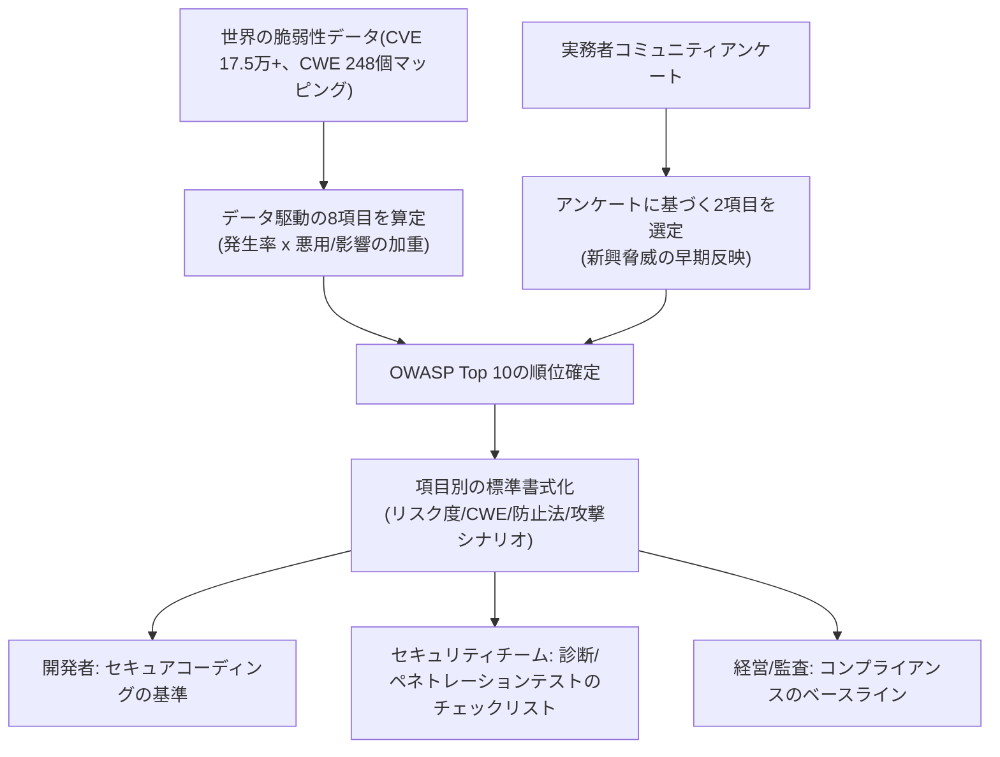
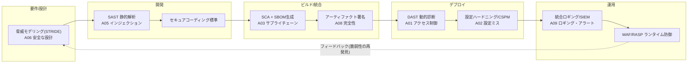

# OWASP Top 10 (Webアプリケーションのセキュリティリスク)

## 1. 概要

> **OWASP Top 10**とは、非営利のオープンコミュニティOWASP(Open Worldwide Application Security Project)が、世界中のアプリケーションの実際の脆弱性データと専門家アンケートを根拠に選定・発表する、Webアプリケーションにおいて最も頻繁かつ危険な上位10のセキュリティリスク(Risk)の一覧であり、事実上の業界標準(de facto standard)となっている認識資料である。

Webアプリケーションは、インターネットに常時露出した最前線の攻撃面(attack surface)である。ファイアウォールの背後に隠せる内部システムとは異なり、WebはHTTP(S)という開かれたプロトコルで不特定多数にサービスを提供しなければならないため、認証・認可・入力検証のどれか一つが崩れるだけで、データ漏えい・権限奪取・サービス停止に直結する。問題は、こうした欠陥の大半が新技術の欠如ではなく、**すでによく知られた基本統制の繰り返される欠落**に起因する点である。OWASP Top 10は、まさにこの「最もよく繰り返される失敗」をデータで抽出し、開発者・セキュリティ担当者・経営陣が優先すべきポイントを提示する。

登場の背景には三つの必要性がある。第一に、**共通言語(common vocabulary)の必要性**である。開発者とセキュリティチーム、監査人、発注機関がそれぞれ異なる用語で脆弱性を論じれば、コミュニケーションコストが急増する。Top 10は「A01 アクセス制御の不備」のように標準分類を提供し、利害関係者間のコミュニケーションを一元化する。第二に、**優先順位付け(prioritization)の必要性**である。セキュリティ予算と人員は有限であるため、発生頻度・悪用可能性・影響度の高いリスクから防御することで投資対効果が大きくなる。第三に、**コンプライアンスとの連携**である。PCI-DSS、韓国の電子金融監督規定、情報保護管理体系(ISMS-P)など多数の規制・認証がOWASP Top 10への対応を事実上要求または参照しているため、これは単なる技術ガイドを超えて規制対応のベースラインとなっている。

OWASP Top 10は約4年周期(2013→2017→2021→2025)で改訂されており、最新版である**2025年改訂版は2025年11月のGlobal AppSecカンファレンスで公開され、2026年1月に最終確定**した。2025年版は17.5万件以上のCVEと248個のCWE(Common Weakness Enumeration)のマッピング、そして実務者アンケートを組み合わせて選定された点で、データ駆動性が一層強化されている。

OWASP Top 10の主要な特徴を整理すると次のとおりである。

- **リスク(Risk)中心の分類**: 個別の脆弱性ではなく、多数のCWEを束ねた上位のリスクカテゴリを扱うため、防御の優先順位策定に適している。
- **データ+アンケートによる二元的選定**: 実測の脆弱性統計(遅行性)と専門家アンケート(先行性)を組み合わせ、過去のデータと新興の脅威を共に反映する。
- **開発者志向の実用性**: 項目ごとに防止方法と攻撃シナリオを標準書式で提供し、即時の対応に活用できる。
- **事実上の標準・コンプライアンスのベースライン**: PCI-DSS、金融監督規定、ISMS-Pなど多数の規制・認証が参照する準拠基準として定着した。
- **周期的な進化**: 約4年周期で改訂され、脅威環境の変化を継続的に追跡する。

## 2. 選定方法論と文書構造

OWASP Top 10は勘ではなく方法論に基づく。項目の順位は大きく二つの軸で決定される。**8項目は実測データ(CVE/CWE統計)で算定**され、**2項目はコミュニティアンケート(Community Survey)で選定**される。データに基づく項目は「発生率(Incidence Rate)」と「悪用可能性・影響(Exploitability・Impact)」を加重計算し、アンケートに基づく項目は、まだCVEでは十分に捕捉されていないものの実務者がリスクを実感している最新の脅威を早期に反映するための仕組みである。この二元的構造のおかげで、Top 10は過去データの遅行性と将来の脅威の先行性を同時に取り込むことができる。

各リスク項目は、リスク度(要因・影響)、代表的なCWE、説明、防止方法(How to Prevent)、攻撃シナリオ例(Example Attack Scenarios)、参考資料という一貫した書式で記述される。この標準書式は、開発者が「何が問題で、なぜ危険であり、どう防ぐのか」を即座に把握する助けとなる。以下の図は、選定パイプラインと成果物の全体構造を示す。

ここで必ず区別すべき点は、Top 10が列挙しているのは個別の「脆弱性(Vulnerability)」ではなく、多数のCWEを束ねた上位の「リスクカテゴリ(Risk Category)」だという事実である。例えばA01 アクセス制御の不備一つにも数十の詳細なCWEがマッピングされている。したがってTop 10は完全なチェックリストではなく**意識向上(awareness)のための文書**であり、実際の検証には後述するOWASP ASVSのような詳細な標準を併用しなければならないことを、技術士の観点から留意すべきである。

## 3. OWASP Top 10:2025 項目別詳細

2025年改訂版の10大リスクは以下のとおりであり、各項目の原理と対応の方向性を順に説明する。

| 順位 | リスクカテゴリ | 主な原因 | 代表的な防御 |
|------|-----------|-----------|-----------|
| A01 | Broken Access Control (アクセス制御の不備、SSRFを吸収) | 認可検査の欠落・迂回 | サーバ側での認可強制、Deny by default |
| A02 | Security Misconfiguration (セキュリティ設定ミス) | デフォルト値・不要機能・エラー露出 | ハードニング、最小機能 |
| A03 | Software Supply Chain Failures (SWサプライチェーンの失敗、新規) | 脆弱・改ざんされた依存関係 | SBOM、SCA、署名検証 |
| A04 | Cryptographic Failures (暗号化の失敗) | 平文・弱いアルゴリズム | 強力な暗号・通信/保存時の暗号化 |
| A05 | Injection (インジェクション) | 信頼できない入力とコマンドの結合 | パラメータバインディング・検証 |
| A06 | Insecure Design (安全でない設計) | 設計段階の脅威モデリング不在 | Threat Modeling、PbD |
| A07 | Authentication Failures (認証の失敗) | 脆弱な認証・セッション管理 | MFA、セッション保護 |
| A08 | Software or Data Integrity Failures (完全性の失敗) | 未検証の更新・デシリアライゼーション | 署名・完全性検証 |
| A09 | Logging & Alerting Failures (ロギング・アラートの失敗) | 検知・対応の遅延 | 統合ロギング、リアルタイムアラート |
| A10 | Mishandling of Exceptional Conditions (例外状況の不適切な処理、新規) | 例外/エラーロジックの欠陥 | 安全な失敗(fail-safe) |

**A01 アクセス制御の不備(Broken Access Control)** は、2021年版に続き2025年版でも不動の1位である。認証(Authentication)は通過したものの認可(Authorization)が杜撰なため、一般ユーザーがURLや識別子(ID)を変えるだけで他人のデータや管理者機能にアクセスできてしまう欠陥が代表的である。例えば`/account?id=1001`を`id=1002`に変えると他人の口座が照会されるIDOR(Insecure Direct Object Reference)が典型である。2025年版では、以前は独立項目だったSSRF(Server-Side Request Forgery)がこのカテゴリに統合されたが、これはサーバが検証なしにユーザー指定のURLで内部リソースにアクセスすることも、本質的には「権限の境界を越えるアクセス」であるという判断による。防御の核心は、クライアント側の制御を信頼せず、**すべてのリクエストをサーバ側でセッション・ロールに基づいて認可し、デフォルトを拒否(deny by default)** とすることである。

**A02 セキュリティ設定ミス(Security Misconfiguration)** は、2021年版の5位から2位へと大きく上昇した。クラウド・コンテナ・IaCの普及により設定要素が爆発的に増え、デフォルトアカウントの放置、不要なポート・サービスの開放、詳細なエラーメッセージの露出、クラウドストレージバケットの公開設定といったミスが急増した結果である。実際、大規模なクラウドデータ漏えい事故の相当数は、脆弱性ではなく「誤って公開したS3バケット」のような設定ミスに起因する。対応は、安全な基準(ハードニングベースライン)を標準化し、IaCスキャンやCSPM(Cloud Security Posture Management)で継続的に点検することである。

**A03 ソフトウェアサプライチェーンの失敗(Software Supply Chain Failures)** は2025年版で新設された上位項目であり、2021年版の「脆弱で古くなったコンポーネント」をサプライチェーン全体へと拡張したものである。今日、アプリケーションコードの70~90%はオープンソース・サードパーティの依存関係であり、一つの人気ライブラリが汚染されれば、それを使う数万のシステムが同時に感染する。SolarWinds事件、npm・PyPIへの悪性パッケージ注入、Log4Shell(Log4j)といった事例が、サプライチェーン脅威の波及力を実証した。対応は、SBOM(Software Bill of Materials)の作成、SCA(Software Composition Analysis)による既知の脆弱性(CVE)のマッピング、署名・ハッシュに基づくアーティファクトの完全性検証、SLSAのようなサプライチェーン完全性フレームワークの適用である。

**A04 暗号化の失敗(Cryptographic Failures)** は、機微情報を平文で保存・送信したり、脆弱なアルゴリズム(MD5、SHA-1、DES)・短い鍵・ハードコードされた鍵を使ったりする欠陥である。防御は、通信区間でのTLS 1.2/1.3、保存データのAES-256、パスワードにはbcryptやArgon2のような適応型ハッシュ、鍵はKMS/HSMで分離管理することである。**A05 インジェクション(Injection)** はSQL・OSコマンド・LDAP・XSSを包括し、信頼できない入力がインタプリタのコマンドやクエリにそのまま結合されるときに発生する。パラメータバインディング(Prepared Statement)、ORM、入力のホワイトリスト検証、出力エンコーディングが定石の対応である。

**A06 安全でない設計(Insecure Design)** は実装バグではなく設計そのものの欠陥であり、「コードは設計どおり正確に動作するが、その設計が危険である」場合である。例えば、パスワード再設定ロジックにアカウント列挙(enumeration)を許すフローを組み込んでいれば、どれほど完璧にコーディングしてもリスクは残る。これは**脅威モデリング(Threat Modeling)とPrivacy/Security by Designを設計段階から適用**して初めて根本的に除去される。**A07 認証の失敗(Authentication Failures)** は、脆弱なパスワードポリシー、クレデンシャルスタッフィングの放置、セッショントークン管理の不備を含み、MFA・アカウントロック・安全なセッション失効で対応する。

**A08 完全性の失敗(Software or Data Integrity Failures)** は、署名・検証なしに更新やプラグインを信頼したり、安全でないデシリアライゼーション(deserialization)によって任意のオブジェクトが実行されたりする問題である。**A09 ロギング・アラートの失敗(Logging & Alerting Failures)** は攻撃そのものではなく「検知・対応の不在」であり、侵害が発生してもログがなかったりアラートが鳴らなかったりして、平均検知時間(MTTD)が数か月に延びる原因となる。2025年版は名称を「アラート(Alerting)」まで含むように変更し、リアルタイム対応の重要性を強調した。最後に新規項目である**A10 例外状況の不適切な処理(Mishandling of Exceptional Conditions)** は、エラー・例外状況のロジックが誤って設計されていることで生じるリスクであり、例外発生時に認可検査をスキップしたり(fail-open)、機微情報をエラーメッセージで露出したり、状態の不整合につながったりする場合を包括する。これは堅牢なエラー処理と**安全な失敗(fail-safe/fail-closed)の原則**によって防御する。

## 4. 2021 → 2025 の変化の比較とその含意

2021年版と2025年版を比較すると、Webセキュリティの重心の移動がはっきりと読み取れる。単に順位が変わっただけではなく、「何が危険か」に関する業界の認識が、アプリケーションコード内部から**サプライチェーン・設定・運用全般へと拡張**されたことを示している。

| 区分 | 2021年版 | 2025年版 | 変化の意味 |
|------|--------|--------|-------------|
| 1位 | A01 アクセス制御 | A01 アクセス制御 | 依然として最大の脅威、SSRF吸収で範囲拡大 |
| 新規/上昇 | A05 セキュリティ設定ミス | A02へ上昇 | クラウド・IaC普及による設定リスクを反映 |
| 新規 | (なし) | A03 サプライチェーンの失敗 | オープンソース依存・サプライチェーン攻撃の急増 |
| 新規 | (なし) | A10 例外状況の不適切な処理 | 運用中に実際に観測された新興攻撃を反映 |
| 統合 | A10 SSRF (独立) | A01へ統合 | 権限境界違反という本質で再分類 |
| 名称変更 | A09 ロギング・モニタリングの失敗 | A09 ロギング・アラートの失敗 | リアルタイムの検知・対応を強調 |

この変化がもたらす実務上の含意は明確である。第一に、**セキュリティの責任境界は開発者だけのものではなくなった。** サプライチェーン(A03)と設定(A02)が上位に来たことで、コードレビューだけでなくCI/CDパイプライン、インフラ構成、依存関係管理まで統合的に防御しなければならない。これはDevSecOpsへの転換を加速する根拠となる。第二に、**設計・運用段階の欠陥が浮き彫りになった。** A06 安全でない設計とA10 例外の不適切な処理は、いずれも「実装以前」と「実装以後」の問題であり、脆弱性スキャナでは捕捉しにくく、脅威モデリング・アーキテクチャレビュー・堅牢性設計によってのみ予防される。第三に、SSRF統合の事例のように**リスクの再分類が防御戦略を単純化**する — SSRFを個別に扱うよりも「権限境界の統制」という一つの原則で束ねて対応すれば、カバレッジが広がる。

具体的な事例として、2021年のLog4Shell(Log4j、CVE-2021-44228)脆弱性は、ただ一つのロギングライブラリの欠陥が世界中の数億台のシステムをリモートコード実行(RCE)の危険にさらした代表的なサプライチェーン事故であり、A03が新たな上位項目となった直接的な背景となった。また、多数のクラウド漏えい事故がコードの脆弱性ではなく公開設定されたストレージバケット(A02)に起因したという統計は、設定ミスの順位上昇を裏付けている。

一方で、順位算定が「発生頻度」と「影響度」の加重である点にも解釈上の注意が必要である。あるリスクは発生頻度は低いが一度起これば致命的であり(例: 完全性の失敗によるサプライチェーン汚染)、あるリスクは頻度は高いが個々の影響は限定的な場合がある。したがって順位が低いからといって防御の優先順位が必ずしも低いわけではなく、組織の業種特性・データの機微度・規制環境に合わせてTop 10を再加重(re-weighting)するのが実務的に妥当である。例えば金融・医療のようにデータの機微度が高いドメインでは、A04 暗号化の失敗とA01 アクセス制御の相対的な比重をより大きくする、といった具合である。

## 5. 実務上の対応手順 — SSDLC/DevSecOpsへの統合

OWASP Top 10を事後点検のチェックリストとして使うと、効果は半減する。真の価値は、**ソフトウェア開発ライフサイクル(SDLC)の全段階にセキュリティを内在化(Shift-Left)** するベースラインとして活用したときに発揮される。すなわち、要件・設計段階では脅威モデリングでA06を、開発段階ではセキュアコーディングとSASTでA05を、ビルド段階ではSCA/SBOMでA03を、デプロイ・運用段階ではDAST・設定点検・統合ロギングでA02・A09をそれぞれ防御するというように、項目をパイプラインの各地点にマッピングする。以下はこの統合をアーキテクチャの観点から示したものである。

このパイプラインの核心は、**各段階のゲート(Gate)で自動化されたセキュリティ検証を通過しなければ次の段階へ進めない**よう強制することである。例えばSCAスキャンで深刻度High以上の既知の脆弱性(CVE)が発見されればビルドを失敗させ、脆弱な依存関係が本番環境に到達することを根本から遮断する。運用段階のWAF・RASPは、除去しきれなかった残余リスクに対する補完的統制(compensating control)として機能し、ここで検知された新たな攻撃パターンは再び脅威モデリングへフィードバックされ、防御を継続的に改善する。実際の金融業界の事例では、こうしたゲート自動化の導入後、デプロイ前の脆弱性検出率が大きく向上し、運用段階で見つかっていた欠陥が開発初期へと前倒しされることで修正コストが大幅に削減される効果が報告されている。

ここでWAF(Web Application Firewall)とRASP(Runtime Application Self-Protection)の役割の違いを押さえておく必要がある。WAFはアプリケーションの前段(ネットワーク境界)で既知の攻撃パターン(シグネチャ)を遮断する外部の防御線であり、デプロイなしに迅速にルールを適用して新規脆弱性に対する仮想パッチ(virtual patching)を提供するが、アプリケーション内部の文脈を知らないという限界がある。一方、RASPはアプリケーションのランタイム内部に組み込まれ、実際の実行フローとデータの文脈を見て判断するため、誤検知が少なく精緻であるが、性能オーバーヘッドと言語・フレームワークへの依存という代償を伴う。両者は排他的ではなく、**境界防御(WAF)と内部防御(RASP)を階層的に組み合わせる多層防御(Defense in Depth)** が推奨される。ただし、これらのランタイム統制はあくまでSDLCへの内在化が見逃した残余リスクに対する補完策であり、根本的な欠陥除去を代替するものではないことを明確に認識すべきである。

## 6. 深掘り — OWASPエコシステムと最新動向

OWASP Top 10の「Web」リストは、膨大なOWASPプロジェクトエコシステムの一部にすぎず、技術士の答案ではこれを拡張標準と連携させて論じることが高得点のポイントである。代表的なものとして、**OWASP API Security Top 10**は、MSA・モバイルバックエンドの普及によってAPIが主要な攻撃面となったことで別途管理されているリストであり、オブジェクトレベル認可(BOLA)、機能レベル認可、無制限なリソース消費といったAPI特有のリスクを扱う。また**OWASP Top 10 for LLM Applications**は生成AI時代の新興脅威として、プロンプトインジェクション、安全でない出力処理、学習データ汚染、モデルのサービス拒否、機微情報の露出などを定義している。これは、今後Web・API・AIアプリケーションが融合するにつれ、統合的な対応が必要になることを示唆している。

検証・成熟度の面での拡張標準も重要である。**OWASP ASVS(Application Security Verification Standard)** は、Top 10の認識レベルを超えて実際に検証可能な詳細要件(レベル1~3)を提供するため、セキュリティ要件定義と診断の根拠となる。**OWASP SAMM(Software Assurance Maturity Model)** は、組織のセキュリティ能力の成熟度を測定・改善するフレームワークであり、Top 10への対応が一過性のイベントではなく組織能力として定着するよう支援する。開発者の実習用の脆弱なアプリケーションである**WebGoat・Juice Shop**や、リスク統制を能動的に提示する**OWASP Proactive Controls**も併せて活用される。

最新動向としては三点が注目される。第一に、2025年改訂で確認されるように、**リスクの中心がコードからサプライチェーン・運用へと移動**し、SBOM・SLSA・署名検証が必須化しつつある。第二に、**AIが諸刃の剣**として作用する — 攻撃側はLLMで脆弱性探索とエクスプロイト生成を自動化する一方、防御側はAIベースのコードレビュー・異常検知で対抗する。第三に、規制・認証(電子金融、個人情報保護法、ISMS-P、サプライチェーンセキュリティの義務化の流れ)がOWASPの基準を事実上の準拠基準として採用するにつれ、Top 10への対応は技術課題を超えて**ガバナンス・コンプライアンス課題**へと格上げされている。

## 7. 考慮事項および示唆 (技術士の観点)

- **認識文書と検証標準の併用戦略**: OWASP Top 10は「最もよくあるリスク」を知らせる意識向上の資料であり、完全なセキュリティ要件ではない。したがって実際のシステム構築・監理の際には、Top 10で優先順位を定めつつ、ASVS・CWE Top 25などの詳細な検証標準を組み合わせてカバレッジの空白を埋めなければならない。Top 10だけで「セキュリティ対応完了」を宣言するのは危険な誤解である。

- **Shift-Leftとコストのトレードオフ**: 欠陥は設計段階で捕捉するほど修正コストが指数関数的に低くなる(設計段階に比べ運用段階の修正コストは数十倍)。脅威モデリング・SAST・SCAをパイプラインの前段に内在化するのが定石であるが、初期には開発速度の低下と誤検知(false positive)への対応負担というトレードオフがある。ゲートの閾値をリスクに基づいて調整し、自動化の精度を高めることで、この摩擦を最小化すべきである。

- **サプライチェーンセキュリティの全社的な拡大**: A03の台頭は、セキュリティの責任が開発チームを越えて調達・法務(ライセンス)・運用へと拡張されることを意味する。SBOMを組織の資産として管理し、ベンダーリスク評価とアーティファクトの完全性検証を標準プロセスとして制度化するガバナンスが求められる。これはゼロトラストの原則(「検証なしに信頼しない」)をサプライチェーンに拡張適用するものと見ることができる。

- **防御の持続性と文化の定着**: 4年周期の改訂が示すように脅威は進化し続けるため、特定時点のTop 10への対応はスナップショットにすぎない。SAMMで組織の成熟度を継続的に測定し、DevSecOps文化とセキュリティチャンピオン(Security Champion)制度によって、開発者がセキュリティを日常的な能力として身に付けるようにすべきである。ツールの導入よりも、人とプロセスの定着が最終的な成否を分ける。

- **AI融合時代の拡張対応**: 今後Web・API・LLMアプリケーションが融合するにつれ、OWASP Top 10(Web)・API Top 10・LLM Top 10を統合的に考慮した脅威モデルが必要となる。特に生成AIをサービスに組み込む際には、プロンプトインジェクション・データ漏えいのリスクを、従来のインジェクション・アクセス制御の観点と結び付けて設計しなければならない。

## 8. 参考資料

- OWASP Top 10:2025, OWASP Foundation — https://owasp.org/Top10/
- OWASP Top Ten Project (プロジェクトホーム) — https://owasp.github.io/www-project-top-ten/
- OWASP Top 10 2025: Key Changes, Orca Security — https://orca.security/resources/blog/owasp-top-10-2025-key-changes/
- OWASP Top 10 2025: What's New, Semgrep — https://semgrep.dev/blog/2026/owasp-top-10-2025-whats-new/

---

> **一言まとめ**: OWASP Top 10は、実際の脆弱性データとアンケートで選定されたWebアプリケーションの10大セキュリティリスクの認識標準であり、2025年改訂版はアクセス制御(A01)を頂点に、サプライチェーンの失敗(A03)・例外状況の不適切な処理(A10)を新たに反映し、リスクの重心がコードからサプライチェーン・設定・運用へと移ったことを示している — SDLCの全段階にShift-Leftで内在化し、ASVS・SAMMなどの拡張標準と併用してこそ実効性を持つ。
