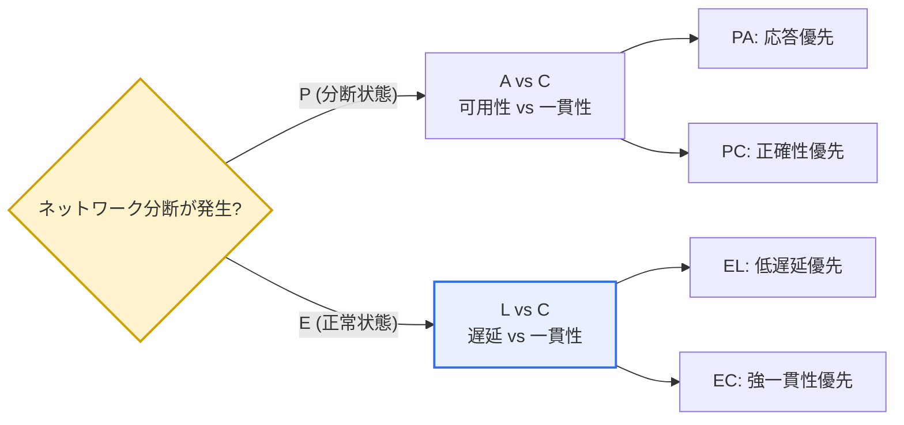
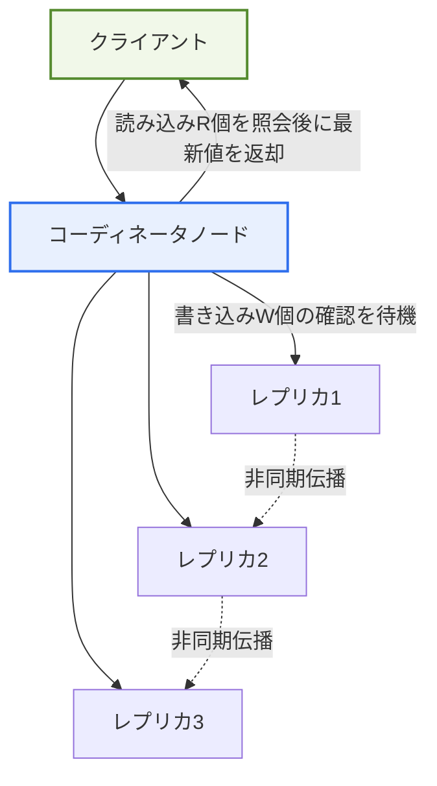

# CAP定理の限界とPACELC定理

## 1. 概要

### A. CAP定理とその限界
> **CAP定理**とは、分散システムは**一貫性(Consistency)・可用性(Availability)・分断耐性(Partition tolerance)** の三つを同時にすべて満たすことはできず、ネットワーク分断が発生した場合には最大で二つしか保証できないという定理である。2000年にエリック・ブリュワー(Eric Brewer)が提示し、2002年にギルバート・リンチ(Gilbert・Lynch)が形式的に証明した。

CAP定理の核心的な洞察は、「**ネットワークが切断される(分断)と、一貫性と可用性のどちらかを諦めなければならない**」という点にある。ここで各属性の意味を正確に押さえておかないと誤解を招く。一貫性(C)はすべてのノードが同じ時点で同じ最新データを見ること(厳密には線形化可能性、linearizability)を指し、可用性(A)は正常なノードがすべてのリクエストに必ず応答することを、分断耐性(P)はノード間のメッセージが任意に遅延・消失してもシステムが動作し続けることを意味する。ここでよくある誤解が「三つのうち二つを選ぶ」という表現であり、これは半分しか正しくない理解である。

分散システムにおいてノード間の通信が途絶える分断(P)は、広域ネットワーク・データセンター障害・スイッチの故障などでいつでも起こり得るため、事実上**選択肢ではなく受け入れるべき前提**である。ネットワークを完全に信頼できるならともかく、現実の分散システムはPを放棄できない。そうなると実際の選択肢はCAではなく、**分断が起きた瞬間のCとA**の二者択一に絞られる。分断が生じたときに最新データの一貫性(C)を守るには、他ノードとの同期を確認できないノードの応答を止めなければならないため可用性を失い、無条件に応答(A)しようとすれば同期されていない古いデータを返し得るため一貫性を失う。

ところがCAPには**決定的な限界**がある。それは「**分断が起きたとき」だけを扱う**という点である。実際、大規模分散システムにおいてネットワーク分断は比較的まれな事象であり、システムは大部分の時間を分断のない「正常状態」で過ごす。では、正常時にシステムは一貫性と応答速度の間で何を選択しているのか。CAPはこれに何の答えも与えない。すなわちCAPは、システムの稼働期間の99%以上を占める正常状態の設計トレードオフを説明できないのである。この空白を埋めたのがPACELCである。

### B. PACELCの登場背景
CAPが分断という例外状況しか説明できないという限界を補うため、2010年にイェール大学のダニエル・アバディ(Daniel Abadi)が、**正常状態のトレードオフまで含めた**PACELCを提案した。その問題意識は明確であった。「分散データベースを実際に選定する際に開発者が直面する本当の問いは、『分断が起きたときに何を諦めるか』よりも『普段どれだけ遅くてよく、どれだけ正確でなければならないか』である」というものである。例えば複数のデータセンターにレプリカを置くシステムでは、分断がなくてもレプリカ間の同期そのものが遅延を生む。この平常時の遅延と一貫性のバランスはCAPの枠組みの外にあるため、アバディはCAPを部分集合として含む、より広い枠組みを打ち立てたのである。

## 2. PACELC定理の構造

> **PACELC**: 分断(**P**)が発生した場合は可用性(**A**)と一貫性(**C**)の間で、そうでない場合(**E**lse)は遅延(**L**atency)と一貫性(**C**)の間で選択しなければならないという定理である。略語のとおり「if **P** then **A** or **C**, **E**lse **L** or **C**」と読む。

この正常/分断の分岐の根底には「レプリケーション(replication)」の構造がある。正常状態のL-C選択であれ分断状態のA-C選択であれ、結局は複数のレプリカへの書き込みをどのように確認(acknowledge)し、読み込みをどのレプリカで処理するかによって決まる。以下はクォーラム(Quorum)ベースのレプリケーションにおいて、クライアント・コーディネータ・レプリカが相互作用する構造を示したものであり、この配置でR・Wの値をどう設定するかが、そのままEL/ECスペクトル上の位置を決める。

この構造で`W`(書き込み確認数)と`R`(読み込み照会数)を大きく取って`R + W > N`を満たせば、常に最新値を読めるため強一貫性(EC)に近づくが、コーディネータがより多くのレプリカの応答を待つ必要があるため遅延が大きくなる。逆に`W=1, R=1`のように下げれば、最も近いレプリカ一つを確認するだけで遅延は最小化される(EL)が、まだ伝播していない他のレプリカから古い値を読むリスクが生じる。このように、一つのアーキテクチャ上でパラメータだけによってPACELC上の座標が移動するという点こそが、現代分散DBにおける「チューナブルな一貫性」の実体である。

### A. 分断状態(PA/PC) — CAPと重なる領域
PACELCの前半(P → A or C)は事実上CAPと同一である。ネットワークが分断されてノードグループが互いに通信できない状況において、システムは各グループが独自にリクエストを受け付けて処理するか(PA)、それとも多数派グループの確認を得られない側は応答を拒否するか(PC)を決めなければならない。例えば銀行口座の残高のように誤った値が致命的なデータはPCを選び、分断された少数派ノードが書き込みを拒否するようにすべきであり、ショッピングカートや「いいね」の数のように一時的にずれても問題のないデータはPAを選び、ひとまず応答して後で統合(conflict resolution)するほうがよい。

この選択が実務上持つ含意は、「可用性の定義」を明確にする点にある。PAを選んだシステムであっても整合性を無期限に放棄するわけではなく、分断が解消された後にベクタークロック・最終書き込み優先(LWW)・CRDTといった手法でデータを収束させる。すなわち「結果整合性(Eventual Consistency)」を前提とした可用性である。逆にPCシステムは、分断中には一部のリクエストを失敗させてでも、成功した応答だけは常に正確であることを保証する。

### B. 正常状態(EL/EC) — PACELC固有の貢献
PACELCの真の核心的な貢献は後半、すなわち**正常状態(Else)のトレードオフ**を明らかにした点にある。分断がなくても、データを複数のレプリカ間で強く一貫した状態に保つには、書き込みリクエストがすべての(またはクォーラムの)レプリカに反映されたことを確認してからでなければ応答できず、応答が遅くなる(Latency↑)。地理的に離れたデータセンターであれば、光速という物理的限界のため往復遅延(RTT)が数十~数百msに達し、このコストは決して小さくない。

逆に遅延を減らすには、レプリケーションの同期を緩め、近くのレプリカ一つだけを読んで応答したり(非同期レプリケーション)、書き込みを多数の確認なしに受理したりする。この場合、応答は速いものの、直前に他ノードに書き込まれた値がまだ伝播していないため古い値を読み得るので、一貫性を譲ることになる。結局システムは、分断という例外のない平常時にも**遅延と一貫性の間で絶えず選択している**のである。クォーラム方式では、このバランスは`R + W > N`(読み込み・書き込みクォーラムの和がレプリカ数より大きい)という条件を満たすかどうかで調整され、これを満たせば強一貫性(EC)に近く、R・Wを下げれば低遅延(EL)側へ移動する。

| 類型 | 分断時(PA/PC) | 正常時(EL/EC) | 代表例 | 代表的な用途 |
|---|---|---|---|---|
| **PA/EL** | 可用性優先 | 低遅延優先 | Cassandra, DynamoDB, Riak | ショッピングカート、セッション、ログ、レコメンド |
| **PC/EC** | 一貫性優先 | 強一貫性優先 | 従来型RDBMS, VoltDB, HBase | 金融元帳、在庫、予約 |
| **PA/EC** | 可用性優先 | 一貫性優先 | MongoDB(設定による) | チューニングでバランス調整 |
| **PC/EL** | 一貫性優先 | 低遅延優先 | PNUTS(Yahoo)、一部の設定 | 地域近接の読み込み+リモートの強一貫な書き込み |

ここで注意すべきは、上記の分類が絶対的なラベルではなく、**デフォルト設定(default)** を表しているという点である。例えばCassandraは基本的にPA/ELであるが、読み込み・書き込みの一貫性レベルを`QUORUM`に上げればECに近くチューニングされる。MongoDBも`writeConcern`と`readConcern`の設定によってECからELへとスペクトル上を移動する。すなわち現代の分散DBは一つの固定点ではなく、「チューナブルな一貫性(Tunable Consistency)」軸上の一区間を提供しており、PACELCはその軸を理解するための座標系の役割を果たす。

## 3. CAPとPACELCの比較

二つの理論の違いは単に「PACELCのほうが多くを説明する」ということではなく、**設計者が実際に直面する意思決定のポイントをどこまで捉えるか**にある。CAPは分断というまれな危機的状況での極端な選択を強調するが、その強調がかえって誤解を広げた。多くの開発者が「うちのDBはCAだ」と言うが、Pを放棄できない以上、CAは分散環境では成立しない組み合わせであり、彼らが実際に言おうとしていたのはたいてい「平常時は強一貫性を維持する(EC)」ということであった。PACELCはまさにこの正常状態の軸を明示することで、その混乱を整理する。

| 区分 | CAP | PACELC |
|---|---|---|
| **扱う状況** | 分断時のみ | 分断時 + 正常時 |
| **トレードオフ** | C vs A | (P)A vs C + (E)L vs C |
| **正常状態の説明** | 不可 | 可能(L vs C) |
| **提案時期/提案者** | 2000, E. Brewer | 2010, D. Abadi |
| **実用性** | 限定的(危機状況中心) | ライフサイクル全体を説明 |

比較から得られる実務上の含意は二つある。第一に、CAPだけでDBを選ぶと「分断時に何を諦めるか」というまれなシナリオに過度にとらわれ、肝心の日々のユーザー体験を左右する遅延と一貫性のバランスを見落とす。第二に、PACELCで見ると、同じ「AP系」であっても正常時の一貫性ポリシー(ELかECか)が異なれば、実際の体感性能と正確性が大きく分かれることが明らかになる。例えばCassandra(PA/EL)と理論上のPA/ECシステムは、分断時の振る舞いは同じでも平常時の読み込みの最新性が異なる。

### A. 具体的シナリオで見る違い
実際の状況を一つ描いてみると、二つの理論の違いが明確になる。ソウルとバージニアの二つのリージョンにレプリカを置いたグローバルなECサイトがあるとしよう。ネットワークは大半の時間正常であるが、リージョン間の往復遅延は約180msに達する。CAPの観点からは「二つのリージョンが切断されたら(分断)どちらを止めるか」しか問えない。しかし実際の運用で刻一刻と直面する問題は、「ソウルのユーザーの注文をバージニアのレプリカまで確認してから応答するか(EC、+180ms)、それともソウルのレプリカだけを確認して即座に応答するか(EL)」である。まさにこの平常時の問いこそがPACELCのElse軸であり、CAPはこれに答えられない。

このとき、データの性質が選択を左右する。在庫の引き当てのように二重販売が致命的なデータはECを選んで遅延を受け入れ、商品の閲覧数や最近見た商品のように一時的にずれても問題のないデータはELを選んで応答性を活かす。結局、一つのサービスの中でもトランザクションの種類ごとにPACELCの座標を変えて設定するのが現実的な設計である。

## 4. 深掘り — 設計への適用事例と最新動向

### A. 産業での適用事例
**Amazon DynamoDB**はPA/EL系の代表であり、もともとはショッピングカートのように「カートへの追加失敗を決して見せてはならない」という要求から出発し、可用性と低遅延を最優先とした。しかし2018年以降、強一貫性読み込みオプション(`ConsistentRead`)とトランザクション(TransactWriteItems)を追加し、一つのシステムの中でデータの性質ごとにELとECを選択できるよう進化した。これは、PACELCの類型が固定的ではなく、要求に応じて組み合わされることを示す事例である。

**Google Spanner**は興味深い位置にある。TrueTimeという精密な時刻同期(原子時計・GPSベース)によって、地理的に分散した状態でも外部一貫性(external consistency)を提供し、PC/ECを志向する。ただし強一貫性の書き込みにはコミット待機(commit-wait)の遅延が伴うため、「一貫性のために遅延を受け入れる」というECの本質をそのまま示している。すなわちSpannerでさえ物理法則とPACELCのトレードオフから自由ではなく、その代償を最小化する工学的な成果を上げたものと理解するのが正確である。

### B. 最新動向
近年の分散データベースの流れは、**「状況・データごとの一貫性の選択」を細分化**する方向にある。NewSQL(CockroachDB、YugabyteDBなど)は分散スケーラビリティと強一貫性トランザクションを両立させようとしており、これはPC/ECを基本としつつ地域近接配置で遅延を減らす折衷と見ることができる。また「因果一貫性(Causal Consistency)」のように、強一貫性と結果整合性の中間モデルが注目されているが、これはPACELCのL-C軸を二分法ではなく連続的なスペクトルへと拡張しようとする試みである。ただし、こうした最新の折衷モデルの成熟度や採用範囲は製品・バージョンによってばらつきが大きいため、導入時には当該製品の公式ドキュメントで保証レベルを確認するのが安全である。

### C. よくある誤解と注意点
現場でよく見られる誤解は「うちのシステムはCAだ」という表現である。先に見たとおり、Pを放棄できない分散環境ではCAの組み合わせは成立せず、そう述べるシステムはたいてい単一ノード(分散ではない)であるか、実際には「平常時の強一貫性(EC)」を意味している。もう一つの誤解は、PACELCのラベルを製品の不変の属性と見なすことである。実際にはほとんどの分散DBが設定によってEL~ECの区間を行き来するため、「このDBはELである」よりも「このDBはデフォルトがELであり、クォーラム設定でECまで調整できる」のほうが正確な記述である。

したがってアーキテクチャレビューでは、製品のラベルをそのまま受け入れるのではなく、実際に適用する読み込み・書き込みの一貫性設定値を確認し、その組み合わせが各データの正確性要件と遅延SLAを同時に満たすかどうかを検証しなければならない。

## 5. 考慮事項および示唆 (技術士の観点)

1. **平常時の遅延と一貫性の選択のほうが実質的に重要である。** 分断はまれであるが、システムは稼働期間の大部分を正常状態で動作するため、PACELCのElse(L vs C)の選択が実際のユーザー体験(応答速度・データの最新性)を左右する。設計レビューの際には「分断時の対応」だけでなく「平常時の一貫性ポリシー」を必ず明示的に決定しなければならない。
2. **データの性質ごとに異なるポリシーを適用する。** 金融元帳・在庫・予約のように正確性が決定的であればEC(強一貫性)を、SNSフィード・レコメンド・閲覧数のように速度と可用性が重要であればEL(低遅延・結果整合性)を選ぶというように、一つのサービスの中でもデータごとの差別化ポリシー(polyglot persistence)を設計する。
3. **NoSQL・NewSQL選定の羅針盤である。** Cassandra(PA/EL)、Spanner(PC/EC)、DynamoDB(PA/EL+チューニング)などの分散DBを選ぶ際にPACELCの分類でトレードオフを明確に理解し、チューナブルな一貫性のオプション(R・Wクォーラム、writeConcernなど)で状況に応じて調整する。[[nosql]]
4. **一貫性は二分法ではなくスペクトルであることを前提に設計する。** 強一貫性と結果整合性の間には、因果一貫性・自分の書き込みの読み取り(read-your-writes)・単調読み取りなど多様な中間モデルがあるため、要件にちょうど合う最小限の一貫性レベルを選択し、不要な遅延コストを避ける。
5. **トレードオフをSLA・コストと結び付ける。** 強一貫性は遅延とインフラコスト(クォーラムレプリケーション、広域RTT)を増やすため、応答時間SLA・ビジネスリスク・運用コストを併せて比較衡量し、過剰な一貫性による無駄と、過小な一貫性による事故の両方を防ぐバランス点を見いださなければならない。
6. **製品のラベルではなく実際の設定で検証する。** 同一製品でもクォーラムやwriteConcernの設定によってEL~ECを行き来するため、導入検討時にはカタログ上の分類をそのまま信頼するのではなく、実際に適用する一貫性パラメータとその組み合わせの保証レベルをベンチマークで確認するのが安全である。

## 参考資料
- Daniel Abadi, "Consistency Tradeoffs in Modern Distributed Database System Design", IEEE Computer, 2012: https://www.cs.umd.edu/~abadi/papers/abadi-pacelc.pdf
- Gilbert & Lynch, "Brewer's Conjecture and the Feasibility of Consistent, Available, Partition-Tolerant Web Services", 2002: https://groups.csail.mit.edu/tds/papers/Gilbert/Brewer2.pdf
- Wikipedia, PACELC theorem: https://en.wikipedia.org/wiki/PACELC_theorem

---

> **一言まとめ**: CAPは*分断時にC・Aのどちらかを選ぶ*ことしか説明できないという限界があり、PACELCはそこに*正常時の遅延(L) vs 一貫性(C)*のトレードオフを加えることで、分断・正常の全状態においてデータの性質に合った分散システムの設計選択を導く実用的な座標系である。
