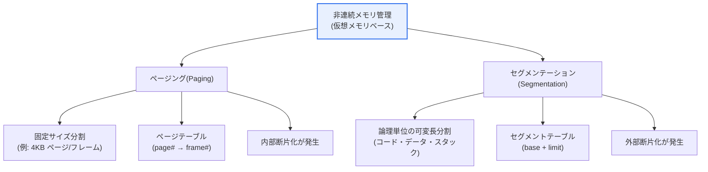
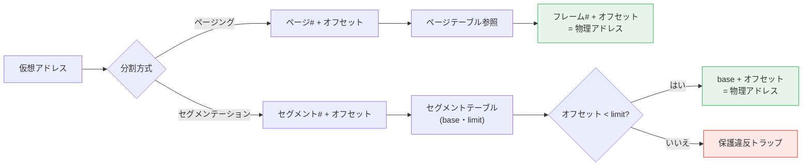

# OSのメモリ管理: ページングとセグメンテーション

## 1. 概要

### A. 定義
> **ページング(Paging)** とは、物理メモリを同一サイズの**ページフレーム(frame)** に、プロセスの論理アドレス空間を同じサイズの**ページ(page)** に分割し、ページ単位で物理メモリ上に分散配置する非連続メモリ管理手法である。**セグメンテーション(Segmentation)** とは、プログラムをコード・データ・スタックといった**論理単位の可変長セグメント**に分割して管理する手法である。

両手法はいずれも**仮想メモリ(Virtual Memory)** を実現する非連続割り当て方式であり、プログラムを物理メモリのあちこちに分散配置し、アドレス変換(address translation)によってプロセスからはあたかも連続しているかのように見せるという共通点がある。プロセスが使用する**論理(仮想)アドレス**をMMU(Memory Management Unit)が実行時に**物理アドレス**へ変換するため、プログラムは物理メモリ上の実際の位置を知る必要がなく、実メモリより大きなアドレス空間を利用できる。

しかし、「**何を基準に分割するか**」が根本的に異なる。ページングはプログラムの意味とは無関係に**決められたサイズ(例: 4KB)で機械的に**切り分け、セグメンテーションはプログラムの**論理的な意味単位**(関数・配列・スタックなど)で切り分ける。この一つの違いが、断片化・保護・共有の特性をすべて分ける。ページングは断片のサイズが均一なため空き領域の管理が単純であるが、論理的な境界を無視するため保護・共有が不自然になり、セグメンテーションは論理的に自然で保護・共有が容易であるが、サイズがまちまちなため空き領域の管理が複雑になる。

### B. 登場背景と必要性
初期の**連続割り当て(contiguous allocation)** 方式では、プロセス全体を物理メモリの「ひとかたまりの連続領域」に載せる必要があった。この方式には二つの明確な限界があった。第一に、プロセスのロードとアンロードを繰り返すとメモリのあちこちに小さな空き領域が散らばる断片化が深刻になり、合計は十分でも大きなプロセスを載せられない状況が生じた。第二に、物理メモリより大きなプログラムはそもそも実行できなかった。

ページング・セグメンテーションは、プロセスを細かく分割して物理メモリに分散配置することでこの問題を解決する。プロセス全体を連続して載せる必要がなくなるためメモリを密に活用でき、当面必要な断片だけをメモリに載せ、残りをディスク(スワップ領域)に置く**デマンドページング(demand paging)** によって物理メモリより大きなアドレス空間を実現する。これが、今日のあらゆる汎用OSが仮想メモリを備えるに至った土台である。

## 2. 概念とアドレス変換の構造

まず両手法の全体構造を俯瞰したうえで、それぞれのアドレス変換手順を見ていく。

**ページングのアドレス変換。** ページングは仮想アドレスを「**ページ番号(page number) + ページ内オフセット(offset)**」の二つの部分として解釈する。MMUはプロセスごとの**ページテーブル(page table)** からページ番号に対応する**フレーム番号(frame number)** を見つけ、そこにオフセットを結合して物理アドレスを完成させる。ページとフレームのサイズが同じであるためオフセットはそのまま使われ、サイズが2の累乗(例: 4KB=2^12)であれば、アドレスの下位ビットがそのままオフセット、上位ビットがページ番号となり、変換は単純なビット分割で処理される。この規則性こそが、ページングをハードウェアで高速に実装できる鍵である。

**セグメンテーションのアドレス変換。** セグメンテーションは仮想アドレスを「**セグメント番号 + セグメント内オフセット**」として解釈する。MMUは**セグメントテーブル(segment table)** からセグメント番号によってそのセグメントの**開始アドレス(base)** と**上限(limit)** を得る。オフセットがlimit未満であれば「base + オフセット」で物理アドレスを計算し、limit以上であればセグメント境界を越えたアクセスであるため**トラップ(例外)** を発生させ、他プロセスのメモリを侵害できないようにする。すなわちセグメンテーションは、論理単位ごとにbase・limit・権限(読み取り/書き込み/実行)を持たせるため、**保護と共有が自然に**実現されるという特徴がある。

| 区分 | ページング | セグメンテーション |
|---|---|---|
| **分割基準** | 固定サイズ(物理的) | 論理単位(可変長) |
| **仮想アドレスの構成** | ページ番号 + オフセット | セグメント番号 + オフセット |
| **マッピングテーブル** | ページテーブル | セグメントテーブル(base・limit) |
| **断片化** | **内部断片化** | **外部断片化** |
| **保護・共有** | ページ単位(限定的・境界が不自然) | 論理単位で自然 |
| **観点** | 物理的な管理の観点 | ユーザー・論理的な観点 |
| **アドレス変換** | 単純(ビット分割) | 境界検査を伴う |

## 3. 断片化の問題: 内部 vs 外部

両手法の決定的な弱点が、それぞれ異なる種類の断片化であるという点は極めて重要である。断片化とは「使えるはずなのに実際には使われず無駄になるメモリ」を意味し、それがどちらで発生するかが手法の命運を分けた。

**ページングは内部断片化(Internal Fragmentation)** を生む。ページサイズが固定であるため、プロセスのサイズがページサイズの整数倍でなければ、**最後のページ**はたいてい満杯にならない。この余った領域はそのページに割り当てられているため、他のプロセスが使えずに無駄になる。無駄の量はプロセスあたり最大「ページサイズ − 1」であり、平均するとページサイズの半分程度である。例えば4KBページでプロセスサイズが10KBであれば、3ページ(12KB)が割り当てられ、約2KBが内部断片化として捨てられる。この無駄を減らそうとページサイズを小さくすると、ページテーブルが大きくなるという相反が生じる。

**セグメンテーションは外部断片化(External Fragmentation)** を生む。セグメントのサイズがまちまちであるため、割り当てと解放を繰り返すと、メモリのあちこちに大小の空き領域の断片が散らばる。それらの断片の**合計は十分でも連続した大きな領域がない**ため、大きなセグメントを載せられない状況が発生する。これを緩和するには、散らばった空き領域を一方に寄せる**コンパクション(compaction)** が必要であるが、これは実行中のプロセスを移動するコストが大きいため頻繁には実施しにくい。まさにこの外部断片化の管理の難しさが、純粋なセグメンテーションが主流から退いた根本的な理由である。

まとめると、内部断片化は「割り当てた断片の内部で使えない領域」、外部断片化は「断片同士の間に散らばって使えない領域」である。ページングは断片のサイズを均一にすることで外部断片化を根本から排除する代わりに少量の内部断片化を受け入れ、セグメンテーションは論理的な自然さを得る代わりに外部断片化を抱え込むという、正反対の選択をしたことになる。

| 区分 | 内部断片化 | 外部断片化 |
|---|---|---|
| **発生する手法** | ページング(固定サイズ) | セグメンテーション・連続割り当て(可変長) |
| **原因** | 最後のページが満杯にならない | 空き領域が小さな断片に散らばる |
| **無駄の位置** | 割り当てられたページの内部 | 割り当てブロックの間 |
| **サイズの上限** | プロセスあたり最大「ページサイズ − 1」 | 累積するほど増加(非決定的) |
| **緩和策** | ページサイズの調整 | コンパクション(compaction)、ページ化方式への転換 |

## 4. ページ化セグメンテーション(結合手法)と実際の適用

両手法の長所だけを取り入れるため、現代のアーキテクチャは**セグメントをさらにページに分割する**ページ化セグメンテーション(Paged Segmentation)を用いる。プログラムを論理単位であるセグメントに分けて**保護・共有の利点**を得つつ、各セグメントをさらに固定サイズのページに分割して物理メモリに分散配置することで、**外部断片化を排除**する。セグメンテーションの論理的な長所とページングの物理的な管理の容易さを組み合わせた折衷である。このときアドレス変換は「セグメントテーブル → (当該セグメントの)ページテーブル → フレーム」の順に行われ、テーブルを二度経由する。

**実例 — x86アーキテクチャ。** 初期のx86(80386)は、セグメンテーションとページングを階層的に組み合わせた代表的な事例であった。しかし実務のOS(Linux・Windows)は、セグメントのbaseを0、limitを最大に設定してセグメンテーションを事実上無効化(flat memory model)し、**ページング中心**で運用してきた。そして64ビット(x86-64)では、セグメンテーションのbase・limit検査機能の大部分が廃止され、今日の汎用OSのメモリ管理においては**多段ページングが圧倒的な主流**であることを明確に示している。これは「論理的な優美さ(セグメンテーション)」よりも「管理の単純さと外部断片化の排除(ページング)」のほうが、実務においてより大きな価値を持っていたことを実証している。

**実例 — 大容量アドレス空間と多段ページテーブル。** 64ビットのアドレス空間では、単一のページテーブルのサイズは非現実的なほど大きくなる。そこでLinuxは4~5段のページテーブルに階層化し、実際に使われているアドレス領域の下位テーブルだけを必要なときに作成することで、テーブル用のメモリを節約する。これはページングが大規模システムへと拡張される実務的な方式である。

**デマンドページング(Demand Paging)とページ置換。** ページングが物理メモリより大きなアドレス空間を実現する実際のメカニズムがデマンドページングである。プロセスのすべてのページを最初からメモリに載せるのではなく、**実際にアクセスされた瞬間(ページフォールト、page fault)に初めてディスクから当該ページをロード**する。これによりプロセスは、自身のアドレス空間全体がメモリ上にあるかのように動作しながら、実際にはアクティブなページ(working set)だけが物理メモリを占有する。

物理メモリが満杯の状態で新しいページが必要になると、どのページを追い出すかを決める**ページ置換アルゴリズム**が介入する。LRU(最も長く参照されていないページを置換)、Clock(LRUの近似)、最適(OPT)などがあり、置換が過度に頻繁になってプロセスが仕事をできずにページの入出力ばかりを繰り返す**スラッシング(Thrashing)** を避けることが性能の鍵となる。セグメンテーションは可変長の単位であるためこうした均一な置換・ロードが難しいという点も、ページングが仮想メモリの標準となった理由の一つである。

## 5. 深掘り: TLBと性能、想定される出題の方向性

**TLB(Translation Lookaside Buffer)による高速化。** ページングの根本的なオーバーヘッドは、「アドレス変換のためにページテーブル(メモリ)にアクセス」しなければならず、多段テーブルではこのアクセスが段数分だけ繰り返されるという点にある。すなわち、データを一回読むためにメモリを何度も読むことになる。これを緩和するため、MMUの内部に**最近の変換結果(ページ→フレーム)をキャッシュする超高速の連想記憶装置であるTLB**を置く。TLBヒット(hit)時にはメモリアクセスなしに即座に物理アドレスを得て、ミス(miss)時にのみページテーブルを探索する。TLBのヒット率は通常99%以上と非常に高いため、ページングの変換コストは実質的にほとんど隠蔽される。**ヒュージページ(Huge Page、例: 2MB・1GB)** は、一つのTLBエントリがより広い領域を担当できるようにしてTLBヒット率を高め、データベース・仮想化などのメモリ集約型ワークロードの性能を改善する。

**最新動向。** 仮想化環境では、ゲスト-ホスト間の二重アドレス変換をハードウェアで高速化する**ネステッドページング(Nested/Extended Page Tables)** が標準となり、セキュリティの面ではページ単位の権限(NXビットによる実行防止)とASLR(アドレス空間配置のランダム化)がページング構造の上に実装されている。すなわちページングは、単なるメモリ節約を超えて、性能・仮想化・セキュリティを包括する基盤メカニズムへと拡張されつつある。

**想定される出題の方向性。** 技術士試験では、(1) ページングとセグメンテーションの概念・アドレス変換を図とともに説明、(2) 内部断片化と外部断片化の違いと発生原因を対比、(3) ページ化セグメンテーションが両手法をどのように組み合わせるかを論述、(4) TLB・多段ページテーブル・デマンドページングの役割を性能の観点から記述、といった形式がよく求められる。答案は**「定義→アドレス変換の構造→断片化の比較→結合/実務→性能(TLB)および示唆」**の順に展開すれば完結性を備える。

## 6. 考慮事項および示唆

技術士の観点からメモリ管理手法を設計・評価する際には、以下を総合的に考慮しなければならない。

1. **外部断片化の深刻さゆえにページングベースが主流となった。** 純粋なセグメンテーションは論理的に優美で保護・共有に有利であるが、外部断片化の管理(コンパクション)コストが大きいため、現代のシステムはページングまたはページ化セグメンテーションを採用している。設計時には「論理的な自然さ」と「断片化の管理コスト」のトレードオフを明確に認識すべきである。

2. **ページサイズ選択のトレードオフ。** ページが小さければ内部断片化は減るが、ページテーブルが大きくなりTLBの効率が低下する。ページが大きければその逆となる。ワークロードの特性(ランダムアクセス vs 大容量のシーケンシャルアクセス)に応じて、基本ページとヒュージページを併用するのが実務的な解決策である。

3. **アドレス変換のオーバーヘッドとTLBへの依存。** 多段ページングの変換コストはTLBヒット率に左右されるため、TLBミスが頻発するアクセスパターン(大規模なランダムアクセス)では性能低下が大きい。ヒュージページやTLBフレンドリーなデータ構造の設計によってこれを緩和すべきであり、性能チューニングの際にはTLBミスを主要な指標として観測しなければならない。

4. **保護・セキュリティの基盤としてのページング。** ページ単位の権限(読み取り/書き込み/実行)、NXビット、ASLR、プロセス間のアドレス空間の分離は、いずれもページング構造の上に実装されている。メモリ管理は単なる効率の問題ではなく、システムのセキュリティ・安定性の土台であるため、信頼実行・分離の要件が大きい環境ほど、この層の設計が重要になる。

5. **仮想化・クラウドへの拡張。** ネステッドページング、メモリのオーバーコミット、ページ共有(KSM)などは、クラウドのリソース密度に直結する。マルチテナント環境で性能分離とメモリ効率を同時に達成するには、ページング層の特性を理解し、ハイパーバイザの設定を調整しなければならない。

## 参考資料
- A. Silberschatz, "Operating System Concepts", Memory Management 概要: https://www.os-book.com/
- Linux Kernel Documentation, "Page Tables": https://docs.kernel.org/mm/page_tables.html
- Intel 64 and IA-32 Architectures Software Developer Manuals(Paging): https://www.intel.com/content/www/us/en/developer/articles/technical/intel-sdm.html

---

> **一言まとめ**: ページングは*固定サイズで分割するため内部断片化*を、セグメンテーションは*論理単位の可変長で分割するため外部断片化*を抱えており、現代のOSはセグメントをさらにページに分割するページ化セグメンテーションと多段ページングで両者の長所を組み合わせ、TLBでアドレス変換を高速化している。この層は性能・仮想化・セキュリティの共通基盤となっている。
