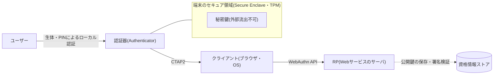
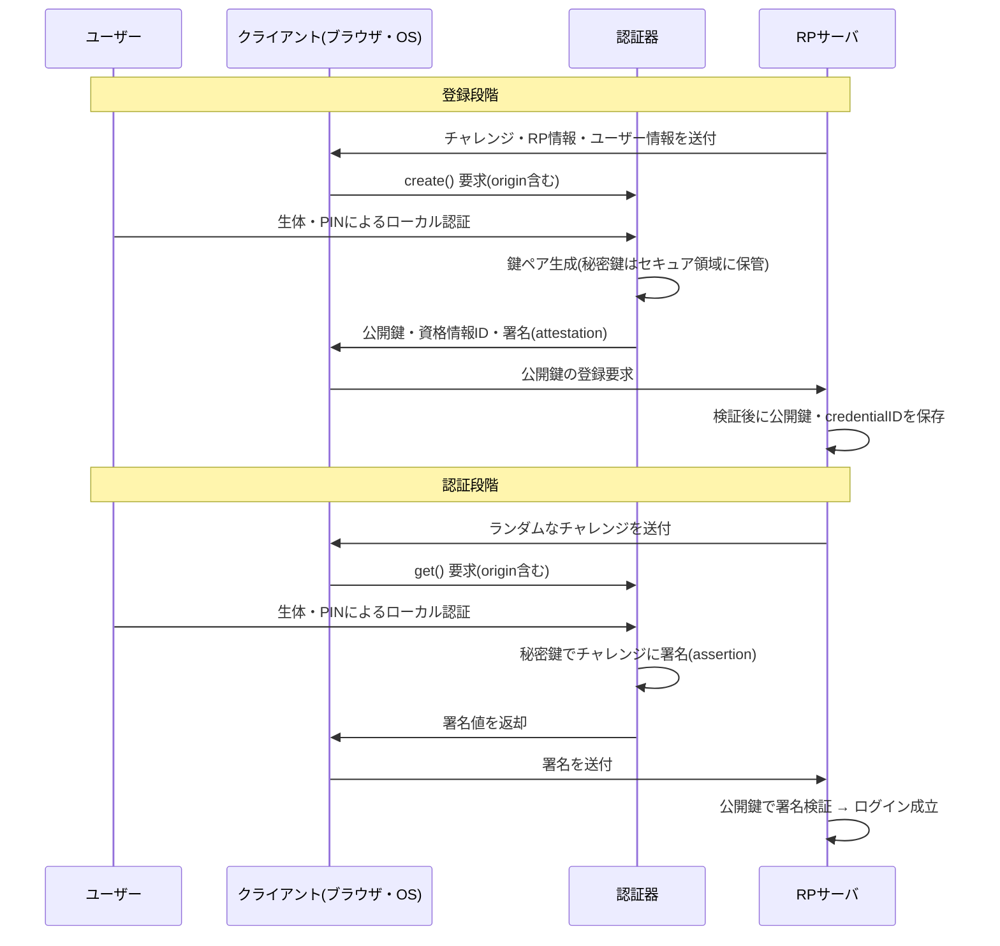

# パスキー(Passkey)とFIDO2/WebAuthn

## 1. 概要

### A. 定義

> **パスキー(Passkey)**とは、FIDO2標準(WebAuthn + CTAP)に基づき、ユーザーの端末に保存された**公開鍵-秘密鍵ペア**でサービスにログインする**パスワードレス(Passwordless)の認証資格情報**である。秘密鍵は端末のセキュア領域(Secure Enclave・TPMなど)から外に出ることはなく、サービスには公開鍵のみが登録され、認証は生体・PINなどによる端末のロック解除(ローカル認証)を経て、秘密鍵で**チャレンジに署名**することで行われる。

パスキーは特定の製品の名称ではなく、FIDOアライアンスとW3Cが標準化した**FIDO2認証器(authenticator)で作成された資格情報**を消費者向けに親しみやすく呼んだ名称である。従来のパスワードが「ユーザーが知っている秘密の文字列をサーバと共有する」方式であるのに対し、パスキーは「端末が保管する秘密鍵で署名値を生成し、サーバは公開鍵で検証する」方式であるため、共有秘密(shared secret)がネットワークにもサーバにも存在しないという点が本質的な違いである。

### B. 登場背景と必要性

認証に関するインシデント統計では、侵害の多くは依然としてパスワードに起因している。ユーザーは記憶の負担から同じパスワードを複数のサービスで使い回し、これが一か所での漏えいが他のサービスへ波及する**クレデンシャルスタッフィング(Credential Stuffing)**の温床となる。また、パスワードは**フィッシング(Phishing)**に対して根本的に脆弱である。偽サイトがユーザーをだましてパスワードを入力させれば、サーバの観点からは正常なログインと区別できないためである。ここにOTP・SMSによる二要素認証を加えても、コードをリアルタイムで横取りして中継する**AiTM(Adversary-in-the-Middle)フィッシング**や、ユーザーを疲弊させる**MFA疲労(fatigue)攻撃**はこれを迂回する。

こうした限界は、パスワードが「共有秘密」であるという構造的な性質から生じる。ユーザー・サーバ・(ときには)中間者が同じ値を知っていなければならないため、その値は送信・保存・再入力の過程でいつでも窃取され得る。サーバがパスワードをハッシュで保存していても、漏えいすればオフラインクラッキングの対象となり、大規模な漏えい事故は繰り返される。パスキーは**共有秘密そのものをなくす**ことで、この問題群を根本的に排除しようとする試みである。秘密鍵は決して送信されないためサーバが漏えいしても盗むものがなく、認証値が特定のドメインに**バインディング**されているため、偽サイトではそもそも署名が生成されない。

政策面でも、米国NIST SP 800-63Bはフィッシング耐性(phishing resistance)を備えた認証手段を最上位の保証レベル(AAL3)の要件として提示しており、主要なビッグテック(Apple・Google・Microsoft)は2022~2024年にかけてパスキーをOS・ブラウザ・アカウントに標準搭載した。これによりパスキーは、実験的な技術を超えて、一般向けサービスの標準的なログイン手段として定着する段階に入った。

## 2. 全体構造と構成要素

FIDO2は大きく二つの規格の組み合わせで構成される。一つはWebアプリケーションとブラウザ間のJavaScript APIである**WebAuthn(W3C標準)**、もう一つはブラウザ・OS(プラットフォーム)と外部認証器(セキュリティキー・スマートフォン)間の通信規約である**CTAP2(Client to Authenticator Protocol)**である。この二つがかみ合うことで、Webサービスは認証器の物理的形態に関係なく、同一の方式で公開鍵ベースの認証を要求できる。

構成要素を原理の観点から説明すると次のとおりである。**RP(Relying Party)**はログインを要求するWebサービスであり、登録時にユーザーの公開鍵と資格情報の識別子を保存し、ログイン時に署名を検証する。**クライアント**はブラウザとOSであり、WebAuthn APIの呼び出しを受けてCTAP2で認証器と通信し、要求元のドメイン(origin)情報を認証器へ正確に伝える**フィッシング耐性の中核的な仲介者**の役割を担う。**認証器**は秘密鍵を生成・保管し署名を実行する主体であり、端末に内蔵された**プラットフォーム認証器**(スマートフォンの指紋・顔認証、PCのWindows Helloなど)と、USB・NFCで接続する**ローミング(外部)認証器**(YubiKeyのようなセキュリティキー)に分かれる。

パスキーのセキュリティを成立させる決定的な仕組みは、秘密鍵が**ハードウェアのセキュア領域**から外に出ないという点である。署名演算はセキュア領域の内部で行われ、結果値だけが外に出てくる。そしてこの演算を開始するには、ユーザーのローカル認証(生体・PIN)が先行しなければならない。したがって端末を物理的に奪取されても、ロック解除なしには署名を作成できず、「所持(端末)」と「生体/知識(ロック解除)」の二要素が自然に組み合わされる。

## 3. 認証手順 — 登録と認証

パスキーの動作は、**登録(Registration/Attestation)**と**認証(Authentication/Assertion)**の二段階として理解すべきである。登録はサービスに公開鍵を初めて登録する過程であり、認証はその後のログインのたびに、サーバが発行したチャレンジに秘密鍵で署名して本人であることを証明する過程である。

登録段階では、サーバがランダムな**チャレンジ(challenge)**と自身のドメイン情報(RP ID)、ユーザー識別情報をクライアントに渡す。クライアントは`navigator.credentials.create()`を呼び出し、その際に実際にアクセスしたoriginを併せて渡す。認証器はユーザーのローカル認証を確認したうえで、当該サービス専用の**鍵ペアを生成**し、秘密鍵はセキュア領域に残して、公開鍵・資格情報ID・(任意で)認証器の出所証明(attestation)を返す。サーバはこれを検証し、公開鍵をユーザーアカウントに紐付ける。

認証段階では、サーバが毎回新しいチャレンジを発行するが、この**ランダム性**が**リプレイ攻撃(replay attack)**を防ぐ鍵である。以前にキャプチャした署名は、別のチャレンジに対しては無効だからである。認証器は秘密鍵で「チャレンジ + origin情報 + 署名カウンタ」をまとめて署名し、サーバは保存された公開鍵でこれを検証する。ここで**originバインディング**がフィッシング耐性を生み出す。ユーザーが`bank.com`に登録したパスキーは`bank.com`というRP IDに紐付けられているため、見た目がそっくりな`bank-login.com`のような偽ドメインではブラウザが異なるoriginを渡すことになり、認証器はそもそも有効な署名を作成しない。ユーザーがだまされても、プロトコルはだまされないのである。

また、多くの認証器は署名のたびに増加する**署名カウンタ(signature counter)**を併せて提供する。サーバが前回の値以下のカウンタを検出した場合は認証器の複製(cloning)を疑うことができ、ハードウェア認証器の複製検知の手段として活用される。

## 4. 類型 — 同期パスキーとデバイス固定パスキー

パスキーは秘密鍵の**移動可能性**によって二つの類型に分かれ、この区分がセキュリティの保証レベルと使い勝手の間のトレードオフを決定する。

**同期パスキー(Synced Passkey)**は、Apple iCloudキーチェーンやGoogleパスワードマネージャーのようなクラウドアカウントを通じて、秘密鍵が複数の端末に**暗号化された状態で複製・同期**される形態である。ユーザーは新しいスマートフォンを購入しても、ログインアカウントを復旧するだけでパスキーが引き継がれるため、端末の紛失がそのままアカウントの喪失につながらないという大きな利便性を得る。その代わり、秘密鍵がクラウドのエコシステム内を移動するため、セキュリティの信頼境界が個々のハードウェアから**クラウドアカウントとその復旧手順**へと拡張される。すなわち、クラウドアカウント自体のセキュリティが最後の防衛線となる。

**デバイス固定パスキー(Device-bound Passkey)**は、YubiKeyのようなハードウェアセキュリティキーのように、秘密鍵が特定の端末から決して出ない形態である。複製・漏えいのリスクが事実上ないため、政府・金融・企業の管理者アカウントなど最高の保証レベルが必要な場面に適しているが、端末を紛失すると当該資格情報は復旧できないため、必ず**複数の認証器をバックアップとして登録**する運用が求められる。

下表は二つの類型と従来の認証手段を比較したものであるが、表だけでは選択基準が見えないため、続けて文脈を説明する。

| 区分 | 同期パスキー | デバイス固定パスキー | パスワード+OTP |
|------|--------------|----------------|-------------|
| 秘密鍵の移動 | クラウドで同期 | 端末外への移動不可 | 該当なし(共有秘密) |
| フィッシング耐性 | 高い(originバインディング) | 高い(originバインディング) | 低い(AiTMで迂回可能) |
| 端末紛失時の対応 | アカウント復旧で自動的に継承 | バックアップキー必須 | 再設定手順 |
| 適した領域 | 一般消費者向けサービス | 高保証(管理者・金融) | レガシー全般 |

選択の核心は「復旧の利便性 vs 秘密鍵の統制力」である。一般向けサービスではユーザー離脱(アカウントロック)がそのままコストとなるため同期パスキーが現実的であり、侵害時の被害が甚大な特権アカウントではデバイス固定パスキーで統制力を最大化するのが合理的である。実務では、二つの類型をアカウントのリスク度に応じて**差別的に適用**する設計が推奨される。

## 5. 深掘り — 既存の認証体系との関係および導入戦略

パスキーはOAuth 2.0・OIDCを置き換えるものではなく、その**最初の関門であるユーザー認証**を強化するものである点を区別しなければならない。OIDCが「誰がログインしたかを他のサービスへ安全に伝える」フェデレーション認証(federation)の問題を扱うのに対し、パスキーはそのIdP(Identity Provider)で実際にユーザーを認証する**一次認証手段**を、パスワードから公開鍵署名へと置き換えるものである。実際に大手IdPは、ログイン方式としてパスキーを採用し、その結果をOIDCトークンとして発行するという組み合わせを取っている。

導入の観点で最大の現実的課題は、**段階的な移行とアカウント復旧**である。既存のパスワードベースのユーザーを一夜にして移行させることはできないため、通常は (1) パスワードでのログイン後にパスキー登録を促し、(2) 以降のログインではパスキーを優先的に提示しつつパスワードを補助として残す、という段階的な方式を取る。問題は、このときパスワードやSMSによる再設定のような**弱い復旧経路が残っていると、全体のセキュリティがその水準まで低下する**という点である。攻撃者は強固なパスキーを正面突破する代わりに、「パスワードを忘れた場合」という裏口を狙うからである。したがって復旧経路についても、複数のパスキー・検証済み端末・オフラインの復旧コードなどによってフィッシング耐性を備えた形で再設計してこそ、真の効果が得られる。

企業環境では、認証器の信頼性を検証する**出所証明(Attestation)**のポリシーが重要である。規制産業は、特定の認証基準(例: FIPS検証)を満たすハードウェア認証器のみを許可するためにattestationを要求することがあるが、これはユーザーが任意の端末を使えなくなるため利便性を下げ、プライバシー(端末モデルの識別)上の懸念も生む。逆に一般向けサービスはattestationを要求せず、どのような認証器でも受け入れることで導入の摩擦を減らす。このようにattestationの要求水準は、セキュリティ・利便性・プライバシーのバランス点を決めるポリシー上のレバーである。

## 6. 考慮事項および示唆

技術士の観点から、パスキーの導入は単なるログインUIの置き換えではなく、**認証アーキテクチャとリスク管理戦略の再設計**としてアプローチすべきである。

- **適用戦略(段階的・差別的な導入)**: 全面移行よりもリスクベースでアプローチする。一般ユーザーには同期パスキーで利便性を確保しつつ、管理者・財務などの特権アカウントにはデバイス固定のハードウェアキーを義務付ける**アカウント等級別の差別化ポリシー**が現実的である。レガシーシステムとの共存期間には、パスワードを完全に廃止するよりも段階的に縮小していく。

- **トレードオフ(セキュリティ vs 復旧性)**: 秘密鍵を端末に閉じ込めるほど安全であるが紛失時の復旧が難しくなり、クラウドで同期するほど便利であるが信頼境界がクラウドアカウントへと移る。特に**復旧経路が最も弱いリンク**とならないよう、バックアップ認証器の複数登録とフィッシング耐性のある復旧手順を併せて設計しなければならない。強固な正門に弱い裏口を設けるという過ちを戒める。

- **展望(パスワードのない未来)**: 主要なOS・ブラウザへの標準搭載により、パスキーは今後標準的なログイン手段として普及する見通しであり、規制当局によるフィッシング耐性の要求と相まって、金融・公共分野へと拡大していくであろう。ただし、クロスプラットフォームの可搬性(異なるエコシステム間でのパスキーの移行)とアカウント復旧の標準化が、大衆化に向けて残された課題である。

- **関連技術およびガバナンス**: パスキーはゼロトラスト(Zero Trust)における強力な本人確認の軸として機能し、MFA・異常行動検知・デバイス信頼度評価と組み合わせることで効果が最大化される。導入時には、プライバシー影響評価(生体情報は端末内でのみ処理されサーバへ送信されないことを明確に告知)、アクセス制御ポリシー、監査ロギング体系までを包含する、ガバナンスの観点からの統合的な設計が必要である。

## 参考資料
- W3C, "Web Authentication: An API for accessing Public Key Credentials (WebAuthn)" — https://www.w3.org/TR/webauthn-2/
- FIDO Alliance, "Passkeys (Passwordless Authentication)" — https://fidoalliance.org/passkeys/
- NIST, "SP 800-63B Digital Identity Guidelines: Authentication and Lifecycle Management" — https://pages.nist.gov/800-63-3/sp800-63b.html

---

> **一言まとめ**: パスキーはFIDO2(WebAuthn+CTAP)に基づくパスワードレス認証であり、秘密鍵を端末のセキュア領域に置き、ドメインにバインディングされた公開鍵署名でログインすることで、フィッシング・クレデンシャルスタッフィング・サーバ漏えいを根本的に遮断する。ただし、同期型・デバイス固定型の類型選択と復旧経路の設計が成否を左右する。
