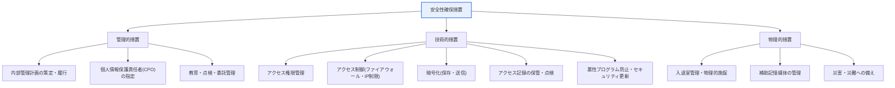
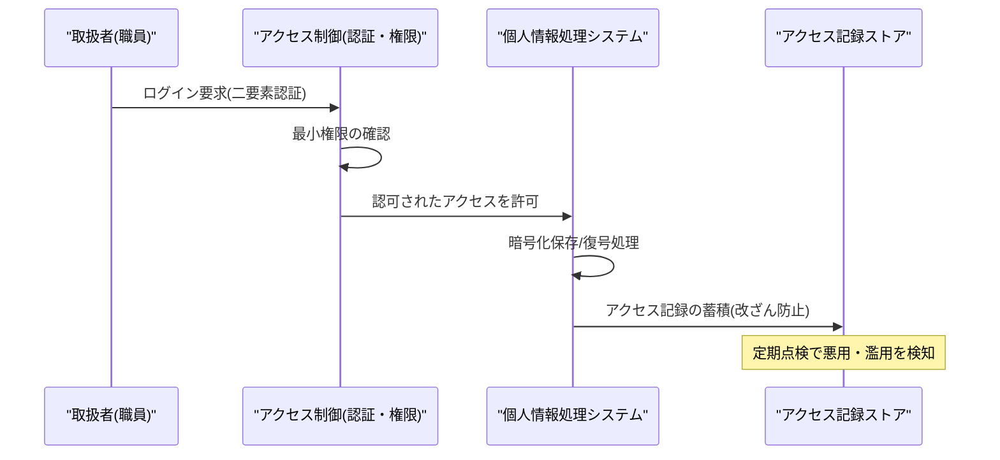

# 個人情報の安全性確保措置基準

## 1. 概要

### A. 定義

> **個人情報の安全性確保措置基準** とは、韓国の「個人情報保護法」に基づき、個人情報処理者が個人情報の**紛失・盗難・漏えい・偽造・改ざん・毀損を防止**するために必ず遵守しなければならない管理的・技術的・物理的保護措置の最低基準を規定した告示(行政規則)である。

この基準の核心的な趣旨は、個人情報保護を「**抽象的な努力**」ではなく「**具体的かつ検証可能な最低限の義務**」として明文化した点にある。法律が「個人情報を安全に管理せよ」と宣言するだけでは実効性がない。何を、どの水準まで行えば安全措置を尽くしたことになるのかが不明確であれば、事業者は履行しにくく、監督機関は違反を判断しにくい。そこでこの告示は、内部管理計画の策定、アクセス権限の管理、アクセス制御、暗号化、アクセス記録の保管・点検、悪性プログラムの防止、物理的安全措置、災害・災難への備えなど、**履行すべき最低限の項目を明確に定め**、予測可能性と執行力を確保している。

ただし、すべての組織に画一的に同じ水準を求めるのは非現実的である。年間売上が数兆ウォン規模の大型プラットフォームと従業員数名の小規模事業者に同じセキュリティ基盤を備えよと求めるのは、過剰規制であり実現不可能な負担となる。そこでこの基準は、処理する個人情報の**規模(情報主体の数)と機微度(機微情報・固有識別情報を含むかどうか)に応じて措置の水準を差別的に適用**する。大量の機微情報を扱う大規模処理者にはより厳格な措置が、小規模処理者には相対的に緩和された措置が適用される「類型別の差別化」構造である。(具体的な類型区分と適用項目は告示の改正によって変わり得るため、実際の適用時には最新の告示の別表を確認する必要がある。)

### B. 登場背景と保護措置の三つの軸

個人情報漏えい事故の相当数は、高度なハッキングではなく**基本的な措置の欠如** — 権限のない職員による無断照会、退職者アカウントの未削除、平文で保存されたパスワード、放置されたアクセス記録 — に起因する。この基準は、そうした「基本を守らないことで起きる事故」を防ぐための最低限のセーフティネットである。安全性確保措置は、人・制度を扱う**管理的措置**、技術で統制する**技術的措置**、物理的なアクセスを防ぐ**物理的措置** の三つの軸で構成され、いずれか一つだけでは防御は完成しない。最高水準の暗号化(技術)を適用しても権限管理(管理)が杜撰であれば正規のアカウントでデータが流出し、完璧なアクセス制御(技術)を備えてもサーバ室への入室(物理)が無防備であれば意味がない。三つの軸が互いの隙間を埋める**多層防御(Defense in Depth)** として機能してこそ、実効的な保護となる。

## 2. 安全措置の体系 — 三つの軸による多層防御

上記の体系は、「誰がアクセスするのか(権限・認証)」、「どのようにアクセスするのか(統制・記録)」、「漏えいしても読めないように(暗号化)」、「物理的に入れないように(入退室管理)」という防衛線を幾重にも築いた構造である。以下では、各軸の主要な措置をその原理とともに見ていく。

## 3. 管理的措置 — 内部管理計画の策定・履行

> **内部管理計画** とは、個人情報の安全な処理のための**組織内部の総合的な管理指針**であり、個人情報保護責任者(CPO)の指定、保護組織の構成・役割、アクセス権限管理、教育、委託・漏えいへの対応などを文書化し、実際に施行する体制である。

内部管理計画が管理的措置の中心である理由は、セキュリティ事故の根源が技術的な欠陥ではなく、**人と手続きの管理の欠如**にあるからである。誰が個人情報について最終責任を負い(CPO)、誰にどのようなアクセス権限を付与・変更・抹消し、職員教育と事故対応・届出をどのような手順で行うのかを**文書で定め、そのとおりに履行**してこそ、組織的な管理が成立する。文書だけあって履行がなければ(いわゆる「引き出しの中の規程」)それ自体が違反であり、実際の監督の現場でも「計画に対する履行の有無」が主要な点検項目となる。

特にアクセス権限の管理は、最小権限の原則(Least Privilege)と職務分離に基づかなければならない。業務に必要な最小範囲のみを付与し、人事異動・退職時には遅滞なく権限を変更・抹消すべきである。実際の大規模漏えい事故の相当数が「退職したのに生きていたアカウント」や「必要以上に広かった権限」に起因していたことから、権限のライフサイクル(付与→変更→回収)管理は管理的措置の急所である。また、個人情報の処理を外部に委託する場合は、受託者が安全措置を遵守するよう契約に明記し、定期的に管理・監督しなければならない — 委託したからといって責任まで移るわけではないからである。

| 含めるべき事項 | 内容 | 実務上の含意 |
|---|---|---|
| **責任体制** | CPOの指定、保護組織・役割の定義 | 責任の所在の明確化、意思決定ラインの確保 |
| **アクセス権限管理** | 付与・変更・抹消の基準、最小権限 | 退職者・異動者の権限を即時回収 |
| **教育・点検** | 定期教育、内部点検・改善 | 人的ミス・内部者脅威の予防 |
| **委託管理** | 受託者との契約・監督 | 委託後も処理者の責任は存続 |
| **対応計画** | 漏えい事故の対応・届出手順 | ゴールデンタイム内の届出・通知体制 |

## 4. 技術的措置 — アクセス制御・暗号化・アクセス記録

技術的措置は、管理上のポリシーをシステムで強制する手段である。第一に、**アクセス制御**は個人情報処理システムへのアクセスを認可された者に限定する。安全な認証手段(例: アカウント・パスワードに加えた二要素認証)を適用し、外部からの接続はVPNなどの安全な接続手段や許可IP制限で統制し、一定時間使用しない場合の自動接続遮断(セッションタイムアウト)を設ける。これは「正当な者だけが、正当な経路で」アクセスできるようにする第一の防衛線である。

第二に、**暗号化**は、個人情報が漏えいしても内容を読み取れないようにする最後の防衛線である。固有識別情報(住民登録番号など)・パスワード・生体情報などの機微な情報は保存時に暗号化しなければならず、特に**パスワードは復号できない一方向暗号化(安全なハッシュ関数)** で保存する。これはシステム管理者でさえ元のパスワードを知ることができないようにし、データベースが丸ごと流出してもパスワードの原文が露出しないようにするためである。これにアカウントごとのソルト(Salt)を加えることで、レインボーテーブル(Rainbow Table)攻撃を無力化する。また、情報通信網を通じて個人情報をやり取りする際にはSSL/TLSで通信区間を暗号化し、暗号鍵の生成・利用・保管・廃棄などの**鍵管理手順**を別途備えなければならない — 暗号化の安全性は、結局のところ鍵管理の安全性に収束するからである。

第三に、**アクセス記録の保管・点検**は追跡性と抑止力を提供する。個人情報処理システムにアクセスした記録(アカウント、アクセス日時、処理した情報主体の情報、実行した業務など)を一定期間(機微情報・大量処理などの場合はより長期間)保管し、偽造・改ざん・盗難・紛失されないよう安全に管理し、定期的に点検しなければならない。アクセス記録は、事故が起きたときに「誰がいつ何をしたのか」を明らかにする事後追跡の根拠であると同時に、「記録が残る」という事実そのものによって内部者の悪用・濫用を事前に抑止する効果がある。このほか、悪性プログラムの防止(ウイルス対策・セキュリティ更新)と、出力・複製時の保護措置も技術的措置に含まれる。

| 対象 | 適用方策 | 目的 |
|---|---|---|
| **アクセス制御** | 安全な認証、IP制限・VPN、セッションタイムアウト | 認可された者のみアクセス |
| **保存時の暗号化** | 固有識別情報・生体情報の暗号化 | 漏えい時の判読不能化 |
| **パスワード** | 復号不可能な**一方向暗号化(ハッシュ)+ソルト** | 管理者・漏えい者も原文を取得不可 |
| **送信時の暗号化** | 送受信区間のSSL/TLS | 送信中の傍受を防御 |
| **アクセス記録** | 一定期間の保管・改ざん防止・点検 | 追跡性・抑止力の確保 |
| **鍵管理** | 暗号鍵の生成・利用・保管・廃棄の手順 | 暗号化の実効性を担保 |

## 5. 事例で見る措置の実効性

三つの軸がなぜ一体でなければならないのかは、実際の事故の類型がよく示している。第一に、ある通信・流通企業で大規模な個人情報が漏えいした事件の共通原因は、多くが「脆弱性の放置・アクセス制御の不備」であった — 技術的措置の基本(セキュリティ更新・アクセス制限)さえ守っていれば防げたケースである。第二に、パスワードを平文で保存していたためにDB流出と同時に全アカウントのパスワードが露出した事例は、一方向暗号化というたった一つの措置が、事故の等級を「致命的」から「限定的」へと引き下げていたであろうことを示している。第三に、退職者アカウントの未削除や過剰な権限による内部者の漏えいは、どれほど優れた暗号化があっても、管理的措置(権限のライフサイクル管理)が崩れれば意味がないことを露呈している。このように措置は相互補完的であり、一つの軸の空白が他の軸の努力を丸ごと無力化する。

以下のシーケンスは、正常なアクセスが三つの軸の統制をどのように順に通過するかを示している。認証(管理・技術)→権限の確認(管理)→暗号化されたデータの処理(技術)→アクセス記録の蓄積(技術)の各段階のうち、一つでも欠ければ防衛線に穴が開く。

物理的措置もまた、この流れの前提である。電算室・資料保管室への入退室を統制し(入退室履歴の管理)、補助記憶媒体(USB・外付けハードディスク)の持ち出し・持ち込みを統制し、個人情報が含まれる書類・媒体を施錠装置で保管しなければならない。地震・火災のような災害に備えたバックアップ・復旧体制も、広い意味での安全措置に含まれる — 可用性(Availability)もまた、個人情報の安全な処理を構成する要素だからである。

## 6. 深掘り — 法制度の統合とPrivacy by Designへの拡張

この分野の最近の流れは二つの方向にある。第一に、**規制の統合・整備**である。かつてオンライン(情報通信網法)とオフライン(個人情報保護法)に二元化されていた個人情報の安全措置に関する規律が、個人情報保護法の体系に一元化・整備されたことで、事業者は一つの統合された基準に従うことになった。規定の詳細(類型区分・項目・保管期間など)は告示の改正によって変わり続けるため、実務では最新の告示と個人情報保護委員会の解説書を必ず確認しなければならない。

第二に、**事後防御から事前予防(Privacy by Design)への移行**である。漏えい後に防ぐ措置を超えて、最初から個人情報を最小限だけ収集し、仮名・匿名処理(PET、Privacy Enhancing Technologies)で識別リスクを下げ、新規システムの導入前に個人情報影響評価(PIA)でリスクを事前に診断する方向へと重心が移りつつある。さらにAI・ビッグデータの時代には仮名情報の結合・活用が拡大するにつれ、「安全措置」の範囲は従来のアクセス制御を超えて、再識別防止・差分プライバシー(Differential Privacy)のようなデータそのものの非識別化技術へと拡張されている。すなわち安全性確保措置は固定されたチェックリストではなく、技術・脅威環境とともに進化する生きた基準である。

## 7. 考慮事項および示唆 (技術士の観点)

1. **規模・機微度に応じた差別的適用が原則**である。処理する個人情報の類型・量に合わせて措置の水準を定め、小規模事業者に対する過度な負担と、大量処理者に対する過小な保護の両方を避けなければならない。自社がどの類型に属するのかをまず正確に識別することが、履行の出発点である。

2. **管理・技術・物理のバランスが核心**である。特定の軸にのみ投資すると、他の軸の空白から防御が丸ごと破られる。暗号化(技術)に注力する場合でも、権限のライフサイクル管理(管理)とサーバ室の入退室管理(物理)を併せて備えてこそ、多層防御が完成する。

3. **アクセス記録の保管・点検によって追跡性と抑止力を確保**しなければならない。誰がいつどの個人情報にアクセスしたかを改ざんなく記録・保管し定期的に点検することで、内部者の悪用・濫用を事前に抑止し、事故時の原因究明と責任の所在の確認を可能にする。記録は「残す」ことではなく「点検する」ことまでが措置である。

4. **事前予防(PbD・PIA・PET)への拡張が戦略的方向性**である。事後対応のコストは事前予防のコストを大きく上回るため、最小限の収集・非識別化処理・影響評価を設計段階に内在化すべきである。AI・仮名情報の活用が増えるほど、再識別防止や差分プライバシーのようなデータ中心の安全技術の重要性が高まる。

5. **履行の証跡と継続的改善**が、監督・紛争対応の鍵である。計画の策定にとどまらず、教育・点検・改善のPDCAサイクルを回し、履行の根拠(ログ・点検記録・教育履歴)を残しておくことで、事故発生時に「注意義務を尽くした」ことを立証できる。

6. **可用性も安全性の一部**であることを見落としてはならない。漏えい・毀損の防止だけでなく、災害・災難・ランサムウェアによるデータ消失に備えたバックアップ・復旧体制まで整えてこそ、「安全な処理」が完成する。機密性・完全性・可用性(CIA)をバランスよく保証することが、情報セキュリティの基本の三角形である。

## 参考資料
- 個人情報保護委員会、「個人情報保護法」および下位告示(個人情報の安全性確保措置基準) — https://www.pipc.go.kr
- 国家法令情報センター、個人情報保護法令 — https://www.law.go.kr
- 韓国インターネット振興院(KISA)、個人情報保護の案内・資料 — https://www.kisa.or.kr

---

> **一言まとめ**: 個人情報の安全性確保措置基準は、*管理的(内部管理計画・権限管理)・技術的(アクセス制御・暗号化・アクセス記録)・物理的*措置を規模・機微度に応じて差別的に規定する多層防御の体系であり、保存・送信時の暗号化とパスワードの一方向暗号化を義務付けている。現在ではPrivacy by Design・PIA・非識別化技術による事前予防へと拡張されつつある。
