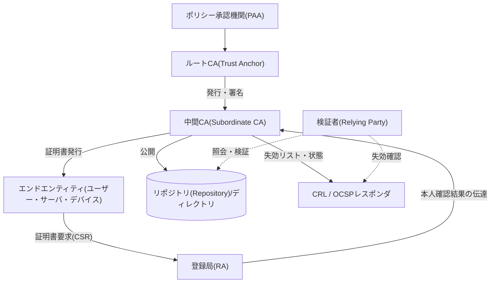
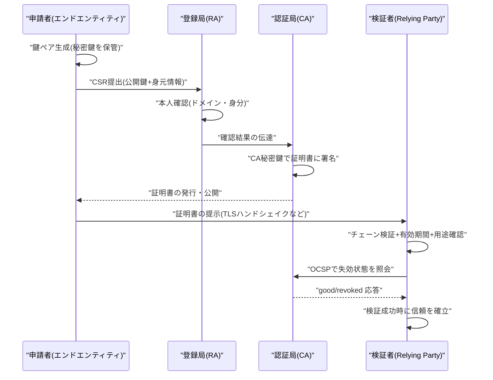

# 公開鍵基盤(PKI, Public Key Infrastructure)

## 1. 概要

### A. 定義

> **公開鍵基盤(PKI)**とは、公開鍵暗号(非対称暗号)を実際のサービスで信頼して利用できるようにするため、**公開鍵とその所有者(主体)の身元を電子的に結び付けた証明書(Certificate)**の発行・管理・検証・失効に必要なハードウェア・ソフトウェア・ポリシー・手続き・人員の総体的な体系をいう。その核心は、信頼できる第三者である**認証局(CA)**の電子署名によって「この公開鍵は本当にこの主体のものである」ことを保証する点にある。

PKIは単一の製品やアルゴリズムではなく、公開鍵暗号を社会的・技術的に運用可能にする**信頼インフラ(trust infrastructure)**である。対称鍵暗号が事前に安全に共有された秘密鍵を前提とするのに対し、公開鍵暗号は誰でも見られる公開鍵で暗号化・署名検証を行うため、鍵配送の問題を原理的に解決する。しかしここには決定的な落とし穴がある。「自分が今入手したこの公開鍵は本当に通信相手のものか」を保証できなければ、攻撃者が自分の公開鍵を相手のものと偽装する**中間者攻撃(MITM)**が成立してしまう。PKIは、この身元と公開鍵の結合の問題を、証明書とCAの署名チェーンによって解決する。

### B. 登場背景と必要性

インターネットが商取引・行政・金融の基盤となるにつれ、互いに会ったこともない当事者間で**機密性・完全性・認証・否認防止**を同時に確保しなければならないという要求が爆発的に増えた。対称鍵だけでは、事前の鍵共有が不可能な見知らぬ相手と安全なチャネルを開くことはできず、公開鍵だけでは前述の身元保証の問題が残る。特に電子商取引では「このWebサイトは本物の銀行か」、電子文書では「この署名は本当にその人のものか」という問いに**技術的に検証可能な答え**を与えられなければ、取引は成立しない。

こうした要求は、結局「信頼をどのように拡張(scale)するか」という問題に帰結する。すべての当事者が互いの公開鍵を個別に検証・交換するのは、ユーザー数が増えるほど組み合わせ的に爆発し、現実的ではない。PKIは、少数の**トラストアンカー(Trust Anchor、ルートCA)**を頂点とする**階層的な信頼の委任**構造を導入し、ユーザーがごく少数のルートを信頼するだけで、その下に委任された無数の証明書を自動的に検証できるようにする。今日のWebのHTTPS(TLS)、電子署名・電子税金計算書、コード署名、電子メールのセキュリティ(S/MIME)、VPN・デバイス認証、そして韓国の共同認証書(旧・公認認証書)体系がすべてPKIの上で動作していることから、PKIはデジタルな信頼の事実上の基盤構造といえる。

## 2. 全体構造と構成要素

PKIは、証明書を作成する**ポリシー・認証の主体**、それを保存・配布する**リポジトリ**、そして実際に証明書を使用・検証する**エンドエンティティ(End Entity)**で構成される。以下の構造図は、これらの関係と信頼の流れを示している。

**認証局(CA, Certification Authority)**はPKIの心臓部であり、エンドエンティティの公開鍵と身元情報を含む証明書に**自らの秘密鍵で電子署名**して発行する。CAの署名は、すなわち「この結合を私が保証する」という宣言である。最上位の**ルートCA**は自分自身で署名した自己署名(self-signed)証明書を持ち、このルート公開鍵がブラウザ・OSの**トラストストア(trust store)**にあらかじめ搭載されることで、あらゆる検証の出発点となる。ルートの秘密鍵が漏えいすれば信頼体系全体が崩壊するため、通常はオフライン状態の**HSM(ハードウェアセキュリティモジュール)**に保管し、平常時は中間CAのみをオンラインで運用する。

**登録局(RA, Registration Authority)**は、証明書を発行する前に申請者の身元を確認する窓口である。CAが信頼を「署名」として表現するのに対し、その信頼の根拠となる**現実世界での本人確認**はRAの役割である。例えばサーバ証明書であればドメインの所有権を、個人証明書であれば身分証・対面確認を通じて、申請者が主張する身元が事実であるかを検証し、その結果をCAに伝える。RAの確認レベルが、そのまま証明書の信頼等級(DV・OV・EV)を分ける。

**リポジトリ(Repository)と失効情報サービス**は、発行された証明書とその状態を公開・照会可能にする。検証者は証明書チェーンを入手することに加えて、その証明書が有効期間内に**途中で失効(revoke)されていないか**を必ず確認しなければならない。このために、失効した証明書のシリアル番号の一覧である**CRL(Certificate Revocation List)**と、個々の証明書の状態をリアルタイムに問い合わせる**OCSP(Online Certificate Status Protocol)**が運用される。最後に**エンドエンティティ(End Entity)**は証明書を実際に使用するユーザー・サーバ・IoTデバイスなどであり、証明書を信頼して検証する側を特に**検証者(Relying Party)**と呼ぶ。

### A. 公開鍵暗号の二つの用途 — 機密性と否認防止

PKIが保証する公開鍵は大きく二つの目的で使われ、この二つを区別して理解することが、証明書の用途(KeyUsage)設計の出発点となる。第一に、**機密性**のためには、送信者が受信者の**公開鍵で暗号化**し、受信者だけが自身の秘密鍵で復号する。ただし公開鍵暗号は演算が重いため、実際には対称のセッション鍵を公開鍵で包んで渡す**ハイブリッド方式(電子封筒)**を用いる。第二に、**認証・完全性・否認防止**のためには、逆に署名者が自身の**秘密鍵で署名**し、誰もがその公開鍵で検証する。秘密鍵は署名者だけが保有するため、有効な署名はそのまま「その人が署名し、その後改ざんされていない」ことの証拠となる。

ここでPKIの必要性が改めて明らかになる。署名検証に使う公開鍵が本当にその署名者のものであることを保証する仕組みがなければ、攻撃者は自分の鍵で署名した文書を被害者のものと偽装できてしまう。証明書はまさにこの「公開鍵と身元」の結合をCAの署名で保証することで、暗号化と電子署名の両方を信頼可能にする。そのため実務では、署名用の鍵ペアと暗号化用の鍵ペアを分けて発行することが多い。署名鍵は否認防止のためにバックアップ・復旧を禁止する一方、暗号化鍵はデータ復旧のために鍵預託(key escrow)が必要になる場合があり、管理ポリシーが相反するからである。

### B. X.509証明書の構造

PKIで流通する証明書は、国際標準である**X.509 v3**形式に従う。証明書には、主体(Subject)と発行者(Issuer)の識別情報、主体の公開鍵、有効期間、シリアル番号、そして用途を制限するさまざまな**拡張フィールド(extensions)**が含まれ、その全体に発行CAの電子署名が付与される。拡張フィールドのうち**KeyUsage/ExtendedKeyUsage**は、当該鍵を署名用か暗号化用か、サーバ認証用かコード署名用かに制限し、**SAN(Subject Alternative Name)**は証明書が保証するドメインの一覧を明示する。今日のブラウザは、CN(Common Name)ではなくSANを基準にドメインの一致を検証する。

| 構成要素 | 役割 | 漏えい・誤り発生時の影響 |
|---|---|---|
| ルートCA | 信頼の頂点、自己署名 | 信頼全体の崩壊(再構築が必要) |
| 中間CA | 委任による発行、オンライン運用 | 下位証明書の大量再発行 |
| RA | 本人確認 | 偽の証明書発行のリスク |
| CRL/OCSP | 失効状態の提供 | 失効した証明書を誤って信頼 |
| HSM | 秘密鍵の保管・演算 | 鍵奪取時の偽造・改ざん署名 |

## 3. 証明書のライフサイクルと検証手順

PKIの運用では、証明書の**発行 → 使用 → 更新 → 失効**へと続くライフサイクル管理が核心である。以下は発行と検証の詳細な流れである。

**発行段階**では、申請者はまず自身の端末・サーバで鍵ペアを生成する。秘密鍵は決して外に出さず、公開鍵と身元情報を含む**CSR(Certificate Signing Request)**だけをRAに提出する。RAの本人確認を経てCAが証明書に署名すれば、発行が完了する。秘密鍵がそもそも申請者の端末から出ないという点が、否認防止(non-repudiation)の技術的な土台となる。

**検証段階**は、PKIの実質的な価値が発揮される地点である。検証者は、提示された証明書から発行者をたどって**中間CA → ルートCAへとつながる証明書チェーン(chain of trust)**を構成し、各段階の署名を上位の公開鍵で検証して、最終的に自身がトラストストアに持つルートに到達するかを確認する。チェーンがルートまでつながり、各証明書が有効期間内であり、用途(EKU)とドメイン(SAN)が一致し、最後に**CRL/OCSPによって失効していないこと**が確認されて、初めて信頼が成立する。このうち一つでも失敗すれば、ブラウザは警告を表示して接続を遮断する。

**失効段階**は、有効期間が終わる前であっても、秘密鍵の漏えい・所属の変更・誤発行が発生した場合に証明書を無効化する手続きである。CRLは定期的に配布されるため鮮度が落ちるという限界があり、OCSPはリアルタイムであるものの、接続のたびにCAへ問い合わせる負担とプライバシー露出の問題がある。これを補うため、サーバがOCSP応答をあらかじめ受け取ってハンドシェイクに添付する**OCSP Stapling**が広く使われている。二つの方式のトレードオフを整理すると次のとおりである。

| 区分 | CRL | OCSP |
|---|---|---|
| 方式 | 失効リストの一括配布 | 個々の証明書をリアルタイム照会 |
| 鮮度 | 発行周期分だけ遅延 | リアルタイム(応答時点基準) |
| 検証者の負担 | リストのダウンロードサイズ増加 | 接続ごとの照会(Staplingで緩和) |
| プライバシー | 露出が少ない | 訪問サイトがCAに露出 |
| 可用性 | キャッシュ可能 | レスポンダ障害時は検証不能 |

両方式とも「失効情報が検証者に適時に届くか」という同一の難題を抱えており、これが近年、**有効期間そのものを短くして失効への依存度を下げようとする**ポリシーの流れの背景となっている。

### A. 長期署名と否認防止の持続性

電子署名の法的効力は、署名時点で証明書が有効であったことを**将来にわたって**立証できてこそ維持される。証明書が期限切れになったりCAが消滅したりした後に「あの時のあの署名は有効だったのか」が争われると、否認防止が揺らぐ。これを解決するため、署名値に**信頼できるタイムスタンプ(TSA)**を付与して署名時刻を固定し、検証に必要な証明書チェーンと失効情報(OCSP・CRL)を署名とともに封入する**長期検証(LTV, Long-Term Validation)**フォーマット(例: PAdES・XAdES・CAdES)が用いられる。これは、電子契約・電子税金計算書・電子文書の保管のように数年~数十年にわたる証跡が必要な領域で、PKIが実質的な法的信頼を提供するための中核的な仕組みである。

## 4. 信頼モデルの比較と適用事例

PKIの信頼を組織する方式にはいくつかのモデルがあり、これは単なる実装の違いではなく、**信頼の拡張性・回復力・相互運用性**という相反する要求から生じた選択である。

| 信頼モデル | 構造 | 長所 | 限界 |
|---|---|---|---|
| 階層型(Hierarchical) | 単一ルートが頂点 | 検証が単純、管理が明確 | ルート漏えい時に全面崩壊 |
| 相互認証(Cross-cert) | CA間の水平的な認証 | ドメイン間の相互運用 | パス探索が複雑 |
| ブリッジ(Bridge) CA | 中立ハブが仲介 | 多機関連携に有利 | ブリッジの運用負担 |
| 信頼の網(Web of Trust) | ユーザー間の相互署名 | 中央機関が不要 | 信頼度の定量化が困難 |

階層型はWeb PKIが採用している方式で、検証は単純であるが、ルートに信頼が集中する。反対にPGPの**信頼の網(Web of Trust)**は、ユーザー同士が互いの鍵に署名することで中央機関なしに信頼を形成するが、「どの程度信頼するか」を客観化しにくいため大規模な運用には不向きである。政府・金融のように異なる組織のPKIを連携させなければならない環境では、中立的なハブを置く**ブリッジCA**が活用される。米国連邦ブリッジCA(FBCA)が代表的な事例であり、省庁ごとに独立して運用されるPKIを一つの信頼フレームにまとめている。

信頼モデルの脆弱性を劇的に露呈した事例が、2011年のオランダの**DigiNotar**事件である。侵害されたこのCAから、Googleなど主要ドメインに対する偽造証明書が500件余り発行され、実際の中間者による盗聴に悪用された。最終的にブラウザ各社が当該ルートをトラストストアから一斉に削除し、CAは破産に至った。この事件は、階層型の信頼の根本的な弱点、すなわち**信頼している数百のCAのうちたった一つが破られるだけで全ユーザーが脅かされる**という事実と、誤発行を事後的にでも検知する監視の仕組み(CT)の必要性を痛烈に刻み込んだ。その後導入されたCertificate Transparencyは、まさにこの教訓の直接的な産物である。

具体的な適用事例としては、第一に**WebのHTTPS/TLS**がある。世界のWebトラフィックの大半はTLSで暗号化されており、その信頼は、ブラウザ・OSに搭載された数百のルートCAと、それを監督する**CA/Browser Forum**の基準(Baseline Requirements)によって維持されている。第二に、韓国の**共同認証書(旧・公認認証書)**体系は、最上位のKISAを頂点に、金融決済院・KOSCOMなどの公認認証機関が階層型PKIを構成し、電子金融・電子政府に用いられてきた。第三に、**コード署名**は、ソフトウェア配布者が自らの証明書で実行ファイルに署名することで、改ざんの有無と出所をユーザーが検証できるようにする。第四に、IoT分野では数億台のデバイスに証明書を組み込んで**デバイスID(device identity)**を付与する事例が増えているが、この規模では手作業での発行は不可能であるため、自動化が必須となる。

## 5. 深掘り — 自動化・透明性と最新動向

従来のPKIのボトルネックは、証明書の**手動による発行・更新**であった。有効期限切れを見落としてサービス障害が発生する事故が繰り返されたため、これを自動化する**ACME(Automated Certificate Management Environment)プロトコル**が標準化(RFC 8555)され、Let's Encryptがこれを基盤に無料・自動の証明書を普及させたことで、HTTPSの普及率は大きく押し上げられた。最近ではCA/Browser Forumが、サーバ証明書の最大有効期間を短縮する方向でポリシーを強化しており(数年 → 数百日、そして長期的にはさらに短く)、事実上**自動化なしのPKI運用は持続不可能**になりつつある。有効期間の短縮には失効情報の鮮度の限界を補う効果もある。証明書がまもなく失効するため、漏えいした鍵が悪用され得る期間(window)が自然に狭まるからである。

信頼の監視の面では、**CT(Certificate Transparency)**が重要である。過去には、一部のCAがドメイン所有者の知らないうちに証明書を誤発行したり、侵害されて偽造証明書が発行されたりする事故があった。CTは、発行されたすべてのサーバ証明書を公開の追記専用(append-only)ログに記録させることで、ドメイン所有者が自分のドメインに対する証明書の発行を常時監視(monitoring)できるようにする。今日、主要なブラウザはCTログに登録されていない証明書を信頼しないため、CTは事後検知を超えて事実上発行の前提条件となった。ドメイン所有者が特定のCAにのみ自ドメインの証明書発行を許可するようDNSで制限する**CAA(Certification Authority Authorization)**レコードも、誤発行の抑止策として併用される。

運用形態の面では、組織内部専用の**プライベート(内部)PKI**とパブリックPKIを区別して運用することが、近年の標準的な設計である。ブラウザが信頼するパブリックPKIは外部に公開されるWebサービスに使い、内部のサーバ・ワークロード・デバイス間のmTLSには、組織が自ら運用する内部CAで短期証明書を大量に自動発行する。このように分けることで、外部の信頼ポリシー(有効期間の短縮・CTの義務)と内部運用の自由度をそれぞれ最適化でき、内部証明書がパブリックのトラストストアを汚染するリスクも遮断される。クラウド事業者のマネージドPKIサービスやサービスメッシュの自動証明書発行が、この流れを加速させている。

最も根本的な最新動向は、**耐量子(PQC)への移行**である。現行PKIの署名・鍵交換はRSA・ECDSAに依存しているが、十分に大規模な量子コンピュータが登場すればこれらが無力化され、証明書の署名そのものを偽造できるようになる。これを受けて米国NISTは2024年に格子ベースの署名・鍵カプセル化アルゴリズム(例: ML-DSA、ML-KEM)を標準として確定し、PKI業界は一つの証明書に既存アルゴリズムとPQCアルゴリズムを併せて格納する**ハイブリッド証明書**による段階的な移行を準備している。ただし、今保存されている暗号文を将来解読する**「今収集し、後で解読する(HNDL)」**脅威を考慮すれば、長期保存データを扱う機関ほど移行の緊急性は高い。

## 6. 考慮事項および示唆

第一に、**ルート鍵の保護とCA運用の完全性**が最優先である。ルートの秘密鍵はオフラインのHSMに保管し、物理的アクセスを複数の承認者に分散(m-of-n統制)し、定期的な監査とCP/CPS(証明書ポリシー・認証業務運用規程)に基づく運用を文書化しなければならない。信頼の頂点が崩れれば下位全体が無意味になるため、ここへの投資が体系全体の回復力を決定する。

第二に、**失効検証の実効性**を確保しなければならない。CRLは配布の遅延によって、OCSPは性能・可用性・プライバシーの問題によって、それぞれ限界がある。OCSP Stapling・Must-Staple、そして有効期間の短縮を組み合わせ、失効の失敗によって偽造証明書を誤って信頼するリスクを減らす設計が必要である。「失効したが検証されない」状態は、失効していないのと変わらないことに留意すべきである。

第三に、**証明書ライフサイクルの自動化と可視性**が運用の安定性の鍵である。期限切れ・誤発行による大規模なサービス障害が繰り返されている以上、ACMEベースの自動更新とともに、組織内のすべての証明書を発見・追跡する**CLM(Certificate Lifecycle Management)**ツールを導入し、「シャドー証明書(shadow cert)」をなくさなければならない。有効期間短縮の流れの中で、手作業はそのまま事故の原因となる。

第四に、**暗号の俊敏性(Crypto-agility)とPQCへの備え**が戦略的課題である。アルゴリズム・鍵長・CAを迅速に置き換えられるようシステムを設計し、資産で使用されている暗号の一覧をインベントリ化(CBOM)して、PQC移行のロードマップを策定すべきである。特に長期署名・長期保存文書を扱う公共・金融の領域では、ハイブリッド証明書の導入時期を先行して検討する必要がある。

第五に、**ゼロトラスト・IoTなど新たな需要との連携**を考慮しなければならない。ユーザーだけでなく、ワークロード・デバイス・サービス間の相互認証(mTLS)が広がるにつれて発行規模が爆発的に増えるため、短期証明書の自動発行を前提とした内部PKI(例: サービスメッシュのワークロードID、SPIFFE/SPIRE)とパブリックPKIを役割に応じて区別・併用するアーキテクチャ設計が求められる。

## 参考資料

- NIST, "Post-Quantum Cryptography Standardization", https://csrc.nist.gov/projects/post-quantum-cryptography
- IETF RFC 5280, "Internet X.509 Public Key Infrastructure Certificate and CRL Profile", https://datatracker.ietf.org/doc/html/rfc5280
- IETF RFC 8555, "Automatic Certificate Management Environment (ACME)", https://datatracker.ietf.org/doc/html/rfc8555
- CA/Browser Forum, "Baseline Requirements", https://cabforum.org/baseline-requirements/
- Certificate Transparency, https://certificate.transparency.dev/

---

> **一言まとめ**: PKIとは、CAの電子署名によって公開鍵と身元をX.509証明書として結び付け、階層的な信頼チェーン・失効(CRL/OCSP)・リポジトリを通じてそれを検証可能にするデジタルな信頼の基盤構造であり、今日では自動化(ACME)・透明性(CT)・耐量子(PQC)への移行を軸に進化している。
