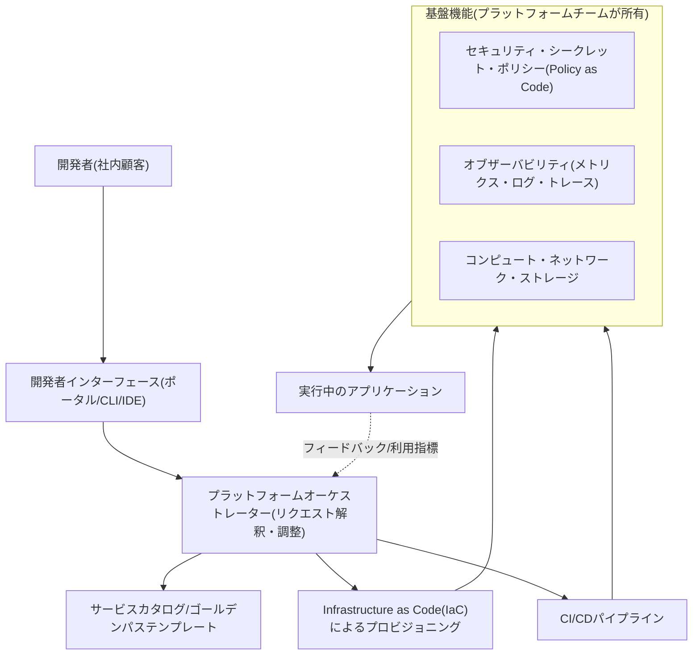
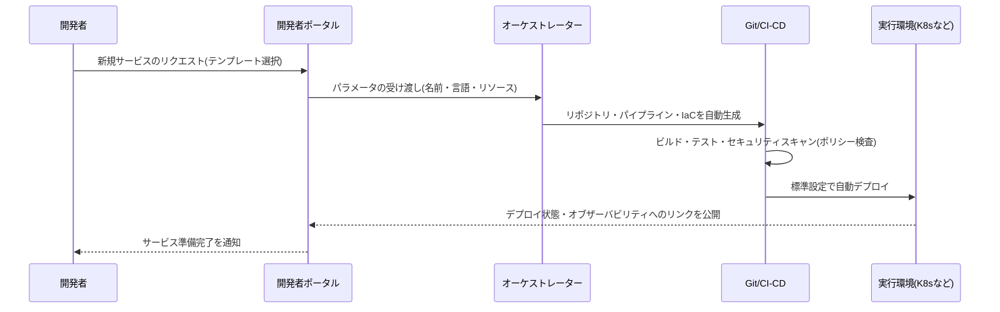

# プラットフォームエンジニアリング(Platform Engineering)

## 1. 概要

> **定義**: プラットフォームエンジニアリングとは、開発者がアプリケーションをビルド・デプロイ・運用するために必要なインフラ・ツール・標準を、セルフサービス型の**内部開発者プラットフォーム(IDP, Internal Developer Platform)** として製品化して提供することにより、開発者の認知負荷を下げ、ソフトウェアのデリバリー速度と安定性を同時に高めるアプローチである。

プラットフォームエンジニアリングは、2022年前後にガートナーとCNCFを中心に台頭した概念であり、その登場の背景には、DevOpsの成功が逆説的に生み出した限界がある。
DevOpsは「開発者が自分で作ったものを自分で運用する(you build it, you run it)」という原則で開発と運用の壁を取り払ったが、クラウドネイティブ環境が複雑化するにつれ、開発者一人が担わなければならない知識の幅が爆発的に広がった。
Kubernetesマニフェスト、Helmチャート、Terraform、CI/CDパイプライン、オブザーバビリティの設定、シークレット管理、ネットワークポリシーをすべての開発者が習得しなければならないとすれば、本来ビジネスロジックを書くべき開発者がインフラの問題に時間を奪われることになる。
このように一人が同時に処理しなければならない認知的な負担を**認知負荷(cognitive load)** と呼び、プラットフォームエンジニアリングはこの認知負荷を管理することを中核的な目標とする。

二つ目の背景は、自律性と標準化の相反である。
各チームが自由にツールを選択すると、組織全体としては断片化(tool sprawl)が深刻化し、セキュリティポリシー・規制遵守・コスト統制が困難になり、重複投資が発生する。
逆に中央ですべてを統制すればボトルネックが生じ、開発者の自律性が損なわれる。
プラットフォームエンジニアリングは「**舗装された道(paved road / golden path)**」を提供し、開発者がその道に従えば特に悩むことなく組織の標準・セキュリティ・ベストプラクティスを自動的に遵守できるよう設計することで、自律性と統制を両立させる。

三つ目の背景は、プラットフォームを**製品(product)として扱う**という発想の転換である。
かつての社内インフラチームは、チケットを受けて処理する受動的なサービス組織であったが、プラットフォームエンジニアリングは社内の開発者を「顧客」と捉え、そのニーズを調査し、ロードマップを策定し、採用率と満足度を測定しながらプラットフォームを継続的に改善する。
すなわちプラットフォームエンジニアリングは、単なる技術の組み合わせではなく、**プロダクトマネジメント(product management)の観点**をインフラに適用した、組織・文化・技術の総体として理解すべきである。

## 2. 内部開発者プラットフォーム(IDP)の全体構造

プラットフォームエンジニアリングの成果物であるIDPは、複数の層が結合した製品である。
以下の概念図は、開発者がインターフェースを通じてリクエストを投入すると、オーケストレーターがそれを解釈して下位のインフラをプロビジョニングするという全体の骨格を示している。

**開発者インターフェース**層はIDPの顔であり、Webポータル(例: Backstage)、CLI、IDEプラグイン、あるいはGitリポジトリそのものがこれに該当し得る。
核心は、開発者が「何を望むか(望ましい状態)」だけを宣言すればよく、「どう作るか」は知らなくてもよいように抽象化することである。
例えば開発者がポータルで「PostgreSQLデータベースが必要」をクリックすれば、その裏でどのクラウドにどのようなセキュリティ設定で何が作られるかは、プラットフォームが責任を持つ。

**プラットフォームオーケストレーター**層は、宣言されたリクエストを実際のリソースに変換する頭脳である。
標準化されたテンプレート(ゴールデンパス)を選択し、IaCツール(Terraform、Crossplaneなど)を呼び出し、必要なパイプラインを接続する。
ここで重要な設計原則は、開発者に公開する抽象化のレベルを適切に定めることである。
隠しすぎれば柔軟性が失われ、隠さなさすぎれば認知負荷がそのまま残るため、大多数のケースは単純に処理しつつ、例外的な要求には下位層にアクセスできるようにするバランス(escape hatch)が必要である。

**基盤機能**層はプラットフォームチームが所有・運用する共通機能であり、セキュリティ・オブザーバビリティ・コンピュートがこれに属する。
特にセキュリティと規制遵守を**ポリシーのコード化(Policy as Code、例: OPA)** で実装してパイプラインに組み込めば、開発者が別途意識しなくても、デプロイ時点でポリシー違反が自動的に遮断される。
この点で、プラットフォームエンジニアリングはDevSecOpsと自然に結び付く。

## 3. 主要構成要素とゴールデンパス

プラットフォームエンジニアリングの実質的な価値は、「ゴールデンパス」という概念に凝縮されている。
ゴールデンパスとは、特定の種類の作業(例: 新規マイクロサービスの作成)を行うための最も推奨される標準経路であり、リポジトリ作成・CI設定・セキュリティスキャン・デプロイ・モニタリング接続が一つのテンプレートとしてあらかじめ組み立てられているものをいう。
開発者はこのテンプレートを使うだけで、組織のあらゆるベストプラクティスを自動的に継承する。

以下の概念図は、新規サービスがゴールデンパスに沿って作成・デプロイされるプロセスを示している。

これらの構成要素を整理すると次のとおりであり、各項目は単なる機能ではなく、開発者体験(DX, Developer Experience)を改善するという目的から選択される。

| 構成要素 | 役割 | 代表的な技術(例) |
|---|---|---|
| 開発者ポータル | セルフサービスの入口・サービスカタログ | Backstage, Port |
| オーケストレーション/プロビジョニング | 宣言的なリソース作成 | Crossplane, Terraform |
| CI/CD・デプロイ | 継続的インテグレーション・デリバリー、GitOps | Argo CD, GitHub Actions |
| ポリシー・セキュリティ | ポリシーのコード化、シークレット管理 | OPA, Vault |
| オブザーバビリティ | メトリクス・ログ・トレースの標準 | OpenTelemetry, Prometheus |

ここで留意すべきは、IDPがすなわちこれら特定のツールの集合ではないという点である。
同じ機能を商用の統合プラットフォーム(例: マネージドIDP)で実装することも、オープンソースを組み合わせて実装することもでき、組織の規模・成熟度によって適切な構成は異なる。
小さな組織が大企業並みの完全なIDPを構築しようとして、かえって過剰投資となるケースが多いため、「最大のボトルネックから薄く(thin platform)解決する」段階的なアプローチが推奨される。

## 4. DevOps・SREとの関係および比較

プラットフォームエンジニアリングはDevOps・SREを置き換えるものではなく、それらを**補完・実現する手段**として理解すべきであり、この関係を明確に区別することが答案の核心的な論点である。
DevOpsが開発と運用の協働という「文化・哲学」であるならば、SREは信頼性を工学的に達成する「実践方法論(SLO・エラーバジェットなど)」であり、プラットフォームエンジニアリングはこれらの文化と方法論を組織全体で再現可能にする「製品・手段」である。
すなわちDevOpsが目指す方向を示し、プラットフォームエンジニアリングがそれを規模をもって実現するツールを提供する。

違いが生じる根本的な理由は、「誰が認知負荷を負うのか」にある。
純粋なDevOpsモデルでは各開発チームがインフラの複雑さを自ら引き受けるが、プラットフォームエンジニアリングのモデルでは、その複雑さを専任のプラットフォームチームが吸収し、再利用可能な形にパッケージ化する。
したがってチーム数が少ないうちは純粋なDevOpsが効率的であるが、組織が大きくなり同一のインフラ作業が複数のチームで重複するようになると、プラットフォームエンジニアリングの投資対効果が急激に大きくなる。

| 区分 | DevOps | SRE | プラットフォームエンジニアリング |
|---|---|---|---|
| 性格 | 文化・哲学 | 信頼性エンジニアリングの方法論 | 製品・手段 |
| 焦点 | 開発・運用の協働 | SLO・エラーバジェット | 開発者体験(DX)・セルフサービス |
| 認知負荷 | 各チームが負担 | 信頼性の観点で標準化 | プラットフォームチームが吸収 |
| 成果物 | 協働プロセス | 信頼性指標・自動化 | 内部開発者プラットフォーム(IDP) |

具体的な効果を示す事例として、多くのケーススタディで、ゴールデンパスの導入後に新規マイクロサービスの初期構成時間が数日から数十分程度に短縮され、チームごとにばらばらだったパイプラインが標準テンプレートに収束することで、セキュリティ脆弱性への対応が一括適用される効果が報告されている。
逆に、開発者のニーズ調査なしにプラットフォームをトップダウンで強制した場合、開発者がプラットフォームを迂回(shadow platform)し、かえって断片化が深刻化したという失敗事例もしばしば言及される — これは、プラットフォームを「製品」ではなく「統制手段」として誤用したときに現れる典型的なアンチパターンである。

## 5. 深掘り: 成熟度と最新動向

プラットフォームの成熟度は、概ね、場当たり的なスクリプトの寄せ集めの段階 → 標準テンプレート(ゴールデンパス)を提供する段階 → セルフサービスポータルを備えた製品化の段階 → 利用指標に基づいて継続的に改善される最適化の段階、へと発展する。
成熟度を測定する指標としては、開発者のデリバリー成果を見る**DORA指標**(デプロイ頻度・変更のリードタイム・変更失敗率・復旧時間)とともに、プラットフォーム採用率・ゴールデンパス遵守率・開発者満足度(アンケート)といった製品の観点からの指標を併用する。

最新動向としては、第一に**AIを組み合わせたプラットフォーム(AI支援IDP)** が台頭している。
自然言語で「決済サービスをステージングにデプロイして」と依頼するとプラットフォームがそれを解釈して実行したり、障害発生時に関連するログ・トレースを要約したりする形態であり、AIOpsとプラットフォームエンジニアリングの接点が広がっている。
第二に、持続可能性の観点からコンピュートの使用を最適化する**グリーンIT・FinOpsとの連携**が、プラットフォームの基本機能に組み込まれる傾向にある。
第三に、標準化の面では、CNCFを中心にプラットフォームの能力モデルと相互運用仕様の議論が進められており、特定ベンダーへのロックインを減らそうとする流れが見られる。
ただしこうした動向は変化が速いため、答案では特定の製品・バージョンを断定するよりも、「方向性」として記述するのが安全である。

## 6. 考慮事項および示唆

プラットフォームエンジニアリングを導入・運用する際には、技術士の観点から以下を総合的に考慮しなければならない。

第一に、**導入時期と規模の適正性**である。プラットフォームの構築には専任組織と相当な初期投資が必要であるため、チーム数が少なくインフラ作業の繰り返しも多くない組織が性急に大規模なIDPを構築すると、投資対効果が低下する。最大のボトルネックから薄く解決する最小機能プラットフォーム(MVP)のアプローチで開始し、段階的に拡張する戦略が望ましい。

第二に、**プラットフォームを製品として運営するガバナンス**である。社内の開発者を顧客と捉えてニーズを調査・測定し、ロードマップを管理すべきであり、採用は強制ではなく「より簡単な道」を提供することで自発的に促さなければならない。統制手段として強制すれば、迂回(シャドーIT)によって失敗しやすい。

第三に、**抽象化レベルのトレードオフ**である。過度な抽象化は柔軟性を損ない例外的な状況への対応を困難にし、過小な抽象化は認知負荷を残す。大多数の標準的なケースは単純に、例外は下位層にアクセス可能に(escape hatch)設計するというバランスが必要である。

第四に、**セキュリティ・規制遵守の内在化と組織間の連携**である。ポリシーをコードとしてパイプラインに組み込み(shift-left)、開発者が意識しなくても遵守されるようにしつつ、プラットフォームチーム自体が単一障害点・ボトルネックとならないよう、セルフサービスとドキュメント整備を併行しなければならない。併せて、プラットフォームチーム・SRE・セキュリティチーム・開発チーム間の責任境界(RACI)を明確にし、組織レベルの協働体制として定着させることが成功の鍵である。

## 参考資料

- CNCF Platforms White Paper — https://tag-app-delivery.cncf.io/whitepapers/platforms/
- Gartner, "What Is Platform Engineering?" — https://www.gartner.com/en/articles/what-is-platform-engineering
- Backstage (オープンソースの開発者ポータル) — https://backstage.io/

---

> **一言まとめ**: プラットフォームエンジニアリングとは、インフラ・ツール・標準をセルフサービス型の内部開発者プラットフォーム(IDP)として製品化し、ゴールデンパスを提供することで、開発者の認知負荷を下げ、DevOps・SREを組織規模で実現するアプローチである。
