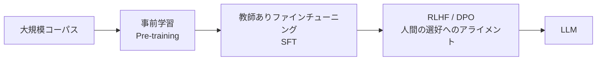

# PLM(事前学習言語モデル)からLLMへの発展

## 1. 概要

### A. 定義
> **PLM(Pre-trained Language Model)** とは、大規模コーパスで言語の一般的なパターンを**事前学習(Pre-training)** したうえで、個々のダウンストリームタスクに**ファインチューニング(Fine-tuning)** して活用する、転移学習ベースの言語モデル(BERT・初期GPT系列)をいう。

PLMの核心的な発想は、「**言語の一般知識を一度大きく学習しておき、タスクごとに少しだけ調整する**」という転移学習である。タスクごとにゼロからモデルを作っていた従来の方式とは異なり、膨大なテキストから得た文脈・文法・常識を再利用するため、少ないラベル付きデータでも高い性能を発揮する。

### B. PLMの特性
PLMを可能にした二つの柱は、**自己教師あり学習**と**Transformer**である。自己教師あり学習は、人がラベルを付けなくてもテキストそのものから学習シグナルを作り出す。BERTは文の一部を隠して当てる**MLM(Masked LM)** によって双方向の文脈を、GPTは次のトークンを予測する方式によって生成能力を獲得する。TransformerのSelf-Attentionは文中のすべてのトークン間の関係を並列に計算し、単語を固定された辞書的な意味ではなく、**文脈に応じて変化する動的な埋め込み**として表現できるようにする。

| 特性 | 内容 |
|---|---|
| **転移学習** | 事前学習→ファインチューニングの2段階構造で知識を再利用 |
| **自己教師あり学習** | MLM(BERT)・次トークン予測(GPT)によりラベルなしで学習 |
| **文脈埋め込み** | 単語を文脈に応じて動的に表現(多義語の処理) |
| **Transformer** | Self-Attentionに基づく並列学習により大規模化が可能 |

## 2. PLM → LLMの学習過程

LLMはPLMを単に大きくしたものではなく、事前学習の上に**アライメント(Alignment)** という新たな段階を載せることで完成する。事前学習を終えただけのモデルは次のトークンを上手につなげるにすぎず、「人が望む形で指示に従う」ことはしないからである。各段階の目的ははっきりと異なる。

| 段階 | 学習の特性 | 目的 |
|---|---|---|
| **事前学習(Pre-training)** | 自己教師あり(次トークン予測)で言語・世界知識を獲得、膨大なパラメータ・データ・計算量 | 知識・言語能力の土台の形成 |
| **教師ありファインチューニング(SFT)** | 人が作成した指示-応答(Instruction)データで学習 | 指示を理解し遂行する能力の付与 |
| **アライメント(RLHF/DPO)** | 人間の選好に基づく報酬モデル(RLHF)または選好ペアの直接最適化(DPO) | 有用・誠実・無害(HHH)な振る舞いへの整合 |

### A. 事前学習
数百億~数兆トークンのテキストで次のトークンを予測し、この過程で文法・事実・推論パターンがパラメータに圧縮される。コストの大部分はここで発生する。

### B. 教師ありファインチューニング(SFT)
「質問には答えを、要約の依頼には要約を」といった高品質な指示-応答の例で学習し、事前学習モデルを**指示に従うアシスタント**へと変える。

### C. アライメント(RLHF/DPO)
同じ質問に対する複数の回答を人が選好順に評価したデータで報酬モデルを作り、強化学習で最適化する(RLHF)か、選好ペアで方策を直接最適化する(DPO)。この段階が有害・虚偽の応答を抑制し、使い勝手を決定する。

## 3. スケーリング則(Scaling Law)と創発

LLMへの質的な飛躍を説明する鍵が、**スケーリング則**と**創発**である。パラメータ・データ・計算量を増やすと性能が予測可能な形で向上するが(Scaling Law)、興味深いことに、特定の臨界規模を超えると、小さなモデルにはなかった能力が**不連続的に発現(創発)** する。多段階の推論、そしてパラメータを変えずにプロンプト内の例示だけで新しいタスクを解く**In-context Learning**が代表的である。

| 概念 | 内容 |
|---|---|
| **Scaling Law** | パラメータ・データ・計算量の増加 → 損失の減少が予測可能 |
| **創発的能力(Emergent)** | 臨界規模以上で推論・In-context Learningなどが発現 |
| **In-context Learning** | 重みを更新せずにプロンプトの例示(Few-shot)でタスクを遂行 |

例えば、GPT-2規模ではわずかだった算術・推論能力が、GPT-3(数千億パラメータ)規模でFew-shotによって突如として有意なものになったことが、創発の実例である。

## 4. 考慮事項および活用
規模が大きくなるにつれ、能力とともにリスクも大きくなる。事実と異なる回答をもっともらしく生成する**ハルシネーション**、学習データの**バイアス**、意図とずれる**アライメントの失敗**は、アライメント段階とレッドチームによる検証で管理しなければならない。ドメインへの適用では、知識・形式を補強するために、全体の再学習の代わりに**PEFT(LoRAなどの軽量ファインチューニング)** で形式・能力を、**RAG** で最新・専用の知識を注入する組み合わせが標準である。コスト・遅延が問題となる現場では、量子化・知識蒸留で軽量化した**sLLM**をオンプレミスに配置する戦略が増えている。技術士の観点からは、「能力はファインチューニング、知識はRAG、安全はアライメント・ガバナンス」と役割を分担し、信頼性・コスト・セキュリティをバランスよく設計することが核心である。

---

> **一言まとめ**: PLMは*事前学習+ファインチューニングによる転移学習*モデルであり、これにSFTとRLHF/DPOによるアライメントを加えて規模を拡大すると、スケーリング則に従ってIn-context Learningなどの創発的能力を備えたLLMへと発展する。
