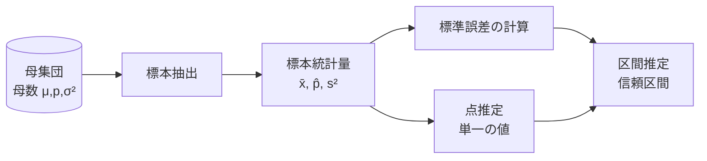

# 点推定(Point Estimation)と区間推定(Interval Estimation)

## 1. 概要

### A. 定義
> 母集団全体を調査できない場合に、**標本から計算した統計量によって母集団の母数(母平均 μ・母比率 p・母分散 σ² など)を推論**する方法が統計的推定である。このとき母数を一つの値として指し示すものが**点推定**、真値が入る範囲を確率的に提示するものが**区間推定**である。

推定が必要となる根本的な理由は、実際に知りたい対象は母集団であるにもかかわらず、時間・費用・物理的な制約のために全数調査がほとんど不可能だからである。たとえば全国の成人の平均労働時間を知ろうとしても数千万人をすべて調査することはできないため、数千人の標本の平均によって母平均を「見積もる」。このとき標本は抽出するたびに値が変わる**確率変数**であるため、推定には必然的に誤差が伴い、その誤差をどう扱うかが点推定と区間推定を分ける。

### B. 登場背景および必要性
点推定は「最ももっともらしい一つの値」を与えるため、直感的で計算・伝達が簡単であるという長所があるが、**その値がどれほど信頼できるか(誤差・信頼度)をまったく示せない**という致命的な限界がある。標本平均が47.2時間であるとき、それが真値とほぼ同じなのか、±5時間程度ずれうるのかは点推定だけではわからない。区間推定はまさにこの**不確実性の大きさまで併せて表現**するために登場した。意思決定者は「平均が47.2」よりも「95%信頼水準で45.8~48.6の間」という情報から、はるかに安全な判断を下すことができる。

## 2. 統計的推定の処理フロー

推定は、母集団から無作為標本を抽出して標本統計量を計算するところから始まる。この統計量自体が点推定値であり、これに**標準誤差(推定量の標準偏差)** を組み合わせて誤差限界を付けると区間推定になる。つまり区間推定は点推定を中心に置き、左右に不確実性の幅を加えた拡張であって、互いに無関係な別個の方法ではない。

## 3. 点推定と良い推定量の条件

点推定は、標本平均 x̄ で母平均 μ を、標本比率 p̂ で母比率 p を推定するように、母数に対応する統計量をそのまま推定値とする。問題は、同じ母数を推定する統計量が複数ありうるという点である(平均 vs 中央値)。そのため「**良い推定量**」を選ぶ基準が必要であり、代表的なものとして次の四つがある。

| 条件 | 意味 | なぜ重要か |
|---|---|---|
| **不偏性(Unbiasedness)** | 推定量の期待値 = 母数 (E[θ̂]=θ) | 系統的な偏り(バイアス)がなく平均的に正しい |
| **有効性(Efficiency)** | 分散が最小 | 同じ不偏推定量なら揺らぎが小さいほど精密 |
| **一致性(Consistency)** | n↑ で母数に収束 | 標本を大きくすれば正解に近づく |
| **十分性(Sufficiency)** | 標本のすべての情報を活用 | 情報の損失なく推定 |

核心は**不偏性と有効性の調和**である。バイアスがなくても値が大きく揺らげば(分散が大きければ)信頼できず、逆に分散が小さくても一方に偏っていれば(バイアス)系統的に誤る。たとえば標本分散を計算する際に n ではなく **n-1 で割る理由**はまさに不偏性の確保にある。n で割ると母分散を系統的に過小推定するため、自由度 n-1 で補正して E[s²]=σ² となるようにする。それでも点推定は「この値がどれほど正確か」という問いには沈黙する。

## 4. 区間推定と信頼区間

区間推定は、母数が含まれると期待される**信頼区間(Confidence Interval)** を信頼水準とともに提示する。母平均の信頼区間は次の形をとる。

> **信頼区間 = 点推定値 ± (臨界値 × 標準誤差)**、例: μ の95% CI = x̄ ± 1.96 · (σ/√n)

ここで標準誤差 σ/√n は標本平均が標本ごとにどれほど散らばるかを表し、臨界値(95%なら1.96)は信頼水準に対応する分布上の境界である。よく誤解されるのは信頼水準の解釈である。「95%信頼区間」は「真値がこの区間に入る確率が95%」という意味**ではなく**、「**同じ方法で標本抽出と区間計算を無限に繰り返すと、そのうち約95%の区間が真値を含む**」という手続きの信頼度を意味する。真値は固定されており、揺らぐのは区間のほうだからである。

臨界値として z(正規分布)を使うか t(t分布)を使うかは状況による。**母分散 σ² が既知であるか標本が十分に大きければ(おおむね n≥30)** 中心極限定理に依拠して z 分布を使うが、**母分散が未知で標本が小さければ**、標本標準偏差 s で代替することで生じる追加の不確実性を反映するため、裾の厚い**t分布**を使う。具体的に n=25、x̄=50、s=10 であれば自由度24の t 値(約2.064)を用いて 50 ± 2.064·(10/5) = 50 ± 4.13、すなわち45.87~54.13が95%信頼区間となる。

## 5. 点推定 vs 区間推定の比較

両方法は競合関係ではなく、**情報量が異なる補完関係**である。点推定は区間推定の中心値を提供し、区間推定はその中心に信頼度という衣をまとわせる。

| 区分 | 点推定 | 区間推定 |
|---|---|---|
| 結果の形態 | 単一の値 | 区間(下限~上限) |
| 提供する情報 | 推定値のみ | 推定値 + 信頼度・誤差 |
| 精度の表現 | なし | 信頼水準・区間幅で表現 |
| 表現の強み | 簡潔・直感的 | 不確実性まで伝達 |
| 相互関係 | 区間の中心 | 点推定 ± 誤差限界 |

区間幅を決める二つの軸は**信頼水準と標本サイズ**である。信頼水準を95%から99%に上げると、より確実に真値を含めるために区間が広がって精度が落ちる**トレードオフ**が生じる。逆に標本サイズ n を大きくすると、標準誤差 σ/√n が √n に反比例して小さくなり、**区間幅が狭まって精度が上がる**。すなわち「より確実に(信頼水準↑)」と「より精密に(区間幅↓)」を同時に得るには、結局より多くの標本を確保するしかない、というのが区間推定がもたらす実務的な洞察である。

## 6. 考慮事項および示唆点
- **不確実性の定量化**: 区間推定は推定の誤差・信頼度まで表現するため、単なる数値よりもリスクを反映した意思決定に有利である。政策・品質管理のように判断の根拠が重要な領域で特に有効である。
- **分布・仮定の点検**: 正規性・標本サイズ・母分散の既知/未知に応じて z/t を正しく選択すべきであり、仮定が崩れる場合はノンパラメトリック・ブートストラップ方式で区間を求める。
- **AI・データ分析との連携**: モデル性能指標(正解率・AUC)の信頼区間、A/Bテストの効果区間、予測の不確実性の定量化などに直接活用され、「点予測」を超えて信頼できる意思決定を支援する。

---

> **一言まとめ**: 点推定は*母数を不偏・有効な推定量一つで*簡潔に示すが誤差情報を与えられず、区間推定は*点推定 ± (臨界値×標準誤差)* によって信頼水準とともに範囲を提示し不確実性まで表現する。両方法は標本サイズ・信頼水準が精度を左右する相互補完の関係である。
