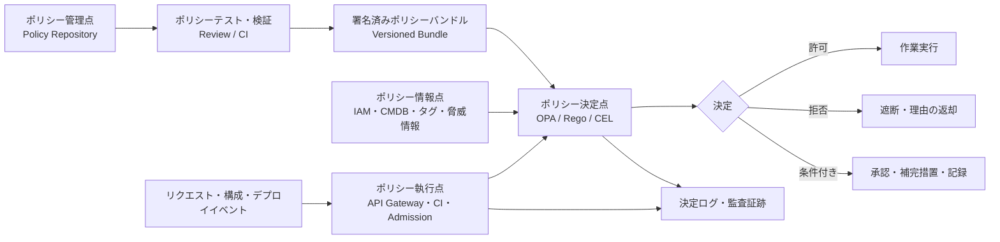
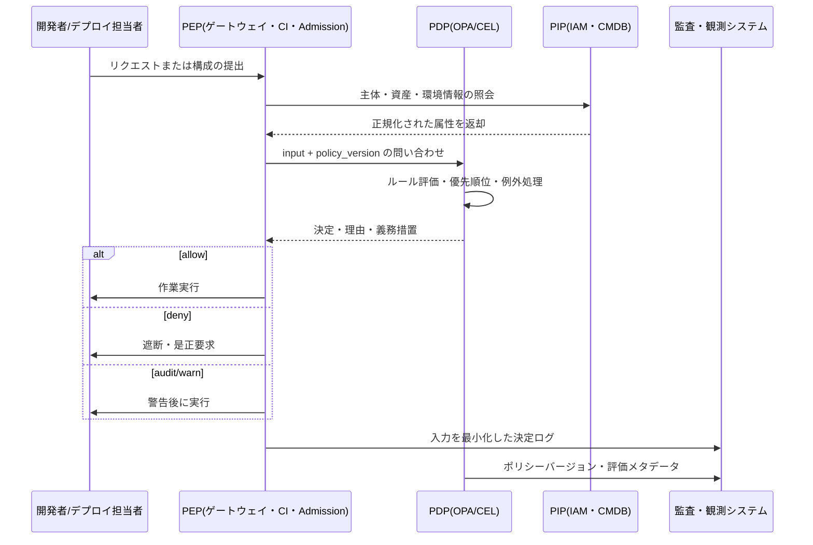

# ポリシーのコード化(Policy as Code)と実行型ガバナンス

## 1. 概要

> ポリシーのコード化(Policy as Code)とは、組織のセキュリティ・コンプライアンス・運用ルールを人が読む文書だけにとどめず、バージョン管理・検証・デプロイ・実行が可能な機械可読のコードとして表現するアプローチである。

企業の情報化環境は、クラウド、コンテナ、API、IaC、CI/CD に分散している。したがって「運用者はセキュリティ基準を遵守しなければならない」という宣言だけでは、実際のデプロイを統制することは難しい。たとえば、インターネットに公開されるサービスは TLS を使用しなければならず、コンテナイメージは承認されたレジストリから取得しなければならず、個人情報を含むデータストアは暗号化しなければならない。これらのルールを Wiki やチェックリストにのみ記録すると、点検の時期と担当者によって結果が変わってしまう。

ポリシーのコード化は、ポリシーをソースコードのように扱う。要件を条件と効果に分解し、ルールをリポジトリ上でレビューし、自動テストとシミュレーションを通過したポリシーだけを実行環境へデプロイする。ポリシーをアプリケーションコードに散在させず、独立した決定ポイントとして分離すれば、ポリシー変更と機能変更のライフサイクルを独立して運用できる。

代表的なポリシーエンジンである OPA(Open Policy Agent)は、宣言型ポリシー言語 Rego とポリシー問い合わせ API を提供する。OPA の公式ドキュメントは、OPA がポリシーの決定と執行を分離し、マイクロサービス・Kubernetes・CI/CD パイプライン・API ゲートウェイなど複数の層で利用できると説明している。すなわち OPA が「許可・拒否」あるいは構造化された判断を返し、呼び出したシステムがその判断を実際の遮断・許可・修正として執行する構造である。

ポリシーのコード化の目的は統制の強化だけではない。同一のルールを開発・検証・デプロイ・運用の各段階で繰り返し適用し、誰がいつどのような根拠でルールを変更したかを追跡することで、スピードと監査可能性を同時に確保することが核心である。

### 1.1 登場背景と必要性

第一に、インフラの生成速度が人による事前レビューの速度を上回った。開発者は Terraform でネットワークやデータベースを数分で作成できるのに、セキュリティ担当者の手動承認を待っていてはボトルネックになる。ポリシーをパイプラインの自動検査に移せば、迅速な変更を許容しつつ最低限の基準を守ることができる。

第二に、同一の業務ルールが複数のツールに重複する。イメージの取得元制限を CI で一度、クラスタの入口で一度、運用監査で一度実装すると、ツールごとの表現の差や漏れが生じる。共通のポリシーモデルと決定インタフェースを置き、各執行ポイントにアダプタを置くほうが一貫性の管理に有利である。

第三に、規制と監査は結果だけでなく根拠を求める。ポリシーファイルのコミット、レビュー承認、テスト結果、デプロイバージョン、決定ログを結び付ければ、「なぜこのリクエストが遮断されたのか」を再現できる。ただし決定ログに個人情報や秘密値をそのまま残すと新たなリスクとなるため、入力の最小化とマスキングが必要である。

### 1.2 主要用語

| 用語 | 意味 | 技術士答案における観点 |
|---|---|---|
| ポリシー(Policy) | 守るべきルールと例外、適用範囲 | 業務要件を条件・効果として形式化 |
| ポリシー決定点(PDP) | 入力を評価して決定を返す構成要素 | OPA のような判断エンジンの分離 |
| ポリシー執行点(PEP) | 決定に従い許可・拒否・修正を行う地点 | API ゲートウェイ、CI、API サーバなど |
| ポリシー管理点(PAP) | ポリシーの作成・レビュー・承認・デプロイを管理する体系 | リポジトリと承認ワークフロー |
| ポリシー情報点(PIP) | 決定に必要なユーザー・資産・環境情報を提供 | IAM、CMDB、タグ、脅威情報との連携 |
| ポリシーバンドル | ポリシーと参照データをまとめてデプロイする単位 | 完全性・バージョン・ロールバックの基準 |
| 観察モード | 遮断せずに違反を測定・記録する運用モード | 段階的導入と誤検知の調整 |

ポリシーは単なる if 文ではなく、決定のコンテキストを含む。主体、行為、対象、環境、時間、リスク度、データ分類が入力に入り、結果も allow/deny の一つで終わるとは限らない。たとえば「許可するが理由を記録し、管理者の承認を求めよ」のように、義務措置と説明を併せて返すことができる。

## 2. ポリシーのコード化の構成原理と概念図

### 2.1 ポリシーの決定と執行の分離

ポリシー決定点は「このリクエストはルールを満たしているか」を判断し、ポリシー執行点は「判断結果をどの技術的動作に移すか」を担う。この分離を守れば、同じポリシーを HTTP API、メッセージコンシューマ、IaC 検査、Kubernetes Admission で再利用できる。

逆にアプリケーションごとに権限ロジックを直接実装すると、サービスごとに解釈が異なってくる。あるサービスは管理者ロールだけを確認し、別のサービスはリソース所有者まで確認するといった形でポリシーが分裂する。PDP は共通の判断を提供し、PEP が自らのプロトコルと失敗処理に合わせて実行するよう、境界を明確にする。

上記の構造において PAP はコードリポジトリと承認手続きを意味する。単にポリシーファイルを中央に集めるだけでは十分ではなく、変更理由と適用範囲を併せて管理しなければならない。CI は構文検査、単体テスト、回帰テスト、性能テスト、禁止された関数や範囲超過の有無の検査を行う。

PIP はポリシーが外部の事実を必要とする場合に重要である。ユーザーのロール、資産の所有組織、データの機微度、イメージの署名状態が信頼できるデータとして入ってこなければ、PDP の決定も正確にはなり得ない。したがって PIP データの出所・更新周期・鮮度・権限をポリシーの前提条件として管理する。

### 2.2 ポリシーの入力・決定・効果モデル

ポリシー入力は JSON のような構造化されたリクエストに正規化する。一般に `subject`、`action`、`resource`、`context` を基本軸とし、クラウドではアカウント・リージョン・タグ・ネットワーク位置を、個人情報処理ではデータ分類・目的・保存期間を追加する。

決定には最低限 `allow` と `deny` を含めるが、運用に必要な説明も併せて持たせる。`reason`、`obligations`、`matched_rules`、`policy_version`、`risk_score` を含めれば、PEP と監査システムが同一の判断結果を活用できる。

効果(effect)は遮断だけを意味しない。値をデフォルト化する mutate、警告を残す warn、レビューキューに送る require-approval、事後検査の対象として表示する audit を区別しなければならない。効果を混在させると、利用者は「なぜデプロイは成功したのに後で違反として検出されたのか」を理解しにくくなる。

このフローにおいて、PEP が PIP を直接呼び出すか PDP が呼び出すかは、配置とセキュリティ境界によって決まる。レイテンシが重要な API リクエストでは短い TTL のキャッシュを使用するが、権限取り消しのようなイベントがキャッシュに残らないよう無効化戦略を設ける。一方、高リスクのデータアクセスでは最新の属性確認を優先し、キャッシュを制限することができる。

### 2.3 宣言型ルールとポリシー言語

宣言型ポリシーは「どのようにプログラムを実行するか」よりも「どのような状態が許可されるか」を表現する。これにより、ポリシー作成者はインフラの実装詳細をすべて知らなくても統制目標を記述できる。ただし宣言型であるからといって曖昧さが自動的に消えるわけではないため、用語辞書と入力スキーマが必要である。

OPA の Rego は、階層的な構造データを対象にルールを定義する宣言型言語である。OPA は入力を評価して構造化された結果を返し、HTTP API・CLI・ライブラリなどから照会できる。アプリケーションが判断ロジックを直接持たず、OPA に決定を委任することが核心である。

Kubernetes では、Admission 段階でオブジェクトの作成・変更・削除リクエストをポリシーで検査できる。API サーバが Admission Review を OPA に送信し、応答を受けてリクエストを許可または拒否する方式であり、複数の Admission Controller のうち一つでも拒否すればリクエスト全体が拒否される「拒否優先」の特性を考慮しなければならない。

Kubernetes の宣言型 Admission Policy は、Webhook とは異なり API サーバ内部で CEL(Common Expression Language)を評価する方式も提供する。公式ドキュメントによれば、`ValidatingAdmissionPolicy` は制約の検証に、`MutatingAdmissionPolicy` はアドミッション時のオブジェクト変更に使用し、ポリシーオブジェクトとは別のバインディングオブジェクトで対象と範囲を結び付ける。

## 3. 適用領域と実装手順

### 3.1 SDLC・CI/CD ポリシー

開発段階では、秘密鍵がソースに含まれていないか、ライセンスが承認リストにあるか、依存関係の脆弱性基準を超えていないかを検査する。この段階のポリシーは迅速なフィードバックが重要であるため、コミット・プルリクエストごとに実行し、失敗したルールと修正例を開発者に提供しなければならない。

ビルド段階では、成果物の出所、ビルドツールのバージョン、依存関係リスト、テスト合格の有無を評価する。ポリシーは「脆弱性が一つでもあれば無条件に失敗」のように単純ではなく、深刻度・悪用可能性・露出範囲・緩和措置・例外の有効期限を併せて考慮しなければならない。

デプロイ段階では、承認済みイメージレジストリ、署名または証明(attestation)、最小権限のサービスアカウント、ネットワーク境界、リソースの要求・制限を確認する。GitHub の公式ドキュメントは、Sigstore Policy Controller を使用して有効なアーティファクト証明を持つイメージだけをデプロイするよう構成できると説明している。こうしたサプライチェーンポリシーは、イメージがどこでどのようにビルドされたかを利用者が確認する根拠となる。

ポリシーはパイプラインの一段階にのみ置くものではない。デプロイ前に検査していても実際のクラスタで手動変更やドリフトが生じうるため、Admission と定期監査で再検証する。事前検査と実行時検査のルールが互いに異なると統制の空白が生じるため、同一ポリシーまたは意味的に同等のポリシーを使用する。

### 3.2 IaC・クラウドガバナンス

Terraform、CloudFormation、Kubernetes マニフェストのような IaC は、実際のインフラ状態を作る前にポリシー入力へ変換できる。パブリックオブジェクトストレージの公開設定禁止、暗号鍵の指定、許可リージョンの制限、最低限のタグ付与、過度な権限付与の禁止などを計画段階で検査する。

計画(plan)時点の利点は、変更を遮断する前に開発者が差分を確認できる点である。一方、実際のリソースに適用された後の状態や外部システムが提供する属性をすべて知ることはできないという限界がある。したがって plan 検査、apply 権限の統制、定期的な drift 検査、クラウドイベントに基づく再評価を組み合わせる。

ポリシー入力にはアカウント・組織・環境情報を含めなければならない。同じデータベースでも、開発アカウントではテスト用の公開アクセスが許可されうるが、本番アカウントでは禁止されうる。こうした例外はコードにハードコーディングするよりも、環境属性と有効期限を持つ明示的な例外オブジェクトとして管理する。

### 3.3 API・マイクロサービスの認可

API 認可は認証の成否とは異なる。認証は主体が誰であるかを確認し、ポリシーはその主体が特定のリソースに対して特定の行為を行えるかを判断する。ポリシー入力にユーザー・サービス・リソース所有者・HTTP メソッド・リクエスト元・時間・リスクシグナルを入れ、きめ細かな決定を下す。

RBAC はロールに権限を付与するため運用は単純だが、ロールの爆発と過剰権限の問題が生じる。ABAC は属性の組み合わせで柔軟性を確保するが、属性の品質とポリシーの複雑さが重要になる。ポリシーのコード化は両モデルを競合させるよりも、基本ロールは RBAC とし、高リスク行為・データ等級・環境条件は ABAC で補完する形で活用できる。

実行時にはデフォルト拒否(default deny)を原則とする。ポリシーエンジン障害時にリクエストを許可する fail-open は可用性は高いがセキュリティリスクが大きく、すべてのリクエストを拒否する fail-closed は安全だが障害の波及が大きい。業務の重要度とデータの機微度に応じて動作を区分し、障害時にも監査可能な代替経路を用意しなければならない。

### 3.4 Kubernetes Admission とランタイム

Admission は、API サーバに入ってくるリソースを保存する前に検査する境界である。検証ポリシーは条件を満たさないリクエストを拒否し、変更(mutation)ポリシーはデフォルトのラベル・セキュリティコンテキスト・リソース値を補完できる。変更のみを使用すると、利用者が明示した危険な値まで自動的に安全な値へ変わると誤解されかねないため、変更の後に検証を連結しなければならない。

Pod Security Admission は Kubernetes に組み込まれたポリシー執行機能であり、`privileged`、`baseline`、`restricted` の分離レベルを名前空間に適用する。`enforce` は違反 Pod を拒否し、`audit` は監査イベントに記録し、`warn` は利用者に警告するがリクエストは許可する。段階的導入では warn と audit で現状を把握した後、リスクの低い名前空間から enforce へ切り替える。

Webhook ベースのポリシーエンジンは拡張性に優れるが、ネットワーク遅延、証明書の期限切れ、エンドポイント障害、再帰呼び出しを考慮しなければならない。API サーバとポリシーエンジン間の TLS、タイムアウト、失敗ポリシー、高可用性、ポリシーキャッシュを運用基準として定義する。すべてのリクエストをリモートエンジンに送る構造であれば、大規模デプロイ時にボトルネックとなりうるため、評価レイテンシと同時実行性を測定する。

### 3.5 データ・個人情報保護

データポリシーは、誰がどの目的でどの項目をどのくらいの期間処理できるかを表現する。データ分類、処理目的、保存期間、国外移転の有無、マスキングの必要性、廃棄状態を属性として正規化すれば、ETL・API・分析プラットフォームで同じ判断を再利用できる。

ポリシーはデータガバナンスのカタログと連携しなければならない。カタログに機微度と所有者がなければポリシーエンジンは入力を受け取れず、入力が古くなれば誤った許可や過剰な遮断が発生する。データ品質・リネージ・所有権をポリシー情報の信頼性指標として管理しなければならない。

決定ログには、元の個人情報の代わりに識別子ハッシュ、データ等級、目的コード、ポリシーバージョンのような最小限の情報のみを残す。ログへのアクセス自体も別のポリシーの対象であり、保存期間を過ぎれば廃棄または集計する。ポリシーのコード化が個人情報保護を自動的に保証するわけではなく、最小収集と目的制限を実行可能なルールへ移す手段であることを明確にする。

## 4. ポリシーのライフサイクルと運用ガバナンス

### 4.1 要件を実行ルールへ変換

ポリシーを作成する前に、自然言語の要件を主体・行為・対象・条件・効果に分離する。「重要システムは安全に運用する」という文を、「本番アカウントにおけるパブリックオブジェクトストレージ作成リクエストは、暗号鍵があり公開 ACL がない場合にのみ許可する」のように判定可能な文へ書き換える。

各ポリシーには、適用範囲、例外条件、違反メッセージ、担当者、リスク度、施行日、有効期限を併せて持たせる。例外のないポリシーは現実には迂回されやすく、期限のない例外は恒久的な脆弱性となる。例外を別個の承認オブジェクトとし、変更履歴と終了条件を追跡する。

### 4.2 テストと検証

ポリシーテストには、正常な許可、明白な拒否、境界値、属性の欠落、悪意ある入力、例外の期限切れ、ポリシーの競合を含めなければならない。単一の例だけを通過するポリシーは、運用データの多様性を反映できない。入力スキーマを固定し、スキーマ変更時には後方互換性の検査を実行する。

回帰テストでは、既存で許可されていた業務が新しいポリシーによって中断されないかを確認する。逆に、既存ポリシーが新たな攻撃経路を許していないかもテストする。ルールのカバレッジと実際の違反発生率を測定し、「テストが多い」が「統制が十分である」と同じではないことを管理する。

ポリシーの性能も品質項目である。API 認可では評価レイテンシ、バンドルのロード時間、キャッシュヒット率、同時リクエスト処理量を測定し、Admission では大量デプロイや API サーバ再起動時の安定性を測定する。ポリシーが複雑になるほど、性能と説明可能性のバランスを取らなければならない。

### 4.3 デプロイ・承認・ロールバック

ポリシーのデプロイはアプリケーションのデプロイと分離するが、同一の変更管理原則に従う。コードレビュー、自動テスト、セキュリティ担当者の承認、署名済みバンドルの生成、対象環境へのデプロイ、結果の観察の順に進める。ポリシーバージョンは決定ログに記録し、特定のリクエストがどのルールで評価されたかを再現できるようにする。

最初から遮断モードで適用すると、業務の中断や迂回が発生しうる。観察モードで違反を収集し、影響度と誤検知を分析した後、一部環境での警告モードと限定的な強制モードを経て全社に適用する。ただし、認証回避や高リスクデータの流出のように即時遮断すべきルールには例外的な緊急経路を設ける。

ロールバックは、以前のポリシーバンドルを再デプロイする方式で実装する。ロールバック権限は運用者単独の権限とせず、事後承認と理由の記録を求める。ポリシーのロールバックがアプリケーションの安全でない状態を再び許可しうるため、禁止ルールの最小集合は別の保護領域として管理する。

### 4.4 モニタリングと監査

ポリシー運用の指標は、許可・拒否の件数だけでは不十分である。ポリシー別の違反率、例外使用率、警告後の修正率、決定レイテンシ、PDP エラー率、バンドルバージョンの分布、ポリシー未適用の資産数を併せて見る。指標が急激に変化した場合は、ポリシー変更の誤りと攻撃活動を区別して調査する。

拒否メッセージは開発者が修正できる程度に具体的であるべきだが、内部構造や機微な情報が露出してはならない。利用者にはルール ID・違反属性・是正方法を提供し、内部ログには相関 ID と完全な診断情報を保管する。

監査は、ポリシーコード、レビュー承認、テスト結果、デプロイ時刻、適用対象、決定ログ、例外承認までを結び付けなければならない。そうすれば統制の設計と実際の運用効果を併せて証明できる。ポリシーファイルだけを保管して執行ログを残さなければ、実行型ガバナンスではなく文書化された意図にとどまる。

## 5. 比較・事例・出題との連携

### 5.1 類似アプローチとの比較

| 区分 | 従来の文書ポリシー | アプリケーション組み込みルール | Policy as Code |
|---|---|---|---|
| 表現 | 自然言語・チェックリスト | サービスごとのソースコード | 宣言型ポリシーコード |
| 変更追跡 | 手動の文書履歴 | アプリケーションリリースに従属 | リポジトリのレビュー・バージョン・承認 |
| 適用時点 | 事後点検中心 | 当該サービスの実行時点 | 開発・デプロイ・実行・監査の全段階 |
| 再利用性 | 解釈に依存 | サービス間で低い | 共通 PDP とアダプタにより高い |
| 失敗リスク | 担当者によるばらつき | ポリシーの重複・漏れ | 中央障害・ポリシーの複雑さ |
| 主な補完策 | 点検の自動化 | 共通ライブラリ | テスト・観察・ロールバック・高可用性 |

文書ポリシーは、組織の目的と原則を説明することに強い。法的解釈、例外承認、倫理的判断のように完全な自動化が難しい部分を盛り込める。しかし文書だけでは、すべてのシステムに同一に適用されたことを証明するのは難しい。

アプリケーション組み込みルールはドメインのコンテキストを深く理解するが、サービスが増えるほど重複と不整合が大きくなる。Policy as Code は共通ルールを分離して一貫性を高めるが、あらゆる業務上の意味を中央のポリシーエンジンに入れると、ポリシーリポジトリが巨大なモノリスになりうる。共通のセキュリティ基準とドメイン固有の判断の境界を設計しなければならない。

### 5.2 事例: コンテナサプライチェーンとクラスタへのデプロイ

仮想の金融プラットフォームが、コンテナを Kubernetes の本番クラスタにデプロイすると仮定する。組織のポリシーは、承認済みレジストリの使用、署名またはビルド証明の確認、`restricted` レベルの Pod セキュリティ、CPU・メモリ要求の指定、本番名前空間でのパブリックサービスの禁止である。

第一段階で、CI はマニフェストとイメージのメタデータを検査する。未承認のレジストリ、証明のないイメージ、privileged コンテナ、リソース制限の欠落を警告または失敗として表示する。このとき開発者が修正できるよう、ファイルパス、ルール ID、是正例を提供する。

第二段階で、クラスタの Admission が同一の主要ルールを再検証する。CI を迂回した手動適用や別のパイプラインからのリクエストも、同じ境界を通過しなければならないからである。サプライチェーンの証明を検査する Policy Controller は、イメージの証明と信頼ルートを確認してデプロイ可否を判断できる。

第三段階で、運用監査は実際のオブジェクトとポリシーの期待値を比較する。ポリシーが変わった場合や既存リソースが手動で変更された場合を見つけ、是正チケットを生成する。すなわち事前検査、アドミッション統制、事後監査を連結し、単一の統制の失敗が保護全体の失敗につながらないようにする。

この事例の核心は「すべてを遮断する」ことではない。新規アプリケーションは強制モードで、レガシーの名前空間は観察・警告モードで開始し、リスク度と修正率に応じて段階的に切り替える。例外には、サービスオーナー、理由、補完統制、有効期限を含める。

### 5.3 技術士答案の構成戦略

論述型答案では、まず Policy as Code の定義と登場背景を提示し、文書ポリシーと実行ポリシーのギャップを問題として提起する。続いて PDP・PEP・PAP・PIP の構成図と入力-決定-効果のフローを示せば、概念の体系性が明らかになる。

本論では、SDLC、IaC、API 認可、Kubernetes Admission、データ保護のうち三つ以上を選び、適用時点と統制効果を説明する。各適用領域ごとに単なるツール紹介ではなく、どのポリシーをどの入力で評価し、違反時にどのような効果を生じ、どのようなログを残すかを記述する。

最後に、テスト・観察・例外・ロールバック・高可用性・個人情報最小化のトレードオフを技術士の観点で整理する。「自動化すれば安全である」と結論付けるのではなく、ポリシーの品質、入力データの信頼性、運用障害、責任の所在まで言及してこそ深化した答案となる。

## 6. 深化: 実行型ガバナンスの発展方向

ポリシーのコード化は、セキュリティチームだけのルールリポジトリではなく、組織の実行型ガバナンス基盤へと拡張しうる。コストタグの欠落、リージョン制限、データ保存期間、モデルの利用条件、アーキテクチャ標準を同じライフサイクルで管理すれば、技術標準と経営目標をデプロイプロセスに結び付けることができる。

ただしポリシーが増えると、相互の競合とポリシー疲れが発生する。組織ポリシー、事業部ポリシー、環境ポリシー、サービス例外の優先順位を明示し、競合時に拒否・上位ポリシー優先・管理者承認のいずれの戦略を採るかを決定する。ポリシーグラフと影響分析によって変更前に影響を予測することも必要である。

AI エージェントや自動化ワークフローでは、主体が人だけでなくモデル・エージェント・サービスアカウントとなる。リクエストを実行した主体、委任チェーン、ツール呼び出し、データの目的、人による承認の有無を入力に含めなければならず、単純なユーザーロールだけでは不十分である。高リスクな行為には、最小権限・短いトークン寿命・明示的な承認・行為の記録を組み合わせる。

ポリシー決定が分散した環境では、決定の一貫性が重要である。地域ごとの PDP が異なるバンドルを使用すると、同じリクエストが異なる結果を生みうるため、バンドルハッシュ、有効時刻、デプロイ状態を観測する。ネットワークが断絶したエッジ環境では、最後に承認されたポリシーを限定期間使用するか、セーフモードへ切り替えるかを事前に定めておく。

ポリシーコード自体もサプライチェーン保護の対象である。ポリシーリポジトリのブランチ保護、署名付きコミット、レビュアーの分離、テストデータからの秘密情報の除去、バンドル署名、デプロイ対象の検証を適用する。攻撃者がポリシーを変更すれば、アプリケーションの脆弱性を修正しなくても統制を無力化できるからである。

## 7. 考慮事項および示唆点

### 7.1 ポリシーの品質と曖昧さ

自然言語のポリシーをそのままコードへ移すと、曖昧な例外と責任の空白が残る。まず用語、属性、許可範囲、禁止範囲、例外、有効期限について業務担当者と合意し、判定可能なテストケースとして作成する。

### 7.2 入力データの信頼性

PDP が正確でも、IAM ロール、資産タグ、データ分類が誤っていれば誤った決定を下す。属性の出所・最終更新時刻・所有者を管理し、重要な属性が欠落した場合の安全なデフォルト値とアラートを定義する。

### 7.3 可用性と失敗処理

中央のポリシーエンジンは共通の統制点であるため、高可用性、地域分散、キャッシュ、タイムアウト、障害分離を設計する。fail-open と fail-closed のいずれかを全社共通で固定するのではなく、業務・データのリスク度別に決定する。

### 7.4 段階的な強制とユーザー体験

ポリシー違反をすべて即時に遮断すると、現場はポリシーを迂回しようとする。観察→警告→部分強制→全面強制の段階と切り替え基準を定め、違反メッセージと自動修正方法を提供してポリシーを開発者体験に統合する。

### 7.5 例外と説明責任

例外は現実的な運用上の仕組みであるが、恒久的な迂回路へと変質しやすい。承認者、理由、リスク受容者、補完統制、有効期限、再レビュー周期を必須フィールドとし、期限間近の例外を自動通知する。

### 7.6 個人情報と監査ログ

ポリシー決定ログは監査に有用だが、入力全体を複製すると個人情報の侵害となる。目的に必要な最小限の属性のみを保存し、機微なフィールドはトークン化・マスキングし、ログの閲覧権限と保存期間もポリシーで統制する。

### 7.7 標準化とドメインの自律性

全社共通のセキュリティ基準は中央集権化するが、業務ドメインの詳細ルールまで一つのチームが独占するとボトルネックとなる。ポリシーインタフェースと共通属性モデルを標準化し、ドメインチームが所有するポリシーを中央ガバナンスが検証する連合モデルが現実的である。

### 7.8 成果の測定

ポリシー数やコード行数を成果とすると、複雑さが増すだけである。遮断した高リスク変更、ポリシー違反の修正時間、例外の減少率、監査証跡の準備時間、ポリシー評価レイテンシ、障害による業務中断を併せて測定し、統制と生産性のバランスを確認する。

## 参考資料

- Open Policy Agent, “Open Policy Agent (OPA) and policy-as-code” — https://openpolicyagent.org/docs
- Open Policy Agent, “OPA for Kubernetes Admission Control” — https://www.openpolicyagent.org/docs/kubernetes
- Kubernetes, “Pod Security Admission” — https://kubernetes.io/docs/concepts/security/pod-security-admission/
- Kubernetes, “Explore Validating and Mutating Admission Policies” — https://kubernetes.io/docs/tutorials/cluster-management/admission-policies/
- GitHub Docs, “Kubernetes admissions controller” — https://docs.github.com/en/actions/concepts/security/kubernetes-admissions-controller

---

> **一言まとめ**: ポリシーのコード化とは、ポリシーを宣言型コードとしてバージョン管理・検証・デプロイし、PDP の判断と PEP の執行を結び付けることで、セキュリティ・コンプライアンス・運用ガバナンスを開発からランタイムまで反復可能にする実行型の統制方式である。
