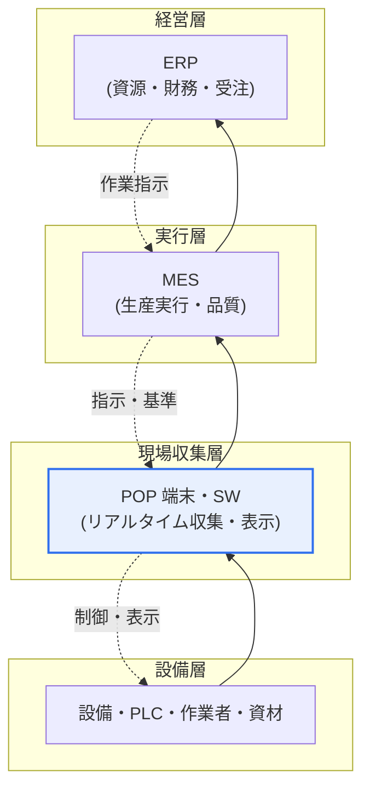
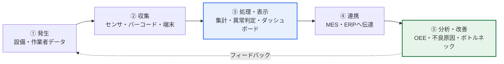

# POP(Point Of Production, 生産時点管理)

## 1. 概要

### A. 定義

> **POP(Point Of Production, 生産時点管理)** とは、生産現場で発生する情報を**発生時点(real-time)と発生場所(on-site)で即座に収集・処理**し、生産管理に活用するシステムである。小売の販売時点を管理する POS(Point Of Sales)の生産版に相当し、現場の設備・作業者と上位の情報システムを結ぶデータ収集層である。

POP の核心的な価値は「生産現場のリアルタイムな可視性(shop-floor visibility)の確保」である。かつての工場では、作業者が紙の作業日報に生産実績と不良を手書きし、それを1日あるいは1シフトが終わった後に事務所で一括入力していた。この方式では、管理者が「今この瞬間」ラインがどう動いているのか、どの工程で不良がどれだけ出ているのかを知る方法がなかった。問題に気づいたときにはすでに不良が大量発生した後であり、対応は常に事後的であった。

POP はこの遅延と不正確さを根本的に解消する。設備・作業者・資材から出るデータ、すなわち生産量・稼働状態・不良・作業時間といった情報を、それが発生したまさにその瞬間、その場所で自動的に収集する。そうすれば管理者は現場をリアルタイムのダッシュボードで把握し、異常が生じた直後に対応でき、人の記憶や筆跡ではなく機械が記録した正確なデータで生産性・品質を管理できるようになる。要するに POP は「見えなかった現場を見えるようにする」層であり、このリアルタイムで正確なデータがあってこそ、その上の MES・ERP が信頼できる判断を下せる。

### B. 登場背景と必要性

製造業の競争軸が大量生産から多品種少量生産・短納期・厳格な品質へと移るにつれ、現場を事後に整理する管理方式では市場への対応が不可能になった。手書き・事後入力は三つの慢性的な問題を抱えていた。第一に、データが不正確であった(誤記・漏れ・推定記入)。第二に、データが遅れるためリアルタイムの意思決定に使えなかった。第三に、設備稼働率・不良原因のような細かなデータを人が逐一記入するのは困難であった。

これにスマートファクトリー・デジタルトランスフォーメーションの流れが重なり、現場データをリアルタイムに確保して生産性・品質・納期を同時に改善しようとする要求が強まった。POP はまさにこの要求への答えであり、現場の最前線でデータを自動収集して上位システムへ正確に供給する役割を担う。すなわち POP の必要性は単なる自動化ではなく、データに基づく生産管理(data-driven manufacturing)の出発点を用意することにある。

## 2. システム構成と階層上の位置

POP は、現場の設備・作業者からデータを収集するハードウェア端末と、それを処理・表示・伝達するソフトウェアで構成され、上位の MES(製造実行システム)・ERP と連携する。自動化ピラミッドにおいて POP は最下位のデータ収集・現場インタフェース層に位置し、物理設備(センサ・PLC)と情報システムの橋渡し役を果たす。

上図のとおり、データは下から上へ(現場実績 → MES → ERP)流れ、指示は上から下へ(受注・計画 → 作業指示 → 現場表示)降りてくる。POP はこの双方向の流れの最前線の接点であり、上へは正確な実績データを上げ、下へは作業指示・品質基準を現場に表示する。

構成要素をもう少し具体的に見ると次のとおりである。入力装置は、バーコード・QR・RFID リーダ、タッチスクリーン端末、そして設備に直接接続されるセンサ・PLC の信号線から成る。作業者が作業指示書のバーコードを読み取って作業開始を知らせ、完成品数量をタッチで入力し、設備の稼働/停止信号はセンサが自動で捉える。POP ソフトウェアはこうして入ってきた信号をリアルタイムで画面に表示し、一次加工(集計・単位換算・異常判定)を経て上位へ伝達する。

| 構成要素 | 役割 | 例 |
|---|---|---|
| **入力装置** | 現場データの収集 | バーコード・RFID・タッチパネル・センサ・PLC |
| **POP 端末・SW** | リアルタイム収集・表示・一次処理 | 現場キオスク、電光掲示板、集計ロジック |
| **上位連携** | データ伝達・指示受信 | MES・ERP インタフェース、通信プロトコル |

## 3. 収集・活用情報と活用プロセス

POP が扱うデータは、大きく生産実績、設備状態、作業情報、品質に分けられる。各項目は単なる数値の収集で終わらず、リアルタイムの管理指標に加工されて現場改善につながるという点が重要である。

生産実績は生産量・良品/不良数量・工程進捗であり、計画対比の実績をリアルタイムで比較して納期遅延を早期に検知できるようにする。設備状態は稼働・停止・故障の信号であり、これを累積すれば設備稼働率、さらには **OEE(設備総合効率、稼働率×性能×品質)** を算出できる。作業情報は作業者・作業時間・工程情報であり、標準時間に対する実作業時間を比較してボトルネック工程を見つけ出す。品質データは不良の種類と発生地点であり、どの工程のどの設備でどのような不良が集中しているかをリアルタイムに明らかにし、原因分析の根拠となる。

| 区分 | 収集内容 | 活用指標 |
|---|---|---|
| **生産実績** | 生産量・良品/不良・進捗 | 計画対比実績、納期遵守率 |
| **設備状態** | 稼働・停止・故障 | 稼働率、OEE |
| **作業情報** | 作業者・作業時間・工程 | 標準時間との偏差、ボトルネック |
| **品質** | 不良の種類・発生地点 | 不良率、原因のパレート分析 |

この収集→処理→連携→分析→改善の循環がリアルタイムで回れば、管理者は「昨日何があったか」ではなく「今何が起きており、何を変えるべきか」を扱えるようになる。これが POP のもたらす管理パラダイムの転換である。

## 4. POS・MES との比較

POP は概念的には POS から出発したが対象と目的が異なり、MES とは階層関係として区別しなければ混同を避けられない。名称が似ているからといって同じものとして扱うと、システム設計において役割の重複や漏れが生じる。

| 区分 | POS | POP | MES |
|---|---|---|---|
| 対象時点 | 販売時点 | 生産時点 | 生産実行全般 |
| 主目的 | 販売・在庫のリアルタイム管理 | 現場データのリアルタイム収集 | 生産計画・実行・品質の統合管理 |
| 階層 | 店舗の接点 | 現場収集層 | 実行管理層 |
| データの方向 | 販売→本社 | 現場→上位 | 指示↔実績の調整 |

POP と MES の関係は特に混同されやすい。POP は「データをいかに正確に・リアルタイムに吸い上げるか」に集中する収集層であり、MES はそうして上がってきたデータをもとに作業指示・日程・品質・トレーサビリティを統括する実行管理層である。たとえるなら POP は現場の目と手であり、MES はその感覚情報を受け取って判断する頭脳である。実際のプロジェクトでは、MES を導入しようとしたものの現場データ収集基盤、すなわち POP が脆弱で MES が空回りする事例がよくある。正確な実績データがなければ、どれほど優れた MES もゴミデータを精巧に加工するだけだからである。

## 5. 深化: IoT・スマートファクトリー時代の POP の進化

従来の POP が人によるタッチ・バーコード入力の半自動方式であったとすれば、最近の POP は IoT センサと設備通信によって人の介入を減らす自動収集へと進化している。この変化の背景には二つの軸がある。

第一は**接続性の標準化**である。かつては設備ごとに通信規格が異なり、異機種設備のデータを統合することが非常に困難であった。これを解決するため、**OPC-UA(Open Platform Communications Unified Architecture)** のような産業標準プロトコルが普及した。OPC-UA はベンダ・プラットフォームに依存しない情報モデルとセキュアな通信を提供し、異なる設備のデータを標準形式で収集・連携できるよう支援する。インダストリー4.0を主導したドイツでは、これにアセット管理シェル(AAS)などの設備情報標準を加えて相互運用性を高めている。標準化が進むほど、POP は特定設備に従属した収集器ではなく、プラグアンドプレイに近いデータハブへと発展する。

第二は**データ活用の高度化**である。自動収集によってデータの量と正確性が高まれば、そのデータをリアルタイム監視に使うだけでなく、分析・予測へと拡張できる。たとえば設備センサの振動・温度データを蓄積して故障を事前に検知する**予知保全(PdM, Predictive Maintenance)**、工程データを学習して不良を予測する品質予測、さらには現場を仮想的に複製してシミュレーションする**デジタルツイン(Digital Twin)** の入力データとして、POP が吸い上げた実績が活用される。実際に自動車・半導体・電子の大企業のスマートファクトリーでは、POP/設備データが MES やデータレイクへ流れ込み、AI ベースの品質・設備管理の源泉データとなっている。

まとめると POP は「人が書いていた時代 → 端末で読み取っていた時代 → センサ・IoT で自動収集し AI で分析する時代」へと発展してきており、スマートファクトリーにおける POP の位置付けは、単なる入力窓口からデータに基づく知能化の最初の関門へと格上げされた。

## 6. 考慮事項および示唆点

技術士の観点から、POP の導入・運用では次の点を考慮しなければならない。

1. **データの正確性・リアルタイム性が上位システムの信頼の前提**: POP が不正確または遅延したデータを上げれば、MES・ERP のあらゆる判断が汚染される。自動収集の比率を高め、入力検証・異常判定を設けて源泉データの品質を保証することが最優先の設計目標とならなければならない。

2. **標準プロトコルに基づく相互運用性の確保**: 異機種設備を OPC-UA などの標準で連携してこそ、拡張・統合分析が可能となる。特定ベンダに従属した閉鎖型の収集構造は、長期的にスマートファクトリー拡張の足かせとなるため、標準化・オープンアーキテクチャを優先的に検討すべきである。

3. **MES・ERP との役割分担の明確化**: POP(収集)・MES(実行管理)・ERP(経営資源)の階層と責任を明確に分けてこそ、機能の重複・漏れを避けられる。導入順序の面では、堅固な POP 基盤なしに MES を載せると失敗しやすいため、現場データ収集基盤から安定化させる段階的ロードマップが望ましい。

4. **分析・知能化への拡張性の設計**: 単なる監視を超えて OEE 管理、予知保全、品質予測、デジタルツインへとつながるよう、データモデルと保存・連携構造を拡張可能に設計してこそ、データの再利用価値を最大化できる。

5. **現場の受容性とセキュリティ**: 作業者が実際に使う UI・運用プロセスが現場に合っていてこそ、データが正しく収集される。同時に OT(制御技術)ネットワークが IT と接続されることでサイバーセキュリティの脅威が増大するため、ネットワーク分離・認証・プロトコルセキュリティ(OPC-UA のセキュリティ機能など)を併せて設計しなければならない。

## 参考資料

- OPC Foundation, OPC-UA 概要: https://opcfoundation.org/about/opc-technologies/opc-ua/
- Plattform Industrie 4.0(ドイツ インダストリー4.0): https://www.plattform-i40.de/
- 韓国国家技術標準院/スマート製造関連資料(スマートファクトリー参照モデル)の概要

---

> **一言まとめ**: POP は*生産現場の情報を発生時点・発生場所でリアルタイムに自動収集*するシステムであり、設備・作業者のデータを吸い上げて MES・ERP と連携する現場収集層である。OPC-UA などの標準に基づく相互運用性と、予知保全・デジタルツインなどの知能化への拡張を通じて、スマートファクトリーのデータ基盤かつデータに基づく生産管理の出発点となる。
