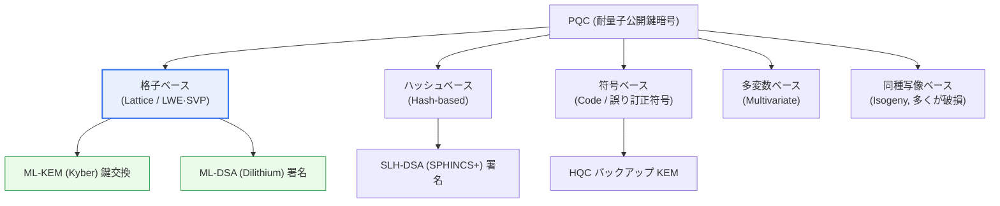
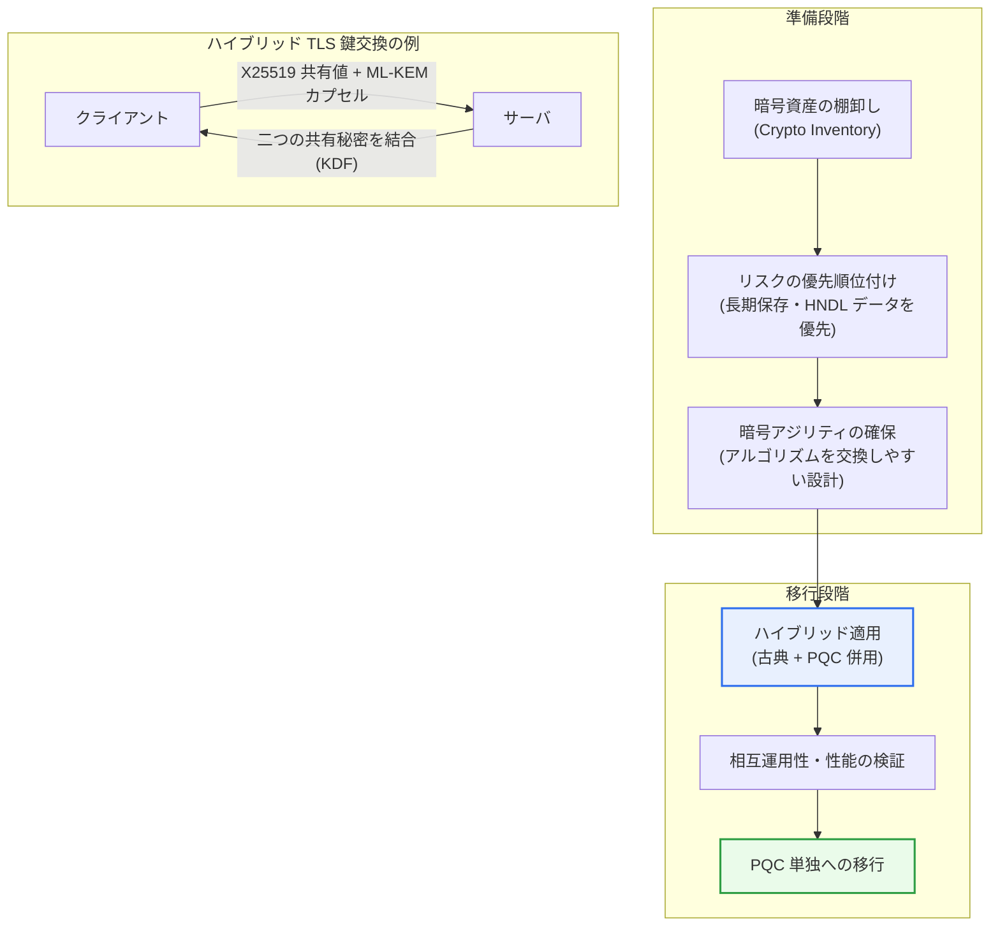

# ポスト量子暗号(PQC, Post-Quantum Cryptography)

## 1. 概要

### A. 定義
> **ポスト量子暗号(PQC)** とは、**大規模な量子コンピュータでも多項式時間内に解くことが困難とされる数学的難問に基づく公開鍵暗号技術**であり、量子コンピュータが既存の公開鍵暗号を無力化する時代に備える「耐量子暗号(Quantum-Resistant Cryptography)」である。特殊な量子装置ではなく、**今日の一般的なコンピュータ・ネットワーク上でそのまま動作**するという点が、量子鍵配送(QKD)と本質的に異なる。

PQC が急を要する根本的な理由は、「**量子コンピュータが今日の公開鍵暗号を丸ごと破りうる**」という点にある。RSA・ECC のような公開鍵暗号は、素因数分解・離散対数のように既存(古典)コンピュータでは事実上解けない問題に依拠して安全性を保証する。たとえば RSA-2048 は、2048ビットの合成数を素因数分解するのに古典アルゴリズムでは宇宙の年齢を超える時間が必要であることを安全性の根拠としている。ところが十分に大きな量子コンピュータが**ショア(Shor)のアルゴリズム**を実行すれば、素因数分解と離散対数を**多項式時間**で解くことができ、RSA・ECC・DH・DSA・ECDSA が原理的に一斉に無力化される。HTTPS(TLS)、電子署名(コード署名・電子政府認証)、VPN、ブロックチェーンウォレットなど、インターネットの信頼の根幹が同時に揺らぐのである。

ここで必ず区別すべきは、**公開鍵暗号と共通鍵暗号が受ける衝撃の大きさが異なる**という点である。共通鍵(AES)・ハッシュ(SHA-2/3)は**グローバー(Grover)のアルゴリズム**による平方根の高速化しか受けないため、探索空間が 2^n から 2^(n/2) に縮む程度にとどまる。すなわち AES-128 は実効強度が64ビット程度に弱まるが、AES-256 は依然として128ビット級で安全であり、ハッシュも出力長を伸ばせば防御できる。

結局、**量子コンピュータが正面から破るのは「公開鍵」暗号であり、共通鍵は鍵長を2倍にすることで対応**できる。PQC の議論が署名・鍵交換(公開鍵)の領域に集中する理由はここにある。逆に言えば、組織が量子時代に備える際に「共通鍵は AES-256 に引き上げ、公開鍵は PQC に置き換える」という二元戦略を立てる根拠も、この非対称な衝撃から生まれる。

さらに恐ろしいのは、「**今盗んで後で解読する(HNDL, Harvest Now, Decrypt Later)**」という脅威である。攻撃者が現在の暗号化通信を丸ごと保存しておき、後に量子コンピュータが登場した時点で遡及的に復号するシナリオである。医療記録・国家機密・住民登録情報・営業秘密のように **10~30年以上秘密を保持しなければならないデータ**は、量子コンピュータがまだ存在しない今日でも、すでに危険にさらされていることになる。したがって「量子コンピュータが商用化されたらその時に替えよう」というアプローチはすでに遅い。PQC は、格子・ハッシュ・符号など量子コンピュータでも困難な新たな数学問題の上に暗号を構築し、この脅威に先制的に対応する。QKD が量子物理(観測時の状態の崩壊)によって鍵を安全に「配送」するのに対し、PQC は純粋なソフトウェアアルゴリズムとして**既存システムへ即座に移植**できる点が実用上の強みである。[[quantum-crypto]]

### B. 脅威の背景と対応の緊急性
整理すると、PQC への移行を急がせる要因は三つある。第一に、ショアのアルゴリズムによる**公開鍵暗号の原理的な崩壊**である。第二に、HNDL によって**量子コンピュータの商用化以前からすでに始まっている脅威**である。第三に、大規模インフラの暗号を置き換えるには数年から十数年を要するため、「攻撃者にとって有用な量子コンピュータが登場する時点(Q-Day)」から逆算すると、**今すぐ始めても余裕はない**。

この三要因の結合は、しばしば「**モスカの不等式(Mosca's Theorem)**」で表現される。データを保護すべき期間(X)とシステムを PQC に移行するのにかかる期間(Y)の和が、量子コンピュータの登場までに残された期間(Z)より大きければ(X+Y>Z)すでに危険である、という論理である。たとえば30年保護すべきデータ(X=30)を5年かけて移行(Y=5)するのに、量子コンピュータが20年後に登場するなら(Z=20)、35>20であるから、このデータは今日すでに事実上の危険区間に入っていることを意味する。

### C. 特徴
PQC の性格は次の特徴に要約される。

- **古典ハードウェアで動作:** 特殊な量子装置なしに既存の CPU・サーバ・ネットワーク上でソフトウェアとして実行され、即座に移植可能である。
- **公開鍵の置き換えが中心:** 正面から脅かされる鍵交換(KEM)・電子署名の領域を置き換え、共通鍵・ハッシュは鍵長の引き上げで補完する。
- **複数系統の併用:** 格子・ハッシュ・符号など異なる数学的難問を並行して採用し、特定系統が破られた際のリスクを分散する。
- **サイズ・性能コストを伴う:** 鍵・暗号文・署名のサイズが従来より大きくなり、帯域幅・遅延・ストレージの負担が増える。
- **標準主導の普及:** NIST・NSA などの標準化・規制機関のロードマップが導入速度を牽引する。

## 2. PQC の基盤となる問題の類型と全体構造

PQC は特定の一つのアルゴリズムではなく、「量子コンピュータでも困難である」と信じられている異なる数学的難問の上に構築された複数系統の総称である。系統が複数ある理由は**リスク分散**のためである。ある一つの系統が将来破られても別の系統へ乗り換えられなければならないため、標準化機関も性格の異なる問題を並行して採用する。

**A. 格子ベース(Lattice-based).** 現在の主流である。n次元格子において最も短いベクトルを見つける最短ベクトル問題(SVP)や、ノイズの混じった線形方程式を解く誤り付き学習(LWE, Learning With Errors)およびその変形である Module-LWE の困難性に依拠する。格子ベースが主流となった理由は明確である。鍵・暗号文のサイズが符号ベースよりはるかに小さく、鍵生成・暗号化・復号の速度が速いため**性能とサイズのバランスが最も優れて**おり、鍵交換(KEM)と署名を一つの数学的構造ですべて実装できるため汎用的である。ただし格子問題の安全性は、数学的に「まだ破られていない」という経験的な信頼に依拠する部分があり、パラメータ選択とサイドチャネル対策には細心の注意が求められる。

**B. ハッシュベース(Hash-based).** 安全性の根拠が「ハッシュ関数の衝突耐性」ただ一つに帰着するため、**仮定が最も保守的で信頼性が高い**。SPHINCS+(標準名 SLH-DSA)が代表であり、状態を管理する必要のないステートレス(stateless)署名である。短所は署名サイズが数十KBと大きく署名生成が遅い点であり、ファームウェア署名のように「まれに署名するが、長期間・確実に検証しなければならない」用途に適する。格子ベースが将来揺らいだ場合に備える安全弁(保守的な代替手段)としての役割が大きい。

**C. 符号ベース(Code-based).** 誤り訂正符号の復号(decoding)が一般に NP 困難であるという点に依拠する。1978年に McEliece 暗号として提案され、**40年以上にわたり大きな攻撃を受けずに生き残ってきた**長い検証実績が強みであるが、公開鍵が数百KB~MB級と非常に大きく、適用が制限される。NIST が後述するバックアップ KEM として符号ベースの HQC を選定したのも、格子とは「異なる数学」に基づく予備手段を確保する意図である。

**D. 多変数・同種写像ベース.** 多変数多項式の連立方程式を解く問題(Multivariate)と楕円曲線の同種写像(Isogeny)問題も候補であった。しかしこの二系統は、**PQC の安全性が決して絶対的ではないことを示した反面教師**である。多変数署名 Rainbow は2022年に Beullens によって、同種写像 KEM である SIKE は同年に Castryck–Decru によって、**一般的なノートPC程度の計算で事実上破られた**。これらの事件は、後述の「考慮事項」で強調する暗号アジリティ(Crypto-Agility)の必要性を実証した代表的事例として残った。

| 類型 | 基盤となる難問 | 強み | 弱み |
|---|---|---|---|
| **格子(Lattice)** | LWE・Module-LWE・SVP | 速度・サイズのバランスが最良、汎用(KEM・署名) | 安全性余裕マージンに関する議論 |
| **ハッシュ(Hash)** | ハッシュの衝突耐性 | 仮定が最小・信頼が最高 | 署名サイズが大きい・遅い |
| **符号(Code)** | 符号復号の困難性 | 40年の検証実績 | 公開鍵が非常に大きい |
| **多変数(Multivariate)** | 多変数多項式 | 署名が短く高速 | Rainbow が破られた(2022) |
| **同種写像(Isogeny)** | 楕円曲線の同種写像 | 鍵が小さい | SIKE が破られた(2022) |

## 3. NIST 標準化と移行アーキテクチャ

PQC 普及の決定的な分岐点は**米国 NIST の標準化**であった。NIST は2016年に公開公募を開始し、世界の暗号学界による長年の検証を経て、**2024年8月に最初の PQC 標準3種を確定**した。格子ベースの鍵カプセル化(KEM)である CRYSTALS-Kyber は **FIPS 203(ML-KEM)**、格子ベース署名 CRYSTALS-Dilithium は **FIPS 204(ML-DSA)**、ハッシュベース署名 SPHINCS+ は **FIPS 205(SLH-DSA)** として標準化された。続いて格子署名 Falcon が **FIPS 206(FN-DSA)** として準備中であり、2025年3月に NIST は格子とは系統の異なる予備 KEM として符号ベースの **HQC** を追加選定(2027年頃に標準化予定)し、リスクを分散した。標準確定後は、各アルゴリズムの正確なバージョン・パラメータを固定して引用するのが安全である。

整理すると、NIST 標準の系統は次のとおりである。

- **FIPS 203 (ML-KEM, 旧 CRYSTALS-Kyber):** 格子ベースの鍵カプセル化(KEM)。主力の鍵交換標準であり、ML-KEM-512/768/1024 のパラメータを提供する。
- **FIPS 204 (ML-DSA, 旧 CRYSTALS-Dilithium):** 格子ベースの電子署名。汎用署名のデフォルトとして推奨される。
- **FIPS 205 (SLH-DSA, 旧 SPHINCS+):** ハッシュベースのステートレス署名。仮定が保守的であり、格子系統の安全弁の役割を果たす。
- **FIPS 206 (FN-DSA, 旧 Falcon):** 格子ベースの署名。署名サイズが小さく帯域幅に余裕のない環境に有利であり、準備中である。
- **HQC(符号ベースのバックアップ KEM):** 格子とは異なる数学に基づく予備の鍵交換手段として、別途標準化が進められている。

以下は、実際の組織が PQC へ移行する**移行プロセスとハイブリッド配置アーキテクチャ**を示した詳細図である。核心は「一度に置き換える」ことではなく、「**棚卸し → 優先順位付け → ハイブリッド併用 → 完全移行**」という段階的な移行である点にある。

**A. ハイブリッド方式が現実的な正解である理由.** 移行期に突然 PQC 単独へ移ると、PQC アルゴリズム自体に将来欠陥が見つかるリスク(Rainbow・SIKE の前例)と、旧システムとの互換性の問題を同時に抱えることになる。そのため、**既存の古典暗号(例: X25519)と PQC(例: ML-KEM-768)を併せて実行し、二つの共有秘密を KDF で結合する**ハイブリッドが推奨される。こうすれば二つのうち一方さえ安全であればセッションは保護されるため、「古典暗号はすでに安全、PQC は未検証」という移行期のリスクを相殺できる。

実際に **Google・Cloudflare は2022~2024年にかけて TLS に X25519+Kyber(X25519MLKEM768)ハイブリッドを大規模に展開**し、**Apple は2024年に iMessage に PQ3 を、Signal は2023年に PQXDH を**導入して、メッセンジャーのエンドツーエンド暗号に格子ベースの鍵交換を組み合わせた。これは PQC がすでに研究室を超え、数億ユーザー規模で運用されていることを示す具体的な事例である。共通点はいずれも「古典+PQC」のハイブリッドから出発したことであり、標準化初期の不確実性を考慮した慎重な選択である。

**B. 性能・サイズという現実的なコスト.** PQC への移行はタダではない。代表的に ML-KEM-768 の公開鍵は約1,184バイト、カプセル(暗号文)は約1,088バイトであり、数十バイトにすぎない ECC 鍵に比べて**10~20倍程度大きくなる**。これは TLS ハンドシェイクのパケットが大きくなり、初回の往復(RTT)で IP フラグメンテーションや遅延を引き起こしうることを意味する。署名も同様で、SLH-DSA の署名は数KB~数十KBに達する。したがって組み込み・IoT のように帯域幅・メモリに余裕のない環境では、アルゴリズム・パラメータの選択がそのまま設計上のトレードオフとなる。

## 4. QKD との比較

PQC は QKD(量子鍵配送)と混同されやすいが、両者は問題を解く層がまったく異なる。QKD は光子の偏光状態を利用して**鍵を物理的に安全に配送する**ハードウェア技術であり、盗聴時に量子状態が撹乱されて検知されるという物理法則に安全性の根拠を置く。一方 PQC は**演算の困難さ(計算複雑性)に基づくソフトウェア**である。この違いはそのまま配置方式の違いにつながる。QKD は専用の光通信装置と中継器が必要で構築費が大きく距離の制約がある一方、PQC はソフトウェアの更新だけでインターネット全域に適用可能である。そのため実務では「**公開鍵暗号の置き換えは PQC、特殊な高セキュリティ区間の鍵配送は QKD**」と役割を分け、相互排他ではなく補完関係とみなす。

| 区分 | PQC(耐量子暗号) | QKD(量子鍵配送) |
|---|---|---|
| **基盤** | 数学的難問(計算複雑性、SW) | 量子力学の物理(観測時の崩壊、HW) |
| **動作環境** | 既存システム・汎用インターネット | 専用光通信装置・中継器 |
| **適用性** | ソフトウェアの置き換えで広範囲・低コスト | インフラ構築が必要・距離の制約 |
| **役割** | 公開鍵暗号(鍵交換・署名)の置き換え | 特定区間の鍵配送チャネルの保護 |
| **成熟度** | NIST 標準確定、大規模な商用展開 | 試験・特殊網が中心 |

## 5. 深化: 国内外の動向と予想される出題方向

**A. グローバルな移行ロードマップ.** 米国は国家安全保障システムについて、NSA の **CNSA 2.0** を通じて2030年代初頭までに PQC への移行を事実上義務化する日程を示しており、ホワイトハウスの **NSM-10** と関連法を通じて連邦機関に暗号の棚卸しと移行計画の策定を強制している。NIST も移行指針(IR 8547 草案など)を出し、既存アルゴリズムの段階的廃止(deprecation)の日程を議論している。このように標準が「作られる」段階から「強制的に履行される」段階へ移りつつあることが、最近の動向の核心である。

**B. 韓国国内の動向.** 韓国でも KISA・国家情報院などを中心とする **KpqC(Korean PQC)公募**を通じて国産の耐量子暗号アルゴリズムを発掘・検証してきており、格子・符号ベースなどで国内候補が選定段階を経た。ただし詳細な選定結果・標準化日程は更新される事項であるため、答案作成時には「KISA 主導で国産 PQC 公募が進められてきた」という事実を中心に記述し、最新の確定内容は最新資料で確認するほうが安全である。公共・金融分野は電子政府・証明書体系が広範であるため、国内の移行は「**暗号資産の棚卸し → ハイブリッド証明書 → 完全移行**」という長期ロードマップで取り組まれると見込まれる。

**C. 予想される出題方向および答案戦略.** 技術士の観点で PQC は、(1) ショア/グローバーのアルゴリズムと共通鍵・公開鍵への衝撃の違い、(2) NIST 標準4種の系統・用途、(3) HNDL とモスカの不等式から見た移行の緊急性、(4) ハイブリッド・暗号アジリティを中心とした移行戦略、をまとめて論述させる問題として出題される可能性が高い。単純な定義の羅列よりも、「**なぜ今移行すべきか(HNDL) → 何に置き換えるか(NIST 標準) → どのように置き換えるか(ハイブリッド・アジリティ)**」という因果の流れで構成すれば深化した答案となる。

## 6. 考慮事項および示唆点

1. **先制的な移行(Migration)は選択ではなく時期管理の問題である。** HNDL の脅威とモスカの不等式(X+Y>Z)に従い、長期保護が必要なデータ・システムから今すぐ棚卸しし、移行を開始しなければならない。「量子コンピュータが出たら対応する」では、すでに流出したデータを守ることはできない。
2. **暗号アジリティ(Crypto-Agility)の確保が本質的な能力である。** Rainbow・SIKE が破られたことが示すように、特定の PQC アルゴリズムも将来揺らぎうるため、アルゴリズムを「ハードコーディング」せず、設定・交換が可能となるようアーキテクチャを設計することが、標準の変化・脆弱性の発見に対する根本的な対応である。
3. **ハイブリッド併用が移行期の現実解である。** 古典暗号と PQC を併せて実行して二つの共有秘密を結合すれば、一方さえ安全であればセッションが保護され、未検証リスクと互換性の問題を同時に緩和する。Google・Apple・Signal の実際の展開がこれを裏付けている。
4. **性能・サイズ・サイドチャネルという実務上のトレードオフを併せて設計しなければならない。** 鍵・署名サイズの増加に伴う帯域幅・遅延、組み込み環境のリソース制約、そして格子実装のサイドチャネル(タイミング)対策まで考慮してパラメータを選択しなければならない。
5. **PQC と QKD、共通鍵の強化は排他ではなく階層的な組み合わせである。** 公開鍵の置き換えは PQC、特殊区間の鍵配送は QKD、共通鍵は AES-256 級に引き上げるという多層戦略が、量子時代の暗号体系の現実的な青写真である。

## 参考資料
- NIST, "Post-Quantum Cryptography" (FIPS 203/204/205, HQC 選定): https://csrc.nist.gov/projects/post-quantum-cryptography
- NSA, "Commercial National Security Algorithm Suite 2.0 (CNSA 2.0)": https://www.nsa.gov/Press-Room/News-Highlights/Article/Article/3148990/
- Cloudflare, "The state of the post-quantum Internet": https://blog.cloudflare.com/pq-2024/
- Apple, "iMessage with PQ3": https://security.apple.com/blog/imessage-pq3/

---

> **一言まとめ**: PQC は*量子コンピュータ(ショアのアルゴリズム)でも解くことが困難な格子・ハッシュ・符号ベースの数学的難問の上に構築された耐量子公開鍵暗号*であり、「Harvest Now, Decrypt Later」の脅威ゆえに今から移行しなければならず、NIST 標準(ML-KEM・ML-DSA・SLH-DSA)とハイブリッド・暗号アジリティ戦略がその核心である。
