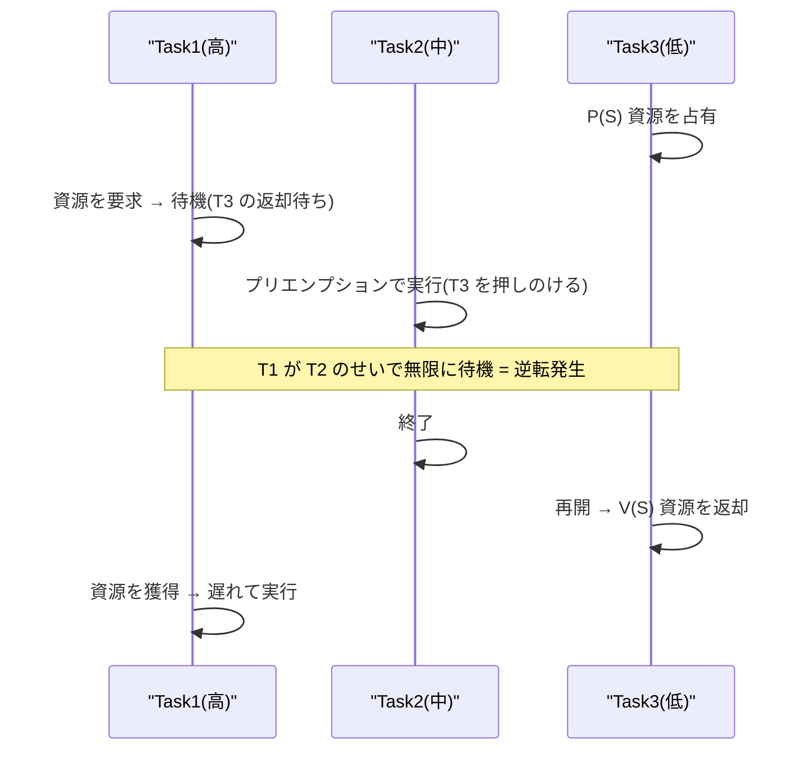

# 優先度逆転(Priority Inversion)

## 1. 概要

### A. 定義
> **優先度逆転(Priority Inversion)** とは、リアルタイムスケジューリングにおいて、**高優先度タスクが、低優先度タスクの占有する共有資源を待つために、かえって遅れて実行される現象**である。優先度の順序が事実上ひっくり返り、低優先度の処理が高優先度の処理を追い越してしまう。

優先度逆転が危険な理由は、「**最も急ぐべき仕事が最も些細な仕事に足を引っ張られる**」点にある。リアルタイムシステム(RTOS)は、締め切り(deadline)を守らなければならない緊急のタスクに高い優先度を与え、スケジューラが常に実行可能(ready)なタスクのうち最も優先度の高いものを先に実行するよう設計されている。この規則が守られる限り、応答時間は予測可能である。ところが複数のタスクが一つの共有資源(例: セマフォで保護されたグローバルバッファ)を共用した瞬間、この予測可能性が崩れうる。

問題の種は相互排除(mutual exclusion)である。低優先度タスクが資源をロックした状態で高優先度タスクが同じ資源を要求すると、高優先度タスクは低優先度タスクが資源を解放するまで待つしかない。ここまでは相互排除を用いる以上避けられない「正常な待機」である。本当の問題は、その待機の間に**中優先度タスクが割り込み**、資源を握っている低優先度タスクを押しのけて CPU を占有したときに発生する。資源を握るタスクが実行されないため資源を解放することもできず、結局、最高優先度のタスクが自分より低い中優先度タスクのために延々と待たされることになる。この待機時間の上限を予測できない点が、リアルタイムシステムにおいて致命的である。

実際に1997年、NASA の火星探査機 **マーズ・パスファインダー(Mars Pathfinder)** が着陸後に再起動を繰り返す障害に見舞われたが、その原因がまさにこの優先度逆転であった。資源を握った低優先度タスクが中優先度の通信タスクに押しのけられて資源を解放できなくなり、高優先度の管理タスクの締め切りを監視していたウォッチドッグタイマがシステムをリセットしたのである。この事例は、優先度逆転が理論上のリスクではなく、実際のミッションを危うくする現実的な欠陥であることを示している。

### B. 発生条件
優先度逆転は三つの条件が重なったときに発生する。第一に、タスク同士が**相互排除で保護された共有資源**を共用する。第二に、優先度が**三段階以上**(高・中・低)に区分されている。第三に、低優先度タスクが資源を握っている間に**中優先度タスクがプリエンプション(preempt)** できる。このうち一つでも欠ければ、無限の遅延につながる逆転は成立しない。たとえばタスクが二段階しかなければ、資源待ちは有限のクリティカルセクションの時間内に終わる。

## 2. 発生事例(P/V 演算に基づく)

セマフォの P(獲得)・V(返却)演算によって逆転が起こる過程を時系列で見ると次のとおりである。Task1 が最も高く、Task2 が中程度、Task3 が最も低い優先度であるとする。

最初に、低優先度の Task3 が実行中に P(S) で共有資源をロックする。その間に Task1 が起動して同じ資源を要求するが、すでに Task3 が占有しているため Task1 は待機状態に入る。ここまでは Task3 の短いクリティカルセクションさえ過ぎればすぐに解消される、許容可能な遅延である。

逆転が成立する決定的な瞬間は、この時点で **Task2 が実行可能状態になる場合**である。Task2 は Task3 より優先度が高いため、スケジューラは Task3 を押しのけて Task2 を実行する。Task2 は資源とは無関係に自分の処理を行うが、そのせいで Task3 は CPU を得られず、V(S) で資源を返却する機会さえ失う。結果として、資源を待つ Task1 は Task2 が終わるまで待ち続ける。

ここに逆転(inversion)の本質が現れる。最も優先度の高い Task1 が、資源とまったく関係のない中優先度の Task2 より遅れて実行されたのである。しかも Task2 が複数集中したり繰り返し実行されたりすると、Task1 の待機時間は理論上際限なく延びうるため、「遅延の上限を計算できない」状態となる。リアルタイムシステムの存在理由である応答時間の保証が、この時点で崩壊する。

## 3. 解決手法

優先度逆転の解決策は、共通して「**資源を占有する低優先度タスクの優先度を一時的に引き上げ、中優先度タスクによるプリエンプションを防ぐ**」という発想に基づく。資源を握るタスクが中優先度タスクに押しのけられず、速やかにクリティカルセクションを抜けて資源を返却するようにすれば、高優先度タスクの待機時間はクリティカルセクションの長さで有界(bounded)となる。

| 手法 | 原理 | 特徴 |
|---|---|---|
| **優先度継承(Priority Inheritance)** | 資源占有タスク(T3)が、待機中の高優先度タスク(T1)の優先度を一時的に継承して素早く実行・資源返却 | 発生時に対応、実装が単純 |
| **優先度上限(Priority Ceiling)** | 資源ごとに上限優先度を定め、資源占有時にその上限へ即座に昇格 → デッドロック・逆転を予防 | 事前予防、デッドロックまで防止 |

### A. 優先度継承プロトコル
**優先度継承(Priority Inheritance Protocol, PIP)** は、逆転が検知された瞬間に対応する方式である。高優先度の Task1 が Task3 の握る資源を待ち始めると、Task3 はその瞬間に Task1 の高い優先度を「受け継ぐ」。優先度が上がった Task3 は中優先度の Task2 にプリエンプトされないため、自らのクリティカルセクションを迅速に終えて V(S) で資源を返却する。資源を返却すると同時に Task3 は元の低い優先度に戻り、待機していた Task1 が資源を得て実行される。

パスファインダー事故の実際の解決策が、まさにこの優先度継承であった。地球から問題のセマフォで継承オプションを有効にするようソフトウェアを遠隔パッチし、再起動現象を解消したという事実は、この手法の実効性を象徴的に示している。ただし優先度継承は、複数の資源が絡むと継承が連鎖する**連鎖ブロッキング(chained blocking)** が生じて遅延計算が複雑になり、デッドロック(deadlock)そのものは防げないという限界がある。

### B. 優先度上限プロトコル
**優先度上限(Priority Ceiling Protocol, PCP)** は、問題を事前に予防する方式である。各共有資源について、その資源を使用しうるタスクのうち最も高い優先度を「上限(ceiling)」としてあらかじめ指定しておく。あるタスクがその資源を占有した瞬間、自らの本来の優先度にかかわらず即座にその上限優先度へ昇格する。こうすれば資源を握るタスクははじめから中優先度タスクに押しのけられず、さらに異なるタスクが複数の資源を交差してロックする状況が根本的に遮断され、**デッドロックと連鎖ブロッキングまで予防**される。

両手法は性格が異なる。優先度継承が、逆転が実際に起きたときに事後的に優先度を上げる「対応型」であるとすれば、優先度上限は資源を取得した時点で最高値まで上げておく「予防型」である。予防効果とデッドロック防止の面では上限が優れているが、資源ごとの上限を正確に算定・管理しなければならないという設計上の負担が伴う。そのため商用 RTOS(VxWorks、FreeRTOS など)は、たいてい優先度継承をミューテックスのデフォルトオプションとして提供し、安全性が極めて重要なシステムで上限プロトコルを選択的に用いる。

## 4. 深化 — 実務適用と検証の観点

実務において優先度逆転は、「症状ははっきりしているのに原因が隠れる」タイプの欠陥である。表面上は特定の高優先度処理が断続的に締め切りを逃す形で現れるが、肝心のその処理のコードには問題がなく、無関係な資源競合が根本原因であるため、再現と追跡が難しい。そのため設計段階で、共有資源ごとにそれを使用するタスクの優先度の範囲を一覧化し、三段階以上にまたがる資源には継承・上限プロトコルを明示的に適用する予防的アプローチが重要である。

検証の観点では、**応答時間解析(Response Time Analysis)** と**最悪実行時間(WCET, Worst-Case Execution Time)** の算定が核心である。優先度継承・上限を適用すれば、高優先度タスクが低優先度タスクによって遅延されうる時間(blocking time)の上限が「クリティカルセクション1回分の長さ」で有界となるため、これをスケジュール可能性解析(例: RMA, Rate Monotonic Analysis)のブロッキング項に組み込み、締め切り遵守の可否を定量的に証明できる。航空電子(DO-178C)、自動車(ISO 26262)のような安全規格に従うドメインでは、このような時間有界性の証明が認証要件に含まれるため、優先度逆転の防止は機能ではなく安全の問題となる。

一方、最近のマルチコアリアルタイムシステムでは、問題はさらに複雑になる。コア間でタスクが分散されると、あるコアのタスクが別のコアの握る資源を待つ状況が生じ、これに対処するため MSRP・MrsP のようなマルチコア向けの資源共有プロトコルが研究・適用されている。詳細な手法と適用範囲は発展を続ける領域であるため、実際に採用する際は使用中の RTOS とハードウェアがサポートするプロトコルを公式ドキュメントで確認することが望ましい。

## 5. 考慮事項および示唆点(技術士の観点)

1. **リアルタイムシステムの信頼性を左右する必須要素である。** 締め切りを必ず守らなければならないリアルタイムシステムにおいて、優先度逆転は予測不能な遅延を生んで締め切り違反に直結するため、RTOS は優先度継承・上限をミューテックスのデフォルトまたはオプション機能としてサポートしている。単純なセマフォの代わりに継承機能を持つミューテックスを使うだけでも、多くのリスクを低減できる。
2. **手法のトレードオフを正確に理解して選択する。** 優先度継承は実装が単純で発生時に対応するが、連鎖ブロッキング・デッドロックの可能性が残り、優先度上限はデッドロックまで予防するが資源ごとの上限の算定・管理という設計コストを要する。システムの安全等級と資源の絡み合いの程度に合わせて選択しなければならない。
3. **共有資源の最小化が最も根本的な予防策である。** そもそも優先度の異なるタスク間の共有資源を減らし、やむを得ない場合はクリティカルセクションをできる限り短く保てば、ブロッキング時間そのものが減り、逆転の余地と遅延の上限がともに小さくなる。ロックフリー(lock-free)データ構造やメッセージキューに基づく設計で共有状態そのものをなくすアプローチも有効である。
4. **時間有界性を定量的に証明しなければならない。** プロトコルの適用はそれ自体が目的ではなく、最悪のブロッキング時間を有界化し、スケジュール可能性解析によって締め切り遵守を証明するための手段である。安全重要システムではこの証明が認証要件となるため、WCET の算定・応答時間解析とともに設計・検証プロセスに統合しなければならない。

## 参考資料
- What Really Happened on Mars? (Mike Jones, NASA JPL 事例のまとめ) — https://www.rapitasystems.com/blog/what-really-happened-software-mars-pathfinder-spacecraft
- FreeRTOS — Priority Inheritance/Mutexes ドキュメント — https://www.freertos.org/Real-time-embedded-RTOS-mutexes.html

---

> **一言まとめ**: 優先度逆転とは*高優先度タスクが、低優先度タスクの資源占有と中優先度タスクのプリエンプションのために予測不能なほど遅れて実行される現象*であり、優先度継承(待機タスクの優先度を一時的に継承)と優先度上限(資源ごとの上限へ即座に昇格し、デッドロックまで予防)によって解決し、究極的には共有資源・クリティカルセクションの最小化によって予防する。
