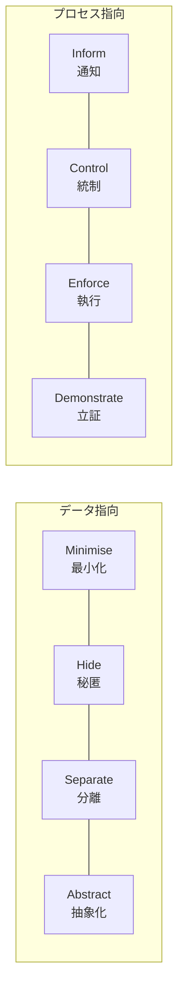

# PbD(Privacy by Design)

## 1. 概要

### A. 定義
> Ann Cavoukian(カナダ・オンタリオ州情報プライバシーコミッショナー)が提唱した、システム・サービス・ビジネスプロセスを**設計する時点からプライバシー保護を先制的に組み込む**個人情報保護の方法論。GDPR 第25条「**Data Protection by Design and by Default**」として法制化された。

PbD の核心的な発想は、プライバシーを**事後に付け足す機能ではなく、設計の基本仕様(default specification)** とすることである。すなわち個人情報保護を別個のオプションとして利用者が有効化しなければならないものとするのではなく、何も設定しなくても最も保護された状態がデフォルトとなるようにする。これは「まず作り、問題が起きたら直す」という従来のアプローチを覆すものである。

### B. 登場背景および必要性
かつての個人情報保護は、漏えい事故が起きた後に対応する**事後的・対症療法的**な方式であった。しかしビッグデータ・IoT・AI の環境では、データが膨大に収集・結合・再利用されるため、一度漏えいすれば回復は事実上不可能であり、事後対応では被害を防げない。また、システムが完成した後にプライバシーを組み込もうとすると再設計のコストが大きく、漏れが生じやすい。そのため**設計段階で構造的に**保護を組み込んでおくべきだという要求が高まり、これが PbD が GDPR をはじめ各国の規制の原則として採用された背景である。

## 2. PbD の7原則

7原則は「いつ・何を・どのように」保護するかという哲学を規定する。とりわけ4番目の **Positive-Sum(ポジティブサム)** 原則は PbD の独創性を示している — プライバシーとセキュリティ(あるいは利便性)を「一方を得れば他方を失う」ゼロサムとみなさず、設計をうまく行えば**両方を達成**できるという観点である。

| # | 原則 | 意味 |
|---|---|---|
| 1 | **事前予防的(Proactive)** | 事故の後ではなく発生前に備える |
| 2 | **デフォルトとしてのプライバシー(Default)** | 設定なしでも最大限の保護がデフォルト |
| 3 | **設計への組み込み(Embedded)** | 付加機能ではなく設計そのものに含める |
| 4 | **完全な機能性(Positive-Sum)** | プライバシーとセキュリティ・利便性の両立 |
| 5 | **ライフサイクル全体の保護(End-to-End)** | 収集から廃棄までの全区間を保護 |
| 6 | **可視性・透明性(Visibility)** | 処理過程を検証可能な形で公開 |
| 7 | **利用者のプライバシーの尊重(User-Centric)** | 情報主体の利益を最優先 |

## 3. PbD の8戦略

7原則が「哲学」であるとすれば、Jaap-Henk Hoepman の8戦略はそれを実際に実装するための**エンジニアリング指針**である。データそのものを扱う4つ(データ指向)と、処理過程を扱う4つ(プロセス指向)に分けられる。

データ指向の戦略は、「**そもそも個人情報を少なく、見えないように、分散させて、まとめて**」扱おうというものである。**最小化**は目的に不可欠なデータだけを収集し(収集そのものを減らせば漏えいリスクも根本的に減少する)、**秘匿**は暗号化・アクセス制御によって露出を防ぎ、**分離**はデータを複数のストアに分けて結合による識別を難しくし、**抽象化**は個々の値の代わりに集計・カテゴリで扱って識別性を下げる。

プロセス指向の戦略は、「**処理過程を透明にし、主体が統制できるようにし、ルールを強制し、遵守を証明する**」ものである。**通知**は何をなぜ処理するのかを知らせ、**統制**は情報主体が同意・閲覧・削除の権利を行使できるようにし、**執行**はポリシーが実際に守られるよう技術的・組織的な統制を置き、**立証**は遵守の事実をログ・監査で証明して**説明責任(accountability)** を確保する。

| 区分 | 戦略 |
|---|---|
| **データ指向** | 最小化(Minimise)・秘匿(Hide)・分離(Separate)・抽象化(Abstract) |
| **プロセス指向** | 通知(Inform)・統制(Control)・執行(Enforce)・立証(Demonstrate) |

## 4. 韓国個人情報保護法第3条の原則との比較

PbD の戦略は、韓国の**個人情報保護法第3条(個人情報保護の原則)** とかなりの部分で対応する。これは両体系が共通して、**最小収集・目的制限・安全性・透明性・説明責任**という普遍的原則から出発しているためである。たとえば会員登録時にサービスに不要な住民登録番号を受け取らないことは、PbD の Minimise であると同時に法第3条の最小収集原則をも満たす。

| PbD 戦略 | 個人情報保護法第3条 |
|---|---|
| **Minimise** | 目的に必要な**最小限の収集** |
| **Inform・Control** | 情報主体への**通知・同意・権利保障** |
| **Enforce・Demonstrate** | **安全性確保措置・説明責任** |
| **Hide・Separate** | 安全な管理(暗号化・アクセス制御・分離) |
| **Abstract** | **匿名・仮名処理** |

## 5. 考慮事項および示唆点
- **DPIA との連携**: PbD は、**個人情報影響評価(DPIA/PIA)** を通じて設計初期にプライバシーリスクを識別・緩和するプロセスとして具体化される。設計と評価が対になってこそ実効性が生まれる。
- **PET による技術的実装**: 仮名・匿名処理、**差分プライバシー**、**準同型暗号**、連合学習のようなプライバシー強化技術(PET)によって8戦略を実際に実装する。
- **トレードオフ**: データの最小化・抽象化はプライバシーを高めるが、データ分析の精度(効用)を低下させる。Positive-Sum を志向しつつも、目的ごとに**プライバシーと効用の均衡点**を設計によって見いださなければならない。
- **展望**: AI・ビッグデータ時代においてデータの活用と保護を同時に求められる中、PbD は選択ではなく**必須の設計原則**であり、規制遵守の前提として定着しつつある。

---

> **一言まとめ**: PbD は*設計段階からプライバシーを先制的に、かつデフォルトとして組み込む*方法論であり、7原則(特に Positive-Sum)とデータ指向・プロセス指向の8戦略が、個人情報保護法第3条の最小収集・安全性・透明性・説明責任の原則に対応し、DPIA・PET によって実装される。
