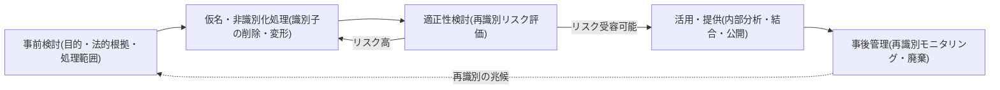
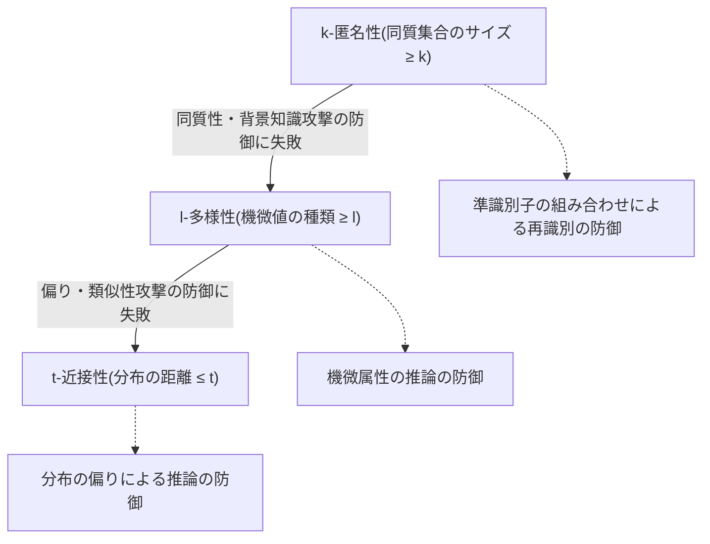

# 個人情報の非識別化措置とプライバシー保護モデル(k-匿名性・l-多様性・t-近接性)

## 1. 概要

> **定義**: 個人情報の非識別化措置とは、情報の集合物から特定の個人を識別できないよう識別子を削除・変形する一連の技術的・管理的処理であり、k-匿名性・l-多様性・t-近接性は、その結果物が再識別にどれほど耐えられるかを定量的に判定するプライバシー保護モデル(privacy protection model)である。

データ経済が拡大するにつれ、組織は保有する個人情報を統計・研究・人工知能の学習に活用しようとする強い誘因を持つようになったが、原本をそのまま使用すると、個人情報保護法上の同意・目的制限の壁に突き当たる。
これを解消するため、氏名・住民登録番号のような直接識別子を消す単純な匿名化が長く用いられてきたが、実務ではこの方式だけでは個人が再び特定される事故が繰り返し発生した。
問題の核心は、個人を特定する力が一つの識別子にあるのではなく、性別・生年月日・郵便番号のような複数の準識別子(quasi-identifier)の**組み合わせ**と、外部ですでに公開されているデータとの**結合**にあるという点である。
したがって今日の非識別化は、「何を消したか」ではなく「残ったデータで個人を突き止められるか」という再識別リスクの観点から設計・検証されなければならない。

非識別化措置はそれ自体が目的ではなく、データ活用と個人情報保護という相反する二つの価値を調整する均衡装置である。
過度に強く処理するとデータの分析的有用性(utility)が失われて活用目的を達成できず、逆に緩く処理すると再識別リスクが残り、法的・倫理的責任を負うことになる。
技術士は個々のアルゴリズムの優劣を並べるにとどまらず、処理目的・データの機微度・利用環境(内部活用 vs 外部公開)・残余リスクの受容水準を総合して適切な保護水準を判断し、その根拠を文書化するガバナンスを設計しなければならない。

## 2. 非識別化措置の処理手順と情報の類型

### 2.1 全体の処理手順

韓国の「仮名情報処理ガイドライン」(個人情報保護委員会、2024.2改訂)と過去の「個人情報非識別化措置ガイドライン」は、非識別化を単発の変換ではなく、**事前検討 → 処理 → 適正性検討 → 安全な管理**の循環手順として規定している。
これは、非識別化がデータを一度加工すれば終わる作業ではなく、結果物のリスクを再測定し、再識別の試みがないかを継続的に管理しなければならない統制活動であることを意味する。

事前検討の段階では、処理目的を明確にし、その目的に必要な最小限の項目だけを残すデータ最小化を適用する。
目的が統計・研究・人工知能の学習など個人情報保護法第28条の2が許容する範囲内であるか、特定の個人を識別しようとする試みを排除する統制が備わっているかが、この段階の核心的な判断である。
処理段階では、後述する五つの技法を組み合わせて識別リスクを下げるが、準識別子の組み合わせリスクまで併せて下げてこそ有効な非識別化となる。
適正性検討では、処理結果が実際に再識別に耐えられるかを k-匿名性などのモデルで計量し、不十分であれば処理段階へ戻る反復構造を形成する。
事後管理では、再識別の試みのモニタリング、アクセス制御、利用目的達成後の廃棄、再識別発生時の即時の処理中止・通知などの管理的統制を継続する。

### 2.2 データ項目の類型区分

非識別化を設計するには、まず各カラムが再識別において果たす役割を区分しなければならない。
同じ処理でも、対象が識別子か準識別子か機微情報かによって、リスクへの寄与度と処理戦略がまったく異なるからである。

| 類型 | 定義 | 例 | 基本的な処理方向 |
|------|------|------|----------------|
| 識別子(Identifier) | それ自体で個人を特定 | 氏名、住民登録番号、携帯電話番号 | 原則として削除・仮名化 |
| 準識別子(Quasi-identifier) | 組み合わせると個人を特定 | 性別、生年月日、郵便番号、職業 | カテゴリ化・一般化でリスク緩和 |
| 機微情報(Sensitive Attribute) | 露出するとプライバシー侵害 | 疾病、所得、宗教、政治的志向 | 値の多様性・分布の保護 |
| 識別と無関係な属性 | 個人の特定と無関係 | 季節、製品カテゴリ | おおむね原本を維持 |

ここで特に重要なのは準識別子である。
1997年に米国でスウィーニー(L. Sweeney)は、公開されたマサチューセッツ州職員の医療記録から、性別・生年月日・郵便番号(ZIP)だけで州知事を再識別し、この三項目の組み合わせだけで米国人口の約87%が一意に特定されることを示した。
この事例は「直接識別子を消したから安全だ」という通念を覆し、準識別子の組み合わせに対する定量的保護モデル(k-匿名性)が登場する直接の契機となった。

## 3. 非識別化措置の5大技法

韓国のガイドラインは、非識別化処理の技法を大きく五つの範疇で提示している。
各技法は単独で完全な安全を保証するものではなく、データ項目ごとの役割とリスクに合わせて組み合わせて適用することが原則である。

**仮名処理(Pseudonymization)** は、識別子を別の値に置き換えて元の値を隠す技法であり、「ホン・ギルドン」を任意の通し番号や別名に置き換える方式である。
暗号化・トークン化・マッピングテーブル方式があり、マッピングを元に戻せる追加情報(仮名鍵)を分離保管すれば、必要に応じて再連携が可能である点が他の技法と異なる。
したがって仮名情報は「追加情報なしには特定の個人を識別できない」状態であり、完全な匿名情報とは異なり、法的には依然として個人情報に準じた安全措置義務が伴う。

**総計処理(Aggregation)** は、個別レコードの代わりに合計・平均・最大値などの統計値に変換し、個人単位の観測をなくす方式である。
たとえば個人別の所得を地域・年齢層の平均所得に置き換えれば個人の追跡は難しくなるが、標本がごく少数の集団では平均だけでも個人の値が逆算されうるため、最小集計単位も併せて統制しなければならない。

**データ削除(Data Reduction)** は、識別リスクの高い項目や極端値(outlier)をまるごと除去する方式である。
少数の高齢・高所得の外れ値はそれ自体の一意性が高く、再識別の出発点となるため、上位・下位の特異値を切り捨てたり部分的に削除したりする処理が必要である。

**データのカテゴリ化(Generalization)** は、具体的な値を区間・カテゴリにまとめて一意性を下げる中心的な技法である。
「1985-03-21」を「1980年代生まれ」に、「ソウル江南区駅三洞」を「ソウル」に一般化すれば、同じ値を持つ人数が増えて個人の特定が難しくなり、これが後述する k-匿名性達成の主な手段となる。

**データマスキング(Masking)** は、値の一部をアスタリスクなどで隠す方式であり、住民登録番号の後半や電話番号の中間の桁を `*` で処理するのが代表例である。
画面表示・運用環境ですぐに適用しやすいが、マスキングされた部分を他のデータから推測できる場合は保護効果が限定される。

## 4. プライバシー保護モデル: k-匿名性・l-多様性・t-近接性

非識別化処理をいくら行っても、「この程度で安全か」を判断する基準がなければ恣意的な処理となる。
プライバシー保護モデルは再識別リスクを定量的に判定する物差しであり、k-匿名性 → l-多様性 → t-近接性へと進むにつれて、前のモデルの弱点を補完する方向へ発展してきた。

### 4.1 k-匿名性(k-Anonymity)

k-匿名性はスウィーニーが2002年に提示した最初の定量モデルであり、準識別子の値が同一であるレコードがデータセット内に常に **k 個以上**存在するようにすることを目標とする。
同じ準識別子の組み合わせを共有するレコードのまとまりを同質集合(equivalence class)といい、同質集合の最小サイズが k であれば、攻撃者は特定の個人をその中の k 人のうちの一人としか絞り込めない。
たとえば k=5 であれば「1980年代生まれ・ソウル・男性」の組み合わせに該当する人が常に5人以上いるため、準識別子だけでは再識別確率が1/5以下に制限される。

k の値が大きいほど保護は強くなるが、その分カテゴリ化・削除が増えてデータの有用性は下がるため、k は保護と活用の代表的なトレードオフパラメータである。
しかし k-匿名性は準識別子を統制するだけで、機微情報の値そのものは見ないという根本的な限界を持つ。
もしある同質集合の5人の疾病がすべて「胃がん」であれば、攻撃者は対象がその集合に属していることさえ分かれば疾病を100%推論できる(同質性攻撃, homogeneity attack)。
また攻撃者が背景知識によって特定の値を除外できれば、残る候補は急激に絞られる(背景知識攻撃, background knowledge attack)。

### 4.2 l-多様性(l-Diversity)

l-多様性は Machanavajjhala らが2007年に提案した補完モデルであり、各同質集合が機微情報について互いに**よく区別される値を l 個以上**含むことを要求する。
これは k-匿名性が放置していた機微属性の多様性を強制することで、同質性攻撃と背景知識攻撃を緩和する。
すなわち「1980年代生まれ・ソウル・男性」の5人の疾病が胃がん一つに偏らず、最低 l 種類以上に分布するようにし、所属だけでは疾病を断定できないようにする。

しかし l-多様性も値の「種類の数」を見るだけで、その**分布と意味的な類似性**は考慮できない。
同質集合の中に胃がん・肝臓がん・肺がんの三種類があって l=3 を満たしていても、すべて「がん」であるという機微な事実はそのまま露見する(類似性攻撃, similarity attack)。
また10人中9人が胃がんで1人だけが風邪であれば、種類は二つだが実際には胃がんである確率が圧倒的に高く、保護が無力化される(偏り攻撃, skewness attack)。

### 4.3 t-近接性(t-Closeness)

t-近接性は Li(N. Li)らが2007年に提示したモデルであり、各同質集合内の機微情報の分布が**データセット全体の分布と t 以下の差しかないよう**制限する。
分布間の距離は一般に EMD(Earth Mover's Distance)のような尺度で測定し、t が小さいほど個々の集合の分布が全体平均に近づき、所属から得られる追加情報が減る。
これにより l-多様性が防げなかった偏り・類似性攻撃まで統制でき、三つのモデルの中で最も強い保護を提供する。

ただし分布を全体と類似させるには、それだけ多くの歪曲・カテゴリ化が必要であるため、データ有用性の損失が最も大きく、計算コストも高い。
したがって実務では三つのモデルを排他的に選ぶよりも、機微情報の性格と活用目的に応じて k を基本とし、機微属性が重要な場合に l・t を追加で適用する段階的な設計が一般的である。

| モデル | 防御対象の攻撃 | 統制対象 | 限界 |
|------|----------------|-----------|------|
| k-匿名性 | 準識別子の組み合わせによる再識別 | 同質集合のサイズ | 同質性・背景知識攻撃 |
| l-多様性 | 同質性・背景知識攻撃 | 機微値の種類数 | 類似性・偏り攻撃 |
| t-近接性 | 類似性・偏り攻撃 | 機微値の分布距離 | 有用性の損失・計算コスト |

## 5. 比較および再識別事故の事例

三つのモデルの違いは「何を統制するか」から生じる。
k-匿名性は準識別子の**集合サイズ**だけを見るため機微値が一方に偏っても通過し、l-多様性は値の**種類**を強制するが分布と意味までは見られず、t-近接性は**分布そのもの**を全体に合わせるため最も強いが有用性の損失が大きい。
したがって疾病・所得のように機微属性が分析の核心であるデータでは t-近接性系の統制が必要であり、準識別子中心の活用では適切な k の値だけでも実効的な保護が可能である。

実際の事故は、非識別化の必要性と限界を同時に示している。
2006年に米国 AOL は、ユーザー識別子を任意の番号に置き換えた検索ログ約2,000万件を研究用に公開したが、検索語の組み合わせ(地名・名前・疾病の検索など)だけで特定の個人が報道機関によって再識別され、データは直ちに回収された。
2008年には Narayanan と Shmatikov が、Netflix が公開した匿名の映画評価データを公開されている IMDb の評価と結合して多数の会員を再識別し、準識別情報の**外部データとの結合**リスクを実証した。
韓国でも複数機関のデータを結合して活用しようとする需要が高まるにつれ、個人情報保護委員会が指定した**結合専門機関**を通じて、異なる個人情報処理者の仮名情報を安全に結合し、持ち出し前に適正性を検討するよう制度化されている。

## 6. 深化: 仮名情報の特例と最新動向

2020年のデータ3法改正により個人情報保護法に**仮名情報**の概念が導入され、統計作成・科学的研究・公益的記録保存の目的に限り、情報主体の同意なしに仮名情報を処理できる特例が設けられた。
これは非識別化を自主的なガイドラインのレベルから法定制度へと引き上げた転換点であり、仮名処理→活用→結合→安全措置の全過程に法的根拠と義務を与えた。
仮名情報は完全な匿名情報とは異なり依然として管理対象であるため、追加情報の分離保管、再識別の禁止、再識別発生時の処理中止・通知などの安全措置が強制される。

技術環境も急速に変化している。
個人情報保護委員会の「仮名情報処理ガイドライン」は2024年2月の改訂により、従来の定型(テーブル)データを超えて、**音声・画像・映像などの非定型データ**の仮名処理方法と、人工知能学習のための活用方策を新たに扱った。
非定型データは顔・声そのものが識別子となるため、マスキング・ぼかし・合成などドメイン特化の技法が必要であり、大規模な AI 学習データでは個々のレコードではなく、モデルが学習データを記憶(memorization)して漏えいさせるという新たなリスクまで考慮しなければならない。
また k-匿名性系が「攻撃者の背景知識を限定的に仮定」するのに対し、別テーマで扱った**差分プライバシー(Differential Privacy)** は背景知識を仮定しない数学的保証を提供するという点で、相互補完的に併せて検討される傾向にある。
予想される出題方向としては、「非識別化の5大技法と3大プライバシーモデルの関係」「仮名情報の結合手順と結合専門機関の役割」「非識別化と差分プライバシーの比較」「非定型・AI 学習データの仮名処理」などが答案形式で頻繁に求められる。

## 7. 考慮事項および示唆点

技術士の観点から、非識別化は技法の選択ではなくリスクに基づく意思決定であり、次の点を総合的に考慮しなければならない。

- **適切な保護水準のリスクに基づく判断**: k・l・t の値は大きいほど安全だが有用性を犠牲にするため、処理目的・データの機微度・利用環境(内部の閉鎖的活用 vs 外部公開)・残余リスクの受容水準を根拠に定め、その判断根拠を文書化しなければならない。外部公開は内部活用よりはるかに高い k と強いモデルを要求する。

- **活用性と保護のトレードオフ管理**: 過度なカテゴリ化・削除は分析結果を歪めて誤った意思決定を誘発するため、データ有用性の指標(情報損失率、分析精度)を併せて測定し、目的達成に必要な最小限の処理を志向しなければならない。

- **結合・外部データリスクの常時統制**: Netflix・AOL の事例のように再識別は多くの場合外部データとの結合から生じるため、結合は指定された結合専門機関を通じて統制し、公開後も新たな公開データの登場に応じて再識別リスクを再評価しなければならない。

- **ライフサイクルガバナンスと事後管理**: 非識別化は1回限りの変換ではなく、事前検討–処理–適正性検討–事後管理の循環であるため、アクセス制御・再識別の試みのモニタリング・目的達成後の廃棄・再識別発生時の対応手順を、組織の個人情報保護体系に組み込まなければならない。

- **関連技術との組み合わせ戦略**: 単一のモデルですべてのリスクを防ぐことはできないため、仮名処理・カテゴリ化・マスキングを組み合わせ、機微属性が核心である場合や反復的な問い合わせが予想される場合には、差分プライバシー・PET(プライバシー強化技術)を併せて適用する多層防御を設計しなければならない。

## 参考資料

- 個人情報保護委員会(韓国)、「仮名情報処理ガイドライン」(2024.2改訂): https://www.privacy.go.kr/front/bbs/bbsView.do?bbsNo=BBSMSTR_000000000049&bbscttNo=20658
- L. Sweeney, "k-anonymity: A Model for Protecting Privacy", 2002: https://dataprivacylab.org/dataprivacy/projects/kanonymity/kanonymity.pdf
- A. Machanavajjhala et al., "l-Diversity: Privacy Beyond k-Anonymity", 2007: https://personal.utdallas.edu/~muratk/courses/privacy08f_files/ldiversity.pdf
- N. Li et al., "t-Closeness: Privacy Beyond k-Anonymity and l-Diversity", 2007: https://www.cs.purdue.edu/homes/ninghui/papers/t_closeness_icde07.pdf

---
> **一言まとめ**: 非識別化措置(仮名処理・総計・削除・カテゴリ化・マスキング)によって識別リスクを下げ、k-匿名性(集合サイズ)・l-多様性(値の種類)・t-近接性(値の分布)で再識別リスクを定量的に検証しつつ、結合・外部データのリスクと有用性の損失をリスクベースで管理するライフサイクルガバナンスが核心である。
