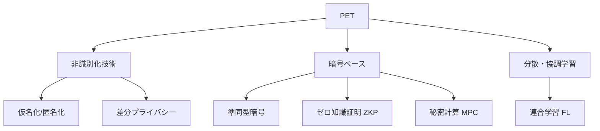

# プライバシー強化技術(PET, Privacy Enhancing Technologies)

## 1. 概要

### A. 定義
> データの**有用性(活用性)を維持しながら、個人情報の識別リスクを除去・最小化**するための技術の総称。データ3法・GDPR の遵守とデータ活用を同時に達成する。

### B. 登場背景および必要性
データ活用とプライバシー保護は、伝統的に**ゼロサムの関係**とみなされてきた。活用するにはデータを共有しなければならないが、共有すれば個人が露出してしまうからである。特に単純な匿名化だけでは、他のデータと結合して個人を再び特定する**再識別攻撃**を防げないことが、複数の事例(例: Netflix の匿名評価データの再識別)で明らかになった。PET はこのゼロサムを打破するために登場した技術群であり、「データを見せずに計算結果だけを得る」あるいは「個人の寄与を数学的に隠す」という方式で、**活用と保護を両立(ポジティブサム)** させる。AI 学習のための大規模なデータ共有の需要が高まるにつれ、PET はプライバシー規制遵守の中核的な手段となりつつある。

## 2. 分類体系

PET はアプローチの原理によって三系統に分けられる。**非識別化技術**はデータそのものを変形して識別性を下げる系統であり、処理後のデータをそのまま活用できるため簡単だが、再識別リスクが完全に消えるわけではない。**暗号ベース**の系統は、データを暗号化したまま計算したり(準同型暗号)、原本を明かさずに事実だけを証明したり(ZKP)、複数の参加者がそれぞれデータを隠したまま共同で計算したりする(MPC)。セキュリティ保証は強力だが、演算・通信コストが大きい。**分散・協調学習**の系統は、データを一か所に集めずそれぞれの場所で学習してモデルだけを共有する連合学習であり、データの移動そのものをなくす。

## 3. 主要技術

各技術は「何を隠し、何を得るか」のトレードオフが異なる。**仮名化/匿名化**は、氏名・住民登録番号のような識別子を仮名・マスキングで置き換える最も基本的な方法であり、法的根拠が明確で処理が簡単だが、準識別子の結合による再識別リスクが残存する。**差分プライバシー(DP)** は、統計結果に精密に計算されたノイズを加え、「特定の個人がデータに含まれているか否かが結果に及ぼす影響」を数学的に制限(ε で定量化)するものであり、精度と保護の強さが反比例する。**準同型暗号(HE)** は、復号せずに暗号文の状態で加算・乗算の演算を行うため、クラウドに預けても原本が露出しないが、演算が非常に遅い。**ゼロ知識証明(ZKP)** は、秘密の値を公開せずに「その値を知っている/条件を満たしている」という事実だけを証明するもので、認証・ブロックチェーンに用いられる。**秘密計算(MPC)** は、複数の機関がそれぞれのデータを公開せずに共同の関数だけを計算し、**連合学習(FL)** は、原本の代わりにローカル学習で得たモデルパラメータだけを中央に集めて統合する。

| 技術 | 原理 | 強み | 限界(トレードオフ) |
|---|---|---|---|
| **仮名化/匿名化** | 識別子の置換・除去 | 簡単・法的根拠 | 再識別リスクが残存 |
| **差分プライバシー(DP)** | 統計にノイズを付加 | 数学的保証(ε) | 精度の損失 |
| **準同型暗号(HE)** | 暗号化状態での演算 | 強力な機密性 | 高い演算コスト |
| **ゼロ知識証明(ZKP)** | 露出なしに事実を証明 | 認証・ブロックチェーンへの活用 | 証明設計が複雑 |
| **秘密計算(MPC)** | 共有なしに共同演算 | 複数機関の協業分析 | 通信オーバーヘッド |
| **連合学習(FL)** | パラメータのみ共有 | データ移動なし | モデルからの逆推論リスク |

## 4. 適用事例

PET は、データの移動が法律上・競争上困難なドメインで特に真価を発揮する。**金融**では、複数の銀行が顧客データを互いに渡すことなく MPC で共同の不正検知モデルを動かし、単独では捕捉できなかった複数機関にまたがる異常取引を検知する。**医療**では、患者データを病院外に出せないため、各病院がローカル学習だけを行ってモデルを集める連合学習で疾病診断モデルを共同開発する。**統計・公共**では、人口統計を公開する際に差分プライバシーでノイズを加え、個々の回答者の保護と統計の有用性を同時に確保する(米国国勢調査局が実際に採用)。

| 分野 | 活用 |
|---|---|
| **金融** | 機関間の不正検知の共同分析(MPC) |
| **医療** | 病院間の連合学習(FL) |
| **統計・公共** | 差分プライバシーに基づく統計公開 |
| **データ結合** | 仮名情報の結合・データ安心区域 |

## 5. 考慮事項および示唆点
- **単一技術の限界と組み合わせ**: どれか一つで完結しないため、手法を組み合わせる。たとえば連合学習(FL)だけではパラメータから原本が逆推論されうるため **FL + DP** でノイズを加え、MPC と HE を組み合わせて協業と機密性を併せて確保する、といった形である。
- **性能と精度の実用的なチューニング**: HE・MPC の演算・通信コストと DP の精度損失は実務導入の障害となるため、保護水準(ε など)と性能を業務要件に合わせて調整することが鍵である。
- **制度・ガバナンスとの並行**: 技術だけでは不十分であり、データ3法・仮名情報制度と**プライバシー・バイ・デザイン(PbD)** の原則を併せて適用し、設計段階からプライバシーを組み込んでこそ持続可能となる。

---

> **一言まとめ**: PET は*仮名・匿名化、差分プライバシー、準同型暗号、ZKP、MPC、連合学習*などによって**データ活用とプライバシー保護を両立**させる技術群であり、各手法のセキュリティと性能のトレードオフを理解して組み合わせ(FL+DP など)、制度・PbD と並行させることが鍵である。
