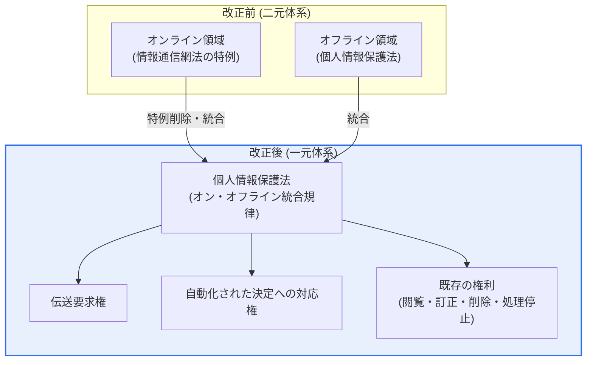
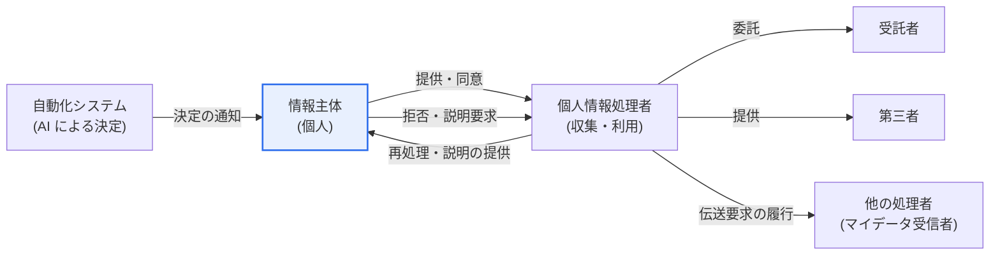

# 韓国個人情報保護法の改正案(2023)

## 1. 概要

### A. 定義
> **2023年改正個人情報保護法**は、2023年3月14日に公布され、原則として同年9月15日から施行された全面改正法であり、オンライン・オフラインで二元化されていた規制を一つに一元化するとともに、**個人情報伝送要求権**と**自動化された決定に対する情報主体の権利**を新たに導入し、*データ経済の活性化と情報主体の権利強化を同時に*図ったことを核心とする。

定義だけでは、この改正の重みは十分に伝わらない。2011年の制定以降、個人情報保護法は幾度も手直しされてきたが、オンライン領域は情報通信網法の特例規定が、オフライン領域は個人情報保護法がそれぞれ規律する二元体系が長く維持されてきた。同じ「個人情報漏えい」であっても、オンライン事業者とオフライン事業者とで適用される条文・課徴金・手続が異なり、名宛人の立場からは混乱が大きかった。2020年のいわゆる「データ3法」改正により情報通信網法の個人情報条項の相当部分が個人情報保護法へ移されたが、特例という形で残存しており、2023年改正はこの特例を削除して**一つの法律で一貫して規律する**体系を完成させた。

### B. 登場背景および必要性
改正の方向性は「**活用は広げつつ、権利は手厚く**」と要約される。背景には、相反するように見える二つの要求が併存していた。第一は**産業的要求**である。マイデータ・人工知能・プラットフォーム経済が拡大するにつれ、散在する個人データを本人の統制の下で安全に移動・結合・活用するための制度的な経路を開いてほしいという声が高まった。データが特定企業に閉じ込められていれば後発事業者のイノベーションが阻まれ、情報主体も自分に有利なサービスへ乗り換えることができない。

第二は**市民的要求**である。自分の情報がどこでどのように使われているのかを知ることが難しく、とりわけ人工知能が人の介入なしに採用・融資・保険引受を決定する時代において、その決定に対して何の異議も申し立てられないという問題意識が高まった。欧州連合の GDPR が2018年に施行され、伝送要求権(データポータビリティ権)と自動化処理に対する権利をすでに明文化していたことも、韓国の立法に直接的な刺激となった。

この二つの要求を一つの法律に盛り込むには、規律体系そのものを再整備する必要があった。すなわち規制を一元化して予測可能性を高めると同時に、情報主体にデータ活用の果実を還元する新たな権利を付与することが、改正の必然的な帰結であった。情報主体の保護なき活用は信頼を失い、活用基盤なき保護は産業を萎縮させるため、両者は切り離せない。

### C. 改正の基本的特徴
改正法は、① 規制体系の**統合(一元化)**、② 情報主体の権利の**拡張(伝送要求権・自動化決定への対応権)**、③ データ活用根拠の**合理化(契約の履行など)**、④ 違反に対する**制裁の実効性強化(全体売上高に基づく課徴金)** という四つの軸で構成される。以下で各軸を文章で詳述する。

## 2. 改正前後の規律体系の変化

まず、規律構造がどのように変わったのか、全体構造を概観する。下図は、改正前の二元体系が改正後の一元体系へ統合される様子と、情報主体に付与された権利群を併せて表現したものである。

改正前は、同一の個人情報処理であっても、事業者が「情報通信サービス提供者」であるか否かによって根拠条文と制裁の水準が分かれていた。改正後は、個人情報保護法という単一の法律がすべての処理者を一貫して規律し、情報主体は従来の閲覧・訂正・削除・処理停止の要求権に加え、伝送要求権と自動化された決定に対する対応権まで行使できるようになった。規制の予測可能性が高まると同時に、権利の一覧が広がったことが核心的な変化である。

| 区分 | 改正前 | 改正後 |
|---|---|---|
| **規律体系** | オン・オフラインの二元(網法特例が残存) | 個人情報保護法に一元化 |
| **情報主体の権利** | 閲覧・訂正・削除・処理停止 | + 伝送要求権、自動化決定への対応権 |
| **収集・利用の根拠** | 同意中心 | 契約の履行など根拠の合理化・明確化 |
| **映像機器** | 固定型 CCTV 中心 | 移動型映像機器(ドローンなど)の基準を新設 |
| **課徴金の基準** | 違反関連売上高中心 | 全体売上高の一定割合(違反と無関係な売上を除外) |

## 3. 主な改正内容の詳細

### A. オンライン・オフライン規制の一元化
規制の一元化は、一見すると条文の整理にすぎないように見えるが、実務的な意味は大きい。かつては同じ漏えい事故であっても、オンライン事業者には情報通信網法特例上の課徴金・通知・届出の規定が、オフライン事業者には個人情報保護法の規定がそれぞれ適用され、公平性をめぐる議論や解釈の争いが頻発していた。特例の削除によってこの境界が消え、**同一行為・同一規律**の原則が確立された。

名宛人の観点では、参照すべき法令が一つに減り、コンプライアンスの負担が下がる。ただし、これまで相対的に緩やかな適用を受けていたオフライン事業者にとっては、オンライン水準の強化された基準が拡大適用される効果もあり、実質的な規律の強度はむしろ高まった領域もある。したがって「一元化=緩和」ではなく、「一元化=基準の上方平準化」と理解するのが正確である。

一元化は、その後導入された新たな権利がオンライン・オフラインの区別なく同一に機能するための土台でもある。伝送要求権と自動化決定への対応権が特定のチャネルにしか適用されなければ実効性が落ちるが、単一の法体系がこれを防ぐ。

### B. 個人情報伝送要求権
伝送要求権(第35条の2)は、情報主体が自らの個人情報を**本人または本人が指定した第三者(他の個人情報処理者)へ伝送するよう要求**できる権利である。これはマイデータサービスの一般法上の根拠であり、これまで金融分野において信用情報法に基づき限定的に実施されてきたマイデータを、全分野へ拡張する出発点となる。

この権利の核心は「データポータビリティ(portability)」である。情報主体が A 事業者に蓄積された自分の情報を B 事業者へ移せるようになれば、ロックイン効果(lock-in)が緩和されて事業者間の競争が促進され、情報主体は各所に散在するデータを一か所に集め、統合資産管理・健康管理のような新たなサービスを享受できる。たとえば複数の銀行・カード・保険に散在する金融情報を一つのアプリに集め、個別化された財務アドバイスを受けるサービスが代表的である。

ただし伝送要求権は、公布と同時にただちに全面施行されたわけではない。伝送対象となる情報の範囲、標準のアプリケーションプログラミングインタフェース(API)、伝送仲介機関、セキュリティ要件などを定める施行令・告示の整備が先行しなければならないため、**分野別に順次施行**する方式が採られた。実際に保健医療・通信など一部の分野が先に施行時期を確定し、エネルギーなど他の分野は準備期間を設けるという形で段階的に拡大されており(詳細な時期は施行令の改正によって変動しうる)、答案では「一般法上の根拠を新設した後、分野別に段階的に施行」という構造で記述するのが安全である。

### C. 自動化された決定に対する情報主体の権利
自動化された決定に対する権利(第37条の2)は、公布から1年後の **2024年3月15日から施行**された。これは、**完全に自動化されたシステム**(人工知能技術を適用したシステムを含む)による処理のみによって、情報主体の権利・義務に**重大な影響**を及ぼす決定が下される場合に、情報主体がその決定を**拒否**し、またはそれについての**説明・検討を要求**できるようにした制度である。

この権利は大きく三つの形で機能する。第一に、**拒否権**は、人の介入なしに下された決定を情報主体が拒否し、人による再処理を要求できるようにする。第二に、**説明要求権**は、決定の基準や処理過程などについての説明を要求できるようにする。第三に、情報主体は自らに有利な情報を追加で提出し、それを決定に反映するかどうかの**検討を要求**できる。たとえば人工知能による信用評価で融資を断られた消費者が、その根拠の説明を求め、欠落していた所得資料を提出して再審査を要請する場面を思い浮かべればよい。

注意すべきは、この権利が無制限ではないという点である。契約の締結・履行に必要な場合や、情報主体が別途同意した場合などには拒否権の行使が制限されうるが、その場合でも説明・検討の要求権は保障するという方式で利益の均衡を図っている。また「完全に自動化された」処理に限定されるため、人が実質的に介入・検討する決定は原則として対象外である。企業の立場からは、どの決定がこの条項の適用対象となるかを自ら分類し、説明可能な人工知能(XAI)の能力と異議処理の手続を備えることが課題となる。

### D. 収集・利用根拠の合理化と移動型映像情報処理機器
改正法は、個人情報の収集・利用の法的根拠も整備した。かつての実務は事実上「同意万能主義」に近く、契約の履行に当然必要な情報についてまで別途同意を得る慣行が形式的な同意を量産していた。改正法は、**契約の締結・履行に必要な場合**など同意以外の処理根拠を明確にし、本当に必要なところに実質的な同意を集中させる方向で合理化した。これは「同意疲れ」を減らし、同意の真正性を高めようとする趣旨である。

また、ドローン・自動運転車・ウェアラブルのように**移動しながら映像を撮影する機器**の普及に対応し、固定型 CCTV 中心であった規定を超えて、**移動型映像情報処理機器**の運営基準を新設した。業務目的での撮影時には、光・音・案内板などで撮影の事実を表示させるなど、公開された場所での撮影と情報主体の認識可能性との均衡を制度化した。新技術が生み出した空白を法が後追いで埋めた事例であり、技術変化に対する立法的対応の典型を示している。

これら二つの変化は方向が相反するように見えるが、実は一つの原理を共有している。収集・利用根拠の合理化は「形式的な同意を減らして実質を生かす」方向であり、移動型映像機器の規定は「新たな撮影手段にも認識可能性を保障する」方向である。いずれも「同意という形式」ではなく「情報主体の実質的な認識と統制」を保護の中心に置くという点で、改正法の一貫した哲学を表している。

この哲学は、実務において「同意管理(consent management)」体系の再設計へとつながる。無分別な同意要求を減らす代わりに、本当に必要な処理については、より明確で理解しやすい方式で同意を得て、その履歴を管理しなければならない。必須・任意の同意を区分し、任意の同意を拒否してもサービス利用に不利益が生じないよう設計することが、改正の趣旨に合致する。

### E. 制裁の実効性強化
改正法は、課徴金の算定基準を**全体売上高**を基準とするものへ引き上げた。かつては「違反行為に関連する売上高」を基準としていたため、実際の賦課額が違反の重大性に比べて小さいという批判があった。改正法は原則として全体売上高の一定割合を上限としつつ、**違反行為と無関係な売上高は除外**するようにして、過剰な制裁を防ぐ安全装置も併せて設けた。この変化は、大規模事業者が個人情報保護をコストではなく中核的なリスクとして認識するよう促す強力な誘因となる。

## 4. 個人情報の処理主体とデータの流れ

権利が実際に機能する文脈を理解するには、個人情報が主体間をどのように流れるのかを見なければならない。以下は、処理主体間の流れに、改正で追加された伝送・自動化決定への対応の流れを加えた詳細図である。

**情報主体**は個人情報の持ち主であり、同意と権利行使の主体である。**個人情報処理者**はこれを収集・利用・管理し、業務を**受託者**に委託したり、**第三者**に提供したりできる。改正によって二つの流れが追加された。一つは、情報主体の伝送要求に従ってデータが**他の処理者へ移動する**流れであり、もう一つは、自動化システムが下した決定を情報主体が**拒否・説明要求**し、処理者がこれに応答する循環の流れである。すなわちデータが一方向に流れるだけであった構造から、情報主体が流れの方向と結果に介入できる構造へと進化したのである。

| 主体 | 役割 |
|---|---|
| **情報主体** | 個人情報の持ち主、同意・権利行使 |
| **個人情報処理者** | 収集・利用・管理、伝送・説明義務の履行 |
| **受託者** | 処理の委託を受けて遂行する者 |
| **第三者** | 提供を受けて自らの目的で処理する者 |
| **伝送受信者** | 伝送要求によってデータを受け取る他の処理者 |

## 5. 海外法制との比較および事例

改正法の二つの新設権利は、欧州連合 GDPR の影響を強く受けている。GDPR は第20条でデータポータビリティ権(right to data portability)を、第22条でプロファイリングを含む自動化された決定に対する権利を規定している。韓国の伝送要求権・自動化決定への対応権はこれと問題意識を共有しているが、GDPR が一般的・包括的に規定しているのに対し、韓国法は**分野別の施行令で具体化**する漸進的なアプローチを採った点に違いがある。

制裁の強度も比較に値する。GDPR は重大な違反に対して、**全世界の年間総売上高の4%または2,000万ユーロのいずれか高い額**まで制裁金を科すことができる。韓国改正法の全体売上高基準への引き上げは、こうしたグローバル基準と歩調を合わせて制裁の実効性を確保しようとする流れとみることができる。ただし韓国法は「違反と無関係な売上の除外」という緩衝装置を置き、比例性を強調した点が特徴である。

韓国国内の適用事例としては、金融分野で信用情報法に基づき先行して定着したマイデータ(本人信用情報管理業)が、伝送要求権の実証モデルの役割を果たしている点が挙げられる。数千万人規模の利用者が複数の金融機関の情報を一つのアプリで照会・管理する経験が蓄積されており、改正法はこのモデルを医療・通信など非金融分野へ拡張する法的な足場となる。

一方、両法制のアプローチの違いは施行方式にも表れる。GDPR が加盟国に直接適用される規則(Regulation)の形で権利を一括して規律するのに対し、韓国法は上位法で権利の骨格だけを定め、詳細な要件を下位規範(施行令・告示)と分野別の施行時期に委任する構造を採っている。これは産業別のデータ特性と準備状況を反映して衝撃を分散できるという長所がある一方、施行時期と適用範囲の不確実性が大きくなり、企業が対応計画を立てにくいという短所もある。したがって実務では、下位規範の立法予告・行政予告の動向を継続的に追跡し、段階的に対応体制を整えることが現実的である。

## 6. 深化: 最新動向および予想される出題方向

施行以降、個人情報保護委員会は下位規範を順次整備している。自動化された決定については、施行令と「自動化された決定に対する措置基準」などの詳細な指針が整備され、どのような決定が「重大な影響」に該当するのか、説明はどの水準まで提供すべきかといった実務基準が具体化されつつある。伝送要求権については、全分野のマイデータへ拡張するための標準 API・仲介機関・セキュリティ要件を盛り込んだ施行令改正が続き、分野別の施行時期が順次定められている。

出題の観点では、① 伝送要求権と自動化決定への対応権の**概念・要件・限界**をそれぞれ説明させる、② GDPR との**比較**を求める、③ 企業の**対応方策(同意設計、伝送処理手順、XAI、異議処理体制)** を問う、という形が有力である。また人工知能関連の法制(人工知能基本法、ISO/IEC 42001 など)と連携させ、「アルゴリズムの説明責任」の観点から統合的に記述する答案は高い評価を受けうる。類似・関連テーマとしては、マイデータ、データ3法、仮名情報、個人情報影響評価(PIA)、プライバシー・バイ・デザイン(PbD)がある。

答案構成の戦略としては、概要で「活用と権利の同時強化」という改正の哲学を明確に提示し、本文で規制の一元化・伝送要求権・自動化決定への対応権・制裁強化をそれぞれ要件と限界まで記述し、概念図でデータの流れと権利の作動構造を可視化する流れが効果的である。結論では、企業のコンプライアンスの再整備、アルゴリズムの説明責任、グローバルな整合性を併せて扱い、技術士の観点からの洞察を示すことが望ましい。

## 7. 考慮事項および示唆点

1. **マイデータ普及の一般法上の基盤の確立**: 伝送要求権によって個人が自らのデータを複数のサービスへ移せるようになり、データ移動に基づく新産業が促進される。ただし標準 API・仲介機関・セキュリティ要件の整備が先行してこそ実効性が確保されるため、制度設計とインフラ構築のスピードを合わせることが鍵である。
2. **アルゴリズムの説明責任の制度化**: 自動化された決定に対して人の介入・説明を求められるようになったことで、企業は決定の根拠を説明できる説明可能な人工知能(XAI)の能力と、人による再処理の手続を備えなければならない。これは人工知能ガバナンス(ISO/IEC 42001)に直結する課題である。
3. **コンプライアンス体制の再整備**: 同意の方式(必須・任意の区分)、伝送要求の処理プロセス、自動化決定への対応窓口、移動型映像機器の運営基準などを新たに整備しなければならない。全体売上高に基づいて強化された課徴金は、個人情報保護を経営リスクの最上位へと押し上げる。
4. **活用と保護の均衡という設計哲学**: 改正法は規制の緩和か強化のどちらか一方ではなく、活用の経路を開きつつ、その経路に権利という安全装置を取り付ける方式で均衡を取った。技術士は個々の条文を超えて、「データ活用と情報主体の信頼の好循環」という政策目標の観点からシステム・プロセスを設計できなければならない。
5. **グローバルな整合性の確保**: GDPR など国際基準と歩調を合わせた制裁・権利体系は、韓国企業の海外進出や国家間のデータ移転(十分性認定など)にも有利に働く。国際基準との整合性は、規制遵守のコストであると同時に競争力でもある。
6. **段階的施行に対する常時モニタリング**: 伝送要求権のように下位規範と分野別の施行時期が順次確定する制度は、施行時期と適用範囲が変動しうるため、立法予告・告示の動向を継続的に追跡しなければならない。確定していない詳細要件を断定するよりも、骨格を理解したうえで、分野別の確定に合わせて対応計画を漸進的に具体化していく姿勢が必要である。

## 参考資料

- 国家法令情報センター(韓国)、「個人情報保護法」本文 — https://www.law.go.kr/법령/개인정보보호법
- 個人情報保護法第37条の2(自動化された決定に対する情報主体の権利等)、CaseNote — https://casenote.kr/법령/개인정보_보호법/제37조의2
- 個人情報保護法一部改正法律の国会通過(2023)、Lexology — https://www.lexology.com/library/detail.aspx?g=18cd2484-6641-4305-842e-d192f33f4df0
- 個人情報保護法上の自動化された決定に対する情報主体の対応権、法律新聞ニュースレター — https://www.lawtimes.co.kr/LawFirm-NewsLetter/196490

---

> **一言まとめ**: 2023年改正個人情報保護法は、*オンライン・オフライン規制の一元化、伝送要求権(マイデータの根拠)、自動化された決定に対する拒否・説明要求権、全体売上高に基づく課徴金の強化*を通じてデータ活用と情報主体の権利をともに引き上げたものであり、企業は同意設計・伝送処理手順・説明可能な AI・異議処理体制を整備し、活用と保護の均衡に対応しなければならない。
