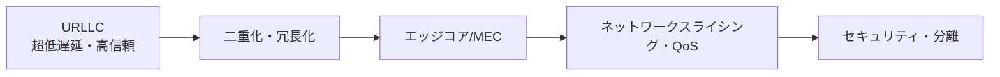
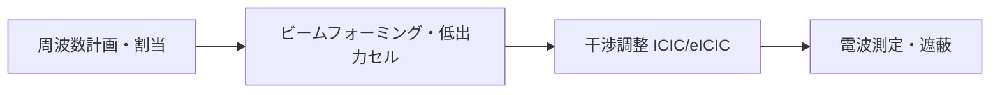

# ローカル5G(Private 5G)構築時の考慮事項

## 1. 概要

### A. 定義
> 特定の企業・機関が、**自社の建物・工場など限定された区域に専用で構築・運用**する5Gネットワーク。移動通信事業者の公衆網を借りる代わりに、組織が直接網を所有・統制する。韓国では **イウム5G(e-Um 5G)**(2021~)として制度化され、4.7GHz・28GHz 帯を需要企業に直接割り当てている。

ローカル5Gの本質は、**ネットワークの所有権と統制権を利用者側の組織が持つ**という点にある。公衆網は多数の加入者が資源を共有するため、特定の工場の要求(超低遅延・データセキュリティ・特定のカバレッジ)を個別に保証することが難しい。ローカル5Gはその区域だけのための専用資源を確保し、ミッションクリティカルな産業が求める**決定論的(deterministic)な性能とデータ主権**を実現する。

### B. 背景および必要性
スマートファクトリー・自律物流・遠隔医療のような産業現場は無線の柔軟性を求めるが、従来の Wi-Fi は干渉・ハンドオーバー・セキュリティに弱く、有線には移動性がない。また製造データを外部の通信網へ送り出すことは、セキュリティ上敬遠される。5G の3大特性 — **eMBB**(超広帯域)、**URLLC**(超低遅延・高信頼)、**mMTC**(多数同時接続) — のうち、特に URLLC とローカルなデータ処理に対する産業上の需要が、ローカル5G登場の背景である。ローカルコアと MEC を現場に置けば、データを外部に出さずに低遅延で処理できるため、OT(制御技術)環境の要求を満たす。

元の問題は、ローカル5G構築時の **① 安定性・信頼性の確保方策**と **② 干渉回避の方策**を併せて求めているため、以下では両軸をいずれも扱う。

## 2. 安定性・信頼性の確保方策

工場でロボット・AGV が無線で制御される環境では、ネットワークの瞬断が一度起きるだけで生産停止や安全事故に直結する。したがってローカル5Gの安定性は、「障害が起きてもサービスが途切れないように」する**多重防御**によって確保する。

- **URLLC の適用**: 1ms 級の超低遅延と99.999%(five-nines)の高信頼伝送を目標に、**短い TTI**・事前スケジューリング・再送(HARQ)の手法を用いる。遅延に敏感なリアルタイム制御(ロボットアーム・安全停止)に不可欠である。
- **二重化(Redundancy)**: コア・伝送・電源・基地局など各区間を二重化して**単一障害点(SPOF)** を除去し、障害時には予備経路へ自動切替(フェイルオーバー)する。二重化のないローカル5Gは可用性目標を達成できない。
- **エッジコンピューティング(MEC)**: コア・演算を現場の近くに配置し、**バックホール(外部網)への依存と往復遅延を最小化**する。外部回線が切れてもローカルでサービスの継続性を維持できる点が、安定性に大きく寄与する。
- **ネットワークスライシング**: 一つの物理網を用途別の論理網に分離し、制御用トラフィックと一般トラフィックが互いに影響しないよう**分離して QoS を保証**する。急増する映像トラフィックが制御信号を押しのける状況を防ぐ。
- **セキュリティ・分離**: 専用網を物理的・論理的に分離し、相互認証・暗号化・アクセス制御を適用して、外部からの侵入とデータ流出を遮断する。
- **モニタリング**: 性能・障害をリアルタイムで監視し、SLA を管理して異常の兆候を早期に捉える。

| 方策 | 中核メカニズム | 確保される効果 |
|---|---|---|
| **URLLC** | 短い TTI・HARQ | 低遅延・高信頼 |
| **二重化** | SPOF の除去・フェイルオーバー | 可用性 |
| **MEC** | ローカル処理・バックホールの最小化 | 継続性・低遅延 |
| **スライシング** | 論理網の分離・QoS | トラフィックの保証 |
| **セキュリティ** | 分離・認証・暗号化 | 機密性・完全性 |

## 3. 干渉回避の方策

工場は金属構造物・機械が多いため電波の反射・遮蔽が激しく、隣接セルや他の無線機器との干渉が性能を低下させる。干渉は信号対雑音比を下げて URLLC の信頼性を直接損なうため、以下のように計画・物理・調整の三つの層で対応する。

- **周波数計画・割当**: セルごとのチャネルを計画的に配置し、**周波数再利用(Frequency Reuse)** の際には隣接セルが異なるチャネルを使うようにして同一チャネル干渉を減らす。隣接帯域の事業者との干渉も事前に調整する。
- **ビームフォーミング・低出力セル**: 指向性アンテナで信号をユーザーの方向へ集中させる(**ビームフォーミング**)と、不要な方向への電波が減り、セル境界の干渉が減少する。**スモールセル**で出力を下げて密に配置すれば、セルあたりのカバレッジが狭くなり、干渉管理が容易になる。
- **干渉調整(ICIC/eICIC)**: セル間の資源・電力を協調的に調整し、**電力制御**・スケジューリングによってセル境界ユーザーの干渉を緩和する。
- **電波環境の最適化**: 事前の**電波測定・シミュレーション(RF 設計)** によって不感地帯・干渉地点を把握し、遮蔽材・中継器(リピータ)を適切に配置して屋内の電波環境を改善する。
- **周波数共用・共存**: 共用帯域を併用する場合は、**LBT(Listen-Before-Talk)** などによって他システムと共存する。

| 方策 | 原理 | 効果 |
|---|---|---|
| **周波数計画** | 再利用・隣接帯域の調整 | 同一チャネル干渉↓ |
| **ビームフォーミング・低出力** | 指向性・低出力 | 境界干渉↓ |
| **干渉調整** | ICIC/eICIC・電力制御 | 境界性能↑ |
| **電波の最適化** | 測定・遮蔽・中継 | 不感地帯・反射への対応 |

## 4. 考慮事項および示唆点
- **費用対効果**: 専用周波数の利用料・機器・運用人員のコストが大きいため、無線の柔軟性と低遅延が実際に必要な工程に優先的に適用する。**自営構築 vs 通信事業者への委託(マネージド型)** のモデルを、組織の能力に合わせて選択する。
- **OT の特性上、可用性・セキュリティが最優先**: 製造・医療の現場では瞬断がそのまま損失・安全問題となるため、二重化と物理的・論理的分離は選択ではなく必須である。IT セキュリティとは異なり、**可用性が機密性に優先する**という優先順位を考慮する。
- **トレードオフ・展望**: セルを密にすれば干渉は減るが、ハンドオーバーと構築費が増える。今後は 5G-Advanced・6G と**決定論的ネットワーキング(TSN 連携)**、AI に基づく自律最適化(SON)へと発展し、スマートファクトリー・自律物流・遠隔医療の**デジタルトランスフォーメーションの中核インフラ**へと拡大すると見込まれる。

---

> **一言まとめ**: ローカル5G(イウム5G)は*組織専用の5Gによって超低遅延・高信頼とデータ主権*を提供するものであり、URLLC・二重化・MEC・スライシングによって安定性・信頼性を、周波数計画・ビームフォーミング・干渉調整・電波の最適化によって干渉回避を確保しつつ、コストと可用性のバランスを考慮しなければならない。
