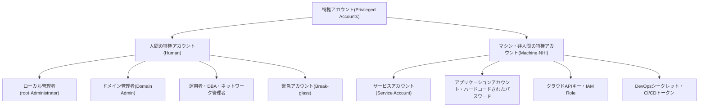
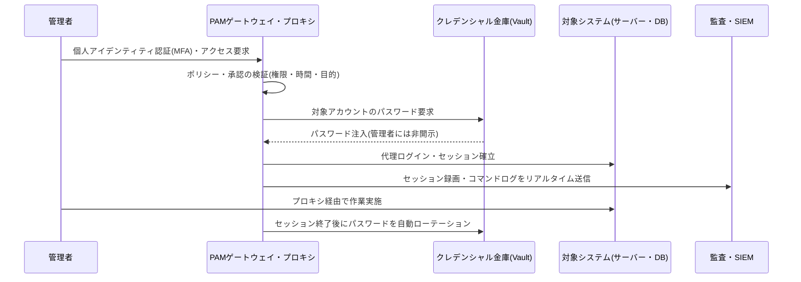

# 特権アクセス管理(PAM, Privileged Access Management)

## 1. 概要

> **特権アクセス管理(PAM, Privileged Access Management)**とは、システム・データ・インフラに対して広範な権限を持つ特権アカウントと特権セッションを識別・保管(ボールティング)・統制・監視・回収するセキュリティ管理体系であり、「誰が、いつ、どの特権で、何をしたか」を統制・追跡することで、特権の濫用とアカウント乗っ取りによる被害を最小化することを目的とする。

一般ユーザーアカウントの管理と特権アカウントの管理とでは、リスクの大きさそのものが異なる。一般アカウントが乗っ取られた場合、被害は当該ユーザーの業務範囲に限定されるが、管理者(root・Administrator)・サービスアカウント・DBAアカウントのような特権アカウントが乗っ取られると、システム全体の設定変更、ログ削除、大量データ流出、バックアップ破壊まで可能となる。実際、多くの侵害事故は初期侵入の後に**権限昇格(privilege escalation)**と**横展開(lateral movement)**を経てドメイン管理者権限を奪取する経路で拡大しており、その過程で特権アカウントが中核的な攻撃標的となる。

特権アカウントの管理が難しい理由は、その数が多く分散しており、さらに人間ではないアカウントが大多数を占める点にある。OSの管理者アカウントだけでなく、アプリケーションがDBへ接続するためのサービスアカウント、スクリプトにハードコーディングされたパスワード、スケジューラが使用するバッチアカウント、クラウドのAPIキー、DevOpsパイプラインのシークレットまで、すべてが特権を持つ。これらは担当者が退職しても残存したり、複数システムで同一パスワードを共有したり、数年間変更されないまま放置されたりしやすい。このように所有者不在のまま漂うアカウントを**孤児アカウント・ゾンビアカウント**と呼び、PAMの最初の課題はまさにこうした特権アカウントの全数識別(discovery)である。

PAMはアイデンティティおよびアクセス管理(IAM)の下位領域であるが、目標と統制の強度が異なる。IAMが「すべてのユーザーに正しい権限を付与する」という広範な問題を扱うのに対し、PAMは「少数の強力な権限を高密度に統制する」ことに集中する。ゼロトラストの普及に伴い、PAMは単なるアカウントパスワードの金庫を超え、セッション単位の検証と最小権限・常時権限の排除(ZSP, Zero Standing Privilege)を実現する中核的な柱として再定義されつつある。

PAMを貫く中核的特徴は三つに集約される。第一は**中央集権的統制**であり、分散した特権クレデンシャルを一つの金庫に集め、管理ポイントを単一化する。第二は**最小権限・最小露出**であり、必要な権限だけを必要な時間にのみ付与して常時露出をなくす。第三は**完全な追跡可能性**であり、すべての特権行為を個人のアイデンティティとマッピングして記録することで、事後の責任究明と監査を可能にする。この三つの特徴は、それぞれアクセス面の縮小・被害ウィンドウの最小化・説明責任(追跡性)の確保というセキュリティ目標に対応する。

PAMが独立した領域として発展してきた背景も押さえておく必要がある。初期には管理者が各自サーバーのパスワードをExcelやメモに記録して管理する程度であったが、その後、共用パスワードを中央の金庫に保管する**パスワードボールト(Password Vault)**の形態へと進化した。しかしボールトだけでは「パスワードを取り出した後に何をしたか」を統制できないという限界が明らかになり、セッションそのものをプロキシで中継・録画するセッション管理が結合された。近年では常時付与された権限そのものをなくそうという問題意識が高まり、JIT・ZSPへと重心が移りつつある。すなわちPAMの発展史は「パスワードを隠す」から「行為を統制・記録する」を経て「権限そのものを常時保有しない」へと進む流れとして要約でき、これはゼロトラストの思想と正確に軌を一にしている。

## 2. 特権アカウントの類型とPAMの統制対象

PAMを設計するには、まず「何が特権アカウントか」を構造的に把握しなければならない。特権は人間のアカウントだけでなく、マシン・アプリケーションにも広く存在するため、類型を分けなければ統制範囲に穴が生じる。以下の概念図は、特権アカウントがどのような系統で存在するかを全体構造として示している。

第一に、**人間の特権アカウント**は、実際の人間が管理目的で使用するアカウントである。サーバーのroot、WindowsのAdministrator、Active DirectoryのDomain Admin、データベースのDBAアカウント、ネットワーク機器のenableアカウントなどがこれに該当する。これらは事故発生時に原因追跡が可能でなければならないため個人識別性が重要であるが、複数の管理者が共用rootアカウントを使うと「誰がやったのか」を特定できないという根本的な問題が生じる。PAMは共用アカウント使用時にもまず個人のアイデンティティで認証させ、そのマッピングをログに残すことで説明責任(accountability)を確保する。

特にドメイン管理者アカウントは組織全体の信頼基盤を掌握し得るため、攻撃の最終目標となる。Active Directory環境でドメイン管理者権限を奪取した攻撃者は、Kerberos認証チケットを偽造するゴールデンチケット(Golden Ticket)攻撃などにより、事実上無制限の永続性を確保できる。したがってPAMは、ドメイン管理者・エンタープライズ管理者のように影響範囲の大きいアカウントを別途最上位の等級に分類し、専用の管理端末(PAW, Privileged Access Workstation)でのみ使用させるよう階層を分離(Tiering)する統制を併用する。

第二に、**緊急アカウント(Break-glass account)**は、平常時は封印しておき、PAMシステムの障害や大規模災害など正規経路でのアクセスが不可能な非常事態においてのみ開封して使用する最上位アカウントである。「ガラスを割って取り出す」という比喩のとおり、開封そのものが強力なアラートを発生させ、使用後は直ちにパスワードを再設定するよう設計する。緊急アカウントを置かなければPAM自体が単一障害点となり、かえって可用性を損なうため、統制と可用性のバランスを取る安全装置として必ず設計しなければならない。

第三に、**マシン・非人間アイデンティティ(NHI, Non-Human Identity)**は、近年最も急速に増加している統制対象である。マイクロサービス・コンテナ・サーバーレスの普及により、人間よりはるかに多くのサービスアカウントとシークレットが自動的に生成・消滅している。例えば一つのWebアプリケーションがDB・キャッシュ・メッセージキュー・外部APIにそれぞれ接続するには複数のクレデンシャルが必要であり、これがソースコードや設定ファイルに平文で埋め込まれていれば、構成管理システムの一度の流出で全体が露出する。PAMはこうしたシークレットをコードから分離して金庫に保管し、アプリケーションが実行時にAPI経由で動的に取得するようにする。

非人間アイデンティティは、人間のアカウントと異なり明示的な所有者が不明確で、MFAのような対話型認証を適用しにくいという点で統制が難しい。一つのサービスアカウントが複数システムで再利用されていれば、一件の流出が連鎖的被害へと広がり、パスワードを安易に変更すると連携するバッチ・連携システムが同時に障害を起こし得るため、ローテーションさえ慎重を要する。したがってPAMは非人間アイデンティティについて、使用先を正確にマッピング(依存関係の把握)した上でローテーション範囲を統制し、可能であれば静的パスワードそのものを短寿命の動的クレデンシャルに置き換えて、流出リスクを根本的に低減する戦略を採る。

| 統制対象 | 代表例 | 中核リスク | PAMの統制方式 |
|-----------|-----------|-----------|----------------|
| 人間の管理者アカウント | root, Administrator, DBA | 濫用・共用アカウントの追跡不能 | 個人認証後の代理接続・セッション記録 |
| 緊急アカウント | Break-glass | 常時露出・濫用 | 封印・開封アラート・使用後ローテーション |
| サービスアカウント | バッチ・デーモンアカウント | パスワード未変更・共有 | 自動ローテーション・使用範囲の制限 |
| アプリケーションシークレット | ハードコードされたパスワード・トークン | コード流出時の大量露出 | シークレット金庫・動的取得 |
| クラウドクレデンシャル | API Key, IAM Role | 過剰権限・長期残存 | 短期トークン・JIT発行 |

## 3. PAMの中核機能とアーキテクチャ

PAMソリューションは、いくつかの独立した機能を一つの統制フローとして結び付ける。管理者が特権リソースにアクセスしようとする瞬間から、セッションが終了して監査が行われるまでの処理経路を理解することが重要である。中核構成要素は大きく、クレデンシャルを保管・ローテーションする**金庫(Vault)**、セッションを中継・隔離・録画する**プロキシ・ゲートウェイ**、ポリシーを判断する**ポリシーエンジン**、そして履歴を蓄積・分析する**監査・分析レイヤー**に分けられる。これらは物理的には複数のコンポーネントであるが、管理者の立場からは一つのアクセス関門として動作してこそユーザビリティが確保される。以下はPAMの代表的なアクセス処理アーキテクチャである。

**第一に、クレデンシャルボールティング(Credential Vaulting)とパスワードローテーション。** PAMの出発点は、特権アカウントのパスワード・鍵を人間が知らない状態にすることである。すべての特権パスワードは暗号化された金庫に保管され、管理者はパスワードを直接見ることなくPAMを通じて対象システムに接続される。セッションが終わるとパスワードを直ちにランダムに再設定(自動ローテーション)するため、仮に画面キャプチャなどでクレデンシャルが流出しても再利用は不可能である。例えば金融機関の次世代システムでは、DBAアカウントのパスワードを24時間ごと、または1回使用するごとにローテーションするポリシーを設定し、協力会社の要員が常駐していてもアカウントを私的に保持できないようにしている。

**第二に、セッション管理と隔離(PSM, Privileged Session Management)。** 管理者は対象サーバーに直接接続せず、PAMプロキシ(踏み台サーバー)を経由する。この構造においてPAMはすべてのセッションを映像・テキストで録画し、危険なコマンド(例:`rm -rf`、`DROP TABLE`)をリアルタイムで検知・遮断できる。管理者端末と対象システムが直接接続されないため、管理者PCが感染してもマルウェアが対象サーバーへ直ちに伝播しないという隔離効果が生じる。

**第三に、最小権限の適用(PEDM, Privilege Elevation and Delegation Management)。** 管理者に常時root権限を付与する代わりに、必要なコマンドだけをその都度昇格させて実行させる。Linuxのsudoポリシーの細分化、Windowsのアプリ単位の権限昇格、アプリケーションのホワイトリストがこれに該当する。ユーザーは普段は一般権限でログインし、特定の管理作業を行うときにのみ承認された範囲で権限が昇格するため、攻撃面が大きく縮小する。

**第四に、ジャストインタイム権限付与(JIT, Just-In-Time)と常時権限の排除(ZSP)。** 従来の方式は管理者にあらかじめ権限を付与しておくが、この「常時権限(Standing Privilege)」こそが攻撃対象となる。JITは要求・承認の時点でのみ期限付きで権限を付与し、作業が終われば回収することで、大部分の時間において誰も特権を保有しない状態(ZSP)を目指す。クラウド環境では、永続的なIAMキーの代わりに数十分単位で失効する短期トークンを発行する方式で実装する。例えば夜間のデプロイ作業が必要な開発者に事前に本番環境の管理権限を常時付与する代わりに、変更管理チケットの承認と連動して作業予定時間帯にのみ30分間の権限を発行し自動回収すれば、アカウントが乗っ取られても権限が有効な時間そのものが極めて短いため、被害ウィンドウ(window)が最小化される。

**第五に、監査・行動分析(Audit·UEBA)。** PAMはすべての特権アクセス・コマンドをログに残すだけにとどまらず、ユーザー・エンティティ行動分析(UEBA, User and Entity Behavior Analytics)を組み合わせて、普段と異なる異常パターンを検知する。例えば特定のDBAが普段は照会しない大量の個人情報テーブルを深夜に照会した場合、認証は正常であってもリスクスコアを上げて追加認証を要求したり、セッションを遮断したりできる。このように蓄積されたセッション記録は事後のフォレンジックや規制監査の証拠としても活用されるため、ログの完全性(改ざん防止)と保存期間の管理を併せて設計しなければならない。

これら五つの機能は、結局のところ特権アカウントのライフサイクル全区間を統制するものとして整理される。PAMの統制フローをライフサイクルとして要約すると次のとおりである。

- **識別(Discovery):** 組織内のすべての特権アカウント・シークレット・孤児アカウントを全数調査し、統制対象のリストを確保する。
- **保管(Vaulting):** クレデンシャルを暗号化金庫へ移管し、コード・文書から平文パスワードを除去する。
- **統制(Control):** 要求・承認・最小権限(PEDM)・JITによりアクセスを制限し、プロキシ経由を強制する。
- **監視(Monitor):** セッションを録画・分析し、異常行為をリアルタイムで検知・遮断する。
- **回収(Rotate·Revoke):** 使用後にパスワードをローテーションし、期限付き権限を回収して常時露出をなくす。

## 4. 類似概念との比較と導入事例

PAMはIAM・IGAとしばしば混同されるが、焦点が異なる。IAMは組織全体のユーザーのアイデンティティ・認証・認可を扱う広い傘であり、IGA(Identity Governance and Administration)はその中でも権限付与の適正性・認証周期・監査に特化したガバナンス領域である。PAMはさらにその中で、**強力な権限を持つ少数のアカウントとセッションのリアルタイム統制**に集中するという点で統制密度が最も高い。三つの概念は代替関係ではなく階層的な補完関係にあり、IGAが「誰がどの権限を持つべきか」を定めれば、PAMは「その強力な権限が実際にどう使われるか」を統制する。

| 区分 | IAM | IGA | PAM |
|------|-----|-----|-----|
| 対象 | 全ユーザー | 全権限・ロール | 特権アカウント・セッション |
| 焦点 | 認証・SSO・認可 | 権限の適正性・認証・監査 | ボールティング・セッション統制・最小権限 |
| 時点 | 常時ログイン | 定期的レビュー | アクセス・セッション単位のリアルタイム |
| 代表的統制 | MFA, プロビジョニング | アクセス認証(Access Certification) | パスワードローテーション, セッション録画, JIT |

PAMはアクセス制御モデルとも区別して理解しなければならない。DAC・MAC・RBACのようなアクセス制御モデルが「どの主体がどの客体にアクセスできるか」というポリシーの論理を規定するのに対し、PAMはそのポリシーが適用される特権アカウントに対して、クレデンシャル保管・セッション中継・行為監視という運用統制を上乗せする。すなわちアクセス制御モデルがルール(rule)であるとすれば、PAMはそのルールが強力な権限に対して実際に守られるようにする執行・監視インフラに近い。両概念は対立するものではなく、アクセス制御ポリシーの上でPAMが特権領域の執行を担う関係として結合される。

実務の導入事例を見ると、統制の効果は明確に表れる。例えば多数の管理者と協力会社要員が共用rootでサーバーに接続していた組織がPAMを導入すると、個人アイデンティティ認証後の代理接続が強制され、「誰が何をしたか」がセッション録画として残る。これは事故調査時間を短縮するだけでなく、監査対応と規制遵守(ISMS-Pのアクセス制御・アカウント管理の統制項目、個人情報の安全性確保措置基準におけるアクセス権限管理・接続記録保管など)を自動化する効果がある。別の事例として、ソースコードにDBパスワードをハードコーディングしていた開発組織がシークレット金庫を導入してコードからクレデンシャルを除去すれば、構成管理リポジトリが流出しても実際のパスワードは露出しない。統計的にも侵害事故の相当数がクレデンシャルの濫用に起因するという点から、特権クレデンシャルの金庫化・ローテーション・最小権限化は投資対効果の高いリスク低減統制と評価される。

逆に、導入過程でよく見られる失敗類型も併せて理解してこそ実効的な設計が可能となる。代表的な落とし穴は次のとおりである。

- **金庫化だけして行為は放置:** パスワードをボールトに入れても、セッション録画・コマンド統制がなければ、権限を取り出した後の濫用は防げない。ボールティングとセッション管理は必ずセットで運用しなければならない。
- **非人間アイデンティティの漏れ:** 人間の管理者だけを統制し、サービスアカウント・APIキーを見落とすと、実際の攻撃面の多数を占めるマシンアイデンティティがそのまま露出する。
- **過剰な統制による迂回の誘発:** 承認手続きが過度に遅いと、現場がPAMを迂回して別アカウントを作成したり統制外の経路を使ったりするようになり、かえって死角が拡大する。リスクベースで統制強度を差別化すべきである。
- **Break-glassの未設計:** 緊急アカウントなしにPAMだけを強制すると、PAM障害時に復旧そのものが不可能となり、可用性の危機を招く。
- **ログ完全性の未確保:** セッションログが改ざん可能であれば、監査証拠としての効力を失う。別途保存・ハッシュチェーン・SIEM連携により完全性を保証しなければならない。

## 5. 深掘り — クラウド・DevOps環境への拡張と最新動向

従来のPAMはオンプレミスのサーバーと人間の管理者を前提に発展してきたが、クラウド・コンテナ・DevOpsの普及に伴い、統制対象と方式が根本的に再編されつつある。第一は**非人間アイデンティティの爆発的増加**である。マイクロサービス・サーバーレス環境では人間よりマシンアイデンティティが数十倍多く、それらのシークレットが短い周期で生成・消滅する。これにより静的パスワードをローテーションする従来方式だけでは限界があり、実行時に短期クレデンシャルを動的に発行する**シークレット管理(Secrets Management)**とワークロードアイデンティティ連携が、PAMの必須の拡張領域となった。

第二は**JIT・ZSP中心への転換**である。クラウドでは長期APIキーが流出した際の被害が大きいため、ロールベースの短期トークンを要求時点でのみ発行する方式が標準として定着しつつある。これは「権限をあらかじめ与えて後で回収する」モデルを「必要なときだけ与えて即座に回収する」モデルへと反転させるものであり、ゼロトラストの最小権限原則と正確に合致する。この転換は監査の観点からも利点がある。常時権限がなければ「今この権限がなぜ付与されているのか」を毎回レビューする必要がなく、発行履歴だけで権限使用の正当性を追跡できるため、アクセス認証(Access Certification)の負担が軽減される。第三は**CIEM(Cloud Infrastructure Entitlement Management)**との結合である。マルチクラウドにおいて過剰に付与された権限(Excessive Permission)や未使用権限を継続的に分析・縮小するCIEMはクラウド特権管理の中核として浮上しており、PAM・CNAPPと相互補完的に統合される傾向にある。

第四に、標準・フレームワークの側面では、PAMはゼロトラストアーキテクチャ(NIST SP 800-207)のポリシー執行ポイント(PEP)と結合してセッション単位の検証を強化しており、韓国国内でもISMS-P認証基準や公共・金融のセキュリティガイドにおいて、特権アカウント管理・接続記録の保存・最小権限が明示的に求められている。特に個人情報を大量に処理するシステムでは、管理者アカウントの接続記録を一定期間以上保管して改ざんを防止し、アクセス権限を必要最小限に差別化して付与するよう規定されており、PAMはこうしたコンプライアンス要件を自動化する実質的な手段となる。今後は、AIエージェントが自律的にシステムを操作する**エージェンティックAI**環境において、人間ではないAIエージェントに付与される特権をいかに統制・監査するかが、PAMの新たな課題として浮上する見通しである。予想される出題方向としては、①PAMの構成要素とアーキテクチャを説明し、②JIT・ZSPの概念を最小権限原則と関連付けて記述し、③IAM・IGA・PAMの違いとゼロトラストとの連携を論じる構成が有力である。

## 6. 考慮事項および示唆

技術士の観点から、PAMは単なるソリューション導入ではなく、アカウント・権限ガバナンスの再設計としてアプローチすべきであり、次の点を総合的に考慮する。

- **適用戦略(段階的導入):** 特権アカウントの全数識別(Discovery)→金庫化・パスワードローテーション→セッション統制・録画→最小権限(PEDM)→JIT・ZSPの順に成熟度を高める。最初からすべての統制を強制すると運用上の抵抗が大きいため、リスクの高いドメイン管理者・DBAアカウントから優先的に適用するリスクベースのアプローチが現実的である。成熟度の段階ごとに統制効果と運用負担を併せて測定し、統制が現場の生産性を過度に阻害しない地点を見極めて展開速度を調整することが成功の鍵である。

- **可用性とのトレードオフ(単一障害点の回避):** PAMプロキシがすべての特権アクセスの関門となるため、PAM自体がダウンすると運用・緊急対応が麻痺し得る。冗長化・高可用性構成とともにBreak-glassアカウントを必ず設計し、統制と可用性のバランスを取らなければならない。

- **成果測定指標:** 導入効果は、金庫化された特権アカウントの比率、常時権限保有アカウント数の減少、未変更パスワード(滞留クレデンシャル)の比率、セッション録画のカバレッジ、異常行為の検知・対応時間(MTTD・MTTR)などで定量化し、継続的改善の根拠とする。

- **説明責任と規制遵守:** 共用アカウント使用時にも個人アイデンティティのマッピングとセッションログを確保し、「誰が、いつ、何をしたか」を再現できなければならない。ISMS-Pのアクセス制御・アカウント管理、個人情報の安全性確保措置基準における接続記録保管・アクセス権限管理の要件と整合するよう、ログの保存期間・完全性(改ざん防止)を設計する。

- **非人間アイデンティティ・シークレットへの拡張:** 人間のアカウントだけを統制すると、サービスアカウント・APIキー・CI/CDトークンというより大きな攻撃面が放置される。シークレット金庫・動的クレデンシャル・CIEMを組み合わせ、マシンアイデンティティまで統制範囲を広げなければならない。

- **連携技術の観点:** PAMはゼロトラスト(ZTNA)・SIEM/SOAR・IGA・CNAPPと連携したときに効果が最大化される。セッションの異常行為をSIEMで相関分析し、SOARで自動対応し、IGAの定期的なアクセス認証で権限の適正性を点検する統合セキュリティ運用体系の中にPAMを位置付けるべきである。

- **組織・プロセスの観点:** PAMは技術導入だけでは完成せず、特権の付与・承認・回収の責任主体と手続きを、変更管理・職務分掌(SoD)の原則に沿って再定義しなければならない。要求者・承認者・実行者を分離し、定期的に特権アカウントの現状を再点検するガバナンスのルーチンがなければ、時間の経過とともに統制は再び緩んでしまう。

- **展望:** 非人間アイデンティティとAIエージェントの特権が爆発的に増加するにつれ、人間中心のPAMはワークロード・エージェントのアイデンティティ管理へと重心を移していくであろう。静的クレデンシャルを最小化し、短期・動的アイデンティティと継続的検証を組み合わせた「常時権限ゼロ(ZSP)」が、特権管理の目標状態として定着する見通しである。

## 参考資料
- NIST SP 800-207, Zero Trust Architecture — https://csrc.nist.gov/pubs/sp/800/207/final
- CISA, Zero Trust Maturity Model — https://www.cisa.gov/zero-trust-maturity-model
- 韓国インターネット振興院(KISA), ISMS-P認証基準案内 — https://isms.kisa.or.kr
- OWASP, Secrets Management Cheat Sheet — https://cheatsheetseries.owasp.org/cheatsheets/Secrets_Management_Cheat_Sheet.html

---
> **一言まとめ**: PAMは特権アカウント・セッションを識別・金庫化・最小権限化・監視・回収するセキュリティ統制体系であり、パスワードローテーション・セッション録画・JIT/ZSPによって特権の濫用とアカウント乗っ取りの被害を最小化するとともに、クラウド・非人間アイデンティティ・ゼロトラストへと統制範囲を拡張している。
