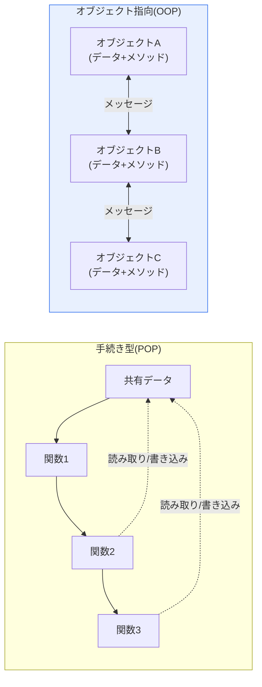
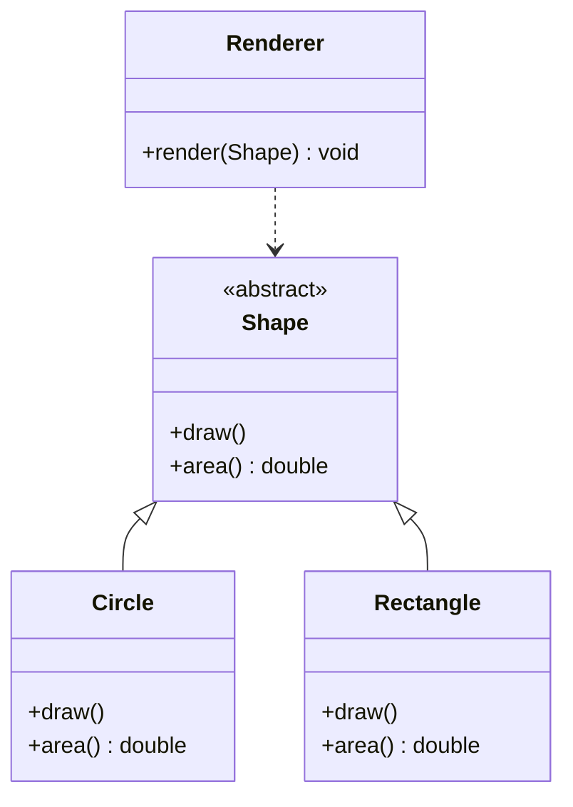

# 手続き型プログラミング(POP)とオブジェクト指向プログラミング(OOP)

## 1. 概要

### A. 概念

> **手続き型(Procedural-Oriented Programming, POP)** とは、プログラムを**一連の関数(プロシージャ)の逐次的な実行フロー**として構成する方式であり、**オブジェクト指向(Object-Oriented Programming, OOP)** とは、データとそのデータを扱う関数を**オブジェクト(Object)** としてまとめ、オブジェクト間のメッセージ交換(相互作用)によってプログラムを構成する方式である。

二つのパラダイムを比較する根本的な理由は、単に「文法が異なる」ことではなく、**ソフトウェアが大規模化し長く生き残るとき、何を中心に構造を組めば保守・管理コストが低くなるか**というソフトウェア工学の本質的な問いにある。ソフトウェアの総コストは初期開発費よりも保守・変更に要するコストのほうがはるかに大きいというのが古くからの経験則であり(ライフサイクル全体のコストの60~80%が保守段階で発生するという調査が繰り返し報告されている)、このコストを左右するのがまさに**変更の波及範囲**である。二つのパラダイムは、「変更が生じたとき、その影響がどこまで広がるか」をそれぞれ異なる方法で制御する。

**手続き型**は「何をするか(動作・関数)」をプログラムの骨格とする。まずデータ構造があり、そのデータを順番に処理する関数群が上から下へと流れる。問題を「大きな作業 → 小さな作業」へと分割するトップダウン(Top-Down)分解と自然に噛み合い、実行フローがコードにそのまま現れるため、小さく単純なプログラムでは直感的で無駄がない。しかし規模が大きくなると、データが複数の関数に共有・露出され(特にグローバルデータ)、一つのデータ構造を変更するとそのデータに触れるすべての関数を併せて修正しなければならず、修正の影響がどこまで及ぶかを人間が追跡することが難しくなる。すなわち、データと関数が分離されているため、結合が「緩やかに見えて実際には広範に拡散している」状態となる。

**オブジェクト指向**は、この問題を「データ中心」へと反転させて解決する。互いに関連するデータとそのデータを扱う関数を一つのオブジェクトとして**カプセル化**し、データはオブジェクト内部に隠蔽して(情報隠蔽)、公開された経路であるメソッドを通じてのみアクセスさせる。すると、データの表現が変わっても変更はそのオブジェクト内部に限定され(外部はインターフェースしか知らないため)、継承・ポリモーフィズムによって共通構造を再利用しつつ、差異のある部分だけを拡張できる。要約すれば、手続き型が「関数の流れ」で世界を捉えるのに対し、オブジェクト指向は「責任を持って互いに協調するオブジェクト群」で世界を捉える。大規模・長期運用・要求変更が頻繁なソフトウェアほど、この構造的局所化(localization)の価値は大きくなる。

### B. 登場背景と必要性

手続き型は1970年代の構造化プログラミング(structured programming)の流れの中で、GOTOの濫用によって絡み合った「スパゲッティコード」を、順次・選択・反復の制御構造と関数分解によって整理しようとする試みから定着したものであり、C・Pascal・Fortranが代表的である。しかし1980年代以降、GUIや大規模業務システムのように状態と相互作用が爆発的に増えるソフトウェアが登場すると、関数分解だけでは複雑性に対処しきれないという「ソフトウェア危機(software crisis)」の認識が広がった。ここでSimulaのクラス概念を受け継いだSmalltalkが純粋なオブジェクト指向を実装し、C++・Javaが産業界にオブジェクト指向を普及させたことで、大規模な協調開発の標準パラダイムへと躍り出た。すなわちOOPの登場は「文法の好み」の問題ではなく、**複雑性の管理とチーム単位の分業**という現実的な必要性から生じたものである。

| 区分 | 中心となる観点 | 世界観 | 代表的な分解方式 |
|---|---|---|---|
| **手続き型** | 関数(動作) | 逐次的な処理フロー | 機能分解(Top-Down) |
| **オブジェクト指向** | オブジェクト(データ+動作) | 協調するオブジェクト群 | 責任分割(役割・協調) |

## 2. 二つのパラダイムの構造比較

以下の概念図は、二つのパラダイムがデータと関数を配置する方式の違いを示している。手続き型ではデータが関数群の外側に置かれて複数の関数に共有されるが、オブジェクト指向ではデータが各オブジェクトの内部に入り、メッセージを通じてのみやり取りされる。

この構造の違いが実務にもたらす結果は明確である。例えば銀行口座の残高を扱うプログラムを考えてみよう。手続き型では`balance`というデータがグローバルに存在し、`deposit()`、`withdraw()`、`printStatement()`のような関数がそれを直接読み書きする。残高がマイナスになってはならないというルールを強制するには、`balance`に触れるすべての関数に同じチェックを重複して入れなければならず、新しい関数を追加する開発者がチェックを入れ忘れればルールは破られる。オブジェクト指向では`balance`を`Account`オブジェクトの中に`private`として隠蔽し、`withdraw()`メソッドを通じてのみ減少させるため、残高の不変条件(invariant)を一箇所で保証できる。**データに関するルールを、データが存在する場所に付けておく**ことが、カプセル化の実質的な利点である。

| 区分 | 手続き型(POP) | オブジェクト指向(OOP) |
|---|---|---|
| **基本単位** | 関数(プロシージャ) | オブジェクト(クラス) |
| **データの扱い** | グローバル・共有(露出) | カプセル化(隠蔽) |
| **再利用の手段** | 関数呼び出し(限定的) | 継承・コンポジション・ポリモーフィズム(容易) |
| **変更の影響** | 広く波及(追跡困難) | オブジェクト内部に局所化 |
| **性能** | 相対的に高速・軽量 | 抽象化・動的ディスパッチのオーバーヘッド |
| **代表的な言語** | C, Pascal, Fortran | Java, C++, C#, Python |
| **適した領域** | 小規模・逐次処理・システム・組込み | 大規模・複雑・変更の多い業務システム |

性能の項目は誤解を招きやすいため、理由まで押さえておく必要がある。オブジェクト指向のポリモーフィズムは、実行時にどのメソッドを呼び出すかを決定する**動的ディスパッチ**(仮想関数テーブルの参照)を伴うため、関数の直接呼び出しよりわずかなコストがかかる。オブジェクト単位のメモリ割り当てと参照追跡、仮想マシン環境(JVMなど)の間接コストも加わる。しかしこの差は大半の業務システムでは無視できる水準であり、保守性・拡張性という大きな利点を相殺するものではない。逆に、カーネル・デバイスドライバ・リアルタイム制御のように、サイクル単位の性能と決定的な動作が重要な領域では、依然としてCベースの手続き型が支配的である。すなわち性能は「絶対的な優劣」ではなく、**適用ドメインに応じたトレードオフ**として理解すべきである。

## 3. オブジェクト指向の4大特徴の深掘り

OOPの保守・再利用上の利点は、次の四つの特徴が互いに噛み合うことで生まれる。各特徴を単なる定義ではなく、「なぜそれが変更コストを下げるのか」という観点から見ていく。

**A. カプセル化(Encapsulation)** とは、データとそれを扱うメソッドを一つの単位にまとめ、内部表現を外部から隠す(情報隠蔽)ことである。中核的な効果は「変更の防火壁」である。外部はオブジェクトが**何をできるか**(公開インターフェース)だけを知り、**どのように行うか**(内部実装)は知らないため、内部のデータ構造を配列からハッシュマップに変えても、計算式を最適化しても、外部のコードは影響を受けない。先に挙げた口座の例のように不変条件を一箇所で守ることができ、ルールがコード全体に散らばることを防ぐ。

**B. 継承(Inheritance)** とは、上位クラスの属性・振る舞いを下位クラスが受け継いで再利用・拡張することである。共通コードを上位に集めて重複を減らすが、上位と下位が強く結合され、上位の変更が下位全体に波及するという脆弱性もある。そのため現代の設計では「継承よりコンポジション(Composition over Inheritance)」が推奨され、継承は「真のis-a関係」に限定して用いられる傾向にある。

**C. ポリモーフィズム(Polymorphism)** とは、同じメッセージに対してオブジェクトごとに異なる反応をする性質である。例えば`Shape`型の複数の図形に対して一様に`draw()`を呼び出しても、円・四角形はそれぞれの方法で描画される。呼び出す側は具体的な型を知らなくてよいため、新しい図形クラスを追加する際にも既存の呼び出しコードには手を加えない。これは後述するOCP(開放閉鎖原則)の技術的な土台である。以下のクラス図は、継承とポリモーフィズムが噛み合う典型的な構造を示している。抽象上位(`Shape`)が`draw()`を規定し、下位の実装クラスがそれぞれこれをオーバーライドし、利用する側(`Renderer`)は抽象型にのみ依存する。

この図において、新しい図形(例:`Triangle`)を追加する変更は`Shape`を継承したクラスを一つ追加するだけで完了し、`Renderer`は`Shape`という抽象型にのみ依存するため、再コンパイルや修正は不要である。手続き型であれば`Renderer`に相当する処理関数内部の分岐文を修正しなければならず、この「修正なしで拡張」できるか否かが、二つのパラダイムの拡張性の格差を生む。

**D. 抽象化(Abstraction)** とは、問題領域から本質的な属性だけを抽出してモデル化し、不要な詳細は隠すことである。インターフェース・抽象クラスで「何をするか」だけを規定し、「どのように」は実装クラスに委ねることで、上位のポリシーと下位の詳細を分離する。

| 特徴 | 中核メカニズム | 保守の観点での利点 |
|---|---|---|
| **カプセル化** | 情報隠蔽, publicインターフェース | 内部の変更を外部から隔離 |
| **継承** | 階層的な特性の継承 | 共通コードの再利用(ただし結合に注意) |
| **ポリモーフィズム** | 動的ディスパッチ | 拡張時に既存コードは不変 |
| **抽象化** | インターフェース・抽象クラス | ポリシーと実装の分離 |

## 4. 比較事例と実務的含意

二つのパラダイムの違いが実際のコード規模でどのように現れるかは、「要求変更」のシナリオで見ると明確である。数十種類の機器タイプを扱う監視制御システムにおいて、「新しい機器タイプの追加」というよくある変更を想定してみよう。手続き型の実装では、機器の種類を`switch`/`if`の分岐で処理するコードが複数の関数(登録・表示・集計・アラーム)に散在しているため、タイプを一つ追加するとそのすべての分岐文を探して修正しなければならず、一箇所でも漏れれば欠陥となる。オブジェクト指向では、各機器を共通インターフェースを実装するクラスとしておけば、新しいタイプはクラスを一つ追加するだけで済み、既存のコードはポリモーフィズムのおかげでそのまま動作する。変更箇所が「N箇所」から「1箇所」に減ること、これが大規模システムでOOPが好まれる定量的な理由である。

ただし「OOPが常に正しい」という結論は危険である。Linuxカーネルは2,000万行を超える大規模ソフトウェアでありながらCベースの手続き型で記述・保守されており(構造体と関数ポインタで必要なポリモーフィズムだけを模倣する)、これは性能・移植性・ハードウェア密着制御というドメイン特性によるものである。逆に大規模なエンタープライズWebサービスは、Spring(Java)のようなオブジェクト指向フレームワークの上で数百人が協働しており、ここでは性能よりもレイヤー分離と拡張性が重要である。さらに関数型プログラミング(FP)の台頭により、不変データと純粋関数によって並行性・テスト容易性を確保する「第三の軸」が実務に入ってきた。結局、パラダイムの選択は優劣の競争ではなく、**ドメイン特性(性能・変更頻度・チーム規模・並行性要求)に対する工学的な適合性判断**である。

## 5. 深掘り — 設計原則・現代言語のマルチパラダイム

オブジェクト指向は、文法を使うだけで利点が自然に生まれるわけではない。設計を誤れば、かえってクラスの爆発と過度な抽象化によって複雑性だけが増す(いわゆる「オブジェクト指向の濫用」)。そのためOOPの真価は、**SOLID原則**と**デザインパターン**と組み合わせたときに発揮される。SOLIDとは ▲SRP(単一責任) ▲OCP(開放閉鎖:拡張に対して開き、変更に対して閉じる) ▲LSP(リスコフの置換) ▲ISP(インターフェース分離) ▲DIP(依存性逆転)であり、先に見た「新しいタイプはクラスの追加だけで済む」という利点は、実はOCPとポリモーフィズムの組み合わせが生み出すものである。デザインパターン(Strategy・Observer・Factoryなど)は、これらの原則を再利用可能な協調構造として定型化したものである。設計の観点から目標は常に**高い凝集度(cohesion)と低い結合度(coupling)** であり、これは手続き型においても同様に追求される普遍的な原則である。[[module-cohesion-coupling]]

現代の言語は一つのパラダイムを強制しない。Python・C++・JavaScript・Kotlinは、手続き型・オブジェクト指向・関数型を一つの言語の中で併せてサポートする**マルチパラダイム(multi-paradigm)** 言語であり、Javaもバージョン8からラムダ・ストリームによって関数型の要素を大幅に取り入れた。実務では「データ変換パイプラインは関数型で、ドメインモデルと状態管理はオブジェクト指向で、性能上重要なループは手続き型で」というように、問題に合わせてパラダイムを混在させて使うのが自然である。したがって技術士の観点で重要な能力は、「どのパラダイムが優れているか」を論じることではなく、**与えられた問題の性質に合ったパラダイムを選択・組み合わせ、そのトレードオフを説明する**ことである。

## 6. 考慮事項および示唆

1. **問題・規模に合った選択が最優先である。** 小規模で性能・決定性が重要な組込み・システム・リアルタイム領域は手続き型(C)が、大規模で変更が多くチーム協働が必要な業務・サービスシステムはオブジェクト指向が有利である。両者は代替品ではなくドメイン別の選択肢であり、誤った選択は保守コストとなって跳ね返ってくる。

2. **パラダイムは共存・混在する。** マルチパラダイム言語が標準となった現在、一つの「正解パラダイム」に固執するよりも、各パラダイムの強み(手続き型=単純・性能、オブジェクト指向=構造・拡張、関数型=不変・並行性)を問題ごとに組み合わせる設計感覚が求められる。

3. **設計原則と組み合わせてこそ真価を発揮する。** オブジェクト指向もSOLID・デザインパターンなしに使えば複雑性が増すだけである。凝集度を高め結合度を下げるという普遍的な原則の上でのみ再利用・保守の利点が実現され、これはパラダイムを超越したソフトウェア工学の定数である。[[module-cohesion-coupling]]

4. **転換・展望:並行性と大規模データがパラダイムの地形を変えつつある。** マルチコア・分散環境において共有可変状態が並行性バグの根源となるにつれ、不変性を前面に出した関数型要素の比重が高まっている。今後開発者に求められるのは、特定パラダイムへの習熟を超えて、複数のパラダイムを状況に応じて行き来する**パラダイムリテラシー**である。技術士はアーキテクチャ決定の際に、性能・拡張性・並行性・チームの能力を併せて比較衡量し、パラダイムと言語を処方できなければならない。

## 参考資料

- Wikipedia, "Object-oriented programming" — https://en.wikipedia.org/wiki/Object-oriented_programming
- Wikipedia, "Procedural programming" — https://en.wikipedia.org/wiki/Procedural_programming
- Robert C. Martin, "The Principles of OOD (SOLID)" — https://blog.cleancoder.com/uncle-bob/2020/10/18/Solid-Relevance.html

---

> **一言まとめ**: 手続き型は*関数の逐次的な流れ*を中心に据えるため小規模・性能・システム領域で効率的であるが、規模が大きくなると変更が広く波及して保守が難しくなる。オブジェクト指向は*データと動作をオブジェクトとしてカプセル化*し、継承・ポリモーフィズムによって変更を局所化・拡張するため大規模・複雑なシステムに適しており、現代の実務ではマルチパラダイムとして問題の性質に合わせて組み合わせ、SOLID・設計原則と結合したときにその利点が実現される。
