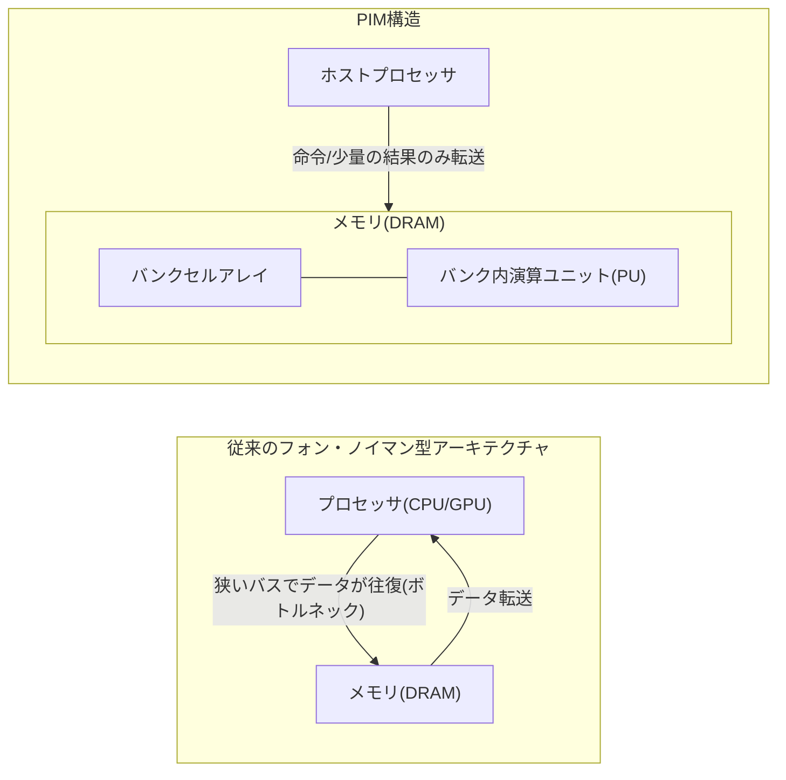
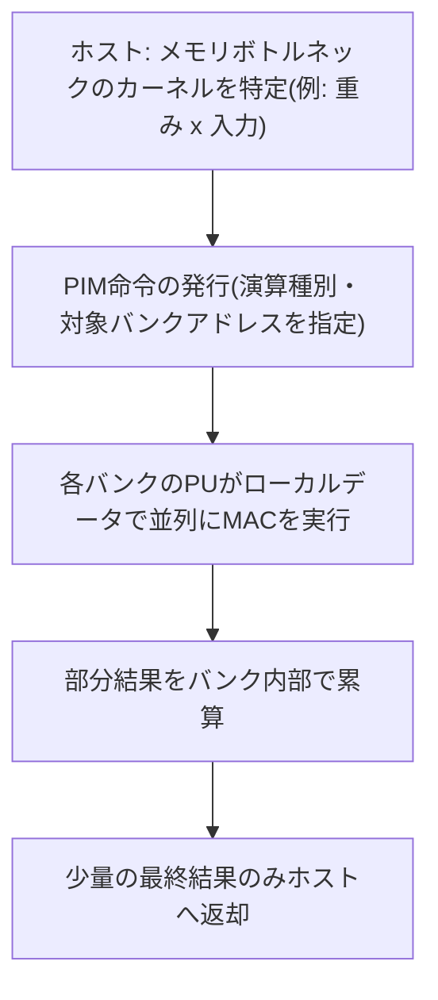

# プロセッシング・イン・メモリ(PIM, Processing-in-Memory)

## 1. 概要

### A. 定義
> **プロセッシング・イン・メモリ(PIM)** とは、データを格納するだけであったメモリ(DRAMなど)の内部に**演算ユニット(簡易ALU・積和演算器など)を併せて集積**し、データをプロセッサへ移動させることなく**メモリが存在する場所で直接演算を実行**できるようにした半導体アーキテクチャである。「演算をデータのある場所へ持っていく(Bring compute to data)」という発想により、フォン・ノイマン型アーキテクチャの根本的なボトルネックを緩和する。

従来のフォン・ノイマン(Von Neumann)型アーキテクチャでは、CPU・GPUのような演算装置とメモリは物理的に分離されており、両者は相対的に狭いバスで接続されている。演算に必要なすべてのデータはこのバスを通じてメモリとプロセッサの間を行き来しなければならないが、演算性能が数十年にわたって急激に向上した一方で、メモリの帯域幅・レイテンシはそれに追いつけなかった。その結果、プロセッサがデータを待って遊休状態となる**メモリウォール(Memory Wall)** 現象が深刻化した。PIMはこの壁を迂回するため、データをわざわざ遠くのプロセッサまで送らず、メモリバンク内部で即座に処理する。Samsung電子のHBM-PIM(Aquabolt-XL)、SK hynixのGDDR6ベースのAiM(Accelerator-in-Memory)が代表的な商用化事例である。

### B. 登場背景および必要性
PIMが台頭した背景には、三つの圧力が重なっている。第一は**メモリウォールの構造的深刻化**である。プロセッサの演算量は毎年大きく増加するが、メモリからデータを読み出す帯域幅の増加率はそれに及ばず、データ移動が全体の実行時間と性能を左右する状況となった。特に大規模な行列・ベクトル演算が繰り返されるAIの推論・学習において、この格差は顕著である。第二は**データ移動のエネルギーコスト**である。今日では演算そのものよりもデータをチップ外へ移動させるための電力のほうがはるかに大きく、一般に1回の浮動小数点演算よりも、そのオペランドをオフチップメモリから取得するほうが数十倍以上のエネルギーを消費すると知られている。データセンターの電力の相当部分がこの「データの往復」に浪費されているわけである。第三は**メモリ帯域幅に敏感な(Memory-bound)ワークロードの急増**であり、推薦システムのエンベディング参照やLLM推論の重み読み出しのように、演算強度(Operational Intensity)は低くデータアクセスは膨大な処理が増えるにつれ、演算器をいくら増やしてもメモリが足かせとなる局面が一般化した。これら三つの圧力が噛み合い、「メモリで直接計算する」PIMが現実的な代替案として浮上した。

## 2. アーキテクチャ構造と動作原理

PIMの核心は、**演算ユニットをメモリ階層のどこに置くか**にある。以下の構造図は、従来のフォン・ノイマン型アーキテクチャとPIM構造とのデータフローの違いを示している。

フォン・ノイマン型(左)では膨大な元データがバスを行き来するのに対し、PIM構造(右)では**演算がバンク内で完結し、ホストとの間では命令と最終結果のような少量のデータだけがやり取りされる。** これによりオフチップトラフィックが大幅に減少し、帯域幅のボトルネックと消費電力が同時に緩和される。このとき性能向上の源泉は単に「近いから速い」ということではなく、**DRAM内部のバンクレベル並列性(Bank-level Parallelism)** をそのまま活用する点にある。外部ピン数に縛られて狭くなったオフチップ帯域幅とは異なり、チップ内部には多数のバンクが並列に存在するため、各バンクに付随する演算ユニットが同時に計算すれば、**内部の実効帯域幅がオフチップ比で数倍に拡大**する。

### A. 演算ユニットの配置位置別の類型
PIMは、演算器をメモリのどの地点に統合するかによって性格が大きく異なる。**バンク単位PIM(PIM-B)** は、DRAMの各バンクごとに小型の演算ユニットを付加する方式であり、内部並列性を最大限に引き出すため帯域幅の利得が最も大きいが、ダイ面積の制約が大きい。Samsung HBM-PIMがこの系統であり、各バンクに積和(MAC)ユニットを配置してAI演算を加速する。**バッファ/ロジックダイPIM** は、HBMのように複数のDRAMダイを3D積層した構造において、最下層の**ロジック(ベース)ダイに演算器を集中**させる方式であり、プロセスの自由度が高く複雑な演算を搭載しやすいが、バンクからロジックダイまでの移動は残る。**PNM(Processing-Near-Memory)** は、メモリモジュール(DIMM)やコントローラの隣に別途アクセラレータを置く広義の近接演算であり、既存システムへの統合が容易な反面、セルに最も密着したPIMよりも利得は小さい。実務ではこれらを目的に応じて使い分ける。

### B. アナログ方式とデジタル方式
演算を実行する回路の観点からも二つの系統がある。**デジタルPIM** は、メモリの近くに通常のデジタル演算器(MACなど)を置いて正確な演算を行うものであり、精度と安定性が高いため、現在の商用製品の大半が採用している。一方、**アナログPIM** は、メモリセルアレイ自体の物理現象を計算に利用する。例えばクロスバー(Crossbar)形態のセル配列に電圧をかけると、オームの法則(電流=電圧×コンダクタンス)とキルヒホッフの法則(電流の合算)によって、**積和演算(行列-ベクトル積)が物理的に一度に生じる。** これは理論上、極めて高いエネルギー効率を実現し得るが、素子ばらつき・ノイズ・ADC変換の負担により精度の確保が難しく、まだ研究・初期商用段階に近い。この二つの方式は「正確性対効率」のトレードオフを成す。

### C. オフローディングの動作フロー
PIMが実際に演算を処理する過程は、「ホストが指示し、メモリが計算する」と要約される。以下の手順図は、行列-ベクトル積のようなカーネルをPIMに委任(オフローディング)した場合のフローを示している。

核心は3~4段階目である。膨大な元データはバンクの外に出ず、**各バンクの演算ユニットが自バンクに格納された値だけを用いて同時に計算**するため、オフチップ転送が最小化される。ホストに戻るのは累算が完了した少量の結果だけである。この構造により、データが大きいほど、また同じデータを再利用せず一度走査するだけのストリーミング的な処理ほど、PIMの相対的な利得は大きくなる。

### D. 類似概念との比較
PIMはデータ中心コンピューティングという大きな流れの中で、ニューロモーフィック・インメモリコンピューティングとしばしば混同されるため、境界を明確にしておく必要がある。**GPU/NPU** は、依然として演算器とメモリを分離したまま演算の並列性を最大化するアプローチであり、データ移動のボトルネックそのものは残る。**ニューロモーフィックチップ** は、脳のニューロン・シナプスを模倣してイベント駆動(スパイク)で動作する別のパラダイムであり、目的は超低消費電力の認知演算であって、PIMのように汎用的なメモリボトルネックの解消を狙うものではない。一方PIMは、既存のDRAMエコシステムを維持したまま「演算をメモリへ移す」という点で、**現行システムとの互換性・即時適用性**が相対的に高い。すなわちPIMは急進的な置き換えではなく、メモリボトルネックという特定の問題を狙った実用的な補完技術に近い。

## 3. 類型比較と適用事例

メモリの種類によって、PIMが狙うポイントは異なる。以下の表は代表的な方式を比較整理したものであり、各選択の**理由**はその後に文章で説明する。

| 区分 | ベースメモリ | 演算位置 | 主な対象ワークロード | 代表事例 |
|------|-----------|----------|----------------|----------|
| HBM-PIM | 高帯域積層DRAM(HBM) | バンク内MAC | LLM・大規模AI推論 | Samsung Aquabolt-XL |
| AiM | GDDR6 | バンク近接演算 | 生成AIの加速 | SK hynix GDDR6-AiM |
| CXL-PIM/PNM | DDR5 + CXL | モジュール/コントローラ近接 | 推薦・インメモリDB | 各社のCXLメモリ拡張 |
| アナログPIM | ReRAM・SRAMクロスバー | セルアレイでの物理演算 | エッジ推論(超低消費電力) | 研究・初期商用 |

HBM-PIMがLLMを狙う理由は、超大規模モデルの推論が膨大な重みを繰り返し読み出す**典型的なメモリボトルネック型の処理**だからである。ここに、すでに帯域幅が最も大きいHBMのバンクごとに演算器を付ければ、重みをオフチップへ出さずに内部で積和演算を完結させ、実効帯域幅と電力効率を同時に引き上げることができる。Samsungは、HBM-PIMを適用した場合、特定のAIワークロードにおいて性能が大きく向上し、エネルギー消費が半分以下に減少する効果を示している。一方、CXLベースのPNMが推薦システム・インメモリDBを狙うのは、これらが**容量は大きいがアクセスが不規則(エンベディング参照など)** であり、大容量の拡張性と標準インターフェースへの統合がより重要だからである。すなわち同じPIMであっても、ワークロードの性格(帯域幅重視 vs 容量重視)によって最適なポイントが異なる。

### A. 標準化とエコシステムの課題
PIMが研究室を超えて産業標準となるためには、ソフトウェアとインターフェースの標準化が鍵となる。ハードウェアがいくら高速であっても、**開発者が既存のプログラミングモデルで容易に使えなければ採用されない。** このためJEDECはメモリ標準にPIM関連の規格を反映する議論を進めてきており、コンパイラ・ランタイムがどの演算をメモリへオフロードすべきかを自動判断できるよう支援するソフトウェアスタックの研究も並行して進められている。標準D2D・CXLとの結合も重要であり、例えばCXLはメモリコヒーレンシとプーリングを提供するため、PIM/PNMアクセラレータをシステムに自然に統合する経路となる。

## 4. 考慮事項および示唆(技術士の観点)

- **適用戦略 — 選択的オフローディング**: PIMは万能ではなく、**メモリボトルネック(Memory-bound)区間においてのみ**利得が大きい。演算強度の高い(Compute-bound)処理では依然としてGPU/NPUが有利であるため、ワークロードをプロファイリングして帯域幅に敏感なカーネルだけをPIMに割り当てる**ヘテロジニアス(Heterogeneous)分業**設計が核心である。Rooflineモデルでボトルネックの類型を判別した上で配置ポイントを決めるアプローチが実務的である。
- **トレードオフ — 面積・発熱・精度**: DRAMダイは低消費電力・高密度に最適化されたプロセスであるため、演算ロジックを入れる面積と発熱の余裕が限られている。演算器を大きくすればセル容量が減り、アナログ方式を選べば効率は上がるが精度が揺らぐ。**「どこまでをメモリ内で、何を外で」** という境界を定めることが、設計の本質的な難題である。
- **ソフトウェアエコシステムへの依存性**: ハードウェア性能が実使用性能に結び付くには、コンパイラ・ライブラリ・フレームワーク(例:ディープラーニングフレームワーク)のサポートが不可欠である。標準化が不十分であればベンダーごとの断片化によって採用が遅れるため、JEDEC・CXLなど**オープン標準との整合**を導入判断の優先基準とすべきである。
- **展望 — AI半導体のメモリ中心への再編**: メモリウォールがAI性能の最大の制約として浮上するにつれ、HBMの高度化・CXLメモリプーリング・PIMは相互補完的に発展する可能性が高い。今後のAIインフラ設計は、演算器の増設に劣らず**データ移動の最小化(Data-centric Computing)** を軸に再編される見通しであり、PIMはニューロモーフィック・CXL・チップレットと結合して、異種集積のメモリ-演算プラットフォームへと進化していくと考えられる。

---
> **一言まとめ**: PIMはメモリ内部に演算器を置き、データを移動させることなくその場で計算することで、フォン・ノイマン型アーキテクチャのメモリウォールとデータ移動電力を緩和するデータ中心の半導体アーキテクチャであり、帯域幅ボトルネック型のAIワークロードを選択的にオフロードするヘテロジニアス戦略と、標準・エコシステムの確保が成否を分ける。
