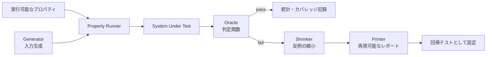
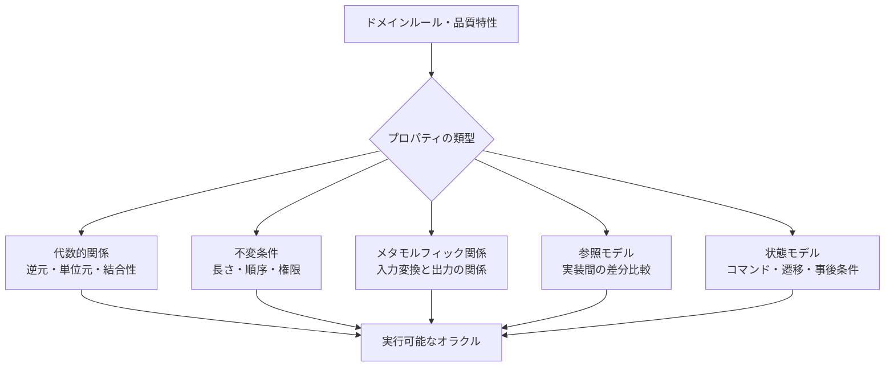

# プロパティベーステスト(Property-Based Testing)と生成ベースの品質検証

## 1. 概要

> プロパティベーステスト(PBT)とは、個々の入力と期待結果をあらかじめ列挙する代わりに、入力の広い集合に対して常に成立すべきプロパティを実行可能な仕様として記述し、生成器が作り出した多数の事例によって検証するテスト手法である。

ソフトウェアテストにおいて、例示ベーステストは人間が選んだ代表的な入力を迅速に検証する。しかし実際の障害は、境界値、空の構造、予期しない組み合わせ、長いシーケンスのように、テスト作成者があらかじめ列挙しにくいところで発生する。PBTはこの問題を、入力生成と仕様検証の問題へと置き換える。

PBTの核心は「ランダムな入力を大量に投入する」という単純な概念ではない。テスト対象の不変条件、対称性、前後関係あるいは参照モデルをまず定義し、生成器(generator)が有効な入力空間を探索し、失敗が発生すれば縮小器(shrinker)が再現可能な最小反例を探し出す。したがって、生成の品質とプロパティの品質がテストの信頼性を左右する。

例えばソート関数は、特定の配列`[3, 1, 2]`の結果だけを合わせるよりも、すべての入力配列に対して長さの保存、結果の非減少順序、要素のマルチセットの保存を満たさなければならないと記述するほうが、一般化された欠陥を見つけやすい。重複の除去、負数、空配列、極端な整数範囲も、同じプロパティのもとで自動的に探索できる。

PBTは関数型プログラムの世界で発展したが、現在ではPython、Java、JavaScript、Rust、Java、Scala、C#など多くの言語や、API・データベース・分散システムの検証へと拡張されている。ただし、すべての入力を試験するわけではないため、生成分布の偏りとプロパティの漏れを別途品質管理の対象として扱わなければならない。

### 1.1 登場背景と必要性

第一に、例示の数を増やす方式は、入力空間が大きくなるほど限界が早く現れる。文字列の長さ・文字種、JSONのネスト、権限の組み合わせ、時間の順序までが直積として結合されると、人間が管理すべきテストケースは爆発的に増える。

第二に、失敗入力を人間が直接設計すると、正常な分布に偏りやすい。PBTの生成器は、0、空のコレクション、最大・最小値、重複、特殊文字のような境界値を意図的に含むように設計できる。重要なのは、一様乱数よりもドメインのリスクに合わせた分布である。

第三に、自動生成テストは失敗原因を説明できなければ、開発生産性を低下させる。縮小と出力(printing)を組み合わせて数百要素の入力を数要素の反例に縮めれば、開発者は失敗条件と修正の方向を素早く把握できる。

### 1.2 目標と適用範囲

PBTの目標はコードカバレッジそのものではなく、「重要な振る舞いの仕様を多様な有効入力で繰り返し確認すること」である。したがって、単体テスト、契約テスト、回帰テスト、セキュリティ検証、モデルベーステストを補完する形で導入するのが現実的である。

算術関数やパーサのように入力と出力の関係が明確な対象は、導入効果が早く現れる。一方、視覚的なレイアウトや主観的な推薦品質のように正解オラクルが不明確な対象では、メタモルフィック関係、不変条件、差分比較をまず定義しなければならない。

## 2. PBTの構成要素と実行構造

PBTの実行器は、プロパティと生成器を組み合わせて複数の入力を作り、テスト対象に渡す。入力ごとにオラクルが真か偽かを判定し、偽であれば元の入力をすぐに捨てず、縮小過程を開始する。

生成器は、プリミティブ値の生成器と組み合わせ生成器に分けられる。整数・文字列・ブール値のようなプリミティブ値を作り、それらをリスト・ツリー・レコード・ドメインオブジェクトへと結合する。有効な注文、権限、SQLクエリのように制約の多い値は、単純なフィルタよりも生成段階で制約を反映するほうが効率的である。

プロパティとは、テスト対象の入力を受け取ってブール判定を下す実行可能な仕様である。代表的な形は`forall x, P(x)`であり、実際の実行では有限個のサンプルを通じて全称命題の反例を探す。したがって「合格した」とは、すべての入力に対する証明ではなく、選択された生成空間において反例が見つからなかったという意味である。

オラクルとは、結果を判定する基準である。期待結果を直接計算する参照実装、結果の不変条件、二つの実装の等価性、前後の状態の関係を用いることができる。オラクル自体が同じ欠陥を共有していればテストが合格してしまう可能性があるため、対象コードから独立したモデルを維持しなければならない。

縮小器は、失敗入力をより小さな入力候補へと変換する。数値は0に近づける方向へ、リストは要素数を減らす方向へ、ツリーは深さと枝の数を減らす方向へと試みる。縮小結果が常に大域的最小値であるとは限らないが、人間が理解し再現しやすい局所的最小値を得ることが実務上重要である。

| 構成要素 | 主な責務 | 設計上の問い |
|---|---|---|
| プロパティ | 常に成立すべき振る舞いの表現 | 何を不変条件と見なすか? |
| 生成器 | 入力空間の探索と分布の調整 | 有効値・境界値・稀な組み合わせをどの程度作るか? |
| 実行器 | 反復、時間制限、シード、並列化の管理 | 失敗をどのように再現するか? |
| オラクル | 合格・不合格の判定 | 参照モデルから独立しているか? |
| 縮小器 | 最小反例の探索 | ドメインの制約を保持しているか? |
| レポーター | 入力・シード・環境の出力 | 開発者がすぐに再現できるか? |

## 3. プロパティの設計類型と仕様化

プロパティは生成器よりも先に設計しなければならない。生成器を先に作るとランダムな値は多くなるが、テストが何を保証するのかが不明確になる。技術士の答案では、「対象の振る舞い → 不変条件または関係 → 生成空間 → 失敗の処理」の順で説明すると、検証の論理が明確になる。

### 3.1 代数的プロパティと不変条件

代数的プロパティは、演算間の関係を表現する。`reverse(reverse(xs)) = xs`はリスト反転の往復関係であり、`sort(sort(xs)) = sort(xs)`はソートの冪等性である。特定の結果を列挙しなくても、実装の中核的な意味を検証できる。

不変条件とは、処理の前後で保存されなければならない条件である。ソートの場合、要素の個数と重複度が保存され、結果が非減少順序でなければならない。口座振替であれば、全体残高の保存、負の残高の禁止、一つの取引の原子性といった条件を状態不変条件として置くことができる。

代数的法則はプロパティが簡潔になるという長所があるが、法則がドメインのすべての意味を包括するわけではない。ソート結果が順序とマルチセットを保存していても、安定ソートという追加要件には別のプロパティが必要である。仕様の範囲を文書化してこそ、過度な合格判定を防ぐことができる。

### 3.2 メタモルフィックプロパティ

正解を計算するのが難しいシステムでは、入力を変換した上で結果間の関係を確認する。例えば、画像の明るさを一定に変えても分類結果が維持されなければならない、あるいは検索結果に無関係な文書を追加しても既存の上位結果の順序が不当に変化してはならない、といった具合である。

暗号化・圧縮・翻訳のように一度の正解を作るのが難しい機能にも、メタモルフィック関係を適用できる。圧縮後に復元した結果は原文と同じでなければならず、暗号化後に復号した結果は平文と同じでなければならない。ただし、その関係が実際の要件と合致しているかを確認しなければ、誤った不変性を強制することになる。

メタモルフィックテストはAIシステムのバイアスや頑健性の点検にも有用であるが、「変換に対して不変」であることが常に望ましいわけではない。例えば日付を変えれば料金が変わるべきサービスもある。変換の前後で同一であるべき要素と、変わるべき要素を明示的に区別しなければならない。

### 3.3 モデルベース・状態ベースのプロパティ

CRUD APIや分散状態システムでは、単一の関数呼び出しよりもコマンドの順序が重要である。状態モデルは抽象的な参照状態を置き、`create`、`update`、`delete`、`read`コマンドの遷移と事後条件を定義する。生成器はコマンドシーケンスを作り、各ステップで実システムの状態とモデルの状態を比較する。

例えばショッピングカートのモデルでは、商品の追加後の数量増加、削除、決済取消をランダムな順序で実行できる。実サービスがモデルと異なる状態を示せば、縮小器がコマンドシーケンスを縮めて最小限の失敗順序を提示する。並行性まで含める場合は、実行順序と観測時点を併せて記録しなければならない。

モデルはシステム全体を複製するものではなく、検証すべき中核的な状態だけを表現すべきである。モデルが実装と同じデータ構造とアルゴリズムを用いていれば、同じエラーが再現されても合格してしまう可能性がある。独立した単純なモデルと実際の実装を比較することが原則である。

## 4. 生成器と縮小器の設計

### 4.1 入力空間と分布

一様乱数は単純であるが、危険な入力を十分に生成できない可能性がある。文字列パーサであれば、空文字列、Unicodeの結合文字、ヌル文字、非常に長いトークン、不正なエンコーディングに意図的に重みを付けなければならない。金融計算であれば、小数点の境界、丸めの境界、最大金額と負の符号が核心となる。

生成器は、プリミティブ生成器、組み合わせ生成器、制約生成器に分けることができる。組み合わせ生成器はリストやツリーを再帰的に作り、制約生成器はドメインの不変条件を満たすオブジェクトだけを生成する。再帰構造では、サイズパラメータと最大深さを設けて、無限生成や実行時間の爆発を防ぐ。

有効入力と無効入力の比率も戦略的に管理しなければならない。パーサの文法検証では、有効な文書を多く生成して正常経路を確認しつつ、エラー処理のプロパティのために無効な文法も一定の比率で生成する。単純な`filter`で捨てると生成コストが増加するため、可能であれば生成器自体で条件を満たすようにする。

実行統計は、生成器の品質を判断する根拠となる。パーティションごとの入力数、最大深さ、空値の比率、例外の種類、コード経路ごとの到達有無を観察し、極端に稀な領域は生成の重みを調整する。テスト回数だけを見て十分であると結論付けてはならない。

### 4.2 縮小と最小反例

縮小とは、失敗入力を小さくする探索問題である。リストであれば接頭・接尾の除去と要素の縮小を試み、整数であれば0・1・符号の境界の方向へ縮め、文字列であれば長さと文字の複雑さを減らす。ドメインオブジェクトは、有効性の制約を破らないように縮小候補を設計しなければならない。

外部縮小方式は、生成後の値に縮小関数を適用する。実装が直感的で既存の生成器と組み合わせやすいが、縮小中に生成器の不変条件が破られる可能性がある。統合縮小方式は、生成過程での選択を縮めるため有効性を保持しやすいが、生成器の構造と縮小ロジックの結合度が高くなる可能性がある。

最小反例は、必ずしも大域的最小を意味しない。実行器は時間とコストを考慮して局所的最小で停止することがある。したがってレポートには、入力だけでなく、生成シード、フレームワークのバージョン、環境設定、実行コマンドを併せて残し、同じ反例を再現できるようにする。

縮小結果を回帰テストとして固定する際には、「現在のバグを再現する入力」と「要件を説明するプロパティ」を併せて保存する。反例だけを固定すると特定の欠陥は防げるが類似の変形を見逃す可能性があり、プロパティだけを維持すると修正前後の具体的な再現性が弱まる可能性がある。

## 5. 導入手順とCI/CD運用

PBTの導入は、対象の選定、プロパティの仕様化、生成器の作成、小規模実行、反例の縮小、CIへの組み込みの順に進める。最初からシステム全体をランダム化するよりも、計算関数やパーサのように入出力の境界が明確なモジュールを選択する。

ローカル実行では迅速なフィードバックのためにテスト数と最大時間を小さく設定し、PR段階では決定的なシードと制限された実行量で変更による欠陥を検出する。夜間またはリリースのパイプラインでは、複数のシード、より大きな構造、状態シーケンス、長時間の実行を適用する。

再現性は、乱数シードを保存するだけでは完全には保証されない。生成器のバージョン、依存ライブラリ、OS、タイムゾーン、データベースの初期状態、並列実行の順序が結果に影響し得る。CIログにこれらの情報を残し、失敗入力をシリアライズして、シードが異なっても再現できるようにする。

テスト失敗時のポリシーは、プロパティの性格に応じて区別する。安全性・セキュリティ・金額計算の不変条件は、一度の失敗でもビルドを遮断するのが適切である。統計的品質や探索的なメタモルフィックテストは、失敗反例を課題として登録し、原因分析の後に遮断レベルを調整することができる。

## 6. 既存手法との比較

例示ベーステストは人間が読みやすく、失敗原因が明確である。PBTは入力空間を広く探索し、共通ルールを再利用する。両者は競合関係ではなく、代表的な業務シナリオは例示テストで固定し、境界・組み合わせ・不変条件はPBTで補強する関係にある。

ファジングは、異常入力や脆弱性の検出のためにバイトや構造を変形させ、実行フィードバックを活用することが多い。PBTは実行可能なドメインプロパティと有効な生成に焦点を置く。構造認識ファジングとPBTを組み合わせれば、文法的に有効な入力を作りながら、カバレッジとエラー経路を広げることができる。

ミューテーションテストは、テストが人為的なコード変異を検出できるかを確認することで、テストスイートの感度を評価する。PBTは入力を生成する方式であり、ミューテーションテストはテスト品質を評価する方式であるため、併用することができる。プロパティが弱すぎれば、変異の生存率が高く現れる。

形式検証は、数学的証明やモデル検査によって、特定の前提を満たすすべての状態を扱うことができる。PBTは証明よりも、実装・環境・ライブラリの境界で実際の実行反例を見つけることに強い。安全性が極めて重要な中核アルゴリズムでは、形式検証、PBT、例示テストを階層的に組み合わせる。

| 区分 | 例示ベーステスト | PBT | ファジング | 形式検証 |
|---|---|---|---|---|
| 入力の選定 | 人間が選択 | 生成器・戦略 | 変形・フィードバック | モデル・制約ベース |
| オラクル | 期待値 | プロパティ・モデル | クラッシュ・例外・脆弱性シグナル | 論理仕様 |
| 強み | 理解とデバッグ | 一般化・境界探索 | パーサ・メモリエラーの検出 | 包括的な保証が可能 |
| 限界 | 組み合わせ爆発 | プロパティ作成の難しさ | 意味のある正解の不足 | モデリング・証明コスト |
| 適した位置 | 中核シナリオ | 不変条件・契約 | 攻撃面・異常入力 | 高リスクアルゴリズム |

## 7. 適用事例

### 7.1 ソート関数

ソート関数のプロパティは、結果が非減少順序であるか、入力と出力の要素マルチセットが同一であるか、結果の長さが同じであるか、によって構成できる。ソート済みの結果を再度ソートしても同じでなければならないという冪等性のプロパティも追加する。

生成器は、空配列、単一要素、重複を含む配列、負数と大きな整数の混在を生成する。誤った実装が重複を除去してしまう場合、縮小器は`[0, 0]`のような最小反例を提示できる。この反例は、欠陥原因を「順序」ではなく「マルチセット保存の欠落」へと絞り込んでくれる。

### 7.2 JSON・プロトコルパーサ

パーサでは、有効な文書をASTに変換した後、再度シリアライズしても意味が維持されるという往復プロパティを置くことができる。また、パーサは任意の入力に対してプロセスを異常終了させず、許容されたエラー型で失敗しなければならないという安全性プロパティを置く。

生成器は、ネストの深さ、配列の長さ、キーの重複、Unicode、エスケープ、数値の境界を調整する。最大深さを制限しなければスタック枯渇が発生し得るため、リソースの上限自体もテスト要件とする。失敗反例には、原文、パース段階、環境とシードを併せて記録する。

### 7.3 APIとデータベースの状態

API契約は、リクエストをシリアライズしレスポンスをデシリアライズする往復関係、HTTPステータスコードとボディスキーマの一貫性、権限のないリクエストに関する不変条件によって検証できる。状態ベースの生成器は、作成・更新・削除・再試行・重複リクエストのシーケンスを生成する。

データベースでは、トランザクション成功前後の残高合計、一意性制約、再試行後の重複作成の防止をプロパティとして設定する。外部決済やメッセージブローカーが含まれる場合はテストダブルと隔離された環境を使用し、実際の運用データが生成器に流入しないよう、個人情報と秘密情報を遮断する。

## 8. 深掘り:状態・並行性・生成AIの検証

状態ベースのPBTは、単純な関数テストをサービス運用の振る舞いテストへと拡張する。コマンド生成器、事前条件、実行関数、モデル遷移、事後条件を分離すれば、ショッピングカート・キャッシュ・ロック・ワークフローの長い状態シーケンスを自動的に探索できる。

並行システムでは、逐次的なプロパティだけでは不十分である。同一リソースに対する交差実行、遅延、再試行、メッセージの重複と順序の逆転を生成し、線形化可能性や結果整合性のように、システムが保証する水準をオラクルとして定義しなければならない。

カバレッジ誘導型のPBTは、実行経路・分岐・フィードバックを観察し、新しい経路を生み出す入力に重みを与えることができる。しかし高いコードカバレッジは、ビジネスルールの完全な検証を意味するわけではない。カバレッジ指標は、プロパティの意味的な範囲と併せて解釈する。

生成AIシステムは単一の正解がないか出力が確率的であるため、形式の一貫性・禁止語・根拠の存在・入力変換に対する安定性・モデル間の差分をプロパティとして設計できる。出力の創造性にまで同一性を強制すると正常な変形を欠陥と誤認する可能性があるため、許容範囲と評価基準を分離する。

最新のフレームワークは、生成器の組み合わせ、自動縮小、ステートマシン、並列実行、カバレッジフィードバックを提供する方向へと発展している。ただし、特定のフレームワークの機能に依存するよりも、プロパティ・データ分布・オラクル・再現性という原則を、組織のテスト標準としてまず定めることが望ましい。

## 9. 考慮事項および示唆

### 9.1 プロパティの完全性

プロパティが弱ければ、多くの入力を通過しても重要な欠陥を見逃す。要件・リスク一覧・障害事例を出発点として、保存すべき不変条件と許容される変化を区別する。

プロパティのレビューは、コードレビューとは別に実施する。ドメインの専門家がルールの意味を確認し、開発者が実行可能性とオラクルの独立性を確認しなければならない。「常に」という表現が実際の契約範囲と合致しているかも検討する。

### 9.2 生成器の偏りと効率

生成器が容易な正常値ばかりを作れば、テスト数が多くても探索範囲は狭い。境界値、稀な組み合わせ、異常入力、実際の障害で発見されたパターンを、重みと例示として反映する。

フィルタベースの生成が候補の大半を捨ててしまうと、実行時間が浪費され、分布が歪む。組み合わせ生成器と制約生成器を使用し、パーティションごとの生成比率を統計によって検証する。

### 9.3 失敗反例と運用品質

再現可能な反例の保存は、自動化の中核的な成果物である。入力、シード、フレームワークのバージョン、環境、コマンドシーケンスを保存し、個人情報や秘密情報が含まれる場合はマスキングとアクセス制御を適用する。

縮小された反例は回帰テストへと昇格させるが、元のプロパティを置き換えるものではない。反例が解決された後も同一系統の欠陥を見つけられるよう、生成器とプロパティを補強する。

### 9.4 CIコストと品質ゲート

PR段階の高速実行と夜間の深い実行を分離すれば、開発者へのフィードバックと探索の深さを両立できる。テスト件数よりも、最大時間、失敗率、新規反例、パーティションカバレッジを基準として運用する。

ランダムな失敗をflaky testとして扱い無条件に再試行すると、欠陥を隠してしまう可能性がある。まずシードと入力を固定して再現し、非決定性の原因を並行性・時間・外部依存性に分解した上で、再試行ポリシーを定める。

### 9.5 セキュリティ・個人情報・安全

生成データが実際の顧客情報に似ていても、運用中の個人情報を複製してはならない。合成データと秘密情報の検出、ログのマスキング、テスト環境の隔離を適用する。

パーサ・認証・権限・暗号処理のように攻撃面が広いコードは、異常入力と権限の組み合わせを別のリスク分類として扱う。発見されたセキュリティ上の反例は、再現可能なセキュリティ回帰テストと脆弱性管理の手順に結び付ける。

### 9.6 技術士の観点からのロードマップ

段階的には、中核的な純粋関数とデータ変換から始め、API契約と状態モデルへ拡張した後、分散・並行性・AIシステムへと範囲を広げる。各段階で、プロパティのテンプレートと組織共通の生成器を再利用する。

成果はテスト数ではなく、欠陥の早期発見、反例分析の時間、回帰の再発率、リスク領域の意味的カバレッジで測定する。例示テスト・PBT・ファジング・ミューテーション・形式手法の役割を重複なく配置したときに、テストポートフォリオの費用対効果が高まる。

## 参考資料

- [Haskell QuickCheckパッケージ文書](https://hackage.haskell.org/package/QuickCheck) — プロパティ仕様、生成器の組み合わせ、ランダム事例実行の基本概念。
- [Hypothesis戦略文書](https://hypothesis.readthedocs.io/en/latest/data.html) — 戦略の組み合わせ、動的生成、再帰生成と入力の縮小に関するAPI。
- [Hypothesis公式リポジトリ](https://github.com/HypothesisWorks/hypothesis) — Pythonのプロパティベーステストフレームワークの概要と実行例。
- [Programmable Property-Based Testing](https://arxiv.org/html/2602.18545v1) — プロパティ、生成器、縮小器、プリンタ、実行器の構造と最近の研究動向。

---

> **一言まとめ**: プロパティベーステストは、実行可能な不変条件とドメイン生成器によって広い入力空間を探索し、縮小された反例を回帰テストへと結び付けることで品質を一般化する検証戦略である。
