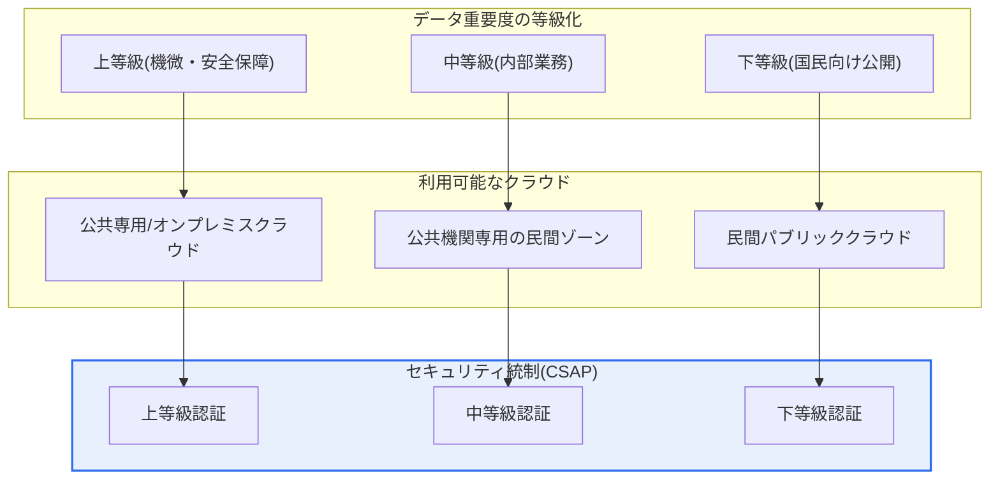
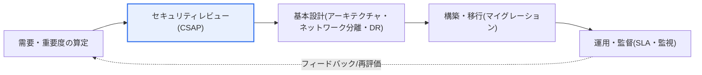

# 公共部門における民間クラウドの活用

## 1. 概要

### A. 定義
> **公共部門における民間クラウドの活用**とは、政府・公共機関が自前の電算室(オンプレミス)を構築・運用する代わりに、商用事業者が提供する検証済みの**民間クラウド(パブリック・専用)サービスを賃借**して情報システムを構築・運用する調達・運用方式である。柔軟性・コスト効率というクラウド本来の利点を享受しつつ、国民の機微情報と国家サービスを扱う公共の特殊性ゆえに、**セキュリティ・データ主権の要件を必ず併せて満たさなければならない**という点で、民間のクラウド導入とは決定的に区別される。

公共部門の民間クラウド活用が特別である理由は、「**効率性とセキュリティ・主権を同時に満たさなければならない**」という二重の制約にある。民間企業がクラウドを導入する際の判断基準は、概して総所有コスト(TCO)や市場投入のスピード、拡張性といった経済的・技術的効用である。しかし公共はこれに加えて、国民の個人情報保護、国家の中核データの国外流出の防止、サービス停止時の社会的影響までを併せて比較衡量しなければならない。民間クラウドは、迅速なリソース確保、弾力的な拡張、資本的支出(CAPEX)から運用費用(OPEX)への転換という明確な利点を提供するが、公共データの相当部分は住民登録番号・健康・課税のような機微情報や国家安全保障関連の情報を含むため、どのクラウドでも使えるというわけではない。

そこで韓国の公共部門では、データの重要度(機微性・影響度)に応じて利用可能なクラウドを差別化し、**CSAP(クラウドコンピューティングサービスセキュリティ認証)** を取得したサービスを優先的に活用し、論理的ネットワーク分離・データの国内保管・暗号化といった統制要件を遵守している。すなわち「民間の革新性と規模の経済を取り入れつつ、公共のセキュリティ統制の枠組みのもとに置く」というバランスがこのテーマの核心的命題であり、このバランス点をどこに置くかが、政策・設計・監督の全段階を貫く判断基準となる。

### B. 登場背景および必要性
公共部門の民間クラウド活用が本格化した背景には、三つの流れが重なっている。第一に、**デジタルプラットフォーム政府(DPG)とクラウドネイティブへの転換**政策である。政府は省庁・機関ごとに分断された情報システムを、クラウドベースのオープン型・連携型構造へと再編しようとしており、そのためにはマイクロサービス・コンテナ・サーバーレスのようなクラウドネイティブ技術を収める器として、成熟したクラウドインフラが必要である。自前で構築したインフラ(IaaS)だけでは、こうした最新のマネージドサービス(PaaS・SaaS)に追随することは難しい。

第二に、**自前構築の非効率**である。機関ごとに電算室を建設しサーバーを購入して運用すれば、初期投資と保守の負担が大きく、リソースの活用率は低く、需要の急増(災害支援金の申請、大学入試の受付などによるトラフィックの急増)に弾力的に対応することが難しい。実際、大規模なアクセスが集中する公共サービスが開通初期に麻痺する事例が繰り返される中で、弾力的な拡張が可能なクラウドの必要性が浮き彫りになった。

第三に、**検証体制の成熟**である。かつては「クラウドは果たして公共が求めるセキュリティ水準を満たせるのか」という信頼の問題が障害となっていたが、CSAP認証制度や『クラウドコンピューティング法』・『公共機関の情報システムのクラウド転換・統合計画』などの制度的基盤が整うにつれ、検証済みの民間クラウドを活用する根拠が整備された。この三つの流れが噛み合い、「自前構築優先」から「民間クラウド優先検討(Cloud First)」へと政策基調が移行した。

## 2. 全体構造と活用類型

公共の民間クラウド活用は単にサーバーを借りる問題ではなく、**データの重要度 → 利用可能なクラウド → セキュリティ統制の水準**を一つの連鎖として結び付けて設計する問題である。以下の概念図はその全体構造を、次の概念図は実際の活用手順の詳細なフローを示している。

この構造が意味するところを文章で説明すると、次のとおりである。公共はまず、対象システムが扱うデータを**重要度に応じて等級化**する。国家安全保障や国民の機微情報のように流出・毀損時の影響が大きい「上」等級のデータは統制が最も強い環境(公共専用クラウドまたはオンプレミス)に置き、内部の行政業務中心の「中」等級は公共機関のみを隔離収容する専用ゾーンに、すでに公開された情報中心の「下」等級は一般の民間パブリッククラウドに置くことができる。核心は、**すべてのデータに同一の最高水準の統制を適用しない**という点である。そうすれば安全ではあるが、コストと柔軟性をともに失う。逆に統制を一律に下げれば、機微情報が危険にさらされる。そのため「重要度に比例した差別化統制」が、効率性と安全性を同時に活かす唯一の現実的な解決策となる。

このとき統制の実効性を担保する仕組みが**CSAP(クラウドセキュリティ認証)** である。CSAPは、公共に提供されるクラウドサービスが一定のセキュリティ基準(管理的・物理的・技術的統制)を満たしているかを第三者が評価・認証する制度であり、サービス類型(IaaS・PaaS・SaaS)ごとに申請→評価→認証の手順を経る。認証の等級体系がデータ重要度の等級と対応しているため、機関は「このデータにはこの等級以上の認証を受けたサービスのみを使う」というルールによって安全性を担保できる。認証済みのサービスを活用すれば、機関が毎回個別のセキュリティレビューを一から実施する負担が軽減され、事業者間のセキュリティ水準を客観的に比較することができる。

### A. サービス類型別の評価観点と責任共有
民間クラウドはIaaS・PaaS・SaaSに階層化されており、階層が上がるほど事業者(CSP)が責任を負う範囲が広がり、利用機関が直接統制する範囲は狭まる。この**責任共有モデル(Shared Responsibility Model)** を正確に理解しなければ、「事業者がすべてやってくれるだろう」という錯覚によってセキュリティの空白が生じる。

| サービス類型 | 主な評価観点 | 利用機関の責任 | CSPの責任 |
|---|---|---|---|
| **IaaS** | インフラセキュリティ、隔離・ネットワーク分離 | OS・ミドルウェア・アプリ・データ | 物理設備・ハイパーバイザー・ネットワーク |
| **PaaS** | プラットフォームセキュリティ、開発環境の統制 | アプリ・データ・アカウント | OS・ランタイム・プラットフォーム |
| **SaaS** | アプリケーションセキュリティ、データ保護・アクセス制御 | データ・アカウント・設定 | アプリ全般・インフラ |

IaaSでは、機関がOSより上の層(パッチ・アカウント・ファイアウォールルール・データ暗号化)を直接責任を持って管理するため、統制の自由度が高い反面、管理負担が大きい。SaaSに向かうほど事業者が大部分の責任を負うが、だからといって機関の責任がなくなるわけではない。**アカウント・権限の管理と設定、そして何よりもデータそのものに対する責任は、いかなる類型においても利用機関に残る。** 実際のクラウド事故の相当数が、事業者のインフラの欠陥ではなく、利用者のアクセス権限の設定ミス(例:ストレージバケットの公開設定の誤り)に起因しているという事実は、この責任境界の重要性をよく示している。

## 3. 活用手順と基本設計

民間クラウドを実際に導入する過程は、「需要・重要度の算定 → セキュリティレビュー → 基本設計 → 構築・移行 → 運用・監督」というライフサイクルで進行し、各段階は前段階の成果物を入力として受け取り、次の段階を規定する。

**需要・重要度の算定**段階では、どのシステムを、いつ、どの程度クラウドへ移すか、そしてそのシステムが扱うデータの重要度がどの等級に当たるかを評価する。この算定結果が後に続くすべての設計の前提となるため、データフローと個人情報の処理状況を精密に識別することが鍵となる。等級を過大評価すれば不必要に高価な統制を負担することになり、過小評価すれば機微情報が危険にさらされる。

**セキュリティレビュー**段階では、対象等級に適合するCSAP認証サービスであるかを確認し、個人情報影響評価(PIA)の対象か否か、国内リージョンでの保管要件、暗号化・アクセス制御の要件を点検する。認証サービス優先の原則に従い、可能であればすでに検証済みのサービスカタログ(デジタルサービス専門契約制度の利用支援システムなど)の中から選択することで、調達とレビューを同時に効率化する。

**基本設計**段階では、アーキテクチャ(アベイラビリティゾーン・リージョン構成)、論理的ネットワーク分離(公共業務網とインターネット網の分離)、災害復旧(DR)とバックアップ戦略、既存システムからのデータ移行方式を確定する。特に公共ではサービスの継続性が社会的義務であるため、単一リージョンの障害がサービスの全面停止につながらないよう、マルチアベイラビリティゾーン・マルチリージョンの設計を考慮する。**構築・移行**段階では実際のマイグレーションを実施して移行前後のデータ整合性を検証し、**運用・監督**段階ではSLA(可用性・性能)の遵守状況、コスト、セキュリティ監視を継続的に点検し、定期的に等級・統制を再評価する。

### A. マイグレーション戦略の選択
基本設計と構築・移行の段階を貫く中核的な意思決定は、「既存システムをどのような方式でクラウドへ移すか」である。通常、マイグレーション戦略は複数の類型(いわゆる6R — Rehost, Replatform, Refactor, Repurchase, Retire, Retain)に区分され、システムの特性と予算・期限に応じて使い分ける。老朽化したシステムを大きな改修なしにそのまま移すリホスト(Lift & Shift)は迅速でリスクが低いが、クラウドの弾力性・マネージドサービスの利点を十分に享受できない。逆に、アプリケーションをコンテナ・マイクロサービスへと再設計するリファクタはクラウドネイティブの利点を最大化するが、時間・コスト・技術的難度が高い。

公共ではサービス停止がそのまま国民の不便に直結するため、無理な一括転換よりも、重要度の低いシステムから段階的に移行して経験と運用能力を蓄積するアプローチが安全である。また、移行過程で個人情報・中核データが一時保存領域やログに露出しないよう暗号化・アクセス制御を維持し、移行前後のレコード件数・チェックサムを照合して整合性を検証することが必須である。この検証を怠ると、データの欠落・重複が運用段階になって初めて発見され、はるかに大きなコストとなって跳ね返ってくる。

## 4. 活用構造の比較と適用事例

公共のクラウド活用構造は、「データをどこに、誰と共に置くか」によって大きく三つに分かれ、それぞれの選択には明確なトレードオフがある。

| 構造 | 特徴 | 長所 | 限界 |
|---|---|---|---|
| **公共専用クラウド** | 公共のみが利用する隔離インフラ(例:国家情報資源管理院のG-Cloud) | 最高水準のセキュリティ・主権 | 拡張性・最新サービスの制約 |
| **民間専用ゾーン(公共ゾーン)** | 民間CSPが公共専用として物理的・論理的に隔離 | 民間の革新性+隔離 | コスト・専用認証が必要 |
| **民間パブリック** | 一般の商用クラウドを利用 | 最新サービス・規模の経済 | 上等級データには不適 |

この三つの構造の違いが生じる根本的な理由は、「**隔離の水準と革新性がトレードオフの関係にある**」ことにある。完全に隔離された公共専用クラウドはデータ主権とセキュリティの面で最も安全であるが、民間が迅速に投入する最新のマネージドAI・データサービスをすぐに使うことは難しく、リソースの拡張にも限界がある。逆に民間パブリックは最新サービスと規模の経済を享受できるが、他の顧客とインフラを共有するため上等級のデータには不適である。そのため実務では、等級の低い国民向けサービスはパブリックに、機微な内部システムは専用ゾーンや専用クラウドに置く**ハイブリッド**が、現実的な折衷案として定着している。

具体的な事例として、大規模なトラフィックが予測不能な形で集中する国民向けサービス(例:国家予防接種の予約、災害支援金の申請)は、オートスケーリングが可能な民間パブリッククラウドに置いて開通初期のアクセス集中に対応するほうが、自前構築よりも有利である。一方、課税・福祉受給のような機微情報中心のシステムは、CSAP上等級の要件を満たす隔離環境に置いて流出リスクを統制する。また、複数の機関が共通で使う標準業務(メール・コラボレーション・文書)のSaaSは、個別に構築する代わりに共同活用することで重複投資を減らす方向へと転換が進んでいる。

### B. SLAと運用監督の実際
運用・監督段階においてSLA(サービスレベル合意)は形式的な文書ではなく、サービス品質を強制する契約上の仕組みである。公共サービスは、可用性(例:月間99.9%以上)、障害復旧時間、性能指標をSLAとして明文化し、未達時には利用料の減額のような賠償条項を設けて事業者の責任を担保する。ただしSLAが保証するのはインフラ層の可用性にすぎず、その上に載るアプリケーションの欠陥までは責任を負わないため、機関は独自のモニタリング・監視体制を併用し、サービス全体の品質を観測しなければならない。また、コストの面では、クラウドは使った分だけ課金される特性上、放置すればコストが雪だるま式に膨らみ得るため、使用量・遊休リソースを継続的に点検するコストガバナンス(FinOps)を運用監督の一部として含めることが望ましい。

## 5. 深掘り:最新動向と政策変化

近年の公共クラウド政策は、いくつかの方向へと進化している。第一に、**CSAP等級制**の定着である。かつて単一基準であったCSAPがデータの重要度に応じて上・中・下の等級に細分化されたことで、低等級のシステムについては民間パブリックの参入ハードルが下がり、これが韓国国内のクラウド市場へのグローバル事業者の条件付き参入に関する議論へとつながっている。これは「セキュリティ」と「産業振興・競争促進」の間の政策的バランスを再調整する流れとして理解できる。

第二に、**デジタルプラットフォーム政府とクラウドネイティブ転換**の結合である。単にサーバーをクラウドへ移すリフト・アンド・シフト(Lift & Shift)を超え、コンテナ・マイクロサービス・サーバーレスによってアプリケーション構造そのものを再設計し、クラウドの弾力性とオープンな連携を十分に活用しようとする方向へと目標が引き上げられている。第三に、**デジタルサービス専門契約制度**による調達の革新であり、クラウド・SaaSを従来の硬直的な公共調達手続きの代わりにカタログベースで迅速に契約できるようになった。ただし最新の事実関係(等級基準の詳細な数値、グローバルCSPの参入範囲、制度改正の時期)は継続的に変わるため、実際の答案作成・実務適用の際には最新の告示・指針を確認し、断定的な記述を避けるほうが安全である。

## 6. 考慮事項および示唆

1. **データ重要度に基づく差別化適用が大原則である。** すべてのシステムに同一の統制を適用することは、非効率(過剰統制)であるか危険(過少統制)である。重要度・機微性の等級に比例して利用可能なクラウドと統制水準を変えることが、効率性と安全性を同時に確保する唯一のバランス点である。
2. **CSAP認証サービスの優先活用により、セキュリティと手続きの効率を併せて得る。** 認証サービスを使えば個別のセキュリティレビューの負担が軽減されて信頼が担保され、事業者間の客観的な比較が可能となる。認証等級とデータ等級を対応させるルール化が実務の核心である。
3. **責任共有モデルを明確にし、Exit(移行)戦略を備えなければならない。** サービス類型ごとに利用機関とCSPの責任境界を文書化しつつ、データ・アカウント・設定に対する責任は常に機関に残ることを認識しなければならない。同時に、契約終了・事業者変更の際にデータを完全に返還・移行できる計画によって、**ベンダーロックイン(Lock-in)** を緩和しなければならない。
4. **データ主権・相互運用性・コストガバナンスを併せて管理する。** 国内リージョンでの保管・暗号化によって主権を確保し、オープン標準・マルチクラウドによって相互運用性を高め、FinOpsの観点から使用量ベースのコストを継続的に最適化(不要リソースの回収、予約・コミットメントの活用)して、クラウド導入による効率上の利点が放漫なコストによって相殺されないよう監督する。

## 参考資料
- 韓国科学技術情報通信部、『クラウドコンピューティングサービスセキュリティ認証(CSAP)制度』案内
- 韓国行政安全部・デジタルプラットフォーム政府委員会、公共部門のクラウド転換・デジタルプラットフォーム政府関連の政策資料

---

> **一言まとめ**: 公共部門の民間クラウド活用は、*需要・重要度の算定 → CSAPセキュリティレビュー → 基本設計 → 構築・移行 → 運用・監督*のライフサイクルで行われ、**データ重要度に基づく差別化統制・CSAP認証サービスの優先・責任共有モデルとExit戦略**を通じて、民間の効率性・革新性と公共のセキュリティ・データ主権をバランスよく確保することが核心である。
