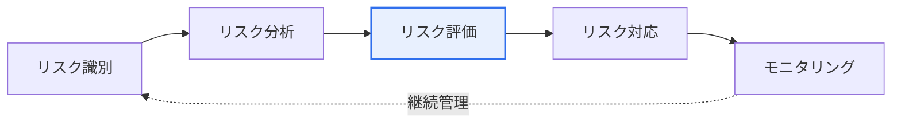
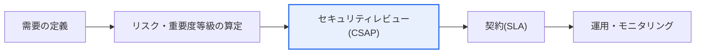

# 公共部門SaaS利用ガイドライン

## 1. 概要

### A. 定義
> **公共部門SaaS利用ガイドライン**とは、国家機関・地方自治体・公共機関が**SaaS(Software as a Service)を安全かつ効率的に利用**できるよう、リスク管理・セキュリティ・契約(SLA)の基準を提示した韓国政府の指針である。デジタルプラットフォーム政府とクラウドネイティブへの転換に対応するものである。

公共機関がSaaSを導入すれば、別途のインフラ構築なしに最新の機能を迅速に使えるため、業務効率の向上とコスト削減の効果が大きい。しかしSaaSは、**データとシステムが外部のCSP(クラウド事業者)のインフラ上に置かれる**という根本的な特性ゆえに、公共データの主権・セキュリティに関する懸念と衝突する。ガイドラインは、この相反を「一律禁止」ではなく**リスクベースで管理**することで、便益と安全性を同時に確保しようとする趣旨で策定された。

### B. 必要性
公共データの機微性はさまざまである。公開可能な広報資料と国民の個人情報を同じ基準で扱うことは、非効率であると同時に危険である。したがって、データの重要度に応じて利用可能なSaaSの範囲と統制水準を**差別化して適用**する管理原則が必要となる。この差別化管理が、ガイドライン全体を貫く中核的な論理である。

## 2. クラウドサービスのリスク管理原則および基準(A)

リスク管理の基本的な哲学は、**リスクベース(Risk-based)アプローチ**と**利用機関の自己責任**である。すべてのSaaSを一律に規制する代わりに、各機関が自らの扱うデータの重要度を自ら判断し、それに見合った統制に責任を持つ。このとき判断基準として**CSAP(クラウドセキュリティ認証)** の等級が活用される。CSAPはクラウドサービスのセキュリティ水準を上・中・下に区分しており、機微なデータほど高い等級の認証を受けたSaaSのみを使うようにマッチングする。リスク管理は一度の審査で終わるものではなく、識別→分析→評価→対応→モニタリングを循環する**継続的な活動**である。

| 区分 | 内容 |
|---|---|
| **原則** | リスクベースのアプローチ、利用機関の自己責任、継続的管理、重要度に基づく差別化 |
| **基準** | データ重要度の分類、CSAP等級(上・中・下)、サービス重要度の評価 |
| **核心** | データの類型・機微性に応じて、利用可能なSaaSの範囲と統制水準を決定 |

例えば国民の個人情報を処理する民願(行政手続)サービスはCSAP「上」等級のSaaSに限定し、内部のコラボレーション用文書ツールは「中・下」等級まで許容するというように、データの機微性と認証等級を対応させる。

## 3. セキュリティ対策の策定およびセキュリティレビュー(B)

セキュリティ対策は、**データが移動・保存・アクセスされる全過程**を統制するように設計する。アクセス制御とアカウント権限によって認可されたユーザーのみがアクセスできるようにし、転送・保存区間を暗号化して流出時にも内容を保護し、ログ・監査証跡によって事後の追跡可能性を確保する。特にSaaSでは、データがどこに保存されるか(データの所在・主権)が重要であるため、国内保管の有無を確認する。セキュリティレビューは**導入前と導入後に分かれる**。導入前にはCSAP認証の有無を確認し、必要に応じて国家情報院のセキュリティレビューを受け、導入後も継続的な点検・再レビューによってセキュリティ水準を維持する。

| 区分 | 詳細内容 |
|---|---|
| **セキュリティ対策** | アクセス制御・アカウント権限、データ暗号化(転送・保存)、ログ・監査証跡、データの所在・主権、バックアップ・継続性 |
| **セキュリティレビュー** | (導入前)CSAP認証の確認・必要に応じて国家情報院のレビュー、(導入後)継続的な点検・再レビュー |
| **責任(SR)** | 責任共有モデルに基づき、CSP・利用機関間のセキュリティ責任範囲を明確化 |

ここで必ず理解すべき概念が**責任共有モデル(Shared Responsibility)** である。SaaSにおいてCSPはインフラ・プラットフォーム・アプリケーションのセキュリティに責任を負うが、**データとアカウント・アクセス権限のセキュリティは利用機関の役割**である。この境界を知らなければ、「CSPがすべてやってくれるだろう」と誤解してアカウント管理を疎かにし、事故につながる。

## 4. サービスレベル合意(C)

SLA(Service Level Agreement)は、SaaS利用の**品質と責任を契約として明確に定める仕組み**である。可用性・性能の基準を数値で定めて未達時には賠償させ、障害発生時の通知・復旧手順を規定する。特に公共において重要なのは、**データの返還・廃棄(Exit Plan)** の条項である。契約終了時にデータを安全に返還してもらい、CSP側で完全に廃棄するよう明文化しなければ、ロックイン(Lock-in)されたり、データが残存して流出したりするリスクがある。

| SLA項目 | 内容 |
|---|---|
| **可用性** | サービス稼働率(%)の保証、未達時の賠償 |
| **性能** | 応答時間・スループットの基準 |
| **障害対応** | 障害通知・復旧目標(RTO/RPO)、対応手順 |
| **データ** | データの返還・廃棄(Exit Plan)、所有権・移行 |
| **責任・賠償** | 責任範囲、違約・損害賠償、セキュリティ事故の通知義務 |

## 5. 導入手順および示唆

導入は、需要の定義 → リスク・重要度等級の算定 → CSAPに基づくセキュリティレビュー → SLA契約 → 運用・モニタリングの順に進められる。この手順の実践的な示唆は次のとおりである。

- **CSAP認証SaaSの優先活用**: すでに検証済みの認証サービスを使えば、セキュリティを確保しつつ導入審査の手続きも簡素化される。
- **責任共有モデルの理解が核心**: 利用機関はデータ・アカウントのセキュリティ責任を必ず負うという前提で統制を設計する。
- **Exit戦略の契約への明文化**: データの返還・廃棄と移行方法を契約段階で確定し、ロックインと流出のリスクを予防する。
- **継続的なモニタリング**: 導入後もセキュリティ水準・SLAの遵守を常時点検し、リスクの変化に対応する。

---

> **一言まとめ**: 公共SaaSは、*リスク・重要度に基づく管理(CSAP等級) → セキュリティ対策・セキュリティレビュー → SLA契約*の手順によって安全性と効率性を同時に確保するものであり、責任共有モデルの理解とExit戦略の明文化が成功の鍵である。
