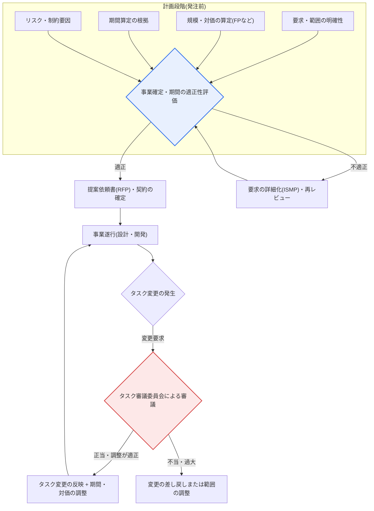
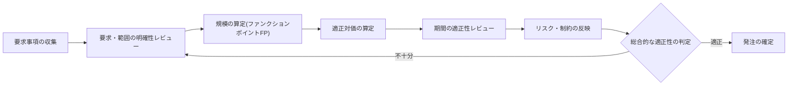

# 公共ソフトウェア事業の計画段階レビューとタスク変更の適正性評価

## 1. 概要

### A. 定義と背景
> **計画段階の適正性レビュー**とは、公共SW事業の発注前に、要求・範囲・規模・期間・対価が現実的であるかを事前に検証する手続きであり、**タスク変更の適正性評価**とは、事業遂行中に発生するタスクの追加・変更・削除が正当かつ合理的であるかを、公式の手続きを通じて判断する統制の仕組みである。両制度の共通の目的は、ずさんな計画と無秩序なタスク変更による事業の失敗(遅延・品質低下・紛争)を予防することにある。

この評価が必要な根本的な理由は、「**出発点を誤るか、途中で揺らげば事業は失敗する**」という点にある。公共SW事業は、要求が不明確なまま、切迫したスケジュールと低い対価で発注されることが多く、開発途中でタスクが次々と追加・変更されて統制不能に陥りがちである。特に発注機関は予算編成の時点で事業規模を確定しなければならないが、その時点では要求が十分に詳細化されていない状態で概算の対価だけが算定されるという構造的な限界がある。その結果、着手後に「当然含まれるのではないか」といった類の追加要求(いわゆる要求事項の上方漂流、scope creep)が累積し、受注者は契約対価の範囲内でそれを吸収しようとして品質を犠牲にすることになる。

計画段階の適正性評価は、「**そもそもこの事業はこの期間・この範囲で可能なのか**」を事前に検証して無理な発注を防ぎ、タスク変更の適正性評価は、「**この変更は正当かつ合理的か、それに見合った期間・対価の調整が行われたか**」を判断して、無秩序な範囲拡大と不当なコスト転嫁を統制する。すなわち、事業の入口(計画)と進行中(変更)という二つの関門でリスクを管理する二重の安全装置であるといえる。

制度的には、『ソフトウェア振興法』(2020年に『ソフトウェア産業振興法』を全部改正)とその下位の告示、そして発注機関が準用する『公共ソフトウェア事業の発注・管理マニュアル』などが、計画レビューとタスク審議の根拠となる。ただし詳細な告示名・条文は改正が頻繁であるため、実際の適用時には最新の法令・告示の原文を確認することが望ましい。

### B. 必要性
公共SW事業の反復的な失敗を防ぐためには、事業計画の妥当性とタスク変更の正当性を、発注機関・受注者いずれか一方の恣意ではなく、**客観的な基準と公式の手続き**によって判断しなければならない。必要性は三つの層に分けて見ることができる。第一は**予算の効率性**である。無理な低価格・短期間の発注は、手戻りや瑕疵補修のコストをかえって増大させ、総所有コスト(TCO)を引き上げる。第二は**品質と国民向けサービスの安定性**である。行政・福祉・税務など国民生活に直結するシステムの欠陥は、社会的コストとして転嫁される。第三は**公正な契約関係**である。タスク変更に見合った対価・期間の調整が保証されてこそ、発注機関と受注者の間の紛争を減らし、SW産業エコシステムの健全性を守ることができる。

## 2. 全体構造 — 計画レビューとタスク変更統制の流れ

計画レビューとタスク変更評価は別個のイベントではなく、事業のライフサイクル(発注準備 → 契約 → 遂行 → 検収)にわたって連結された一つのリスク管理体系である。以下の構造図は、二つの関門がどこに位置し、どのような成果物・機関と噛み合うかを示している。

上記の構造で注目すべき点は、二つの関門の性格の違いである。計画段階の評価(G1)は**事前予防的(preventive)** な統制であり、無理な事業がそもそも開始されないようにふるい分けるゲートである。一方、タスク審議(G2)は**進行中の是正的(corrective)** な統制であり、すでに開始された事業が軌道を外れないように押さえるバルブである。計画段階で要求を十分に詳細化(ISMPなど)しておけば進行中の変更そのものが減るため、二つの関門は互いに補完し合う関係にある。

## 3. 計画段階のレビュー項目(事業確定・期間の適正性)

計画段階レビューの目標は、「要求の範囲と規模に照らして、事業の期間・対価が現実的であるか」を判定することである。以下の詳細フロー図は、レビューがどのような順序で行われるかを示している。

### A. 要求・範囲の明確性
計画のずさんさの第一の原因は、要求が曖昧なまま発注されることにある。要求が「会員管理機能一式」のように抽象的にしか記述されていなければ、受注者と発注機関がそれぞれ異なる範囲を想定することになり、この乖離が後にタスク変更をめぐる紛争として噴出する。したがって計画段階では、機能要求・非機能要求が**測定可能かつ確定的な水準**に整理されているかを確認する。例えば「速い応答」ではなく、「同時接続1,000人で平均応答2秒以内」のように検証可能な形でなければならない。

要求が十分に詳細化されていない大規模・複雑な事業の場合、発注前に別途の**情報化戦略計画(ISP)または情報システムマスタープラン(ISMP)** 事業を先行させ、要求を具体化するよう推奨されている。ISMPは要求事項をファンクションポイントの算定が可能な水準まで詳細化することを目標とするため、その後の規模・対価・期間の算定の信頼性を大きく高める。

### B. 規模・対価の適正性
要求が整理されれば、規模を定量化する。公共SW事業の標準的な規模の尺度は**ファンクションポイント(Function Point, FP)** であり、開発言語・技術に依存せずユーザー視点の機能規模を測定できるという長所があるため、発注規模の算定と対価の算定の基準として広く用いられている。算定されたFPにソフトウェア事業対価基準の単価・補正係数を適用して開発費を算出し、これに直接経費・利益などを加えて適正な対価を導き出す。

ここで核心となるのは、**低価格発注のリスク**をふるい分けることである。規模に対して対価が過度に低ければ、受注者は投入人員を減らしたり熟練度の低い人員で補ったりすることになり、品質が構造的に低下する。実際、公共SW事業における過度な価格競争(低価格落札)は品質低下と下請け問題の原因として指摘されてきており、そのため商用SWの直接購入(分離発注)、遠隔地開発の拡大、適正対価の支払いなどが政策的に強調されてきた。

### C. 期間の適正性
規模が同じでも、期間が非現実的に短ければ事業は失敗する。人月(man-month)を際限なく圧縮できないことは、ブルックスの法則(「遅れているプロジェクトに人員を追加すると、さらに遅れる」)がはるか以前に指摘したとおりである。計画段階では、算定された規模(FP)と生産性指標を根拠に**必要な期間を逆算**し、発注機関が予算・行政スケジュールの都合で設定した希望期間との乖離を点検する。乖離が大きければ、範囲を段階的に分割する(段階的構築)か、期間を現実的なものに改めなければならない。

例えば、ある次世代システムが3,000 FPの規模と算定されたにもかかわらず発注の希望期間が8か月であれば、通常の生産性指標から見て無理な圧縮である可能性が高い。この場合、中核機能を優先的に構築した上で2段階に分けるロードマップを提示することが、計画レビューの実務的な結論となる。

### D. リスク・制約要因
最後に、技術・人員・組織・法制度上の制約を計画に反映しているかを確認する。新技術の導入に伴う不確実性、多数の機関との連携に伴う利害調整、個人情報・セキュリティ規制の遵守、既存システムからのデータ移行の難度などは、いずれもスケジュール・コストを左右する変数である。こうしたリスクが計画書において識別・定量化され、対応策(予備費、バッファスケジュール)が用意されているかが、適正性の重要な判断要素である。

| レビュー項目 | 中核的な問い | 不十分な場合の結果 |
|---|---|---|
| **要求・範囲の明確性** | 要求は測定可能・確定的か | 着手後の範囲紛争、scope creep |
| **規模・対価の適正性** | FPなどによる規模算定、適正な対価か | 低価格発注 → 品質低下 |
| **期間の適正性** | 規模に対して期間は現実的か | 無理な圧縮 → 遅延・欠陥 |
| **リスク・制約** | 技術・人員・規制の制約を反映したか | 予期せぬ変数による事業の頓挫 |

## 4. タスク変更の適正性の判断基準

### A. タスク変更が問題となる理由
事業開始後に発生するタスク変更そのものは避けられない。要求は進化し、法・政策は変わり、着手後になって初めて明らかになる要求もあるからである。問題は、変更が**正当な根拠・正式な手続き・それに見合った調整なしに**行われる場合である。発注機関が「もともとその程度はやってもらうべきもの」として対価・期間の調整なしに機能を追加すれば、受注者は損失を品質で埋め合わせることになり、逆に受注者が恣意的に範囲を縮小すれば発注機関が損害を被る。そのため、変更の正当性とその影響を客観的に審議する手続きが必要となる。

### B. 四つの判断基準
タスク変更の適正性は、次の四つの軸で判断する。各軸は独立しておらず互いに絡み合っているため、一つでも食い違えば、その変更は不適正と評価され得る。

第一に、**変更理由の正当性**である。変更が、法・政策の変化、上位計画の変更、着手後に確認された必須要求のように不可避なものか、それとも単なる好み・利便による恣意的な拡大かを見極める。第二に、**範囲・規模への影響**である。原契約に対するファンクションポイントの増減を定量化し、変更が事業全体に占める比重を把握する。第三に、**スケジュール・コストへの影響**である。規模が増えたのであれば、それに見合って期間と対価を調整しなければならず、調整なしに吸収だけを求める変更は不適正である。第四に、**手続きの遵守**である。変更が**タスク審議委員会**などの公式機関の審議を経たか、契約変更(設計変更・契約金額の調整)の手続きが適切に履行されたかを確認する。

タスク審議委員会は、発注機関・受注者・外部専門家などが参加して変更の正当性と影響を審議する機関であり、変更をめぐる力の不均衡(発注機関優位)を牽制する仕組みである。審議の結果、正当な変更と判定されればそれに合わせて期間・対価を調整し、過大・不当な要求は差し戻すか範囲を再調整する。

### C. 具体的事例から見た適正/不適正
例えば、着手後に個人情報保護法の改正によって暗号化・アクセス制御の要件が強化され、関連機能を追加しなければならなくなった場合、これは**不可避かつ正当な変更**であるため、規模の増加分だけ期間・対価を調整することが適正である。逆に、発注機関の担当者が個人的な好みで画面デザインを何度も全面的に改修するよう要求しながら、対価・期間はそのままにしようとするのであれば、これは理由の正当性も、それに見合った調整も欠いた**不適正な変更**に該当し、タスク審議を通じて統制されなければならない。

| 判断基準 | 内容 | 適正と判定される要件 |
|---|---|---|
| **変更理由の正当性** | 必須・不可避な変更か | 法・政策・上位計画の変化などの客観的根拠 |
| **範囲・規模への影響** | 原契約に対する規模の変化 | FPなどによる増減の定量化 |
| **スケジュール・コストへの影響** | 期間・対価の調整の必要性 | 規模の変化に見合った調整 |
| **手続きの遵守** | 公式の手続きを経たか | タスク審議委員会の審議・契約変更の履行 |

## 5. 深掘り — 関連制度との連携と予想される出題方向

計画レビューとタスク変更評価は単独の制度ではなく、公共SW事業の管理体系全般と噛み合って機能する。**発注前**にはISP/ISMPによって要求を詳細化し、商用SWの分離発注によって無理な一括発注を緩和する。**遂行中**には情報システム監理(段階別監理、常駐監理)によって進捗・品質・タスク変更を継続的に点検し、PMO(発注機関を代行する事業管理組織)がタスク変更の要求を事前にレビューしてタスク審議の負担を軽減する。**検収時**には要求事項に対する履行状況を検証する。このように、計画レビュー(入口)–監理・PMO(進行)–タスク審議(変更)–検収(出口)が一つの統制の連鎖を成している。

政策動向としては、低価格受注・タスク変更をめぐる対立を減らすための適正対価の支払い、遠隔地開発の拡大、下請け構造の改善、SW影響評価などが継続的に強調されてきた。ただし詳細な制度名と適用範囲は改正が頻繁であるため、答案作成時には最新の法令・告示を確認し、一般化した表現を用いるのが安全である。

技術士試験の観点から、このテーマは「公共SW事業の失敗原因と対策」、「タスク変更管理(タスク審議委員会)」、「SW事業対価の算定(ファンクションポイント)」、「情報システム監理・PMO」と関連付けて出題されやすい。答案構成の戦略としては、① 計画段階(入口)とタスク変更(進行)の二重統制構造をまず提示し、② 各関門の詳細な判断基準を表+文章で展開した上で、③ ISMP・監理・PMOなどの連携制度と政策動向で締めくくる流れが効果的である。

## 6. 考慮事項および示唆

1. **適正な対価・期間の保証が品質の前提である。** 無理な低価格・短期間の発注は、手戻り・瑕疵補修によってかえって総コストを増大させる。規模(FP)に基づく対価と現実的な期間を計画段階で確保することが事業成功の出発点であり、これはトレードオフではなく、長期的には発注機関にとっても利益となる。
2. **タスク変更の統制と正当な調整は必ず並行して行われなければならない。** 無秩序な範囲拡大は防ぎつつ、正当な変更には期間・対価を見合った形で調整することが公正である。統制だけを強調すれば必要な変更まで萎縮し、調整だけを強調すればscope creepを助長するため、バランスが鍵となる。
3. **予防的統制(計画)への投資は、是正的統制(変更)よりも効率的である。** 着手前にISMPで要求を詳細化すれば、進行中の変更そのものが減る。要求の不明確さを後からタスク審議で吸収するよりも、前もって要求を確定するほうが、コスト・紛争を根本的に減らせる。
4. **監理・PMOとの連携によって統制の実効性を高めなければならない。** 計画レビューとタスク審議は書類上の手続きにとどまりやすいため、常駐監理・PMOが実際の進捗と変更を常時モニタリングし、形式的な審議にならないよう下支えしなければならない。
5. **制度の目的は規制ではなく、事業の成功と産業エコシステムの健全性である。** 統制手続きを負担としてのみ認識すれば形骸化する。発注機関・受注者がリスクを共に管理する協調の仕組みとして制度を活用したときに、紛争の減少と品質の向上という本来の効果が現れる。

## 参考資料
- 国家法令情報センター、『ソフトウェア振興法』: https://www.law.go.kr/
- 韓国科学技術情報通信部・情報通信産業振興院(NIPA)、ソフトウェア事業対価算定ガイド: https://www.nipa.kr/
- 韓国知能情報社会振興院(NIA)公共情報化事業管理資料: https://www.nia.or.kr/

---

> **一言まとめ**: 公共SW事業は、*計画段階*で要求の明確性・規模(FP)・期間・対価の適正性を事前に検証して無理な発注を防ぎ、*遂行中*にはタスク審議委員会を通じてタスク変更の正当性・範囲への影響・スケジュールとコスト・手続きを審議し、見合った調整を保証することで、ずさんな計画と無秩序な範囲拡大という二つの失敗要因を、入口・進行の二つの関門で統制する。
