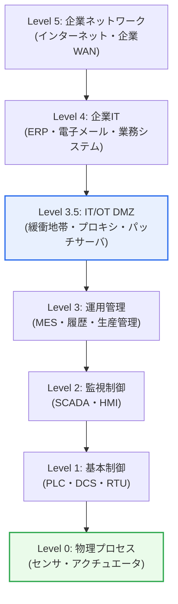
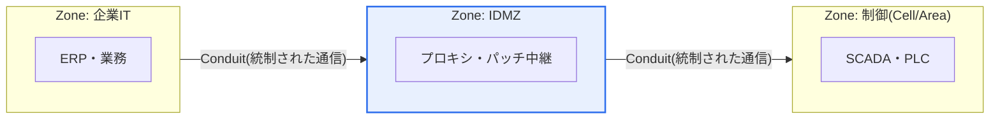

# 産業制御システム(ICS)のパデュー(Purdue)モデル

## 1. 概要

### A. 定義および概念
> **パデューモデル(Purdue Model, Purdue Enterprise Reference Architecture)** とは、産業制御システム(ICS)の構成要素を**機能と役割に応じて複数の階層(Level)に分けて表現した参照アーキテクチャ**であり、IT(情報技術)とOT(運用技術)の領域を階層的に分離し、その間に緩衝地帯を設けることで、産業ネットワークの構造とセキュリティ境界(Security Boundary)を定義する。

パデューモデルは、1990年代初めに米国パデュー大学のコンピュータ統合生産(CIM)研究において、企業の情報・制御の流れを階層化するために考案されたものであり、その後ISA-95(企業-制御システム統合)標準と結びついて、産業オートメーションの事実上の標準的な地図として定着した。今日では、その機能的な階層構造が**産業サイバーセキュリティのベースライン**としてより広く活用されている。

パデューモデルが産業セキュリティの基準となった根本的な理由は、「**工場の物理設備とオフィスのITが無秩序に混在すると危険であるため、階層に分けて境界を守ろう**」という点にある。産業現場には、実際の物理設備を制御するOT領域(センサ・PLC・SCADA)と、経営・業務を担うIT領域(ERP・インターネット)が共存している。ところが、両者の要求は正反対である。OTは安全(Safety)と稼働の継続(Availability)が最優先であるため、むやみに停止させたりパッチを当てたりすることができず、ライフサイクルも10~20年と長い。一方、ITはデータの機密性・完全性と接続性が重要であり、頻繁に更新される。

もしこの二つを何の統制もなく接続すれば、インターネットを通じて侵入した攻撃が直ちに物理設備を操作し、爆発・停電・人命被害のような物理的災害を引き起こしかねない。パデューモデルはこれを防ぐため、システムを物理現場(下位)から経営(上位)まで階層に分け、各階層の間に明確な境界と統制を設ける。特にITとOTの間には**産業DMZ(IDMZ, Industrial DMZ)** という緩衝地帯を置き、上位ITの脅威が下位OTへ直接伝播しないよう遮断する。要するにパデューモデルは、産業システムを理解するための「地図」であると同時に、防御を設計するための「セキュリティ境界線」である。

### B. IT/OT融合の背景と必要性
かつてOTは外部から切り離された閉域網(Air-gap)であったため、セキュリティ脅威から比較的自由であると考えられていた。しかし、スマートファクトリー・Industry 4.0・産業IoT(IIoT)によって生産データをリアルタイムに収集・分析したいという需要が高まるにつれ、閉じられていたOTがIT・クラウドと接続され始めた。この接続は生産性を高めたが、同時に攻撃対象領域(Attack Surface)を広げた。結果として、階層構造に対する理解とIT-OT境界のセキュリティが産業安全の必須要件となり、パデューモデルはこうしたセグメンテーション(Segmentation)設計の出発点となっている。[[isa-iec-62443]]

## 2. パデューモデルの階層構造

パデューモデルは、上図のように物理プロセス(最下位のLevel 0)から企業ネットワーク(最上位のLevel 5)まで階層で構成される。この階層構造を理解する中核原理は、**「下に行くほどリアルタイム性・安全・可用性が重要になり、上に行くほどデータ・接続性・機密性が重要になる」** という方向性である。以下、各階層を下から上へと見ていく。

### A. OT領域 — Level 0~2(物理プロセスとリアルタイム制御)
最下位の**Level 0(物理プロセス)** は、バルブ・モータ・ポンプのようなアクチュエータと、温度・圧力・流量を計測するセンサから成る実際の物理設備である。ここではミリ秒単位のリアルタイムな物理現象が起こり、事故が起きればそのまま物理的被害につながるため、安全が絶対的に優先される。

**Level 1(基本制御)** には、PLC(Programmable Logic Controller)・DCS(分散制御システム)・RTUが位置し、Level 0の設備を直接制御する。「温度がしきい値を超えたらバルブを閉じる」といった制御ロジックが実行される階層であり、ここでの誤動作や改ざんはそのまま物理プロセスの異常に直結する。スタックスネットが標的としたのは、まさにこのPLCであった。

**Level 2(監視制御)** には、SCADA(監視制御・データ収集)とHMI(オペレータ画面)が位置し、オペレータがプロセスの状態を監視して設定値を変更する。Level 0~2は総称して「**セル/エリアゾーン(Cell/Area Zone)**」を構成し、リアルタイム制御の中核区間となる。これら三つの階層は、稼働停止がそのまま生産・安全の損失となるため、IT流の強制パッチ適用や再起動をそのまま適用しにくいという特性を共有している。

### B. 境界階層 — Level 3.5(IT/OT DMZ)
パデューモデルのセキュリティ上の核心は、Level 3とLevel 4の間に位置する**Level 3.5、すなわちIT/OT DMZ(IDMZ)** である。この緩衝地帯は、OTとITを決して直接接続させず、必ずここを経由させる。IDMZには、リバースプロキシ、パッチ配布サーバ、データヒストリアンの複製、リモートアクセス用のジャンプサーバなどが配置され、上位ITからのトラフィックが下位OTに直接到達しないよう中継・検査する。

IDMZの設計原則は明確である。**「いかなるトラフィックもITとOTを貫通(traverse)できず、DMZで終端(terminate)される」** ということである。例えば、ITのパッチサーバがOT資産を直接更新する代わりに、IDMZの中継サーバにパッチを置いておき、OT資産がそこからのみ取得するようにする。こうすれば、IT網がランサムウェアに感染しても、その脅威が物理設備にまで直ちに広がることはない。

### C. IT領域 — Level 3~5(運用管理と経営IT)
**Level 3(運用管理)** は、MES(製造実行システム)・生産スケジューリング・品質履歴管理など工場全体の運用を管理する階層であり、OTの最上位であると同時にITと接する地点である。**Level 4(企業IT)** はERP・電子メール・業務システムなど事業所単位のビジネスITを、**Level 5(企業ネットワーク)** は複数の事業所を包括する全社WANとインターネット接続を担う。これらの上位階層は、伝統的なITセキュリティ(パッチ・ウイルス対策・アクセス制御)が通常どおり適用される領域である。

| 階層 | 代表的な構成要素 | 機能・特徴 | 優先される価値 |
|---|---|---|---|
| **Level 5** | インターネット・企業WAN | 全社ネットワーク・外部接続 | 接続性 |
| **Level 4** | ERP・電子メール・業務システム | 事業所のビジネスIT | 機密性・データ |
| **Level 3.5** | プロキシ・パッチサーバ・ジャンプサーバ | IT-OTの緩衝・境界統制 | 隔離・遮断 |
| **Level 3** | MES・履歴管理 | 生産運用管理(OTの上位) | 運用効率 |
| **Level 2** | SCADA・HMI | 監視・オペレータ操作 | 可視性 |
| **Level 1** | PLC・DCS・RTU | 設備の直接制御 | リアルタイム性 |
| **Level 0** | センサ・アクチュエータ | 物理プロセスの実行 | 安全・可用性 |

## 3. セキュリティ観点での活用とIEC 62443との連携

パデューモデルの階層概念は、産業セキュリティの国際標準である**IEC 62443**の**ゾーン(Zone)・コンジット(Conduit)** 概念と結びつくことで、実質的な防御設計として具体化される。IEC 62443は、パデューの硬直的な「階層」を、資産の論理的なまとまりである「ゾーン(Zone)」と、ゾーン間の統制された通信経路である「コンジット(Conduit)」として再解釈する。各ゾーンには要求セキュリティレベル(SL, Security Level 1~4)を付与し、コンジットではファイアウォール・一方向ゲートウェイ(Data Diode)などによって必要最小限の通信のみを許可する。実務ではよく「**パデューで構造を描き、62443でそれを守る**」と表現される。

| セキュリティの観点 | 内容 | 実務適用の例 |
|---|---|---|
| **境界分離(Segmentation)** | 階層・ゾーンごとのネットワーク分割、IDMZによるIT-OTの隔離 | VLAN・ファイアウォール・ゾーン分離 |
| **最小通信(Least Communication)** | 階層間で必要な通信のみをConduitで許可 | ホワイトリスト・プロトコル制限 |
| **下位の保護を優先** | 物理設備(L0~1)への直接アクセスの統制 | 一方向ゲートウェイ・ジャンプサーバ |
| **多層防御(Defense in Depth)** | 各階層ごとに多重の防御線を構築 | 階層別のモニタリング・認証 |

歴史的な事例が、この構造の必要性をよく示している。2010年の**スタックスネット(Stuxnet)** は、USBを通じて閉域のOT網に侵入した後、Level 1のシーメンス製PLCを操作し、イランのナタンズにある遠心分離機を物理的に破壊した。2015年12月の**ウクライナ大規模停電(BlackEnergy)** では、攻撃者がIT網を経由して配電会社の制御センターにリモート接続し、約30か所の変電所の遮断器を操作して、約23万人が停電の被害を受けた。2016年には、産業用プロトコルを直接操る**インダストロイヤー(Industroyer/CrashOverride)** が、キーウの電力網の一部を約1時間麻痺させた。三つの事例はいずれもIT経路から侵入してOTへ拡散したという共通点を持ち、これはIT/OTの境界統制がなぜ産業セキュリティの急所であるかを立証している。

### A. ITセキュリティとOTセキュリティの根本的な違い
パデューモデルがITとOTをあえて階層で分ける理由は、両領域のセキュリティ上の優先順位が根本的に相反するためである。ITセキュリティは伝統的に、機密性(Confidentiality)→完全性(Integrity)→可用性(Availability)の順に価値を置く。データ漏えいが最悪の事故であるため、疑わしければシステムを遮断して即座にパッチを当てるのが定石である。

一方、OTセキュリティではこの優先順位が正反対になる。可用性・安全が最優先であり、機密性は後回しである。制御信号がわずか数ミリ秒遅延したり遮断されたりするだけで物理プロセスが誤動作し、爆発・停電につながり得るため、「疑わしければ遮断」というIT流の対応はそれ自体が安全事故を引き起こす。また、OT資産は24時間無停止稼働が前提であるため、パッチ適用のための再起動がそのまま生産損失となり、10~20年使用されるレガシー設備は最新のセキュリティ機能をサポートすらしていない。

この違いのため、ITセキュリティの方式をOTにそのまま移植すると、かえって危険である。例えば、ITで一般的な能動的脆弱性スキャンは旧式のPLCをダウンさせる恐れがあるため、OTでは受動的(Passive)なモニタリングが好まれ、リアルタイムのパッチ適用の代わりに仮想パッチ(IPSシグネチャによって脆弱性の悪用を遮断)が広く用いられる。パデューモデルの階層分離は、まさにこの相反する二つのセキュリティ哲学が互いを侵害しないよう、物理的・論理的な緩衝を提供する仕組みなのである。

## 4. 深掘り — クラウド・IIoT時代におけるパデューモデルの再解釈とゼロトラスト

パデューモデルは明確な階層と境界を前提としているが、現実の産業ネットワークはその前提が曖昧になる方向へと変化している。クラウドベースの分析、IIoTセンサの直接通信(MQTTなどで上位階層を飛び越える通信)、5Gプライベートネットワーク、コロナ禍以降に急増したリモート保守は、いずれも「階層を順次経由する」というパデューの仮定を崩すものである。このため、「パデューモデルはもはや時代遅れなのか」という論争が続いている。

現在の実務的な合意は、「**パデューモデルは概念的な地図(共通言語・セグメンテーションの思考枠組み)としては依然として有効であるが、文字どおりの実装設計図としては拡張・補完が必要である**」というものである。すなわち、階層の順序を絶対的な通信経路として強制するよりも、階層を資産分類と境界設計の基準としつつ、実際の統制はアイデンティティベースへと移行する。その核心が**ゼロトラスト(Zero Trust)** であり、「ネットワーク上の位置を信頼の根拠とせず(暗黙の信頼の排除)、すべてのアクセスをアイデンティティ・状況に基づいて毎回検証する」という原則である。[[zero-trust]]

実際に、2025年に米国防総省が発表した「Zero Trust for Operational Technology」ガイダンスは、パデューモデル・IEC 62443を依然として権威あるOT分類フレームワークとして認めつつも、IIoT・クラウド・リモートアクセスが生み出した空白を、IEC 62443のゾーン・コンジット、ゼロトラストによる検証、IDMZにおけるハードウェアで強制された境界統制によって埋めるべきであると提示している。想定される出題の方向としては、「パデューモデルの限界とゼロトラストによる補完」「IT/OT融合環境におけるセグメンテーション設計」「IEC 62443のゾーン・コンジットに基づくSL設計」などが有力である。

## 5. 考慮事項および示唆点

1. **IT/OT境界のセキュリティが最優先である。** スタックスネット・ウクライナ停電など、重大な産業サイバー事故の大半はITを通じて侵入しOTへと拡散した。したがって、IDMZ・ネットワーク分離・階層間のアクセス制御・一方向ゲートウェイによって脅威の伝播を遮断することが防御の急所である。技術士の観点では、ITセキュリティの予算・能力をOT境界に戦略的に配分することが中核的な意思決定である。

2. **OT固有の特性を尊重したセキュリティを設計せよ。** OTは稼働停止・再起動・パッチ適用が難しく、ライフサイクルが長く、レガシープロトコル(認証機能のないModbusなど)が多い。したがって、ITセキュリティの方式をそのまま移植するよりも、仮想パッチ(IPSシグネチャ)、受動的なトラフィックモニタリング(パッシブ異常検知)、資産の可視性確保を中心としたOT特化型のセキュリティを設計しなければならない。

3. **境界の曖昧化にゼロトラストで対応せよ。** クラウド・IIoT・リモート保守によって、伝統的な階層境界が曖昧になりつつある。パデューモデルをセグメンテーションのベースラインとしつつ、アイデンティティ・機器状態に基づくゼロトラストのアクセス制御とIEC 62443のゾーン・コンジット設計で補完するハイブリッド戦略が必要である。

4. **標準・ガバナンスと連携して継続的に管理せよ。** IEC 62443(ゾーン・コンジット・SL)、NIST SP 800-82(ICSセキュリティガイド)、韓国の主要情報通信基盤施設保護制度などと整合的にセキュリティアーキテクチャを策定し、資産の識別→リスク評価→目標セキュリティレベル(SL-T)の設定→継続的な点検というガバナンス体系で運用しなければならない。

5. **安全(Safety)とセキュリティ(Security)の相反を調整せよ。** OTでは、セキュリティ統制がかえって可用性・安全を損なうことがある(例: ファイアウォールの誤検知による制御信号の遮断)。セキュリティ対策が物理プロセスの安全とリアルタイム性を阻害しないよう、安全性分析とセキュリティ設計を統合的に検討することが、技術士としての均衡点である。

## 参考資料
- Fortinet, "What Is the Purdue Model for ICS Security?" — https://www.fortinet.com/resources/cyberglossary/purdue-model
- Zscaler, "What Is IEC 62443? Definition, Breakdown & Methodology" — https://www.zscaler.com/zpedia/what-is-iec-62443
- 4Secure, "The Purdue Model in 2026: Is It Still Fit for Purpose?" — https://www.4-secure.com/purdue-model-ics-security/
- Wikipedia, "Industroyer" — https://en.wikipedia.org/wiki/Industroyer

---

> **一言まとめ**: パデューモデルは、*ICSを物理プロセス(L0)から企業IT(L5)まで階層に分けた参照アーキテクチャ* であり、Level 3.5のIT/OT DMZによって両領域を隔離して脅威の伝播を遮断し、IEC 62443のゾーン・コンジットおよびゼロトラストと結びついて、IT/OT融合時代における産業セキュリティの基盤となる。
