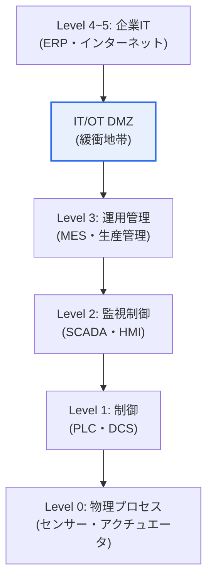

# 産業制御システム(ICS)のパデュー(Purdue)モデル

## 1. 概要

### A. 概念
> **パデューモデル(Purdue Model)** とは、産業制御システム(ICS)の構成要素を**機能と役割に応じて複数の階層に分けて表現した参照アーキテクチャ**であり、IT(情報技術)とOT(運用技術)の領域を階層的に分離し、産業ネットワークの構造とセキュリティ境界を定義するものである。

パデューモデルが産業セキュリティの基準となった根本的な理由は、「**工場の物理設備とオフィスのITが混在すると危険であるため、階層に分けて境界を守ろう**」という点にある。産業現場には、実際の物理設備を制御するOT領域(センサー・PLC・制御システム)と、経営・業務を担うIT領域(ERP・インターネット)が併存している。ところが、この両者の要求は正反対である。OTは安全と稼働の継続が最優先であるため、むやみに停止したりパッチを適用したりすることができず、ITはデータ・接続性が重要である。もしこの両者を無秩序に接続すれば、インターネット経由で侵入した攻撃が直ちに物理設備を操作し、爆発・停電のような物理的災害を引き起こし得る(Stuxnetがその例である)。パデューモデルはこれを防ぐため、システムを物理的な現場(下位)から経営(上位)までの階層に分け、各階層の間に明確な境界を設ける。特にITとOTの間に緩衝地帯(DMZ)を置き、上位ITの脅威が下位OTへ直接伝播しないようにする。すなわちパデューモデルは、産業システムを理解し防御するための「地図」であり、「セキュリティの境界線」である。

### B. IT/OT融合の背景
スマートファクトリー・Industry 4.0によって閉鎖的であったOTがITと接続されるにつれ、階層的な構造の理解とIT-OT境界のセキュリティが不可欠となった。[[isa-iec-62443]]

## 2. パデューモデルの階層と特徴

| 階層 | 構成 | 特徴 |
|---|---|---|
| **Level 0** | センサー・アクチュエータ | 実際の物理プロセス(現場機器) |
| **Level 1** | PLC・DCS・RTU | 基本制御(設備の直接制御) |
| **Level 2** | SCADA・HMI | 監視・制御(オペレーターによる操作) |
| **Level 3** | MES・履歴管理 | 生産運用管理(OTの上位) |
| **IT/OT DMZ** | プロキシ・パッチサーバー | IT-OTの緩衝・境界統制 |
| **Level 4~5** | ERP・インターネット・企業ネットワーク | 企業のビジネスIT |

下位(0~1)に向かうほどリアルタイム性・可用性・安全が重要となり、上位(4~5)に向かうほどデータ・接続性が重要となる。核心は**Level 3.5のIT/OT DMZ**であり、OTとITを直接接続せずにこの緩衝地帯を経由させることで、脅威の伝播を遮断する。

## 3. セキュリティの観点からの活用

| 観点 | 内容 |
|---|---|
| **境界分離(Segmentation)** | 階層・ゾーン(Zone)ごとの分割、DMZによるIT-OTの隔離 |
| **最小限の通信** | 階層間で必要な通信のみを許可(Conduit) |
| **下位の保護を優先** | 物理設備(L0~1)への直接アクセスの統制 |

パデューモデルは、産業セキュリティ標準IEC 62443の**ゾーン(Zone)・コンジット(Conduit)** の概念と結合し、階層・ゾーンごとにセキュリティレベルを分けて統制するセグメンテーション(segmentation)設計の基盤となる。

## 4. 考慮事項および示唆

1. **IT/OT境界のセキュリティが核心**である。産業サイバー攻撃の大半はITを経由して侵入しOTへと拡散するため、DMZ・ネットワーク分離・階層間のアクセス制御によって脅威の伝播を遮断することが最も重要である。
2. **境界の曖昧化に対応**しなければならない。クラウド・IIoT・リモート保守の普及により従来の階層境界が曖昧になりつつあるため、パデューモデルを基盤としつつ、ゼロトラストなどのアイデンティティベースの統制で補完しなければならない。[[zero-trust]]
3. **可用性優先の特性を考慮**する。OTは稼働停止・パッチ適用が難しいため、ITのセキュリティ方式をそのまま適用するのではなく、OTの特性(リアルタイム・安全)に合ったセキュリティ(仮想パッチ・モニタリング中心)を設計しなければならない。

---

> **一言まとめ**: パデューモデルは、*ICSを物理プロセス(L0)から企業IT(L4~5)までの階層に分けた参照アーキテクチャ*であり、IT/OT DMZによって両領域を隔離して脅威の伝播を遮断し、IEC 62443のゾーン・コンジットによるセグメンテーションと結合して産業セキュリティの基盤となる。
