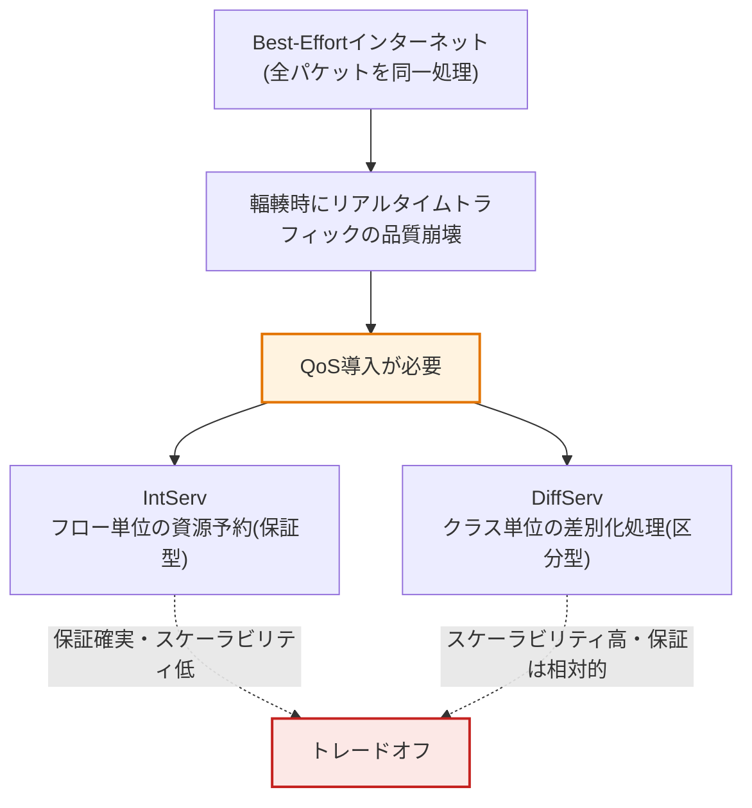
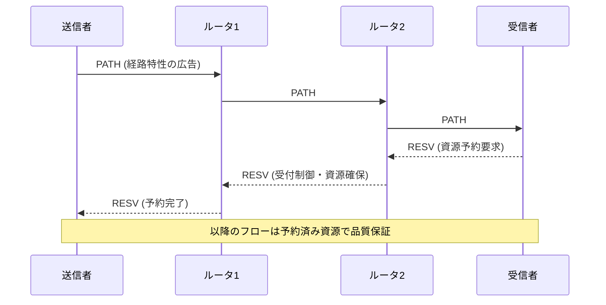
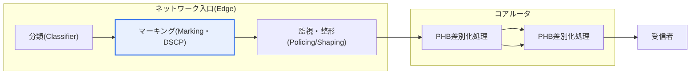

# QoS — DiffServとIntServ

## 1. 概要

### A. QoSの定義
> **QoS(Quality of Service)** は、ネットワークにおいて特定のトラフィックに対し **帯域幅(bandwidth)・遅延(delay)・ジッタ(jitter)・損失率(loss)** などのサービス品質指標を **保証する、または差別化して提供する** 技術体系であり、**IntServ(Integrated Services)** と **DiffServ(Differentiated Services)** は、これをIPネットワーク上で実現する2つの代表的アーキテクチャである。

### B. 登場背景と必要性
QoSが必要となる根本的な理由は、「**すべてのトラフィックを同じように扱うと、肝心の重要なトラフィックの品質が崩れる**」という点にある。インターネットは本来、**ベストエフォート(Best-Effort)転送**を前提に設計された。ルータはすべてのパケットを区別なく到着順に処理(FIFO)し、輻輳すれば後から来たパケットからキューで破棄する(tail drop)。平常時にリンクに余裕があるときはこの単純な原理でも十分であるが、問題は輻輳時である。

輻輳時にはトラフィックの性格の違いが決定的となる。リアルタイム音声(VoIP)・ビデオ会議は **遅延・ジッタ・損失に敏感** である。VoIPは通常 **片方向遅延150ms以内、ジッタ30ms以内、損失率1%以内** を維持しなければ通話品質が保証されず、わずかな遅延・損失でも音声が途切れ、映像が乱れる。一方、大容量ファイル転送(FTP)・バックアップは遅延に鈍感で、スループット(throughput)さえ確保されればよい。このように要件が相反するトラフィックをベストエフォートで同一に扱えば、リアルタイムトラフィックの品質を保証することはできない。

QoSはトラフィックに **優先順位と資源を差別的に配分** することでこの問題を解決する。ところが「どのように差別化するか」において思想が二つに分かれる。**IntServ** は通信を開始する前に経路上のすべてのルータに必要な資源をあらかじめ「**予約(reservation)**」し、フローごとに品質を確実に保証する方式であり、**DiffServ** はパケットに優先順位を「**マーキング(marking)**」し、各ルータがその等級に従って差別的に処理する方式である。前者は確実であるが重く、後者は軽量であるが絶対的な保証は弱い。すなわち両方式は本質的に **「保証の確実性(強い保証)」と「スケーラビリティ(scalability)」の間の異なる選択** である。このトレードオフが以降のすべての比較の軸となる。

## 2. IntServ (Integrated Services) — フロー単位の資源予約

IntServは通信に先立ち、**RSVP(Resource reSerVation Protocol)** によって経路上のすべてのルータに必要な帯域を予約する。概念的には電話網の回線予約をIP上で模倣したものであり、「通話をかける前に回線を確保しておく」方式に近い。

**動作原理** を段階的に見ると、まず送信者が **PATHメッセージ** を送り、経路とトラフィック特性を下流(downstream)へ広告する。これを受け取った受信者が **RESVメッセージ** で必要な資源を上流(upstream)へ逆方向に要求すると、経路上の各ルータは **受付制御(Admission Control)** によって空き資源があるかを判断し、可能であれば資源を予約(確保)する。資源が不足していれば予約を拒否して新しいフローを受け入れないことで、既存フローの品質を守る。このように **経路全体で予約が成立して初めて** フローが開始されるため、品質が確実に保証される(ハード保証、hard guarantee)。

**中核構成要素** としては、①予約を交渉するRSVP(シグナリング)、②新しいフローの受け入れ可否を決定する受付制御、③予約された等級どおりにキューを管理するパケットスケジューラ(例:WFQ)、④フローが約束したトラフィック規格を守っているかを検査する分類・ポリシング(classifier・policer)がある。IntServはサービス等級を **保証型サービス(Guaranteed Service、遅延上限の保証)** と **負荷制御型サービス(Controlled-Load、低負荷時の品質に近似)** に分ける。

**決定的な限界はスケーラビリティ** である。各ルータが **フロー(flow)の数だけ状態(state)を保持** しなければならないためである。フローが数千・数万に達する大規模バックボーンでは、ルータが管理すべき状態とシグナリング負荷が爆発的に増加する。また経路上の **すべての** ルータがRSVPに対応していなければならず、一つでも非対応であれば保証が途切れる。この2点により、IntServは大規模インターネットでは事実上採用されなかった。

| 特徴 | 内容 |
|---|---|
| **品質保証** | フロー単位の確実な保証(ハード保証) |
| **中核技術** | RSVPシグナリング、受付制御 |
| **状態管理** | ルータがフロー単位の状態を保持(stateful) |
| **限界** | フロー数に比例する状態・シグナリング → スケーラビリティ低 |

## 3. DiffServ (Differentiated Services) — クラス単位の差別化処理

DiffServは、IntServのスケーラビリティ問題を解決するために **フロー単位の予約を放棄し「クラス単位の差別化」** へと方向転換したアーキテクチャである。中核となる発想は、「**複雑な判断はネットワークの端(edge)で一度だけ行い、内部(core)はマーキングだけを見て単純・高速に処理する**」ことである。

**動作原理** は次のとおりである。トラフィックがネットワークに入る入口(edge)ルータでトラフィックを **分類(classify)** し、IPヘッダの **DSCP(DiffServ Code Point)** フィールド(IPv4 ToS/IPv6 Traffic Classバイトの上位6ビット)にクラスを **マーキング(mark)** する。入口では、約束された規格を超過するトラフィックを破棄または遅延させる **ポリシング(policing)・シェーピング(shaping)** も行う。それ以降、**内部(core)ルータはフロー状態を一切保持せず**、パケットのDSCPマーキングが指定する **PHB(Per-Hop Behavior、ホップごとの振る舞い)** に従って差別化処理のみを行う。

**PHB(ホップごとの振る舞い)** は、各ルータが特定クラスのパケットをどのように扱うかを定義した規則であり、標準化された類型は次のとおりである。①**EF(Expedited Forwarding)** は遅延・ジッタ・損失を最小化する最優先クラスで、VoIP・映像のようなリアルタイムトラフィックに用いる。②**AF(Assured Forwarding)** は4つのクラスとそれぞれ3段階のドロップ優先度に分かれ、輻輳時に破棄する順序を差別化する(企業データなど)。③**BE(Best-Effort, Default)** は従来のベストエフォートそのままである。

**長所は優れたスケーラビリティ** である。内部ルータがフロー単位の状態を保持しないため(stateless)、フロー数に関係なく動作し、大規模バックボーンに適する。**短所は絶対的保証の欠如** である。予約ではなく「相対的優先順位」であるため、特定クラスが必ず何ms以内を保証すると断言することは難しい(ソフト保証、soft guarantee)。そのため実際には **SLA(サービスレベル合意)** と各クラスのトラフィック総量を管理・設計することで、統計的に品質を確保する。

| 特徴 | 内容 |
|---|---|
| **品質保証** | クラス単位の相対的差別化(ソフト保証) |
| **中核技術** | DSCPマーキング、PHB(EF/AF/BE)差別化処理 |
| **状態管理** | コアはステートレス、判断はedgeで |
| **長所** | フロー状態不要 → スケーラビリティ高 |

## 4. 比較と事例 — なぜDiffServが主流なのか

両アーキテクチャの違いは、結局「**どこでどれだけ状態を保持するか**」に由来し、それが保証レベルとスケーラビリティのトレードオフにつながる。

| 区分 | IntServ | DiffServ |
|---|---|---|
| **処理単位** | フロー(flow)単位 | クラス(class)単位 |
| **保証レベル** | フロー単位の確実な保証(ハード) | クラス単位の相対的差別化(ソフト) |
| **状態管理** | ルータごとにフロー状態を保持 | コアはステートレス(edgeのみ分類) |
| **シグナリング** | RSVPが必要(事前予約) | 不要(パケットマーキングで代替) |
| **スケーラビリティ** | 低(フロー数に比例) | 高(フロー数に無関係) |
| **適用領域** | 小規模・末端区間 | 大規模バックボーン・インターネット・SP網 |

**違いが生じる根本的理由** は、IntServが「フロー単位の状態+事前シグナリング」という重い仕組みで確実性を得たのに対し、DiffServはその仕組みを「パケットヘッダの6ビットのマーキング」で置き換えることでスケーラビリティを得た点にある。状態をコアから取り除いたことで、ルータはフロー数に関係なく動作できるようになり、この **ステートレス性(statelessness)** がインターネット規模で決定的な利点となったのである。

**第一の事例 — 通信事業者(ISP)バックボーン**:数十万のフローが同時に流れるバックボーンでは、フロー単位の予約(IntServ)はルータのメモリ・CPUが耐えられず非現実的である。そのため実務の大規模網はDiffServを標準として採用し、音声はEF、重要業務データはAF、一般トラフィックはBEにマッピングして運用する。

**第二の事例 — 企業のVoIP構築**:ある企業がIP電話を導入してビデオ会議の遅延問題に直面した場合、スイッチ・ルータで音声パケットをDSCP EF(値46)にマーキングし、優先キューに入れてデータトラフィックより先に送出する。このとき実際の帯域配分はDiffServのマーキングだけで完結するわけではなく、WFQ・LLQ(Low Latency Queuing)のような **キューイング・スケジューリング手法** が担う。

**第三の事例 — ハイブリッド設計**:両方式は排他的ではない。品質が極めて重要な末端区間(例:キャンパスのアクセス網)はIntServ/RSVPで確実に保証し、トラフィックが集約されるバックボーンはDiffServで処理するハイブリッド構成により、保証性とスケーラビリティを両立できる。実際、RSVP-TEはMPLS網のトラフィックエンジニアリングにおいて経路・帯域予約の用途で現在も活用されている。

## 5. 深掘り — QoSメカニズムの連携と最新動向

DiffServ・IntServは「**何を優先するかを決めるポリシーの枠組み**」にすぎず、実際の品質はそのポリシーを実行する下位メカニズムと結合して初めて完成する。QoSの実行体系は大きく、①**分類・マーキング(Classification・Marking)**、②**輻輳管理(Congestion Management、キューイング・スケジューリング)**、③**輻輳回避(Congestion Avoidance、WREDなど)**、④**ポリシング・シェーピング(Policing・Shaping)** の4つの軸で構成される。

特に **キューイング・スケジューリング** が中核である。DiffServがパケットをEFにマーキングしても、ルータがそのパケットを先に送出するには **PQ(優先度キュー)・WFQ(重み付け公平キューイング)・CBWFQ・LLQ** のようなアルゴリズムが必要である。例えばLLQは、音声のような遅延に敏感なトラフィックに厳格な優先キューを与えつつ、他のトラフィックの飢餓(starvation)を防ぐよう帯域上限を設ける。輻輳回避の側では、**WRED(Weighted Random Early Detection)** がキューが満杯になる前に低優先度のパケットを確率的に先行破棄し、TCPの同時減速(global synchronization)を防止する。すなわちDiffServのAFドロップ優先度は、WREDと組み合わさって初めて意味を持つ。[[wfq]]

**最新動向** としては、物理回線の予約からソフトウェアポリシーへと重心が移りつつある。**SD-WAN** はアプリケーションを認識(application-aware)してリアルタイムに最適な経路・キューを選択することで、従来のDSCPマーキングを超えた「インテントベース(intent-based)」のQoSを実現する。**SDN** ではコントローラがネットワーク全体を俯瞰し、フロー単位でポリシーを集中制御するため、IntServのフロー単位制御とDiffServのスケーラビリティをソフトウェアで折衷しようとする試みがなされている。5Gコアの **ネットワークスライシング(network slicing)** もまた、1つの物理網を論理的に分割してスライスごとのQoS(超低遅延のURLLCなど)を保証するという点で、IntServの「保証」思想を仮想化技術で再解釈した流れと見ることができる。

## 6. 考慮事項および示唆 (技術士の観点)

1. **スケーラビリティがアーキテクチャ選択を支配する。** インターネット規模ではフロー単位の予約(IntServ)は状態・シグナリング負荷により非現実的であるため、ステートレス・高スケーラビリティのDiffServが実務の事実上の標準となった。技術士はQoS設計において「保証の確実性」と「スケーラビリティ」のトレードオフをネットワーク規模に応じて判断すべきであり、バックボーンはDiffServ、末端は必要に応じてIntServという階層的な選択が合理的である。

2. **QoSは単一技術ではなく、エンドツーエンド(end-to-end)のポリシー体系である。** DiffServのマーキングが経路上のどこか一区間でも無視されたり再マーキング(re-marking)されたりすると、品質保証は途切れる。したがって異なる事業者網を通過する際の **DSCPトラストバウンダリ(trust boundary)とマーキングポリシーの一貫性** をSLAで明文化することが中核的な考慮事項である。

3. **オーバープロビジョニング(帯域の過剰確保)との経済性比較が必要である。** リンク帯域が十分に安価になった区間では、複雑なQoSを設計するよりも帯域を潤沢に確保するほうが総所有コスト(TCO)の面で有利な場合がある。技術士はQoS導入の運用複雑性と帯域増設コストを比較し、最適点を提示しなければならない。

4. **下位のキューイング・輻輳回避メカニズムとの統合設計が成否を分ける。** DiffServのEF/AFマーキングは、WFQ・LLQ・WREDなど実際のスケジューリングと結合して初めて品質として実現される。マーキング(marking)だけでキューポリシーがなければQoSは名ばかりとなるため、マーキング-キューイング-回避-整形の4つの軸を一貫して設計・検証しなければならない。

5. **SDN・SD-WAN・5GスライシングなどソフトウェアベースのQoSへの移行に備えるべきである。** 静的なDSCPポリシーから、アプリケーション・インテント認識に基づく動的QoSへとパラダイムが移行しているため、既存のDiffServ設計の上に集中制御・自動化を載せる進化経路を戦略的に準備することが望ましい。

## 参考資料
- RFC 2205 — Resource ReSerVation Protocol (RSVP)、IntServシグナリング
- RFC 2475 — An Architecture for Differentiated Services (DiffServ)
- RFC 2597 / RFC 3246 — Assured Forwarding(AF) / Expedited Forwarding(EF) PHB

---

> **一言まとめ**: QoSのIntServは *RSVPでフロー単位の資源を事前予約して確実に保証(ハード)* するが、フロー状態の保持によりスケーラビリティが低く、DiffServは *DSCPマーキングとPHBでクラス単位に差別化処理(ソフト)* し、コアはステートレスで高スケーラビリティであるが保証は相対的である。大規模網ではDiffServが主流であるが、WFQ・WREDなどのキューイング・輻輳回避メカニズム、およびSDN・SD-WAN・5Gスライシングと結合して完成する。
