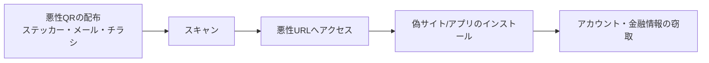

# クイッシング(Qshing, QR code + Phishing)

## 1. 概要

### A. 定義
> **QRコード(Quick Response Code)** を餌として利用者を悪性サイトへ誘導したり悪性アプリをインストールさせたりして、アカウント・金融情報を窃取する **QRコードベースのフィッシング(Phishing)** 攻撃。

クイッシングはスミッシング(SMSベースのフィッシング)が一段階進化した形態であり、攻撃ベクトルが「リンクテキスト」から「画像(QR)」に変わったことが本質である。人間はURL文字列であれば目視である程度検証できるが、QRコードは白黒の点のパターンであるため、スキャンする前には遷移先をまったく知ることができない。この **遷移先の秘匿性(destination opacity)** がクイッシングの中核的な武器である。

### B. 登場背景および必要性
新型コロナウイルス感染症以降、非対面・簡易決済が拡大するにつれ、QRコードは決済・入退室認証・電子メニュー・チラシなど日常のいたるところに定着した。利用者はQRを「当然信頼できる便利な手段」と認識するようになり、この **学習された信頼** がかえって攻撃対象領域となった。また、QRは紙のステッカー1枚で物理空間に容易に仕込むことができ、メール本文に画像として挿入すればURLベースのスパムフィルタを回避できるため、攻撃者にとって費用対効果が非常に高い。このためクイッシングは近年急増している攻撃類型となっており、事後の認知が難しいという特性上、事前予防体制の整備が急務である。

## 2. 攻撃フロー(アーキテクチャ)

クイッシングはおおむね **①配布 → ②スキャン誘導 → ③アクセス → ④窃取** の4段階を経る。攻撃者は正規サービスを装ったQRを物理・電子チャネルでばら撒き、「駐車料金精算」「イベント景品」「宅配便照会」のようなソーシャルエンジニアリング的な名目でスキャンを誘導する。スキャンした瞬間にブラウザが悪性URLへ遷移するが、このURLは正規サイトと視覚的に同一のフィッシングページか、悪性APKのダウンロードリンクである。利用者がログイン情報やカード番号を入力した瞬間、あるいはアプリのインストール後に過剰な権限を承認した瞬間に情報が窃取される。特にモバイル画面はアドレスバーが短く表示されるため、ドメイン偽装に気付きにくいことが被害を拡大させる。

## 3. 攻撃類型・手口

クイッシングはQRが置かれるチャネルと手口によって次のように分類される。共通点は、いずれも **「正規に見えるQR」** を作るということである。

- **QRステッカーの上貼り**:駐車料金精算機・飲食店のテーブル・公共決済機などに貼られた正規のQRの上に、悪性QRステッカーを物理的に貼り付ける。例えば米国では、公共駐車場の精算QRの上に偽のQRを貼って決済情報を詐取した事例が多数報告されている。物理的なアクセスだけで可能なため、検知が非常に困難である。
- **フィッシングメール・SMS(Quishing)**:メール本文や添付画像にQRを挿入する。テキストのURLがないため従来のスパム・URLフィルタでは除去できず、利用者は「PCではなく個人のスマートフォン」でスキャンすることになり、企業のセキュリティ統制(EDR・プロキシ)から外れる。
- **悪性アプリのインストール誘導**:スキャン後、公式アプリストアではない外部リンクからAPKの直接インストールを誘導する。インストールされたアプリはSMS・連絡先・アクセシビリティ権限を要求し、OTPの窃取や遠隔操作にまでつながる。
- **決済・送金詐欺**:偽造された口座・加盟店のQRで、意図しない相手に送金させる。

| 類型 | 手口 | リスクポイント |
|---|---|---|
| **QRステッカーの上貼り** | 正規QRの上に悪性QRを貼付(駐車・決済機) | 物理アクセス、事後の認知が困難 |
| **フィッシングメール/SMS** | 添付・本文のQRでURLフィルタを回避 | 個人端末で統制から離脱 |
| **悪性アプリのインストール** | スキャン後にAPKダウンロードを誘導 | 過剰権限・OTP窃取 |
| **決済詐欺** | 偽造QRで送金を誘導 | 直接的な金銭損失 |

## 4. 対応方策

クイッシングは遷移先の秘匿性ゆえに、「スキャン後の検証」ではなく **「アクセス前・入力前の検証」** が中核となる。対応は利用者・技術・機関の多層防御に分けられる。

- **利用者の側面**:出所が不明確なQR(路上のステッカー、スパムメール)はスキャンを控え、スキャン後に自動で開くのではなく **URLプレビュー** を必ず確認する。決済・ログインはQRではなく **公式アプリ・ブックマーク** から直接アクセスする習慣が最も安全である。
- **技術の側面**:QRスキャナアプリがアクセス前にURLを表示し、脅威インテリジェンスに基づく **レピュテーション(reputation)照会** で悪性ドメインを遮断する。ウイルス対策ソフト・MDMで悪性アプリのインストールを統制する。
- **機関・サービスの側面**:掲示されたQRの **完全性(改ざんの有無)** を定期的に点検し、電子署名を含む **認証QR** で偽造・改ざんを防止するとともに、利用者の意識向上キャンペーンを並行して実施する。

| 主体 | 対応 |
|---|---|
| **利用者** | 出所不明QRのスキャン自粛、URLプレビュー確認、公式アプリから直接アクセス |
| **技術** | スキャン時のURL検証・レピュテーション照会、ウイルス対策・MDM |
| **機関** | QR完全性の点検・署名ベースの認証QR・意識向上 |

## 5. 考慮事項および示唆
QRは遷移先の秘匿性が大きく、被害が発生して初めて認知されるケースが多いため、技術士の観点では **事前検証中心の予防アーキテクチャ** が鍵となる。第一に、すべてのアクセスを信頼しない **ゼロトラスト** 原則と組み合わせ、QRスキャン後のアクセスも継続的な検証の対象とする。第二に、モバイルセキュリティ(EDR・MDM・モバイルウイルス対策)と脅威インテリジェンスを連携させ、悪性ドメイン・アプリをリアルタイムに遮断する。第三に、決済・認証用のQRには **電子署名・動的QR(ワンタイム)** を導入し、偽造・改ざんそのものを無力化する。究極的にクイッシングは技術単独ではなく、**利用者の意識・サービス設計・規制** が共に歩むことで減少する、人と技術が絡み合ったセキュリティ問題である。

---

> **一言まとめ**: クイッシングは *QRコードの遷移先の秘匿性を悪用して悪性サイト・アプリへ誘導し、情報を窃取する* フィッシングであり、ステッカーの上貼り・メールQR・悪性アプリなどの手口に対しては、出所不明QRのスキャン自粛・アクセス前のURL検証・署名ベースのQR完全性確保など、事前予防が中核である。
