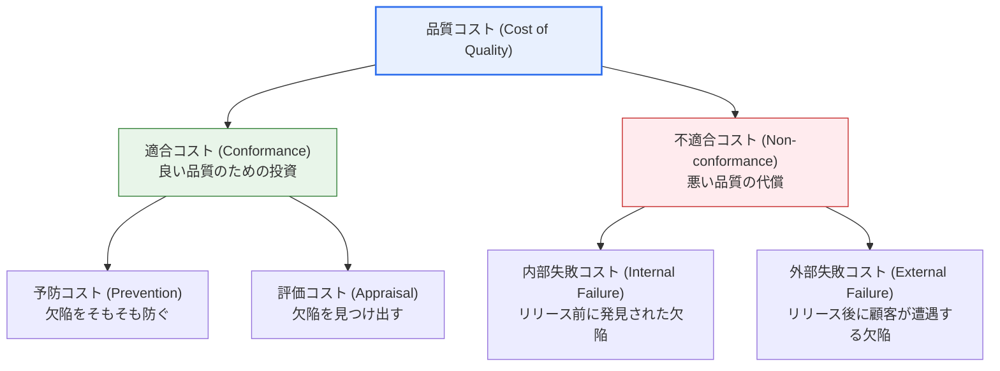
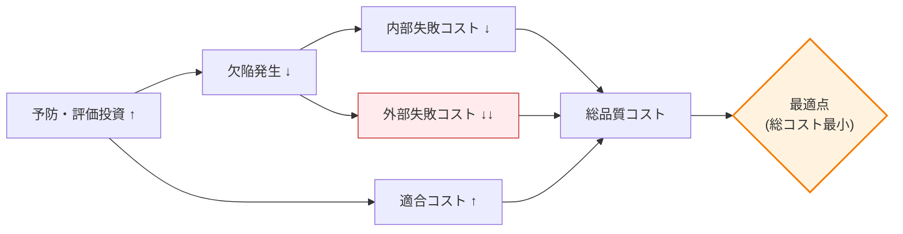

# ソフトウェア品質コスト(Cost of Quality)

## 1. 概要

### A. 定義
> **品質コスト(Cost of Quality, CoQ)** は、ソフトウェアの品質を確保・維持・管理するために発生するすべてのコストの総和であり、良い品質を作るための **適合コスト(Cost of Conformance = 予防コスト + 評価コスト)** と、悪い品質のために支払う **不適合コスト(Cost of Non-conformance = 内部失敗コスト + 外部失敗コスト)** で構成される。

品質コストという概念が含む中核的な洞察は、**「品質には必ずコストがかかるが、そのコストをどの段階に使うかが総コストを決定する」** という点にある。多くの組織は「品質を高めればコストが増える」という直観にとらわれ、検証活動を縮小しようとする。しかし品質コスト理論はこの直観に真正面から反論する。予防と評価に前もって投資すれば欠陥が減り、手戻りや賠償のような失敗コストが急減し、結果として **総品質コストがむしろ減少する** というのである。逆に前工程の統制をおろそかにすれば欠陥が累積し、後工程で失敗コストが急増する。すなわち品質コストは「使うか使わないか」の問題ではなく、**「どこに使うか(予防か、失敗の後始末か)」** という配分の問題である。

この洞察の定量的根拠こそが、**欠陥修正コストの段階的増幅の法則** である。欠陥は発見が遅れるほど修正コストが指数関数的に大きくなる。BoehmやIBMなどの古典的研究によれば、要求段階で発見すれば1のコストで修正できる欠陥が、設計段階では数倍、コーディング・テスト段階では数十倍、運用(リリース後)段階では **数十〜数百倍** のコストに膨れ上がる。運用段階の欠陥は単なるコード修正を超えて、障害対応、緊急パッチの配布、顧客への通知、信頼回復にまで連鎖的なコストを誘発するためである。この法則があるからこそ、「前工程の予防投資が経済的である」という結論が理論ではなく数値によって裏付けられる。

### B. 登場背景と必要性
品質コストの概念は、製造業の品質経営(TQM)の思想家であるJuranとCrosbyに由来する。Crosbyの有名な命題 *"Quality is Free(品質はタダである)"* は、「予防に投資したコストはそれよりはるかに大きな失敗コストの削減によって回収されるため、きちんと作り込んだ品質は結局コストを発生させない」という意味である。この思想がソフトウェア工学に導入されると、目に見えにくかった手戻り・残業・顧客離反のコストを **貨幣単位で測定・可視化** するツールへと発展した。ソフトウェアは無形(intangible)であるため品質の良し悪しがすぐには表に出ず、欠陥が運用段階で大規模障害として爆発する特性があるため、品質活動を **費用対効果の観点で管理** する必要性が特に大きい。品質コスト分析なしに検証へ投資すれば過剰品質で資源を浪費し、投資しなければ過少品質で失敗コストが雪だるま式に膨らむため、**最適投資点を見出す経営意思決定の根拠** として品質コストが求められる。

## 2. 品質コストの4大構成項目

### A. 全体分類構造図
品質コストは大きく「良い品質を作るための能動的投資(適合コスト)」と「悪い品質がもたらした事後の代償(不適合コスト)」の2つの軸に分かれ、各軸はさらに2つの項目に細分される。

この4分類の中核的な論理は、**「左側(予防・評価)に投資するほど右側(内部・外部失敗)が減る」** という相殺関係である。そして右へ行くほど、特に外部失敗コストに近づくほどコストが破壊的に大きくなるため、投資の優先順位は自然と左側(予防 > 評価)に傾く。

### B. 予防コスト(Prevention Cost) — 欠陥をそもそも防ぐ投資
予防コストは、欠陥が発生すること自体を防ぐために先制的に投入するコストである。ここには開発者の教育・訓練、コーディング標準と開発プロセスの確立、品質計画の策定、要求・設計レビュー、静的解析ツールの導入、アーキテクチャ検討などが含まれる。予防コストの本質は **「欠陥の根本原因(root cause)を除去する」** ことにある。例えば特定の種類のヌルポインタエラーが繰り返されるならば、その都度修正する(失敗コスト)のではなく、コーディング規約と静的解析ルールを追加してその類型自体が二度と発生しないようにすることが予防である。

予防は4つの項目の中で **投資対効果(ROI)が最も高い**。欠陥が作られる前に防ぐため、後工程の評価・失敗コストを連鎖的に削減するからである。しかし効果がすぐには目に見えず(予防した欠陥は「起きなかった事象」であるため測定が難しい)、成果へのプレッシャーの中で真っ先に削減される項目でもある。成熟した組織ほど予防コストの比重が高いというのが、品質コスト分析の一貫した観察である。

### C. 評価コスト(Appraisal Cost) — 欠陥を見つけ出す検査
評価コストは、すでに作られた成果物に欠陥があるかを **見つけ出すための検査・測定コスト** である。動的テスト(単体・結合・システム・受入テスト)、コードレビューとインスペクション、監理、品質監査、テスト環境の構築および維持コストなどがここに属する。評価の本質は「欠陥をなくすこと」ではなく、「欠陥を発見して後工程(運用)へ漏れ出すのを防ぐフィルタの役割」である。

評価コストを理解する際に重要なのは、予防との関係である。評価は欠陥を **見つけるだけで予防はできないため**、評価だけに依存すると「欠陥を見つけては直し続ける」消耗的な循環に陥る。理想的な改善経路は、評価で繰り返し発見される欠陥パターンを予防活動へフィードバック(feedback)し、次第に評価で引っかかる欠陥そのものを減らしていくことである。ただし評価を際限なく強化することも最善策ではない。テストカバレッジを99%から100%へ引き上げるのに要する限界コストが、それによって防げる失敗コストを上回る点が存在するためである。

### D. 内部失敗コスト(Internal Failure Cost) — リリース前に発見された欠陥の処理
内部失敗コストは、製品が顧客に引き渡される **前に** 欠陥が発見され、それを処理するのにかかるコストである。バグ修正、手戻り(rework)、再テスト、欠陥の原因分析、設計変更などが該当する。このコストは「悪い品質の代償」ではあるが、少なくとも **顧客に届く前に捕捉したという点で外部失敗よりはるかに安価** である。

内部失敗コストは、評価活動の産物という二面性を持つ。テストを強化すれば(評価コスト増加)その分リリース前に多くの欠陥が捕捉されて内部失敗コストが増えるが、これはむしろ健全な兆候である。同じ欠陥が除去されずにリリースされ、外部失敗として爆発するよりも圧倒的に良いからである。したがって内部失敗コストは「低いほど良いもの」ではなく、**外部失敗コストとの比率(内部/外部)** によって品質プロセスの健全性を判断する指標として見るべきである。

### E. 外部失敗コスト(External Failure Cost) — 最も破壊的なコスト
外部失敗コストは、欠陥がリリース後に **顧客に到達した後で** 発生するコストであり、4つの中で **最も大きく破壊的** である。顧客への賠償・返金、リコール、緊急パッチとホットフィックスの配布、コールセンター・技術サポートの負担、契約違約金、そして何よりも **ブランド信頼の低下と顧客離反** が含まれる。前の3つのコストが組織内部で貨幣として比較的明確に測定されるのに対し、外部失敗コストは信頼喪失・評判毀損のように **測定は難しいが実際には最大の損失** を含む点が特徴である。

具体的な事例で規模を推し量ることができる。2012年、あるグローバル証券会社の注文処理ソフトウェアの欠陥は、45分間で約4億4千万ドルの損失を出し、会社を破綻の危機に追い込んだ。航空会社の予約システム障害、銀行アプリの振込エラー、大規模な個人情報漏えい事故などは、いずれもリリース後の欠陥(外部失敗)が賠償・課徴金・株価下落へとつながった事例である。このように外部失敗コストは開発コストを数十倍上回ることがあり、「リリース前の検証を節約することが最も高くつく節約」になるという逆説を生む。

| 項目 | 性格 | 代表的な活動/事例 | 発生時点 |
|---|---|---|---|
| **予防コスト** | 適合(投資) | 教育、コーディング標準、プロセス、設計レビュー、静的解析ツール | 開発以前・全工程 |
| **評価コスト** | 適合(投資) | テスト、コードレビュー、インスペクション、監理、品質監査 | 開発中 |
| **内部失敗コスト** | 不適合(代償) | バグ修正、手戻り、再テスト、原因分析 | リリース前 |
| **外部失敗コスト** | 不適合(代償) | 顧客賠償、リコール、ホットフィックス、信頼低下、違約金 | リリース後 |

## 3. 品質コスト間の関係と最適投資点

### A. 相殺関係と総コスト曲線
品質コストの4項目は独立しておらず、互いに噛み合って動く。中核となる力学は、**「適合コスト(予防・評価)を増やせば不適合コスト(失敗)が減る」** という相殺(trade-off)関係である。これをグラフにすると、品質水準を高めるほど適合コストは右上がりに増加し、失敗コストは右下がりに減少し、この2つを足した **総品質コストはU字型の曲線** を描く。

### B. 最適点の解釈
初期には予防・評価投資を増やすほど失敗コストが大きく減り、総コストが減少する。しかしある点を過ぎると、追加投資で防げる失敗コストよりも投資自体の限界コストのほうが大きくなり、総コストは再び増加する。この **総コストが最小となる点が最適な品質投資水準** である。ただし現代の観点はやや進化しており、自動化テスト・CI/CD・静的解析ツールの発達により評価・予防の限界コストが大きく下がったことで、最適点が以前より **高い品質の側へ移動した** とされる。すなわち「完璧な品質は非経済的である」という古典的な結論は、自動化によって検証コストが急落した今日では相当程度緩和されている。

ここで必ず強調すべき点は、**外部失敗コストの重み** である。総コストを計算する際、外部失敗コストには測定不可能な信頼損失が隠れているため、名目上計算された最適点よりも **さらに前工程に投資するほうが安全** である。目に見えるコストだけで最適化すると、真のリスク(ブランドの崩壊)を過小評価することになる。

### C. 項目間の比率で読み取るプロセス成熟度
品質コストは絶対額だけでなく、**項目間の比率** によって組織の品質成熟度を診断するうえでも有用である。例えば失敗コスト(内部+外部)が総品質コストの大部分を占め、予防コストがわずかであれば、その組織は「欠陥を作っておいて後で後始末する」未成熟な段階にあるという兆候である。逆に予防コストの比重が高く失敗コストが低ければ、前工程で欠陥を統制している成熟した組織である。特に **外部失敗コストに対する内部失敗コストの比率** が高いということは、「欠陥を顧客に出す前にうまく除去できている」という肯定的な指標として解釈される。このように品質コストは単なる支出明細ではなく、**プロセス改善の方向を指し示す羅針盤** の役割を果たす。

また品質コストは、個別の欠陥ではなく **推移(trend)** として見るときに意味が大きい。スプリントやリリースごとに項目別のコストを追跡すれば、予防投資を増やした後、数か月にわたって失敗コストが実際に減っているかをデータで確認できる。このフィードバックループがあってこそ、「品質投資には効果がある」という主張を経営陣に定量的に立証し、継続的な予算を確保することができる。

## 4. 深掘り — アジャイル・DevOps時代の品質コストとShift-Left

伝統的な品質コスト理論はウォーターフォール(waterfall)モデルを背景に、「リリース前の徹底した検証」を強調した。しかしアジャイル・DevOps環境では短いサイクルで反復的にデプロイするため、品質コストの管理方法も進化した。中核となる戦略が **シフトレフト(Shift-Left)**、すなわち品質活動を開発ライフサイクルの **より前工程(左側)へ引き寄せること** である。これは先に見た「欠陥修正コスト増幅の法則」の論理的帰結であり、欠陥をできるだけ初期に捕捉して失敗コストの根を断つアプローチである。

具体的な実践としては、①**TDD(テスト駆動開発)** によりコードを書く前にテストを先に作って欠陥の流入を予防し、②**CI(継続的インテグレーション)** パイプラインでコミットごとに自動テスト・静的解析を実行して欠陥を即座に発見し、③**静的解析ツール(SonarQubeなど)** によりコードレビュー以前に脆弱性・コードスメルを自動検出する。これらはいずれも予防・評価コストを **自動化によって安価に** し、人が手作業で行っていた時代よりはるかに低いコストで欠陥を前工程で除去する。その結果、同じ品質をはるかに少ない総コストで達成することが可能になった。

こうした自動化の効果は、品質コスト曲線を根本的に変える。かつては評価活動(テスト・レビュー)が人の反復労働であったため限界コストが高く、一定水準以上に品質を高めるとすぐに経済性が崩れた。しかしテストをコードとして書いておけば、その後数千回実行しても追加コストはほぼ0に収束するため、**同じ予算ではるかに緻密な検証** が可能になる。すなわち自動化は、評価コストの性格を「毎回かかる変動費」から「一度作っておく固定投資」へと変え、予防と評価の境界を曖昧にする。よく書かれた自動テストスイートは、欠陥を見つける評価手段であると同時に、将来の欠陥流入を防ぐ予防装置(回帰防止)としても機能するからである。

一方、近年では **シフトライト(Shift-Right)** の概念も補完的に議論されている。運用環境でオブザーバビリティ(observability)・カナリアリリース・機能フラグ・A/Bテストを通じて実利用中の問題を早期に検知し迅速にロールバックすることで、外部失敗コストが大規模障害に波及する前に抑制するアプローチである。すなわち現代の品質コスト戦略は、「前工程での予防(Shift-Left)」と「運用段階での早期検知・迅速な復旧(Shift-Right)」を組み合わせ、欠陥がどこから漏れてもコストが急増する前に遮断する **双方向の防御** へと発展している。さらにAIベースのコードレビュー・欠陥予測ツールが予防コストの効率をもう一段引き上げるという最新の流れも注目される。

## 5. 考慮事項および示唆(技術士の観点)

1. **予防中心(Prevention-first)の投資配分** — 4つのコストのうち予防のROIが最も高いため、品質予算を失敗の後始末ではなく、レビュー・標準・教育・自動化ツールといった予防活動に優先的に配分すべきである。「欠陥を見つけて直す組織」から「欠陥が生じないようにする組織」への転換が総品質コスト最小化の核心であり、これは組織のプロセス成熟度(CMMIなど)の向上に直結する。

2. **外部失敗コストの隠れた大きさの認識** — 外部失敗コストには、賠償・リコールのような明示的なコストを超えて、ブランド信頼の低下、顧客離反、規制上の課徴金など **測定は難しいが致命的な損失** が含まれる。したがって名目上計算された最適投資点よりもやや前工程に保守的に投資するほうが安全であり、特に金融・医療・安全関連のドメインではこの原則が絶対的である。

3. **品質コストの測定・可視化によるデータ駆動の意思決定** — 4つのコストを貨幣単位で測定・追跡しなければ、品質投資は勘に頼ることになる。手戻り時間、欠陥密度、流出欠陥数、項目別コスト比率(例:予防:評価:内部:外部)などを定量指標化し、経営陣が理解する言語(コスト削減・ROI)で品質を論証してこそ、品質投資への支援を継続的に確保できる。

4. **自動化による最適点の移動** — CI/CD・静的解析・自動テストによって予防・評価の限界コストを下げれば、総コストを最小化する最適品質水準そのものがより高い側へ移動する。すなわち自動化投資は「より高い品質をより低い総コストで」達成するてこであるため、品質コスト最適化とDevOps自動化戦略は一体として設計されなければならない。

5. **Shift-Left/Rightの結合とライフサイクル全体での品質の内在化** — 品質を特定段階(リリース前テスト)の関門(gate)としてではなく、要求・設計・コーディング・運用の全ライフサイクルに内在化(built-in quality)させなければならない。前工程での予防(Shift-Left)と運用での早期検知(Shift-Right)を組み合わせ、オブザーバビリティ・カナリアリリースで外部失敗の波及を抑制することが、現代的な品質コスト管理の目指すところである。

## 参考資料
- Philip Crosby, *Quality Is Free: The Art of Making Quality Certain* (概念の出典)
- Juran's Quality Handbook — Cost of Qualityフレームワーク
- ISTQB Foundation Level Syllabus — Cost of Quality / Cost of Defectsの説明 — https://www.istqb.org/

---

> **一言まとめ**: 品質コストは *適合コスト(予防・評価)と不適合コスト(内部・外部失敗)の4項目* で構成され、欠陥は発見が遅れるほど修正コストが指数関数的に大きくなる(外部失敗コストが最も破壊的)ため、前工程の予防・評価に前もって投資して総コストを最小化することが経済的であり、今日では自動化とShift-Left/Rightにより、より高い品質をより低い総コストで達成する方向へと発展している。
