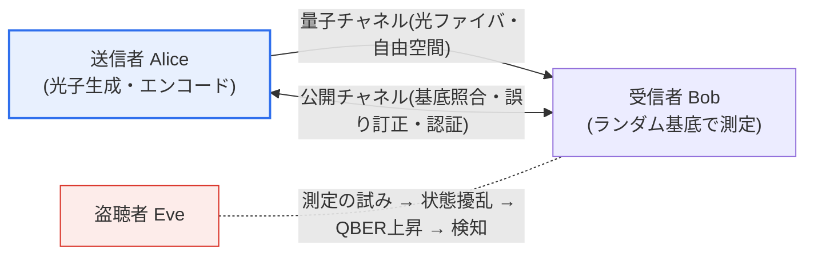

# 量子暗号通信(Quantum Cryptography Communication)

## 1. 概要

### A. 定義

> **量子暗号通信** は、量子力学の根本原理(測定による状態の擾乱、複製不可能性)を利用し、**盗聴が物理的に検知される方式で暗号鍵を安全に配送** する通信技術である。その代表的な実装が **量子鍵配送(QKD, Quantum Key Distribution)** であり、ここで配送された鍵をワンタイムパッド(OTP)や共通鍵暗号と組み合わせて実際のデータを保護する。

量子暗号通信の中核的な発想は、「**数学的な計算困難性ではなく、物理法則そのものによって安全性を保証する**」ことである。RSA・ECCのような既存の公開鍵暗号は、素因数分解や離散対数のような数学問題が現実的な時間内に解けないという「計算量的仮定」に安全性を依存している。しかし、Shorのアルゴリズムを実行できる大規模な誤り耐性量子コンピュータが登場すればこの仮定が崩れ、既存の公開鍵暗号が無力化される可能性がある。

一方、量子暗号通信は計算ではなく自然法則に安全性の根拠を置く。量子状態(単一光子)は2つの根本的な性質を持つ。第一に、**測定すると必ず状態が擾乱される(ハイゼンベルクの不確定性原理)**。第二に、**未知の量子状態は完全には複製できない(複製不可能定理、No-Cloning Theorem)**。したがって盗聴者(通常Eveと表記)が伝送中の光子を傍受して測定すれば、その痕跡が必ず状態の擾乱と誤り率の上昇として残り、送受信者(Alice・Bob)はこれを統計的に検知して汚染された鍵を直ちに破棄する。すなわち「盗聴の試みそのものが物理的に検知される」ため、どれほど強力なコンピュータを持つ盗聴者であっても、気付かれずに鍵を盗むことはできない。この性質が **無条件安全性(情報理論的安全性)** であり、量子コンピュータ時代においても有効な安全性を約束する。

### B. 登場背景および必要性

デジタル社会のほぼすべての信頼(電子商取引、金融、国防通信、電子政府)は、鍵交換の安全性の上に築かれている。ところが量子コンピューティングの進展により、現在広く使われている公開鍵ベースの鍵交換が将来解読されうるという懸念が高まった。特に攻撃者が現在暗号化された通信を保存しておき、後日量子コンピュータで復号する **HNDL(Harvest Now, Decrypt Later、先に収集して後で解読)** の脅威は、長期的な機密性が求められる国家・医療・金融データに現在進行形のリスクをもたらしている。

このような背景から、計算困難性ではなく物理法則に基づいて「根本的に」安全な鍵配送手段が求められ、その答えの一つとして量子暗号通信が浮上した。ソフトウェアアルゴリズムを入れ替えるだけで済む耐量子計算機暗号(PQC)とは異なり専用の光ハードウェアを必要とするが、「情報理論的安全性」という理論的上限を提供するという点で、超高セキュリティ領域において独自の価値を持つ。

## 2. 量子鍵配送(QKD)の原理と構成

QKDは、光子の量子状態(偏光、位相など)に鍵ビットを載せて **量子チャネル** で伝送し、その結果を **公開(古典)チャネル** で照合・精製して、AliceとBobだけが共有する秘密鍵を生成する。2つのチャネルの役割分離と、盗聴が誤り率として現れるという点が全体構造の核心である。

**量子チャネル** は光子一つひとつに込められた量子状態を伝える物理経路であり、光ファイバ、または衛星・地上間の自由空間リンクが用いられる。このチャネルを通過する光子は盗聴者の測定によって擾乱されるため、チャネル自体が盗聴検知センサーの役割を兼ねる。**公開チャネル** はインターネットのような一般の通信網であり、伝送後にどの基底で送信・測定したかを照合し、誤りを訂正するために使われる。ただし公開チャネルは内容が露出しても問題ないが、**中間者攻撃(MITM)** を防ぐために必ず別途の認証(事前共有秘密または証明書ベース)を併用しなければならない。この認証がなければ、EveがAlice・Bobそれぞれと別々の鍵を確立して通信を中継・傍受できるため、「QKDは認証された古典チャネルを前提としてのみ安全である」という点が実務上の重要な但し書きである。

### A. BB84プロトコルの動作

最も代表的なプロトコルは、1984年にBennettとBrassardが提案した **BB84** である。Aliceは各ビットを2種類の基底(例:直線基底+と対角基底×)のうち無作為に一つを選んで光子の偏光にエンコードし、送信する。Bobもまた各光子を無作為な基底で測定する。伝送が終わると、2人は公開チャネルで「どの基底を使ったか」だけを(ビット値は公開せずに)照合し、基底が一致した位置のビットだけを残して残りは捨てる。この過程を **基底照合(Sifting)** と呼び、統計的に約半分が残る。

盗聴者Eveが途中で光子を測定しようとしても、EveはAliceがどの基底を使ったか知らないため、無作為な基底で測定するしかない。基底を誤って選んで測定すると状態が擾乱され、その光子がBobに届いたとき、Bobが正しい基底で測定しても元の値と異なる結果が出る確率が生じる。その結果 **量子ビット誤り率(QBER, Quantum Bit Error Rate)** が上昇し、Alice・Bobは残した鍵の一部をサンプルとして公開比較してQBERを推定する。QBERが理論的しきい値(BB84の場合おおよそ11%付近とされる)を超えれば、盗聴または過度な雑音と判断して鍵を破棄し、再試行する。

簡単な数値例で直観を整理することができる。Aliceが100個の光子を無作為な基底で送り、Bobが無作為な基底で測定すると、基底が偶然一致する割合は平均50%程度であるため、約50ビットが基底照合後に残る。ここで盗聴者Eveが「傍受-再送(intercept-resend)」方式ですべての光子を無作為な基底で測定したうえで再送するとすれば、Eveの基底が誤っていた半分の光子で誤りが誘発され、そのうちさらに半分がBobの測定で実際の誤りとして現れるため、理論上約25%のQBERが発生する。すなわち盗聴がない場合の低い雑音性の誤り(数%以内)とは明確に区別される誤り率の急上昇が観測されるため、統計的に盗聴を検知できる。この例は、「測定は痕跡を残す」という原理がどのように定量的な検知につながるかを示している。

### B. 鍵の後処理 — 誤り訂正と秘匿性増幅

基底が一致したビットであっても、チャネル雑音と機器の不完全性のためにAlice・Bobの鍵は完全には一致しない。そこで公開チャネルで **誤り訂正(Information Reconciliation)** を行い、2つの鍵を同一に揃える。この過程で一部の情報が公開チャネルに漏れ、Eveが部分的な情報を持っている可能性があるため、続いて **秘匿性増幅(Privacy Amplification)** を適用する。これはハッシュ関数系の変換によって鍵をより短く圧縮し、Eveが知りうる情報量を無視できる水準まで下げる段階である。この後処理を経て、最終的にAlice・Bobだけが知る安全な共通鍵が完成する。

## 3. 主要な要素技術

量子暗号通信の実効性は、光子を精密に生成・伝送・検出するハードウェア技術と、長距離の限界を超えるための中継技術にかかっている。以下の要素が相互に結合して初めて実用的なシステムが成立する。

| 技術 | 内容 | 実務上の含意 |
|---|---|---|
| **単一光子の生成・検出** | 光子を一つずつ精密に生成・測定 | 多光子放出はPNS攻撃の対象となる |
| **量子状態のエンコード** | 偏光・位相・タイムビンに鍵情報をエンコード | チャネル環境に適した方式の選択 |
| **鍵の後処理** | 誤り訂正・秘匿性増幅 | 最終鍵の安全性確保 |
| **量子中継器・衛星QKD** | 長距離伝送のための信号中継 | 光ファイバ損失の限界を回避 |

**単一光子の生成** が特に重要である。理想的なQKDは光子1個に1ビットを載せるべきであるが、実際の光源は一度に複数の光子を放出することもある。この場合、Eveが余分な光子だけを抜き取る **光子数分割(PNS, Photon Number Splitting)攻撃** が可能になる。これを防ぐため、実務では信号強度を無作為に変える **デコイ状態(Decoy State)法** が広く採用されており、単一光子源の不完全性の下でも安全性を回復する。

**鍵生成率(Secret Key Rate)** も重要な実務指標である。単一光子レベルの微弱な信号を扱い、後処理で相当数のビットを破棄するため、QKDの毎秒の安全な鍵生成量は古典通信に比べて低く、伝送距離が伸びるほど急減する。したがって大容量データを毎回OTPで暗号化するよりも、QKDで得た鍵をAESのような共通鍵のセッション鍵として定期的に更新・供給する方式が実用的である。このように「鍵生成率 対 要求される更新周期」のバランスを取ることが、QKDシステム設計の中核的な性能課題となる。

**長距離伝送** はQKDの根本的な制約である。光ファイバでは光子が距離に応じて指数関数的に損失し、古典通信のように信号を単純に増幅(複製)すると複製不可能定理に反して量子状態が破壊される。したがって損失を回避するために **量子中継器(Quantum Repeater)** や信頼ノード(Trusted Node)方式、または大気損失の少ない上空経路を活用する **衛星ベースのQKD** が研究・構築されている。実際に中国のMicius衛星は衛星-地上間のQKDおよび大陸規模の量子通信実験を実施し、自由空間の衛星リンクが地上光ファイバの距離限界を補完できることを示した。

## 4. 脆弱性と限界

無条件安全性はあくまで「理想的な機器とプロトコル」を前提とした理論的性質であり、実際の実装には様々な脆弱性と制約が存在する。理論(プロトコル)と実装(機器)の間のギャップが、実務セキュリティにおける最大の関心事である。

| 区分 | 内容 |
|---|---|
| **実装(サイドチャネル)の脆弱性** | 不完全な光源・検出器を狙った攻撃(PNS、検出器ブラインディングなど) |
| **距離・伝送速度の限界** | 光子損失により長距離・高速伝送が制約され、中継インフラが必要 |
| **認証が必須** | 公開チャネルの中間者攻撃防止のため別途の認証体系が必要 |
| **コスト・インフラ** | 専用光機器・専用回線の高い導入・運用コスト |

この表の項目は性格が互いに異なる。実装の脆弱性と認証の必要性は「安全性」そのものを脅かすのに対し、距離・伝送速度の限界とコスト・インフラは「実用性・経済性」を制約する。したがって対応も二元化されるべきであり、安全性への脅威にはプロトコル・機器の改善(MDI-QKD、デコイ状態、堅牢な認証)で、実用性の制約にはアーキテクチャの選択(衛星・中継・信頼ノード)と投資妥当性の検討でアプローチする。

最も現実的な脅威は **サイドチャネル攻撃** である。プロトコルが安全であっても、実際の光源が多光子を放出したり(PNS)、検出器に強い光を当てて誤作動させる「検出器ブラインディング」のような攻撃によって、物理機器の欠陥を突くことができる。これに対応し、検出器側の脆弱性を根本的に取り除く **測定装置非依存QKD(MDI-QKD, Measurement-Device-Independent QKD)** のようなプロトコルが提案され、信頼できない機器環境でも安全性を維持しようとする研究が続いている。

また、QKDは **鍵配送のみ** を担うという点を明確に認識しなければならない。QKDはそれ自体でデータを暗号化したり通信相手を認証したりはせず、配送した鍵は別途の共通鍵暗号(AESなど)やOTPと組み合わせて初めて実際の機密性を提供する。このため米国NSAなど一部の機関は、QKDのハードウェア依存性・距離制約・認証問題を理由に、広範な国家安全保障通信にはQKDよりも標準化されたPQCを優先的に推奨するという慎重な立場を取ることもある。すなわちQKDの位置付けは分野と脅威モデルによって異なって評価されるため、断定的な優劣判断は避けるべきである。

これらの制約を総合すると、QKDは「すべての通信を置き換える汎用技術」というよりも、「特定の高価値区間を物理的に保護する特化技術」として位置付けられる。例えば2つのデータセンター間のバックボーン回線、金融機関の災害復旧センター間の専用リンク、国防指揮統制網の中核区間のように、距離が比較的短く最高水準の機密性が求められる地点にQKDを配置し、それ以外の広域・汎用区間はPQCで保護する階層的な配置が、現実的な導入形態として議論されている。このとき、QKD区間で配送された鍵を既存の暗号インフラ(鍵管理システム、VPNなど)と連携させる統合設計が実務の鍵となる。

## 5. 深掘り:PQCとの関係および国内外の動向

量子時代のセキュリティ対応は、大きく **QKD(ハードウェアベースの物理的セキュリティ)** と **PQC(ソフトウェアベースの数学的セキュリティ)** の2つの軸に分かれる。QKDは専用の光機器で鍵を物理的に安全に配送し、情報理論的安全性を志向するが、距離・コスト・認証の制約が大きい。一方PQC(耐量子計算機暗号)は、格子・ハッシュ・符号ベースなど、量子コンピュータでも解くのが難しいと考えられる数学問題に基づくアルゴリズムであり、既存のネットワーク機器にソフトウェア更新だけで適用できるため、拡張性と経済性が高い。

2つのアプローチの性格の違いは次のように整理される。

| 区分 | QKD(量子鍵配送) | PQC(耐量子計算機暗号) |
|---|---|---|
| **安全性の根拠** | 物理法則(情報理論的安全性) | 数学的難問(計算困難性) |
| **実装方式** | 専用光ハードウェア・専用回線 | 既存機器にソフトウェアで適用 |
| **距離・拡張性** | 光子損失による距離制約、中継が必要 | ネットワーク制約なく広域に適用 |
| **認証問題** | 公開チャネルに別途認証が必要 | 署名アルゴリズムで自己認証 |
| **主な用途** | 国防・金融など超高セキュリティ区間 | 汎用インターネット・電子政府・商取引 |

この2つは競合ではなく **相互補完的** に理解するのが妥当である。表に示すとおり、QKDは物理的安全性という理論的上限を提供するが距離・コスト・認証の制約が大きく、PQCは拡張性と経済性が高いが、あくまで「まだ解かれていない数学問題」という仮定に依存する。したがって公開チャネルの認証にPQCを使い、鍵配送にQKDを組み合わせるハイブリッド構成も可能であり、脅威モデル・コスト・要求セキュリティ水準に応じて選択または併用される。

標準化の面では、米国NISTが2024年にFIPS 203(ML-KEM、CRYSTALS-Kyberベース)・FIPS 204(ML-DSA)・FIPS 205(SLH-DSA)などのPQC標準を正式に発表し、PQCへの移行が本格化している。QKD陣営では、前述の衛星QKD実験や都市規模の量子通信網(量子バックボーン)の構築が国家戦略事業として推進される流れが続いており、韓国国内でも通信事業者・研究機関を中心にテストベッドの構築と実証が進められてきた。ただし標準・バージョン・構築状況は急速に更新されるため、具体的な数値・時期は最新の標準文書で再確認する姿勢が必要である。

技術士の答案の観点では、このテーマは「量子コンピューティングの脅威と対応」という大きな枠組みの中でQKDとPQCを対比させ、BB84の動作・QBER・後処理によって原理的な深さを示したうえで、サイドチャネル脆弱性や距離限界といった実装上の現実を指摘し、国防・金融など超高セキュリティ領域での実際の適用とハイブリッド戦略で締めくくる構成が効果的である。

## 6. 考慮事項および示唆

1. **理論的安全性と実装上の安全性のギャップを管理すべきである。** 量子原理そのものは安全であっても、実際の光源・検出器の不完全性を狙ったサイドチャネル攻撃が可能であるため、MDI-QKD・デコイ状態のような実装セキュリティ手法と、機器の検証・認証体系を必ず併用しなければならない。

2. **QKDとPQCを相互補完的に組み合わせるべきである。** QKDは物理的な鍵配送、PQCはソフトウェアベースのアルゴリズム防御という異なる層を担う。組織の脅威モデル(特にHNDLリスク)とコスト・距離の制約を考慮し、超高セキュリティ区間はQKD、広域・汎用区間はPQCで配置する階層的戦略が現実的である。

3. **距離・コスト・認証という実務上の制約を設計初期に反映すべきである。** 光ファイバ損失による距離限界、専用機器・回線のコスト、公開チャネル認証の要求は、QKD導入の妥当性を左右する中核的な変数である。衛星QKD・量子中継器・信頼ノードなどのアーキテクチャ選択を、要求セキュリティ水準・予算とともに検討しなければならない。

4. **国家インフラ・移行ロードマップの観点からアプローチすべきである。** 盗聴不可能という特性上、QKDは国防・金融・政府など超高セキュリティ通信に優先的に適用され、同時に組織全体の暗号資産を把握してPQCへ段階的に移行する「暗号アジリティ(Crypto-Agility)」の確保を並行して進めてこそ、量子時代のセキュリティの連続性を維持できる。

## 参考資料

- Wikipedia, "Quantum key distribution". https://en.wikipedia.org/wiki/Quantum_key_distribution
- Wikipedia, "BB84". https://en.wikipedia.org/wiki/BB84
- NIST, "NIST Releases First 3 Finalized Post-Quantum Encryption Standards" (2024). https://www.nist.gov/news-events/news/2024/08/nist-releases-first-3-finalized-post-quantum-encryption-standards

---

> **一言まとめ**: 量子暗号通信は *測定時の擾乱・複製不可能性という量子力学の原理により盗聴を検知* して安全に鍵を配送(QKD・BB84)する技術であり、QBER・後処理(誤り訂正・秘匿性増幅)によって鍵を精製するが、サイドチャネル・距離・認証の制約があるため、PQCと相互補完的に活用される。
