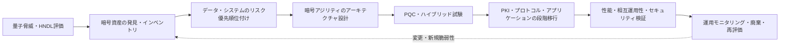
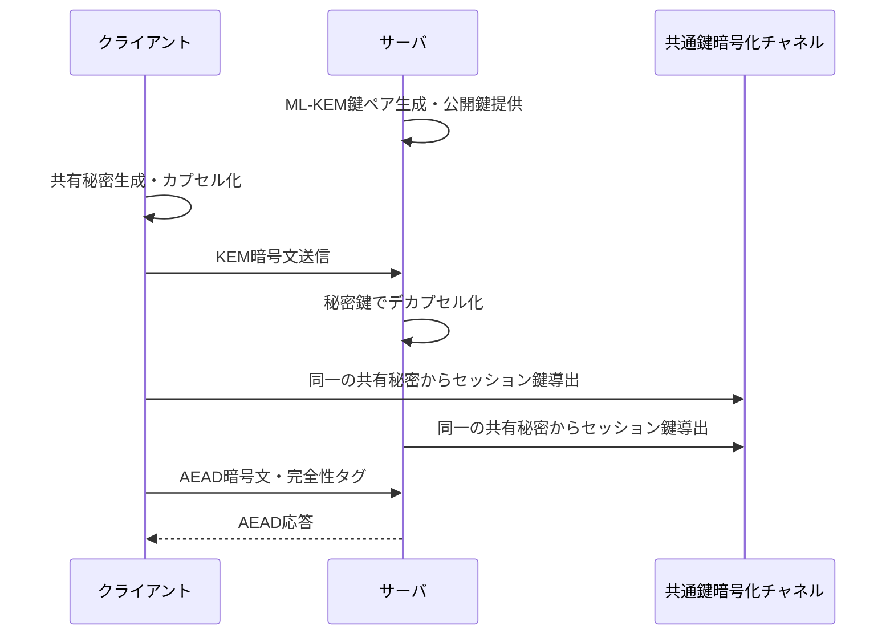

# 耐量子計算機暗号(PQC, Post-Quantum Cryptography)と暗号移行戦略

## 1. 概要

> **定義**: 耐量子計算機暗号(PQC)は、十分に大規模な量子コンピュータが登場した場合でも、既存の公開鍵暗号の中核となる問題を耐量子性のある数学問題に置き換えることで、機密性・完全性・認証を維持するよう設計された暗号技術である。

現在のRSA、Diffie–Hellman、楕円曲線暗号は、整数の素因数分解と離散対数の計算困難性に安全性を依存している。
古典コンピュータで大きな鍵を対象にこれらの問題を解くには非常に長い時間を要するため、インターネットの鍵交換、電子署名、証明書体系に広く使用されてきた。
しかし、Shorのアルゴリズムを実行できる暗号解読用量子コンピュータ(CRQC)が現実化すれば、これら公開鍵体系の安全性の前提は根本的に弱体化する。

共通鍵暗号とハッシュ関数も量子攻撃の影響を受けるが、公開鍵暗号とは影響の性格が異なる。
Groverのアルゴリズムは共通鍵・ハッシュの探索計算量をおおよそ平方根の水準に下げるため、鍵長または出力長を伸ばす方式で緩和する余地がある。
一方、ShorのアルゴリズムはRSA・DH・ECCの基盤となる問題を効率的に解ける可能性を示すため、単に鍵長を少し伸ばす方式では十分ではない。

PQC移行は、新しいアルゴリズムを一つ選んで入れ替える単純な暗号化プロジェクトではない。
証明書、鍵管理、TLS・VPN・SSH、コード署名、ファームウェア更新、データベース接続、機器の暗号ライブラリとベンダー依存関係をあわせて調査しなければならない。
特に、現在収集した暗号文を将来復号する「収集後復号(HNDL, Harvest Now, Decrypt Later)」の脅威は、データの秘密保持期間が長い組織が今準備しなければならない理由となる。

米国国立標準技術研究所(NIST)は2024年にFIPS 203・204・205を最終承認し、PQC標準の最初の3本柱を提示した。
FIPS 203は鍵カプセル化メカニズムML-KEM、FIPS 204は汎用電子署名ML-DSA、FIPS 205はハッシュベース電子署名SLH-DSAを規定する。
技術士の答案では、アルゴリズム名を暗記するにとどまらず、現行暗号のリスク分析から暗号資産の目録化・優先順位付け・試験・段階的移行へと続くガバナンスとアーキテクチャを説明しなければならない。

## 2. 量子の脅威と移行の必要性

### 2.1 既存暗号に対する量子アルゴリズムの影響

RSAは大きな整数の素因数分解、DHとECCは離散対数問題の計算困難性に基づく。
古典コンピューティングでは鍵長を十分に大きくすれば攻撃コストを現実的に高めることができたが、量子コンピューティングではShorのアルゴリズムがこれらの問題を効率的に扱える可能性がある。
したがってRSA証明書、ECDH鍵交換、ECDSA署名は、量子コンピュータが十分に発展すれば同時に置き換えの対象となる。

共通鍵暗号については、Groverのアルゴリズムの効果を考慮してセキュリティ強度を再評価する。
例えば128ビット共通鍵の量子探索に対する安全性が理論上低下しうるため、長期保護が必要な領域ではAES-256のようなより長い鍵を検討する。
ただし実際の攻撃には、量子誤り訂正、論理量子ビット数、回路深さ、実装上の欠陥など様々な条件が必要であるため、「明日すぐにすべての暗号が破られる」と断定してはならない。

PQCの目的は量子コンピュータを使うことではなく、量子コンピュータを持つ攻撃者に対しても、古典コンピュータ上で実行可能な暗号を提供することである。
したがって耐量子アルゴリズムも、実装エラー、乱数生成の失敗、サイドチャネル、鍵管理の不備、証明書の誤発行といった伝統的なリスクから自由ではない。
アルゴリズムを変えても運用統制が弱ければ、全体のセキュリティ水準は改善されない。

### 2.2 HNDLとデータの秘密保持期間

攻撃者は現在の暗号を即座に解けなくても、ネットワークトラフィックと保存データを収集しておくことができる。
将来、量子コンピューティング能力が十分になれば、過去に集めた暗号文を復号して医療情報、国家機密、産業設計資料、長期契約文書を盗むことができる。
この脅威は、機密保持期間が暗号移行に要する期間よりも長い組織において特に重要である。

リスク評価では、データの機微性と秘密保持期間をあわせて見なければならない。
1週間後に公開される資料と、20年間保護しなければならない基盤技術資料とでは、同じRSAを使っていても優先順位が異なる。
暗号資産目録にはアルゴリズムだけを記載するのではなく、データ分類、初回生成日、保存期間、暗号文の流出可能性、復号主体と置き換えの難易度を記録すべきである。

### 2.3 全体の移行フロー

このフローで最初に行うべきことは、アルゴリズムを決めることではなく、現在の暗号の使用箇所を把握することである。
直接呼び出しているライブラリだけでなく、オペレーティングシステム、Webサーバ、認証局、クラウドサービス、ネットワーク機器、外部SaaSが内部で使用している暗号まで含めなければならない。
発見結果はシステムオーナーと紐付けられるべきであり、オーナーのいない暗号の使用はそれ自体を管理リスクとして分類する。

次に、データの重要度、露出可能性、置き換えの難易度、サプライチェーン依存性、障害の影響度を用いて移行順序を決める。
長期機密データを扱う通信とコード署名は単純なテストサーバよりも早く検討すべきであるが、可用性が重要な中核サービスは互換性試験なしに即座に置き換えてはならない。
移行ではセキュリティだけでなく、性能、鍵サイズ、証明書サイズ、ネットワークMTU、ストレージ容量、レガシー機器のサポート有無をあわせて検証しなければならない。

## 3. PQC標準と中核アルゴリズム

### 3.1 NIST標準の役割区分

NISTが最終化した3つの標準は、同じ機能を競い合うリストではない。
ML-KEMは2つの通信当事者が公開チャネル上で共有秘密を確立する鍵カプセル化系であり、ML-DSAとSLH-DSAはメッセージの完全性と署名者認証のための電子署名系である。
実際のTLSやアプリケーションでは、通信セッションの鍵確立とサーバ・クライアント認証の両方が必要になりうるため、KEMと署名を組み合わせて設計する。

| 標準 | アルゴリズム | 主な機能 | 基盤となる数学 | 移行時の役割 |
|---|---|---|---|---|
| FIPS 203 | ML-KEM | 鍵カプセル化・共有秘密の確立 | モジュール格子ベース | TLS・VPN・メッセージ暗号化の鍵確立 |
| FIPS 204 | ML-DSA | 汎用電子署名 | モジュール格子ベース | 証明書・コード・文書・トークンの署名 |
| FIPS 205 | SLH-DSA | ステートレスなハッシュベース電子署名 | ハッシュ関数ベース | 代替的な信頼の起点・アルゴリズムの多様性 |

この表の機能区分を誤解すると、ML-KEMで文書に署名したり、ML-DSAを鍵交換アルゴリズムとして使用したりするような誤りが生じる。
鍵カプセル化は共通のセッション鍵を安全に合意するためのものであり、電子署名は公開鍵で署名を検証して出所と改変の有無を確認するためのものである。
したがって要求分析において、機密性中心の経路と認証・完全性中心の経路を分離したうえで、適切な標準をマッピングしなければならない。

### 3.2 ML-KEMと鍵カプセル化

ML-KEMは、CRYSTALS-Kyber提案から派生したモジュール格子ベースの鍵カプセル化メカニズムである。
受信者は公開鍵と秘密鍵を生成し、送信者は受信者の公開鍵でカプセル化して暗号文と共有秘密を作る。
受信者は秘密鍵で暗号文をデカプセル化して同一の共有秘密を得、以降の大容量データはAES-GCMのような共通鍵暗号で処理するハイブリッド構造が一般的である。

鍵カプセル化の利点は、公開鍵暗号で平文全体を直接暗号化せず、短い共有秘密を確立する点である。
しかし既存のECDHよりも公開鍵と暗号文のサイズが大きくなりうるため、証明書・ハンドシェイク・パケットサイズと処理遅延を測定しなければならない。
特に小型のIoT機器、古いVPN機器、MTUが厳格なネットワークでは、フラグメンテーションとバッファの限界が接続失敗につながりうる。

### 3.3 ML-DSAと汎用電子署名

ML-DSAは、CRYSTALS-Dilithium提案から派生したモジュール格子ベースの電子署名標準である。
署名者は秘密鍵でメッセージに署名し、検証者は公開鍵と署名を用いて、メッセージの改変の有無と署名者による公開鍵の所有を確認する。
証明書、アプリケーションパッケージ、コンテナイメージ、ファームウェア、APIトークン、電子文書に適用できる。

ML-DSAは汎用性が高いが、既存のECDSA署名よりも公開鍵・署名サイズが大きくなりうる。
署名サイズが大きくなると、証明書チェーンとコード配布パッケージのサイズ、検証時間、キャッシュ効率、ログとデータベースの保存量が影響を受ける。
したがって単にアルゴリズム名だけを置き換えるのではなく、証明書チェーンの長さと最大メッセージサイズを含むエンドツーエンドの試験を実施しなければならない。

コード署名では、アルゴリズムを変えることよりも、信頼の起点と更新失敗時の復旧手順のほうが重要な場合がある。
署名検証が失敗したときに機器が安全な旧バージョンに戻れるか、ロールバック攻撃を遮断するか、オフライン署名鍵へのアクセスをどう統制するかを点検する。
ベンダーが生成するバイナリと内部ビルド成果物の署名形式が異なる場合は、デプロイパイプライン全体をあわせて標準化しなければならない。

### 3.4 SLH-DSAとアルゴリズムの多様性

SLH-DSAは、SPHINCS+提案から派生したステートレスなハッシュベース電子署名である。
構造化された格子問題の代わりにハッシュ関数の性質に基づくため、ML-DSAとは異なる前提に立つ代替手段となりうる。
一つの数学的前提に問題が生じたときにすべての信頼体系が同時に崩壊するリスクを下げるという、アルゴリズムの多様性の観点で意味がある。

その代わり、署名サイズと処理特性がML-DSAと異なりうるため、すべての経路のデフォルトとして選択することには慎重であるべきである。
帯域幅が制限されたデバイスや署名頻度が非常に高いサービスでは、性能・保存・伝送の負担を測定し、長期の信頼アンカーのように速度よりも保守的な前提を重視する領域に優先的に適用できる。
アルゴリズムの多様性とは、無条件に複数のアルゴリズムを同時に使うことではなく、独立した失敗可能性と運用の複雑さのバランスを設計する原則である。

## 4. 暗号アジリティとハイブリッド移行

### 4.1 暗号アジリティの概念

暗号アジリティ(crypto-agility)とは、暗号アルゴリズム・鍵長・プロトコル・証明書を、周辺の業務ロジックを大規模に書き直すことなく置き換えられるシステムの能力である。
アルゴリズム名がソースコードのあちこちにハードコーディングされていたり、証明書形式と鍵ストアが特定の実装に縛られていたりすると、脆弱性が発見されたときの置き換えに長い時間がかかる。
PQC移行においてアジリティは、一度きりの量子対策ではなく、その後の標準変更やアルゴリズムの脆弱性にも対応する持続可能な品質特性である。

暗号化サービスを抽象化した共通API、集中鍵管理、ポリシーベースのアルゴリズムネゴシエーション、バージョン付きの証明書プロファイル、自動化された鍵・証明書のローテーションを適用すれば、置き換えの範囲を縮小できる。
ただし抽象化層が実際のアルゴリズムのパラメータとエラー動作を隠してしまうと性能・セキュリティの検証が難しくなりうるため、標準化されたインタフェースと観測可能なメタデータをあわせて設計しなければならない。
暗号アジリティの成功基準は「いつでも変えられる」という宣言ではなく、特定のサービスにおいて承認されたアルゴリズムを何段階・何回のデプロイで置き換えられるかによって測定する。

### 4.2 ハイブリッド暗号の意味

ハイブリッド方式とは、既存の公開鍵方式とPQC方式を併用し、一方が失敗しても他方の安全性を活用できるよう設計するアプローチである。
鍵確立では古典的なECDHとML-KEMから得た秘密を結合して鍵を導出でき、署名では既存の署名とPQC署名を両方検証するポリシーを設けることができる。
この方式は相互運用性の検証と段階的移行に役立つが、結合方法と検証ポリシーを誤って設計すると、かえって最も弱い構成や複雑な失敗経路が生じる。

ハイブリッド結合は、2つの暗号文や署名を単純に連結する問題ではない。
鍵導出関数に各秘密の出所を明示し、いずれか一つの構成要素が失敗した場合にセッション全体を失敗とするか、ダウングレードを許容するか、ネゴシエーション結果を監査ログに残すかを定義しなければならない。
また両方のアルゴリズムを検証する間はハンドシェイクサイズとスループットが増加するため、実際のネットワーク・機器・クライアントの組み合わせで試験する。

### 4.3 既存暗号とPQCの比較

| 区分 | RSA・DH・ECC | PQC | 移行時の示唆 |
|---|---|---|---|
| 安全性の前提 | 素因数分解・離散対数 | 格子・ハッシュなど別の問題 | アルゴリズムの多様性と検証実績の確認 |
| 量子攻撃 | Shorのアルゴリズムに脆弱 | 量子攻撃を考慮して設計 | 長期機密データから優先的に移行 |
| 鍵・署名サイズ | 相対的に小さい | 一部の構成でより大きい | MTU・証明書・保存量の測定が必要 |
| エコシステム | 長年の実装・相互運用性 | ライブラリ・機器のサポートが発展中 | ハイブリッドと段階的適用が必要 |
| 運用リスク | 慣れているが長期リスクが存在 | 実装・標準・サプライチェーン変化のリスク | 暗号インベントリとアジリティの確保 |

比較の要点は、PQCがすべての項目で既存暗号より優れているという主張ではない。
PQCは量子の脅威に対する安全性目標を提供するが、鍵サイズと性能・実装エコシステムの面でコストが発生しうる。
したがってシステムのセキュリティ寿命、性能予算、障害許容水準、規制要件を反映して、ハイブリッドまたは単独PQCの適用可否を決定する。

## 5. 暗号資産インベントリと段階的移行手順

### 5.1 発見と目録化

暗号資産インベントリとは、システム・アプリケーション・機器・データフローにおいて、どの暗号がどの目的で使用されているかを記録した目録である。
アルゴリズム、モード、鍵長、ライブラリバージョン、鍵と証明書のオーナー、有効期間、保存場所、依存プロトコル、ベンダー、置き換え方法を最低限の項目として含める。
ソースコードの静的解析だけではハードウェアセキュリティモジュール、クラウドのマネージド証明書、外部API、運用者の手動手順を見つけられない場合があるため、複数の検出方式を組み合わせる。

発見プロセスでは、ネットワークスキャン、証明書ストアの分析、ソフトウェア構成分析、コード検索、クラウド設定の照会、ベンダーへの問い合わせ、インタビューを併用する。
各結果には検出時刻と精度、未確認領域を表示し、自動で発見されなかった暗号の使用は別途の残存リスクとして管理する。
インベントリは静的なスプレッドシートではなく、CMDB・資産管理・鍵管理・デプロイパイプラインと連携した継続的なデータプロダクトとして運用しなければならない。

### 5.2 リスクの優先順位付け

優先順位は、暗号が古いという事実一つで決めるものではない。
データの秘密保持期間、攻撃への露出度、システムの重要度、置き換えに必要なリードタイム、ベンダーのサポートスケジュール、障害時の業務影響度をあわせて評価する。
例えば外部に公開されたTLSエンドポイントは露出リスクが大きく置き換えは容易かもしれないが、販売終了した産業制御機器は露出が限定的であっても置き換えのリードタイムと安全への影響が大きい場合がある。

| 優先順位 | 代表的な対象 | 判断根拠 | 推奨活動 |
|---|---|---|---|
| 非常に高い | 長期機密データ、中核PKI、コード・ファームウェア署名 | HNDL・信頼の崩壊・置き換えリードタイム | 直ちにインベントリ・設計・ベンダー計画を策定 |
| 高い | インターネットTLS、VPN、IAM・API認証 | 外部露出と大規模な影響 | ハイブリッド試験・証明書・プロトコルのロードマップ |
| 中程度 | 一般的な内部サービスと短期データ | 秘密保持期間と影響が相対的に低い | 標準ライブラリ・アジリティ適用後に順次移行 |
| 低い | 公開データ・サポート終了予定の資産 | 保護価値または残存寿命が低い | 例外承認・置き換えまたは廃棄計画 |

この表は自動決定ルールではなく、リスク評価の出発点である。
優先順位が高くても、実際の適用前には相互運用性、性能、障害復旧を検証し、優先順位が低くても法規や契約が別途の期限を求める場合には順序を調整する。
例外はシステムオーナー、セキュリティ責任者、調達・法務の利害関係者が承認し、有効期限と補完統制を明示しなければならない。

### 5.3 実装・試験・デプロイ

パイロットは、代表性がありつつ失敗の範囲を限定できるサービスから始める。
公開TLSエンドポイント、内部サービス間mTLS、コード署名、VPN、データベース接続のように異なる暗号経路を一つずつ選定し、サポートされるライブラリとアルゴリズムパラメータを確認する。
試験結果には平均遅延だけでなく、p99ハンドシェイク遅延、最大メッセージサイズ、CPU・メモリ使用量、接続失敗率、証明書チェーンの処理、ロールバック時間を含める。

デプロイは開発・検証・一部トラフィック・全トラフィックの段階に分け、ネゴシエーション失敗時には安全なエラーを返しつつ、脆弱なアルゴリズムへ黙ってダウングレードしないようにする。
実験用の機能フラグが運用環境に残って許可されていないアルゴリズムを再有効化しないよう、有効期限と自動点検を設ける。
移行完了後は既存の証明書・鍵を即座に削除するよりも、依存関係の確認と保存義務を検討したうえで安全に廃棄し、廃棄の証跡を残す。

## 6. 適用事例と関連技術

### 6.1 金融機関の外部チャネル移行事例

大手金融機関が、モバイルアプリとインターネットバンキングのTLS、内部APIのmTLS、顧客証明書、電子文書署名を運用していると仮定する。
まず証明書の発行・更新経路とクライアントバージョンをインベントリ化し、長期間保存される取引文書と短期のセッションデータを区別する。
次にサーバ・最新モバイルクライアント・APIゲートウェイのハイブリッド鍵交換を試験し、旧型クライアントの失敗率と通信パケットサイズを測定する。

サーバだけがPQCに対応しても、旧型端末が新しい証明書とハンドシェイクを処理できなければサービス障害が発生する。
したがってアプリ更新、互換性のある暗号ライブラリ、証明書チェーン、カスタマーセンターのエラー対応、障害時のロールバックを一つのリリース計画にまとめなければならない。
取引文書の電子署名は鍵確立とは別の経路であるため、ML-DSA・SLH-DSAの適用と、長期検証のための署名形式・タイムスタンプポリシーもあわせて定める。

### 6.2 製造・IoTファームウェア署名の事例

製造現場には、寿命が10年以上のセンサー、ゲートウェイ、PLC、車載制御器が存在しうる。
機器がインターネットに直接接続されていなくても、悪性ファームウェアがサプライチェーンや保守用ノートPCを通じて流入しうるため、ファームウェア署名と更新鍵の長期保護が重要である。

移行計画は、ブートローダが新しい署名アルゴリズムを検証できるか、ROMに固定された信頼の起点を変更できるか、署名サイズを格納するフラッシュ容量があるかの確認から始める。
旧型機器を一度に置き換えるのが難しければ、セキュリティゲートウェイで更新パッケージの検証を強化し、新規機器から暗号アジリティを組み込み、機器の寿命終了と置き換え予算をロードマップに反映する。
この事例は、アルゴリズムの選択だけでは解決できない、ハードウェア寿命・現場へのアクセス性・安全停止手順の問題を示している。

### 6.3 PKIとソフトウェアサプライチェーンの連携

PQC移行は、PKIのルート・中間認証局・リーフ証明書だけでなく、コード署名、コンテナイメージ、パッケージリポジトリ、ビルドワークフローにもつながる。
証明書サイズと署名形式が変われば、プロキシ、セキュリティ機器、クライアントSDK、署名検証ツールが連鎖的に影響を受ける。
ソフトウェアサプライチェーンでは、ビルド環境の署名鍵を保護し、どのアルゴリズムと鍵でいつ成果物に署名したかをprovenanceとともに記録しなければならない。

## 7. 深掘り:標準化・運用の動向と出題との関連

NISTは2024年にFIPS 203・204・205を公開した後も、追加の標準化とバックアップアルゴリズムの開発を続けている。
したがって特定時点の候補リストを永続的な正解のように暗記するよりも、最終標準か草案か、鍵確立か電子署名か、適用製品が検証済みかを区別することが重要である。
最新の標準の状態はNIST PQCプロジェクトとFIPS原文を基準に確認し、製品ベンダーのマーケティング上の説明と標準の要求事項を分けて評価する。

NISTの移行方針は、脆弱な公開鍵の使用を特定し、システムとデータに優先順位を付け、暗号の置き換えが可能な構造へ移行することである。
この観点は、情報セキュリティガバナンス、PKI、セキュアコーディング、ソフトウェアサプライチェーンセキュリティ、個人情報保護、災害復旧と結び付く。
技術士の答案では、「PQC導入」をセキュリティチームのアルゴリズム置き換えに矮小化せず、全社の資産管理・調達・開発・運用・監査体制の変化へと拡張して記述すれば論理性が高まる。

想定される論述問題は、量子の脅威の原理と対応アルゴリズムの比較、HNDLを考慮した移行ロードマップ、暗号資産インベントリの構築、暗号アジリティの設計、ハイブリッド移行の長所と短所、PKI・コード署名の適用事例を組み合わせる形で構成できる。
答案構成は、脅威と必要性、標準・構成要素、移行手順、事例・比較、リスクとガバナンス、技術士としての示唆の順に展開すれば、原因から実行へとつながる。

## 8. 考慮事項および示唆

### A. 標準・相互運用性の管理

PQC標準が最終化されたとしても、すべてのオペレーティングシステム・ブラウザ・ネットワーク機器・HSMが同時にサポートするわけではない。
標準のバージョン、パラメータセット、暗号モジュールの認証状態、ライブラリ実装のサイドチャネル対策、ライセンスと保守主体を確認しなければならない。
ハイブリッドネゴシエーションにおいて双方の実装の組み合わせが実際に相互運用できるかをベンダーと共同で試験し、失敗時のユーザーへの影響とロールバック経路を文書化する。

### B. 性能・容量・可用性のトレードオフ

鍵・署名・暗号文のサイズ増加は、ネットワーク帯域幅、MTU、証明書の保存、キャッシュ、データベースのカラム、ログコストを増大させうる。
平均性能だけで意思決定せず、トラフィックピーク、再接続の急増、モバイルの低帯域、CPU不足の機器、障害復旧時の大量検証を含む負荷試験を実施する。
セキュリティ強度を高める代わりに可用性が低下しうるため、ユーザー体験とサービスレベル目標を満たすパラメータとデプロイ段階を選択する。

### C. 鍵管理・運用統制

PQCも、秘密鍵の窃取、乱数生成の誤り、鍵バックアップの露出、権限の濫用に対して脆弱でありうる。
HSM・KMSのアルゴリズムサポート、鍵の生成と廃棄、二重承認、アクセスログ、バックアップの暗号化、証明書の自動更新、緊急時の置き換えをポリシーとして定義する。
暗号資産インベントリと鍵管理システムのデータが不一致にならないよう、定期的な突き合わせとオーナー確認を運用統制として組み込む。

### D. 長期的なガバナンスと投資

PQCは、短期プロジェクトの完了宣言よりも、継続的な発見・優先順位付け・置き換え・再検証のプログラムとして運用しなければならない。
CISOまたは情報セキュリティ最高責任者を中心に、システムオーナー、ネットワーク、PKI、開発、調達、法務、監査が参加する意思決定体制を作り、ベンダーのサポートスケジュールと契約上の責任を管理する。
新規システムには最初から承認された暗号APIと置き換え可能な証明書プロファイルを使用させ、レガシーの例外には終了日・補完統制・予算を付与する。

### E. 技術士の観点からの展望

耐量子計算機暗号は量子コンピューティングだけのテーマではなく、信頼できるデジタル社会の長期的な暗号インフラを再設計するテーマである。
今後は、暗号資産をソフトウェア構成要素のように追跡するCBOM、自動化された証明書・鍵のライフサイクル管理、サプライチェーンの証跡、ポリシーベースの暗号ネゴシエーションが重要になるであろう。
技術士は特定のアルゴリズムを推奨するだけで終わらず、組織のリスク・データの寿命・サービス品質・調達上の制約を反映した移行アーキテクチャと実行可能なロードマップを提示しなければならない。

## 参考資料

- [NIST Post-Quantum Cryptography プロジェクト](https://csrc.nist.gov/projects/post-quantum-cryptography)
- [NIST FIPS 203: Module-Lattice-Based Key-Encapsulation Mechanism Standard](https://csrc.nist.gov/pubs/fips/203/final)
- [NIST FIPS 204: Module-Lattice-Based Digital Signature Standard](https://csrc.nist.gov/pubs/fips/204/final)
- [NIST FIPS 205: Stateless Hash-Based Digital Signature Standard](https://csrc.nist.gov/pubs/fips/205/final)
- [NIST IR 8547: Transition to Post-Quantum Cryptography Standards](https://csrc.nist.gov/pubs/ir/8547/ipd)
- [NIST NCCoE Migration to Post-Quantum Cryptography FAQ](https://pages.nist.gov/nccoe-migration-post-quantum-cryptography/FAQ/)

---

> **一言まとめ**: PQC移行とはML-KEM・ML-DSA・SLH-DSAを選ぶことではなく、暗号資産を発見してリスクに優先順位を付けたうえで、暗号アジリティと段階的な検証によって全社のPKI・プロトコル・サプライチェーンを耐量子構造へ移す戦略である。
