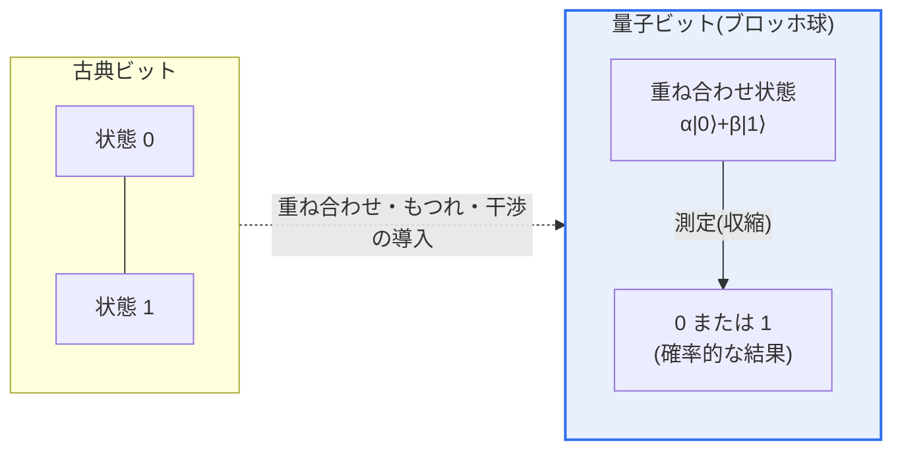
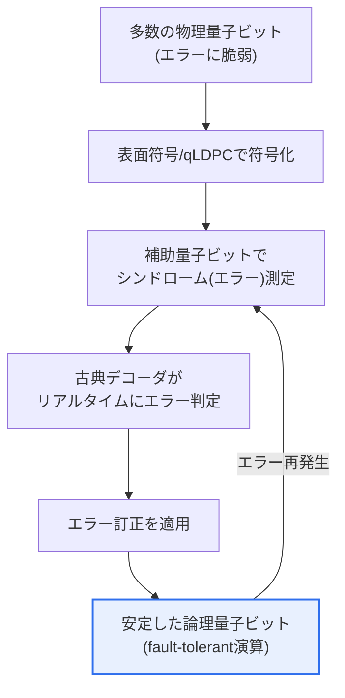

# 量子ビット(Qubit)

## 1. 概要

### A. 定義
> **量子ビット(Qubit, Quantum Bit)** は量子コンピュータにおける情報の最小単位であり、古典コンピュータのビットが0または1のいずれか一方しか持たないのとは異なり、**0と1の状態が確率振幅として同時に重なり合って存在(重ね合わせ)** できる量子情報の単位である。

量子ビットを理解する出発点は、「**0か1かではなく、0であると同時に1でもありうる**」という量子力学的性質である。古典ビットは、トランジスタのオン(1)・オフ(0)という2つの値のいずれか一方のみを持つ決定的(deterministic)な状態である。一方、量子ビットは **重ね合わせ(Superposition)** によって、|0⟩と|1⟩の2つの基底状態をそれぞれの確率振幅(complex amplitude)で同時に保持する。数式では |ψ⟩ = α|0⟩ + β|1⟩ (|α|²+|β|²=1)と表現され、α・βが複素数であることが位相(phase)情報を担い、古典的な確率と決定的に区別される。1つの量子ビットの状態は半径1の球の表面上の一点、すなわち **ブロッホ球(Bloch Sphere)** 上のベクトルとして可視化され、北極が|0⟩、南極が|1⟩、赤道が完全な重ね合わせ状態に相当する。

量子ビットの真の力は、その数が増えたときに現れる。n個の量子ビットは2ⁿ個の基底状態を同時に表現するため、50量子ビットであれば2⁵⁰(約1,126兆)、300量子ビットであれば宇宙の原子の数を超える場合の数を一つの状態ベクトルに収める。ここに、複数の量子ビットが一つの結合状態として結び付き個別には記述できなくなる **量子もつれ(Entanglement)** が加わると、ある量子ビットの測定結果が即座に他の量子ビットの状態を決定づける強い相関が形成される。最後に **干渉(Interference)** を利用して、誤答に相当する確率振幅は打ち消し、正答の振幅は強め合うことで、指数関数的に多い候補の中から目的の解を高い確率で取り出す。この重ね合わせ・もつれ・干渉の三重奏こそが、素因数分解・最適化・量子シミュレーションといった特定の問題で古典コンピュータを圧倒する量子コンピュータの性能の源泉である。

### B. 登場背景と必要性
古典コンピュータは、問題の規模が大きくなると計算量が指数関数的に爆発する種類の問題(大規模な分子シミュレーション、組合せ最適化、大きな数の素因数分解)を事実上解くことができない。例えば2,048ビットのRSA鍵を古典コンピュータで素因数分解するには現在のスーパーコンピュータでも数十億年を要するが、十分な量子ビットを備えた量子コンピュータはショア(Shor)のアルゴリズムによって多項式時間内に処理できる。また、新薬・触媒・電池材料を左右する分子の量子状態は本質的に量子力学に従うため、同じ量子原理で動作する量子ビットでシミュレーションするのが自然かつ効率的である。リチャード・ファインマンが1982年に「自然をシミュレーションするには、コンピュータ自体が量子的でなければならない」と指摘したのがまさにこの必要性であり、量子ビットはその実現手段である。

## 2. 古典ビットと量子ビットの構造的比較

まず全体構造の観点から、古典ビットと量子ビットが情報を保持する方式の違いを概念図で整理する。古典ビットは2つの値の間の離散的なスイッチであるが、量子ビットはブロッホ球上の任意の点を指す連続的なベクトルであり、測定した瞬間にのみ0または1に収縮する。

表は両方式の中核的な違いを要約したものであるが、各項目が「なぜ」そうなるのかが重要である。**表現力** がビットでは線形(n個)、量子ビットでは指数(2ⁿ個)と開くのは、重ね合わせが基底状態を並列に載せるためである。**測定** が量子ビットで確率的になるのは、重ね合わせ状態を観測した瞬間に波動関数が一つの古典的な値へと収縮(collapse)するためである。この収縮のため、量子ビットは「指数関数的に多くの計算を同時に行うが、答えはただ一度、確率的にしか読み出せない」という制約を持つ。そのため量子アルゴリズム設計の本質は、「干渉をうまく調整して、正答が読み出される確率を最大化すること」にある。

| 区分 | 古典ビット | 量子ビット |
|---|---|---|
| **状態** | 0または1(決定的) | α\|0⟩+β\|1⟩ の重ね合わせ(確率振幅) |
| **表現力** | nビット = n個の状態 | n量子ビット = 2ⁿ状態を同時に |
| **演算** | 論理ゲート(AND・OR)を逐次 | ユニタリ量子ゲート(可逆) |
| **測定** | 常に同じ値(非破壊) | 確率的・破壊的(測定時に収縮) |
| **複製** | 自由にコピー可能 | 複製不可(No-Cloning定理) |
| **エラー** | ビット反転が中心 | ビット+位相反転、デコヒーレンス |

## 3. 中核となる量子的性質と物理的実装

### A. 重ね合わせ・もつれ・干渉の動作原理
**重ね合わせ** は単一の量子ビットに複数の可能性を同時に持たせる性質であり、アダマール(Hadamard)ゲートを|0⟩に適用すると(|0⟩+|1⟩)/√2という完全な重ね合わせが作られる。重ね合わせだけでは、古典的な確率的コンピューティングと根本的な違いはない。違いを生むのは **もつれ** である。2つの量子ビットをもつれさせると(|00⟩+|11⟩)/√2のようなベル(Bell)状態となり、1つ目の量子ビットを0と測定すれば2つ目も即座に0に確定する。この相関は2つの量子ビットがどれほど離れていても維持され、個々の量子ビットの状態には分解できない「全体としての情報」を作り出す。最後に **干渉** は、波の強め合い・打ち消し合いのように確率振幅を操作するものであり、グローバー(Grover)の探索アルゴリズムは正答状態の振幅を繰り返し増幅して、√N回で目的の項目を見つける(古典ではN回)。この3つの性質が噛み合って初めて「量子優位性」が成立する。

### B. デコヒーレンスとエラー — 最大の難題
量子ビットの最大の弱点は **デコヒーレンス(Decoherence)** である。量子ビットは熱・振動・電磁ノイズなど外部環境とわずかでも相互作用すると、位相と重ね合わせの情報を失ってしまう。この維持時間を表す指標がコヒーレンス時間(T1:エネルギー緩和、T2:位相緩和)であり、現在の超伝導量子ビットではマイクロ秒〜ミリ秒の水準である。すなわち計算をこの短い時間内に終えなければならない。そのため超伝導方式は、絶対零度に近い約15mK(ミリケルビン、宇宙背景放射よりも低い温度)の希釈冷凍機の中で量子ビットを隔離する。それでもゲート1回あたり0.1〜1%程度のエラーが発生するため、数百万ゲートを使う実用アルゴリズムをそのまま実行することはできない。

### C. 量子誤り訂正と論理量子ビット
この問題への正攻法が **量子誤り訂正(QEC, Quantum Error Correction)** である。No-Cloning定理のため古典のような単純複製による多数決は使えないので、複数の **物理量子ビット(physical qubit)** をもつれさせて1つの安定した **論理量子ビット(logical qubit)** を構成し、補助量子ビットの測定によって状態を壊さずにエラーだけを検出・訂正する。代表的には表面符号(Surface Code)が格子状の配置で実装しやすいため超伝導方式で広く使われており、物理量子ビットのエラー率が特定のしきい値(threshold)を下回って初めて、量子ビットを増やすほど論理エラーが減る「損益分岐点」に到達する。以下は、物理量子ビットから論理量子ビットを作って計算に用いる流れを示した概念図である。

### D. 量子ゲートと代表的アルゴリズム
量子ビットを操作する演算が **量子ゲート(quantum gate)** である。古典論理ゲートとは異なり、量子ゲートは情報を失わない可逆(reversible)・ユニタリ変換でなければならない。単一量子ビットゲートとしては、状態を反転させるX(NOT)、位相を変えるZ、重ね合わせを作るアダマール(H)が代表的であり、2つの量子ビットをもつれさせるCNOTゲートがあれば、任意の量子演算を近似できる普遍ゲートセットが構成される。これらのゲートを時間順に並べたものが **量子回路(quantum circuit)** であり、アルゴリズムとはすなわち回路設計である。

代表的なアルゴリズムを通じて、量子ビットの威力と限界をあわせて理解できる。**ショア(Shor)のアルゴリズム** は大きな数の素因数分解を多項式時間で処理し、RSAを脅かす指数関数的な優位を示しており、これがPQC移行の直接的な契機である。**グローバー(Grover)のアルゴリズム** は、整列されていないN個のデータの探索を√N回で終える平方根レベルの高速化を提供する。NISQ時代に実用性が期待される **VQE(変分量子固有値ソルバー)** は、量子コンピュータが状態の準備・測定を行い、古典コンピュータがパラメータを最適化する古典-量子ハイブリッド方式であり、分子エネルギー計算などの化学シミュレーションに適用される。このように量子ビットの利点は、すべての問題ではなく特定の構造(周期性・探索・量子シミュレーション)を持つ問題でのみ発揮される。

| アルゴリズム | 対象問題 | 優位性 | 産業応用 |
|---|---|---|---|
| **Shor** | 素因数分解・離散対数 | 指数関数的 | 公開鍵暗号の解読(→PQCを誘発) |
| **Grover** | 非整列データの探索 | 平方根(√N) | DB検索・逆関数探索 |
| **VQE/QAOA** | 化学・組合せ最適化 | 問題依存(ハイブリッド) | 新素材・新薬・物流最適化 |

### E. 実装方式の多様性
量子ビットを物理的に何で作るかについては、まだ標準が確定しておらず、方式ごとに速度・安定性・拡張性のトレードオフが異なる。どの方式であれ、拡張可能な量子ビット、初期化、長いコヒーレンス、普遍ゲートセット、測定という **ディヴィンチェンツォの基準(DiVincenzo Criteria)** の5つを満たして初めて実用的な量子コンピュータとなる。

| 実装方式 | 代表的な主体 | 特徴 |
|---|---|---|
| **超伝導(Superconducting)** | IBM, Google | ゲートが高速・集積に有利、極低温が必要 |
| **イオントラップ(Trapped Ion)** | IonQ, Quantinuum | コヒーレンス・精度に優れる、速度が遅い |
| **光子(Photonic)** | PsiQuantum, Xanadu | 常温・通信網と親和的、ゲート実装が困難 |
| **中性原子(Neutral Atom)** | QuEra, Pasqal | 量子ビットの再配置が柔軟、拡張性に期待 |
| **スピン/シリコン(Spin)** | Intelなど | 既存の半導体プロセスを活用可能 |
| **トポロジカル(Topological)** | Microsoft | 原理上エラーに強い、実証は初期段階 |

## 4. 発展段階と産業動向の比較

現在は誤り訂正が完備されていない **NISQ(Noisy Intermediate-Scale Quantum)** 時代であり、ジョン・プレスキルが2018年に命名した。数十〜数百個のノイズを含む量子ビットで限定的な実験を行う段階である。Googleは2019年に53量子ビットのSycamoreで、特定のランダム回路サンプリングにおいて古典スーパーコンピュータに対し圧倒的な速度を示す「量子超越性(quantum supremacy)」を主張し、2024年末には **Willow** チップで、量子ビットを増やすほどエラーが減る「しきい値以下(below-threshold)」の誤り訂正を実証し、QECが原理検証を超えて工学的な進展段階に入ったことを示した。IBMは2021年に127量子ビットのEagle、2022年に433量子ビットのOsprey、2023年に1,121量子ビットのCondorと物理量子ビット数を増やした後、単純な数の競争からモジュール化・誤り訂正中心へと転換した。IBMのロードマップは、qLDPC符号とリアルタイム復号を活用して2029年に **Starling**(200論理量子ビット、1億ゲート級の大規模フォールトトレラント量子コンピュータ)を目標としており、その前段階としてLoon・Kookaburra・Cockatooを提示している(発表されたロードマップ基準であり、日程は流動的でありうる)。

この流れの実務的な含意は、方式間の優劣がまだ決していないという点である。超伝導はゲートが高速で半導体プロセスとの接点があるため集積に有利であるが極低温インフラのコストが大きく、イオントラップは量子ビットの品質(精度・コヒーレンス)に優れるが演算速度が遅く大規模回路では不利である。したがって応用の性格(精度優先 vs スループット優先)によって適した方式が異なり、当面は複数の方式が並存しながら発展する可能性が高い。

ここで留意すべき点は、**量子ビットの「数」だけで性能を判断してはならない** ということである。いくら量子ビットが多くても、エラー率が高くコヒーレンスが短ければ意味のある回路を実行できないからである。そのため、量子ビット数・接続性・ゲート忠実度(fidelity)・エラー率を総合した指標である **量子ボリューム(Quantum Volume)** や、毎秒の有効演算量(例:CLOPS)といった尺度が併用される。例えば「127量子ビット」という数字は物理量子ビット数にすぎず、誤り訂正を経た論理量子ビットに換算するとはるかに少ない。技術士の観点から量子コンピューティングの成熟度を評価する際には、このように物理量子ビット数、論理量子ビット数、ゲート忠実度、コヒーレンス時間をあわせて見てこそ、誇張されたマーケティングに惑わされない。

## 5. 深掘り — 暗号への脅威とPQC移行

量子ビットが産業・社会に及ぼす最も差し迫った影響は、**公開鍵暗号体系への脅威** である。十分な規模・品質の論理量子ビットを備えた量子コンピュータは、ショアのアルゴリズムによって大きな数の素因数分解と離散対数問題を多項式時間で解くことができ、今日のインターネットセキュリティの根幹であるRSA・ECC(楕円曲線)公開鍵暗号を無力化する。共通鍵(AES)やハッシュは、グローバーのアルゴリズムによって探索速度が√倍速くなる程度であるため鍵長を2倍にすれば対応できるが、公開鍵は原理的に置き換えが不可避である。

問題は「**Harvest Now, Decrypt Later**」の脅威である。攻撃者が現在暗号化された通信・データを保存しておき、暗号学的に意味のある量子コンピュータ(CRQC)が登場した将来に遡って復号できるため、長期的な機密性が必要なデータは、量子コンピュータが実際に完成する前にあらかじめ保護しなければならない。これを受けて米国NISTは2024年8月、格子・ハッシュベースの **耐量子計算機暗号(PQC, Post-Quantum Cryptography)** 標準を正式に発表した — ML-KEM(FIPS 203、鍵カプセル化)、ML-DSA(FIPS 204)・SLH-DSA(FIPS 205、電子署名)。国内外の機関も、暗号資産の目録化(crypto-agilityの確保)と段階的なPQC移行ロードマップを策定している。量子ビット技術の進歩が、そのまま暗号移行の緊急性を決定する構造である。

## 6. 考慮事項および示唆 (技術士の観点)

1. **エラー・デコヒーレンスの克服が商用化の決定的変数である。** 物理量子ビット数の競争を超えて、1つの論理量子ビットを安定して作るためのQECオーバーヘッド(論理量子ビットあたり数百〜数千の物理量子ビット)をどれだけ下げられるかが実用性の鍵である。表面符号とqLDPC符号、リアルタイム古典デコーダの発展をあわせて注視しなければならない。

2. **特定の問題に特化した技術として理解すべきである。** 量子コンピュータがすべての演算で優れているわけではなく、素因数分解・量子シミュレーション・組合せ最適化・量子機械学習など、指数関数的な優位がある問題群でのみ有効である。汎用コンピューティングを置き換えるよりも、古典HPCと役割を分担する **ハイブリッド(古典+量子)** 構造で活用される見通しであり、アルゴリズム・応用の発掘がハードウェアと同じくらい重要である。

3. **暗号移行(PQC)は今着手すべき戦略課題である。** Harvest Now, Decrypt Laterの脅威のため、量子コンピュータの完成以前に対応しなければならない。組織は暗号の使用状況を目録化し、crypto-agility(暗号アルゴリズムの置き換えの柔軟性)を確保し、NIST PQC標準を反映した段階的な移行計画を策定しなければならない。

4. **国家戦略・サプライチェーンの観点からのアプローチが必要である。** 極低温冷凍機、制御用電子機器、素材など量子ハードウェアのサプライチェーンと人材は少数の国・企業に集中しており、技術主権の問題が大きい。アクセス手段はクラウドベースの量子コンピューティング(QCaaS)によって敷居が下がりつつあるため、自前のハードウェア確保とクラウド活用を並行する投資戦略が現実的である。

5. **実装方式の不確実性を前提としたポートフォリオ戦略が求められる。** 超伝導・イオントラップ・中性原子・光子など方式ごとのトレードオフが明確で勝者が未確定であるため、特定の方式に早期にロックインされるよりも、標準・成熟度の推移を観察しつつ応用の準備(アルゴリズム・人材・ユースケース)を先行させることがリスクを減らす。

## 参考資料
- IBM Quantum, "IBM lays out clear path to fault-tolerant quantum computing": https://www.ibm.com/quantum/blog/large-scale-ftqc
- IBM Quantum Hardware and roadmap: https://www.ibm.com/quantum/hardware
- NIST, Post-Quantum Cryptography標準(FIPS 203/204/205): https://csrc.nist.gov/projects/post-quantum-cryptography

---

> **一言まとめ**: 量子ビットは *重ね合わせ・もつれ・干渉* によってn個で2ⁿの状態を同時に表現する量子情報の単位であり、量子コンピュータの指数関数的な演算能力の源泉であるが、デコヒーレンス・エラーへの脆弱性を論理量子ビット(QEC)で克服しなければならないという課題を抱えており、ショアのアルゴリズムで公開鍵暗号を脅かしてNIST PQC標準への移行を促している。
