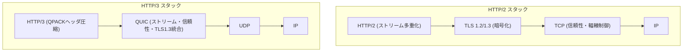
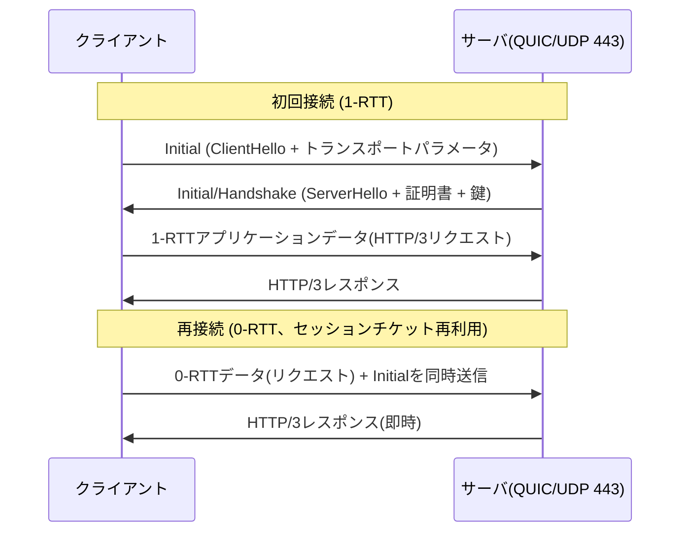

# QUICとHTTP/3

## 1. 概要

> **QUIC(Quick UDP Internet Connections)**は、UDP上で動作しながら、TCPの信頼性・順序保証とTLS 1.3の暗号化、そしてストリーム多重化を一つに統合したトランスポートプロトコルである。**HTTP/3**は、このQUICをトランスポート層として使用するよう再定義した次世代のHTTPバージョンであり、それぞれIETFにおいてRFC 9000(QUIC、2021)とRFC 9114(HTTP/3、2022)として標準化された。

QUICとHTTP/3が登場した根本的な背景は、**Webパフォーマンスのボトルネックはもはや帯域幅ではなく、遅延(latency)とプロトコル構造そのものにある**という認識にある。初期のWebはHTTP/1.1のテキストベースの要求-応答構造を長く使用してきたが、1つの接続で要求を逐次処理しなければならない制約(Head-of-Line Blocking、HOL Blocking)のため、ブラウザはドメインごとに複数のTCP接続を並列に開くという便法を使わざるを得なかった。これを改善したHTTP/2は、1つのTCP接続の中で複数のストリームを多重化(multiplexing)してアプリケーション層のHOL Blockingを解消したが、依然として根本的な限界が残っていた。

問題の核心は、**HTTP/2が信頼性をTCPに依存している** という点にある。TCPは1本のバイトストリームを順序どおりに届けるプロトコルであるため、多重化された複数のストリームは実際には単一のTCPシーケンスの上に載っている。したがって途中でパケットが1つ失われただけでも、TCPはその後に到着したすべてのデータをアプリケーションに渡せず、再送を待つことになる。論理的には独立したストリームが物理的には1つのTCPキューを共有しているため、**トランスポート層レベルのHOL Blocking** がそのまま再現されるのである。さらに、TCPの3ウェイハンドシェイク(1 RTT)の上にTLSハンドシェイク(TLS 1.2基準で2 RTT、1.3は1 RTT)が直列に載るため接続確立の遅延が大きく、カーネルに組み込まれたTCPは改善・展開が数年単位で遅いという硬直化(ossification)の問題もあった。QUICはこれらすべての問題を、**UDPの上に信頼性・暗号化・多重化をユーザ空間(user space)で再実装する** という方式で回避する。

## 2. QUICプロトコルの構造と中核的特性

QUICはOSI階層で見るとUDP(トランスポート)の上に位置するが、TCP・TLS・HTTP/2のストリーム制御を丸ごと吸収した「融合トランスポート層」である。以下の概念図は、従来のHTTP/2スタックとHTTP/3スタックの階層構造の違いを対比して示している。

QUICの特性は4つの軸で整理される。第一に、**ストリーム単位の独立伝送** である。QUICは1つの接続の中に複数のストリームを置くが、各ストリームの順序・再送を個別に管理する。したがってストリームAのパケットが失われても、ストリームB・Cは影響を受けずにアプリケーションへ届けられる。これがQUICがトランスポート層のHOL Blockingを根本的になくした方式であり、損失率が高いモバイル・無線環境ほど体感効果が大きい。

第二に、**暗号化の標準装備(Encryption by default)** である。QUICはTLS 1.3をプロトコルに統合し、ヘッダの一部とペイロード全体を常に暗号化する。平文のQUICは別途存在しないため、盗聴・改ざんだけでなく、中間装置(ミドルボックス)がプロトコルの詳細をのぞき込んで特定の動作に依存し、硬直化してしまうossificationも構造的に防止する。

第三に、**コネクションIDに基づく接続マイグレーション(Connection Migration)** である。TCP接続は(送信元IP・ポート、宛先IP・ポート)の4タプルで識別されるため、スマートフォンがWi-FiからLTEに切り替わってIPが変わると接続が切れる。一方QUICは、IP・ポートとは無関係な **Connection ID** で接続を識別するため、ネットワークが変わっても同じ接続を維持したまま通信を続けることができる。移動性の高い端末において、再接続・再ハンドシェイクのコストを大きく削減する実質的な利点である。

第四に、**ユーザ空間実装による俊敏性** である。TCPはOSカーネルに組み込まれているため改善案が展開されるまでに長い時間がかかるが、QUICはブラウザ・ライブラリなどアプリケーションレベルで実装されるため、輻輳制御アルゴリズムの入れ替えや機能改善をアプリケーションの更新だけで迅速に反映できる。

## 3. HTTP/3の接続確立と0-RTTの動作手順

HTTP/3のパフォーマンス上の利点を決定づけるのは、**接続確立遅延の短縮** である。QUICはトランスポートのハンドシェイクとTLS 1.3の暗号ネゴシエーションを1つの過程に統合し、新規接続は1 RTT、以前に接続したことのあるサーバへの再接続は0-RTTでデータ送信を開始できる。以下のシーケンス図は、QUICの接続確立と0-RTT再開のフローを示している。

初回接続では、クライアントがQUICのトランスポートパラメータとTLS ClientHelloを含むInitialパケットを送信し、サーバがServerHello・証明書・鍵材料で応答すれば、わずか1 RTTで暗号化されたアプリケーションデータをやり取りできる。TCP+TLS 1.2が最低3 RTTを消費していたのと比べると、初期ロードの遅延が大幅に短縮される。一方、すでに通信したことのあるサーバに対しては、以前のセッションで受け取った **セッションチケット(PSK)**を用いて、ハンドシェイクの完了を待たずに最初の往復で直ちにリクエストデータを載せて送る **0-RTT** が可能である。ただし0-RTTデータはリプレイ攻撃(replay)に脆弱である可能性があるため、サーバは参照(GET)のような冪等(idempotent)なリクエストにのみ許可し、決済・注文のような非冪等なリクエストは1-RTT確立後まで遅らせる防御が必要である。

ヘッダ圧縮方式も変わる。HTTP/2はHPACKを使用していたが、HPACKは動的テーブルの更新順序に依存するため、QUICの順序不同の配送と衝突する。そこでHTTP/3は **QPACK** を導入し、ヘッダ圧縮状態の同期を別のストリームに分離することで、ストリームの独立性を損なうことなくヘッダの重複を除去する。

## 4. HTTP/2(TCP) vs HTTP/3(QUIC)の比較

両プロトコルの違いは単なるバージョンアップではなく、**信頼性をどの層が担うのか** という設計思想の違いに由来する。HTTP/2は信頼性をTCPに委ねたため多重化の利点が単一のTCPキューに閉じ込められ、HTTP/3は信頼性をQUICがストリームごとに直接管理するため、多重化の利点が損失発生時にも維持される。以下の表は主要項目を整理したものである。

| 区分 | HTTP/2 (over TCP) | HTTP/3 (over QUIC) |
|------|-------------------|--------------------|
| トランスポート層 | TCP | UDPベースのQUIC |
| 多重化時のHOL Blocking | トランスポート層で発生 | ストリーム独立により解消 |
| 接続確立 | TCP 1-RTT + TLS 1-~2-RTT | QUIC 1-RTT(再接続は0-RTT) |
| 暗号化 | TLSは別レイヤー(任意) | TLS 1.3を常時内蔵 |
| 接続識別 | 4タプル(IP・ポート) | Connection ID |
| ネットワーク切替 | 再接続が必要 | 接続マイグレーションで維持 |
| ヘッダ圧縮 | HPACK | QPACK |
| 実装位置 | カーネル(TCP) | ユーザ空間 |

表に示すとおり、実務上最も意味のある違いは **損失・移動環境における堅牢性** である。例えば地下鉄で移動しながらWebページを開くユーザは、パケット損失とWi-Fi↔LTEの切り替えを同時に経験するが、HTTP/2では1回の損失が全ストリームを停止させ、IPの変更が接続を切断するのに対し、HTTP/3では該当ストリームのみが一時的に遅延し、接続はそのまま維持される。ただし安定した有線・低損失環境ではTCPも十分に最適化されているため、QUICの利点は相対的に小さい場合があり、UDP処理に伴うCPU負荷はむしろ不利に働くこともある。

## 5. 導入状況および実務上の考慮事項 (深掘り)

QUICはGoogleが2012年頃に社内の実験プロトコル(gQUIC)として開始し、Chrome・YouTube・検索トラフィックに適用して大規模な検証を経た後、IETFでの標準化を通じてベンダー中立のプロトコルとして定着した。現在、Chrome・Firefox・Edgeなどの主要ブラウザと、Cloudflare・Google・Metaなどの大規模CDN・サービスがHTTP/3をサポートしており、世界のWebトラフィックのかなりの割合がすでにHTTP/3で処理されている(正確な数値は調査機関・時点によって異なるため一般化する)。通常、ブラウザはまずHTTP/2で接続した後、サーバが送る **Alt-Svc(Alternative Services)** ヘッダによってHTTP/3の利用可能性を認識し、次回の接続からQUICに切り替える。

導入に際しては、実務上いくつかの制約を考慮しなければならない。第一に、多くの企業のファイアウォール・NATはUDP 443ポートを遮断したり速度制限(throttling)したりするため、その場合にブラウザがTCPベースのHTTP/2に自動的に復帰(fallback)するよう、二重サポート構成が必要である。第二に、UDPパケットをユーザ空間で処理する特性上、同じトラフィックでもTCPよりCPU使用率が高くなる場合があるため、カーネルバイパス(kernel bypass)・GSOのような最適化やハードウェアオフロードをあわせて検討しなければならない。第三に、パケットがすべて暗号化されているため既存のネットワーク機器(IDS・プロキシ)がペイロードを検査しにくく、セキュリティの可視性を確保する戦略(エンドポイントベースの検査、ポリシーの再設計)を事前に用意しなければならない。

## 6. 考慮事項および示唆 (技術士の観点)

- **適用戦略**: HTTP/3は全面的な置き換えではなく、HTTP/2との並行サポートを前提に段階的に導入すべきである。Alt-Svcとfallbackを活用してUDP遮断環境でもサービスの継続性を保証し、損失・移動性の大きいモバイルサービスから優先的に適用して効果を最大化するのが合理的である。
- **トレードオフ**: 遅延短縮・移動性という利点と、CPU負荷の増加・既存セキュリティ機器の可視性低下というコストが相反する。トラフィック特性(損失率・RTT・移動性)とインフラ条件を定量的に分析し、利点がコストを上回るワークロードを選別して適用する判断が求められる。
- **セキュリティの観点**: 常時暗号化はプライバシーを強化するが、ネットワークベースの脅威検知を困難にするため、セキュリティ統制の重心をネットワーク境界からエンドポイント・アプリケーションへ移す(ゼロトラストとの整合)アーキテクチャ転換を並行しなければならない。0-RTTはリプレイ攻撃に留意し、冪等なリクエストに限定する。
- **展望・関連技術**: QUICはHTTP/3を超えて、DNS over QUIC、メディア伝送(WebTransport・Media over QUIC)、さらには6G・エッジコンピューティング環境の低遅延伝送基盤へと拡張されている。ユーザ空間実装の俊敏性を活かして、輻輳制御(BBRなど)・マルチパス(Multipath QUIC)の進化が急速に続くと見込まれ、オブザーバビリティ(Observability)・CDN・サービスメッシュ設計との連携もあわせて考慮しなければならない。

## 参考資料

- IETF RFC 9000, "QUIC: A UDP-Based Multiplexed and Secure Transport", https://www.rfc-editor.org/rfc/rfc9000
- IETF RFC 9114, "HTTP/3", https://www.rfc-editor.org/rfc/rfc9114
- IETF RFC 9204, "QPACK: Field Compression for HTTP/3", https://www.rfc-editor.org/rfc/rfc9204

---

> **一言まとめ**: QUICはUDPの上にTLS 1.3・ストリーム多重化・信頼性を統合してトランスポート層のHOL Blockingをなくし、0-RTT接続・接続マイグレーションを実現したトランスポートプロトコルであり、これを使用するHTTP/3は損失・移動環境で特に強い次世代Webプロトコルである。
