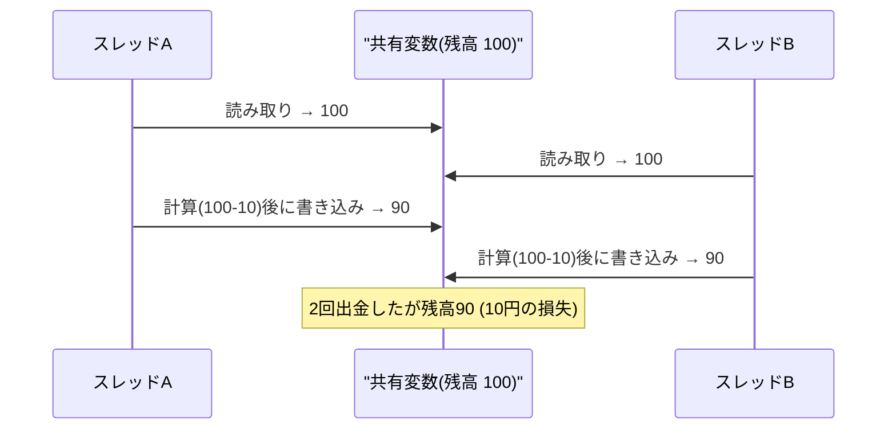
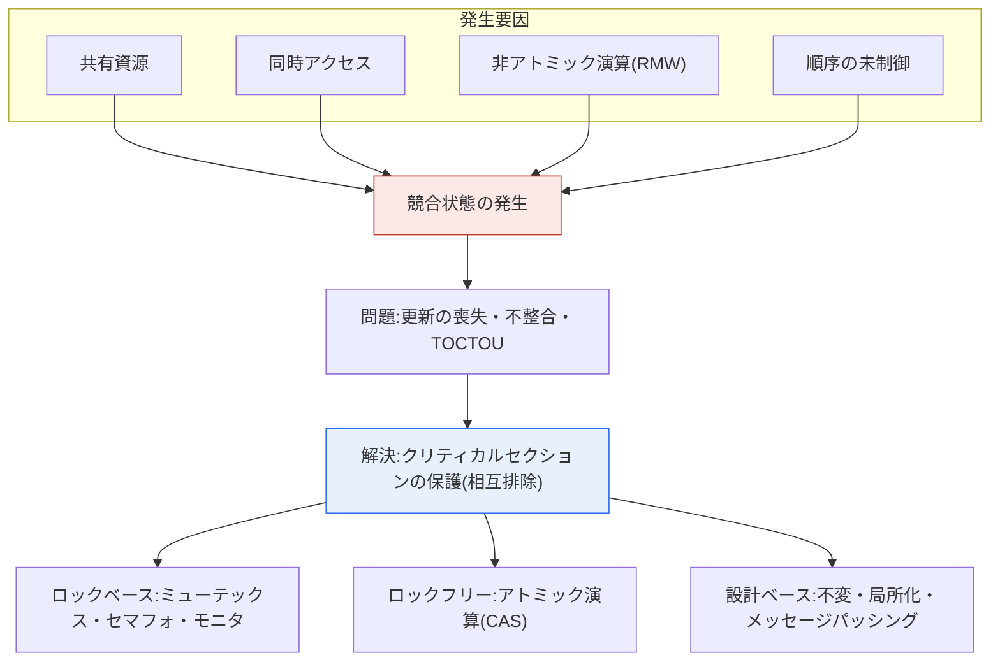

# 競合状態(Race Condition)

## 1. 概要

### A. 定義
> **競合状態(Race Condition)** とは、2つ以上のプロセス・スレッドが **共有資源に同時にアクセスする際、その実行順序(タイミング)によって最終結果が変わってしまうエラー状況** をいう。すなわち、プログラムの正しさが「誰が先に実行されるか」という制御不能な偶然に左右される状態である。

競合状態が特に危険な理由は、「**いつ発生するかわからず、再現さえ難しい**」という点にある。複数のスレッドが同じ変数を同時に読み書きすると、スケジューラが各スレッドをどの瞬間に割り込ませて実行するかによって、結果が毎回変わる。例えば残高100円の口座から、2つのスレッドが同時に10円ずつ出金するとしよう。各出金は「現在の残高を読む → 10を引く → 再び書き込む」という3段階で行われるが、2つのスレッドがほぼ同時に100を読んでしまうと、それぞれが90を計算して書き込むため、2回出金したにもかかわらず残高が80ではなく90になるという事態が起こる。10円が虚空に消えたのである。

この問題の厄介さは、「**ときどきしか**」発生しない点にある。ほとんどの実行では偶然順序が合って正常に動作し、特定のタイミングが重なる極めてまれな場合にのみエラーが発生する。そのため開発・テスト環境では問題がないのに、負荷の高い運用環境で、しかも断続的にしか発生しないため、原因の特定が非常に難しい。このような非決定性(non-determinism)のため、競合状態は「ハイゼンバグ(Heisenbug、観察しようとすると消えるバグ)」の代表例と呼ばれる。

根本的な原因は、複数の命令からなる更新処理が **アトミック(atomic)ではないため**、その途中に別の実行フローが割り込めることにある。このように割り込まれるとデータの一貫性が崩れるコード区間を **クリティカルセクション(Critical Section)** と呼び、このクリティカルセクションを一度に1つの実行フローだけが通過するよう保護することが問題解決の核心である。

ここでよくある誤解を一つ指摘しておく。「コード1行ならアトミックである」という考えは誤りである。高級言語の `balance = balance - 10;` という1行も、コンパイルされると「メモリから値をレジスタに読み込む → 減算する → メモリに書き込む」という複数の機械命令に分割され、その間にスケジューラが別のスレッドを割り込ませることができる。さらにマルチコアでは、CPUのキャッシュ・メモリの並べ替え(reordering)のために、あるスレッドが書き込んだ値が他のスレッドから即座には見えない **可視性(visibility)** の問題まで重なり、競合状態は単なる順序の問題を超えてメモリモデル(memory model)レベルの問題へと拡張される。

### B. 発生条件と背景
競合状態は、(1) **共有資源**(グローバル変数・ファイル・DBレコード・ハードウェアなど)が存在し、(2) 2つ以上がその資源に **同時にアクセス** し、(3) そのアクセスが **読み取り-変更-書き込み(read-modify-write)** のような非アトミックな演算であり、(4) **実行順序が制御されない** ときに成立する。この4つの条件は、裏返せばそのまま解決の糸口となる。すなわち、共有をなくす(1を除去)、同時アクセスを直列化する(2を除去)、演算をアトミックにする(3を除去)、順序を強制する(4を除去)のいずれかを行えば、競合状態は消える。後述する解決手法はすべて、この4条件のうち1つ以上を崩す方式である。

マルチコアCPUが普及し、非同期・並列プログラミングが日常化するにつれ、かつてシングルスレッドでは表面化しなかったこの欠陥が、現代ソフトウェアの中核的な信頼性・セキュリティ上の脅威として浮上した。特にセキュリティ領域では、検査時点(Time-Of-Check)と使用時点(Time-Of-Use)の間のわずかな隙を突く **TOCTOU** 攻撃として悪用される。例えばファイルの権限を検査した後、実際に開くまでの間に攻撃者がそのファイルをシンボリックリンクにすり替えれば、検査は通過しつつも実際には権限のないファイルにアクセスしてしまう、といった具合である。

## 2. 発生原理

競合状態の本質は、「アトミックであるべき更新が途中で分割され、別のフローが割り込む」ことである。以下のシーケンス図は、先に説明した残高出金の例において、2つのスレッドの読み書きがどのように交錯(interleaving)し、更新の喪失(lost update)を引き起こすかを示している。

上図のポイントは、Aが「読み取り」と「書き込み」の間でまだ90を反映する前に、Bが割り込んで古い値100を読んでしまう点である。もしAの3段階がアトミックにまとめられ、Bがその間に割り込めなかったとすれば、Bは90を読んで80を書き込み、結果は正確になったはずである。すなわち競合状態は「並行性そのもの」ではなく、「**保護されていないクリティカルセクションへの同時アクセス**」から生じる。

競合状態は、その現れ方によっていくつかの類型に分けられる。上の例のような **更新の喪失(lost update)** が最も一般的であり、2つの資源を更新している途中の中間状態が他のフローに露出する **読み取り不整合(dirty read)**、そしてセキュリティで問題となる **TOCTOU**(検査と使用の間の状態変更の悪用)が代表的である。以下の図は、競合状態の原因要素と解決の階層との関係を構造的に整理したものである。

## 3. 解決方法

競合状態の解決策は、結局一つの原理に収束する。クリティカルセクションに **一度に1つの実行フローだけを入れる(相互排除、Mutual Exclusion)** か、そもそも共有をなくすことである。ただしその実装手段は、階層によって大きくロック(lock)ベース、ロックフリー(lock-free)ベース、設計ベースに分かれ、それぞれトレードオフが異なる。表の前に、各アプローチの原理を確認しておく。

**A. ロック(Lock)ベースの相互排除。** 最も直観的な方法であり、クリティカルセクションに入る前にロックを獲得し、出るときに解放することで、他のフローの進入を防ぐ。**ミューテックス(Mutex)** はただ1つのフローだけを通過させる二値ロックであり、**セマフォ(Semaphore)** はP(待機)・V(シグナル)操作によって同時にアクセス可能な資源の数をN個に制御する(ミューテックスはN=1の特殊なケースと見なせる)。**モニタ(Monitor)** はJavaの `synchronized` のように、言語・ランタイムレベルでロックと条件変数をカプセル化し、開発者がロックの解放を忘れるミスを減らしてくれる。ロックベースは理解しやすく強力であるが、ロックが性能のボトルネックとなり、誤用するとデッドロック(deadlock)を招くという代償がある。

ロックベースの手法を用いる際に必ず守るべき原則がある。ロックの獲得と解放は、例外発生時にも対応が取れていなければならないということである。クリティカルセクション内で例外が発生してロックを解放できなければ、他のすべてのフローが永遠に待機することになるため、`try-finally` やRAII(リソース獲得は初期化である)パターンによって解放を保証しなければならない。モニタが言語レベルで好まれる理由も、まさにこの解放漏れのリスクを言語が代わりに防いでくれるからである。

**B. ロックフリー(Lock-Free)のアトミック演算。** ハードウェアが提供するアトミック命令、代表的には **CAS(Compare-And-Swap)** を用いて、ロックなしで安全に更新する。CASは「メモリの値が自分が読んだ期待値と同じときにだけ新しい値に置き換える」という比較-交換を1回のアトミック演算で行うため、途中で他のフローが値を変更していれば失敗を返し、再試行させる。ロックがないためデッドロックがなく、競合が少ないときには性能が良いが、競合が激しいと再試行が急増し、「ABA問題」のような微妙な落とし穴もあるため、実装の難易度が高い。

**C. 設計ベースの回避。** 最も根本的な解決策は「共有そのものをなくす」ことである。値が変化しない **不変(immutable)オブジェクト** を使えば同時に読んでも問題はなく、状態をスレッドごとに別々に持つ **スレッドローカル(thread-local)** 変数は共有がないため競合が根本的に封じられる。さらに、状態を共有せず **メッセージパッシング(message passing)** のみでやり取りするアクター(Actor)モデル(Erlang・Goのチャネル)は、並行性エラーの相当部分を設計段階で除去する。

| 手法 | 階層 | 中核原理 | 注意点 |
|---|---|---|---|
| **ミューテックス(Mutex)** | ロック | クリティカルセクションの相互排除(N=1) | デッドロック・ボトルネック |
| **セマフォ(Semaphore)** | ロック | P/Vでアクセス数をN個に制御 | 順序を誤るとデッドロック |
| **モニタ(Monitor)** | ロック | 言語レベルでの同期のカプセル化 | 言語サポートが必要 |
| **アトミック演算(CAS)** | ロックフリー | 比較-交換・再試行 | ABA・競合時の再試行急増 |
| **不変/局所/メッセージ** | 設計 | 共有そのものを除去 | 設計変更のコスト |

手法選択の実務指針は「競合の性格」によって異なる。クリティカルセクションが短く競合がまれであれば、スピンロック(spinlock)やCASのようなロックフリー手法がコンテキストスイッチのコストを節約できて有利であり、クリティカルセクションが長い、あるいは待機が長引く可能性がある場合は、スレッドを休眠させるミューテックスがCPUの浪費を防ぐ。読み取りが圧倒的に多く書き込みがまれな場合には、複数の読み取りを同時に許容しつつ書き込みだけを排他的にロックする **読み書きロック(RW Lock)** がスループットを大きく高める。すなわち「無条件にミューテックス」ではなく、アクセスパターンを分析して適切なツールを選ぶことが、性能と安全性のバランス点である。

## 4. 実務事例とデッドロックとの関係

競合状態は理論上の問題ではなく、実際の重大事故の原因となってきた。代表的には、1980年代の放射線治療装置 **Therac-25** の事故は、オペレータの入力と装置制御スレッドとの間の競合状態が安全検査を迂回させ、患者に過剰な放射線を照射したものとして知られており、ソフトウェアの並行性欠陥が人命被害につながった古典的な教訓として残っている。Webサービスでは在庫1個の商品に2件の注文が同時に入り両方とも成功扱いになるオーバーセリング(overselling)、銀行では先に見た二重出金が典型的な事例である。こうした問題は、アプリケーションのロックだけでなく、データベースのトランザクション分離レベル(isolation level)と楽観的・悲観的ロックによってもあわせて制御しなければならない。

データベース層では、競合状態はトランザクション分離レベル(isolation level)の問題として現れる。分離レベルが低ければ(例:Read Uncommitted)性能は良いがダーティリード・更新の喪失といった競合現象がそのまま露出し、高ければ(Serializable)安全であるがロック競合によってスループットが低下する。実務では、**悲観的ロック(Pessimistic Lock)** で更新対象のレコードを事前にロックするか、**楽観的ロック(Optimistic Lock、バージョン列の比較)** で衝突時にのみ再試行させることで、先に見たアプリケーション層のミューテックス・CASと同じ原理をデータ層で実装する。すなわち競合状態の制御は、アプリケーションとデータベースの両方で一貫した戦略として設計されなければならない。

一方、競合状態を防ごうとしてロックを濫用すると、正反対の問題である **デッドロック(Deadlock)** につながる。2つのスレッドが互いに相手の保持するロックを待って永遠に停止する状況であり、相互排除・保持と待機・非横取り・循環待ちの4条件がすべて成立したときに発生する。

したがって実務の要諦は、「ロックを使いつつ、**ロックの順序を一貫して定め、ロックの範囲を最小化** して、デッドロックと性能低下をともに制御する」というバランスにある。ロックの順序をグローバルに統一すれば循環待ちの条件が崩れてデッドロックが予防され、クリティカルセクションを最小化すれば直列化による性能低下を減らすことができる。競合状態とデッドロックは互いを誘発する関係にあるため、どちらか一方だけを見て対応すると、もう一方が悪化する。並行性制御は、この2つを一つの設計問題としてともに扱わなければならない、コインの表裏のような課題である。

## 5. 深掘り — 検出手法と言語レベルでの対応

競合状態は再現が難しいため、事後のデバッグよりも **事前の検出ツールと言語レベルでの予防** がますます重要になっている。動的解析ツールである **ThreadSanitizer(TSan)** は、プログラムを実際に実行しながら、異なるスレッドが同期なしに同じメモリにアクセスしているかを追跡してデータ競合を検出し、C/C++・Goなどで広く使われている。Go言語は `-race` フラグでこの機能を組み込みで提供している。静的解析は実行せずにコードから潜在的な競合パターンを見つけ、ストレス・ファジングテストは人為的にスケジュールを揺さぶってまれなタイミングを強制的に露出させる。

可視性の問題を扱う言語レベルの仕組みも重要である。Javaの `volatile` やメモリバリア(memory barrier)は、あるスレッドが書き込んだ値が他のスレッドから確実に見えることを保証し、命令の並べ替えを制限する **happens-before** 関係を成立させる。すなわち現代の競合状態への対応は、「相互排除」だけでなく「可視性・順序の保証」までをあわせて扱って初めて完結し、これは各言語のメモリモデルを正確に理解しなければならないことを意味する。

言語設計レベルでの対応も注目すべき流れである。**Rust** は所有権(ownership)と借用(borrow)の規則によって「可変参照は同時に1つしか存在できない」という制約をコンパイル時に強制することで、データ競合の相当部分を **コンパイル段階で根本的に遮断** する("fearless concurrency")。これはランタイム検査に依存していた従来の方式と対照的な根本的転換であり、並行性の安全性を型システムの問題へと引き上げた事例である。

**Go** のチャネルベースのCSP(Communicating Sequential Processes)モデルは、「メモリを共有して通信するのではなく、通信によってメモリを共有せよ」という哲学のもと、ゴルーチン間のデータをチャネルでやり取りさせることで共有可変状態を減らす。関数型言語が不変性を重視するのも同じ文脈であり、これらは共通して「共有可変状態を減らし、競合を設計段階でなくす」という方向を志向している。こうした流れは、競合状態への対応の重心が「実行中にロックで防ぐ」ことから「設計・コンパイル段階でそもそも不可能にする」ことへと移りつつあることを示している。

## 6. 考慮事項および示唆

技術士の観点から競合状態を扱う際には、以下を総合的に考慮しなければならない。

1. **同期の代償を必ず認識しなければならない。** ロックは競合状態を防ぐが、過度になると性能低下(直列化)とデッドロックを招く。ロックの範囲(クリティカルセクション)を必要最小限に縮小し、複数のロックを使う場合は獲得順序をグローバルに一貫して維持し、循環待ちを断ち切ることがデッドロック予防の核心である。

2. **テストでは捕捉しにくい欠陥であることを前提に設計しなければならない。** 競合状態は断続的・非決定的であるため、通常のテストでは再現されない。したがってThreadSanitizerなどの並行性検出ツール、ストレス・ファジングテスト、共有資源へのアクセスに対する重点的なコードレビューを開発プロセスに常時組み込み、「事後発見」ではなく「事前遮断」を志向しなければならない。

3. **セキュリティ脆弱性に直結することに留意しなければならない。** TOCTOUのような競合条件は、権限検査と実際の使用の間の隙を突いて、権限昇格・認証回避に悪用される。検査と使用をアトミックにまとめるか、ファイルディスクリプタベースのアクセスのように時点差をなくす設計で防御すべきであり、セキュリティレビューの項目に競合条件を明示的に含めなければならない。

4. **「共有をなくす」設計を優先的に検討しなければならない。** ロックで事後的に保護するよりも、不変オブジェクト・スレッドローカル状態・メッセージパッシング(アクター/チャネル)によって共有可変状態そのものを減らすことが、根本的かつ拡張性のある解決策である。新規システムの設計時には、Rust・Goのような言語の並行性安全モデルを積極的に検討し、欠陥を設計段階で排除する戦略が望ましい。

---

> **一言まとめ**: 競合状態は *共有資源への保護されていない同時アクセスにより、実行順序によって結果が変わる非決定的なエラー* であり、クリティカルセクションをミューテックス・セマフォ・アトミック演算(CAS)で相互排除するか、不変性・メッセージパッシングによって共有そのものをなくして解決するが、デッドロック・性能低下とTOCTOUのセキュリティ脅威をあわせて制御しなければならない。
