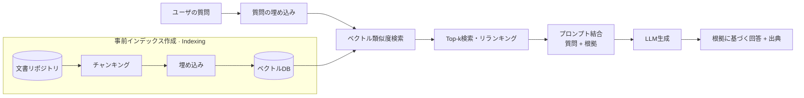

# RAG(Retrieval Augmented Generation、検索拡張生成)

## 1. 概要

### A. 定義
> LLMが回答を生成する前に、**外部の知識ベースから質問に関連する文書を検索(Retrieval)** し、その内容をプロンプトに結合(Augmentation)して、**検索された根拠に基づいて回答を生成(Generation)** する手法。

すなわちRAGは、「**ノンパラメトリック記憶(外部文書)**」と「**パラメトリック記憶(LLM内部のパラメータ)**」を結合する構造である。LLMは学習時点でパラメータに知識を圧縮して記憶するが、この方式だけでは学習以降の最新情報や、学習に含まれていない社内文書を知ることができない。RAGは回答に必要な知識を **推論時点で外部から参照** してプロンプトに入れることで、この限界を補う。

### B. 登場背景および必要性
LLMは、もっともらしいが事実と異なる回答を生成する **ハルシネーション(Hallucination)**、学習データのカットオフ以降を知らない **最新性の不足**、企業内部・専門ドメインの知識の欠如という根本的な限界を持つ。これをファインチューニング(再学習)で解決しようとすると、データ構築・GPUのコストが大きく、知識が変わるたびに学習し直さなければならない。RAGは **モデルを再学習しなくても** 知識ベースを更新するだけで最新・専用の知識を反映でき、**出典(根拠)を併せて提示** できるため、信頼性と検証可能性を高める。このため、企業向けLLM導入の事実上の標準アーキテクチャとなった。

## 2. 処理フロー(アーキテクチャ)

RAGは2つの段階に分かれる。**① 事前インデックス作成(オフライン)** 段階では、文書をチャンキング・埋め込みしてベクトルDBにインデックス化しておく。**② 質問処理(オンライン)** 段階では、ユーザの質問を同じ埋め込み空間に変換して類似するチャンクを検索し、これをプロンプトに結合してLLMが回答を生成する。検索品質が最終的な回答品質を左右するため、RAGの性能改善の焦点は大部分が「生成」よりも「**検索**」にある。

## 3. 構成要素

各構成要素は次のように動作し、どれか一つでも不十分であれば回答全体の品質が低下する。

- **文書処理・チャンキング(Chunking)**: 原文を、検索・注入の単位であるチャンクに分割する。大きすぎると不要な内容が混ざってノイズとなり、小さすぎると文脈が途切れる。そのため段落・意味の境界に基づく分割と、チャンク間の **オーバーラップ** を設ける。
- **埋め込みモデル(Embedding)**: テキストを、意味が近いほどベクトルも近くなるよう高次元ベクトルに変換する。ドメイン特化の埋め込みを使えば検索精度が上がる。
- **ベクトルDB**: 大量の埋め込みを保存し、**近似最近傍探索(ANN、例:HNSW・IVF)** によって類似するチャンクを高速に見つける(FAISS・Pinecone・pgvectorなど)。
- **検索器(Retriever)**: 質問に類似するTop-kのチャンクを返す。ベクトル(意味)検索とキーワード(BM25)検索を組み合わせた **ハイブリッド検索** が一般的である。
- **生成器(LLM)**: 検索された根拠をプロンプトのコンテキストとして受け取り、その範囲内で回答を生成し、出典を引用する。

| 構成 | 役割 | 品質への影響要因 |
|---|---|---|
| チャンキング | 検索単位の分割 | チャンクサイズ・オーバーラップ・境界 |
| 埋め込み | 意味のベクトル化 | モデル性能・ドメイン適合性 |
| ベクトルDB | インデックス・類似度検索 | ANNアルゴリズム・インデックス |
| 検索器 | Top-kの根拠選別 | ハイブリッド・リランキング |
| 生成器(LLM) | 根拠に基づく生成 | プロンプト・コンテキスト長 |

## 4. 高度化(Advanced RAG)の類型

基本(Naive)RAGは「検索→注入→生成」が単純であるため、検索の失敗や無関係な文書の混入に弱い。これを補う代表的な手法は次のとおりである。

- **ハイブリッド検索 + リランキング**: ベクトル・キーワード検索の結果を統合した後、Cross-Encoderリランカーで精密に並べ替え、上位の根拠の精度を高める。
- **質問変換(Query Rewriting/HyDE)**: 曖昧な質問を拡張・書き換えしたり、仮想的な回答を生成したりして、検索のヒット率を改善する。
- **GraphRAG**: ナレッジグラフでエンティティ・関係を構造化し、複数の文書にまたがる推論が必要な質問に対応する。
- **Self/Corrective RAG**: 検索結果の関連性を自ら評価し、不適切であれば再検索するか、Web検索で補完する。

## 5. RAG vs ファインチューニング

両者は代替関係ではなく、**役割が異なる**。ファインチューニングは知識を重みに内在化するため、応答の **形式・口調・特定の能力** を学習させることに強いが、知識が変われば再学習が必要となる。一方RAGは **事実・最新情報** を外部から注入するため、更新が速く出典を提示できる。そのため実務では「**能力はファインチューニング、知識はRAG**」として併用する場合が多い。

| 区分 | RAG | ファインチューニング |
|---|---|---|
| 知識の注入 | 推論時に外部検索でプロンプトに結合 | 学習によって重みに内在化 |
| 最新性/更新 | 知識ベースのみ更新(速い) | 再学習が必要(遅い・コスト) |
| 出典の提示 | 可能(根拠の引用) | 困難 |
| 強み | 最新・根拠に基づく事実応答 | 形式・トーン・専門能力 |
| コスト | 検索インフラ | 学習コスト・データ |

## 6. 限界および評価

RAGの弱点の大部分は **検索段階** に起因する。関連文書を見つけられなければ(Recallの低下)回答が不十分になり、無関係な文書が混ざれば(Precisionの低下)かえってハルシネーションを誘発する。また、検索・リランキングによる **遅延(latency)** とコンテキスト長の制限、根拠が相反する場合の処理も課題である。このため、検索精度、根拠への忠実性(Faithfulness)、回答の関連性などを定量評価する **RAGASのような評価体系** によって、継続的に測定・改善しなければならない。

## 7. 考慮事項および示唆
- **検索品質がすなわち回答品質**: 投資の優先順位を、生成よりもチャンキング・埋め込み・リランキングなどの検索パイプラインに置く。
- **ガバナンス・セキュリティ**: 社内文書をベースとするため、アクセス権限・個人情報(機微情報のフィルタリング)・出典管理が必須である。
- **評価・運用**: RAGAS・A/Bテストで品質を定量化し、文書更新・再インデックス化のパイプラインを自動化する。
- **適用**: 社内ナレッジ検索・顧客対応チャットボット・業務自動化の中核アーキテクチャであり、エージェント(Tool利用)・GraphRAGへと拡張されている。

---

> **一言まとめ**: RAGは *外部知識の検索結果をLLMのプロンプトに結合* して、再学習なしに **ハルシネーションを減らし、最新かつ根拠に基づく回答** を生成する手法であり、性能は検索パイプライン(チャンキング・埋め込み・ハイブリッド・リランキング)が左右し、ファインチューニングと相互補完的である。
