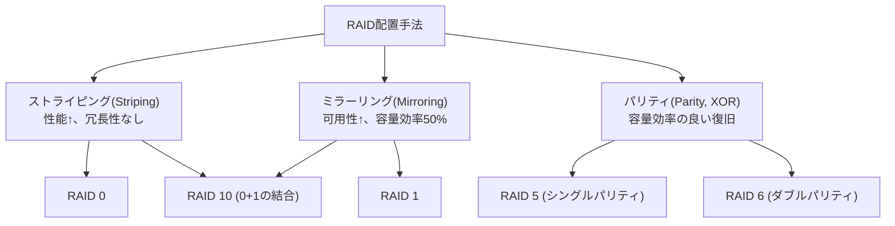
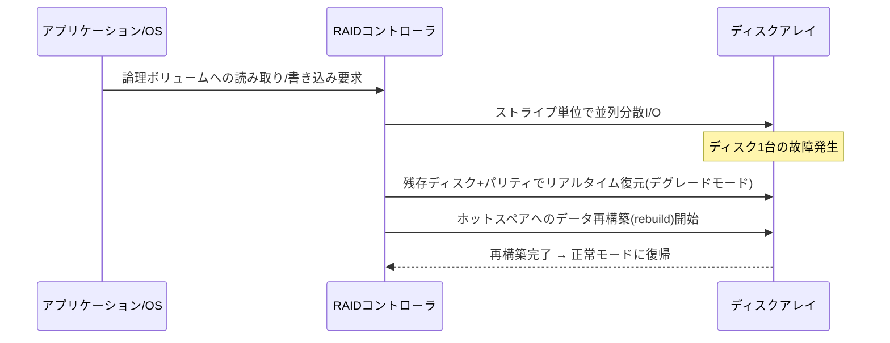

# RAID(Redundant Array of Independent Disks)

## 1. 概要

### A. 定義
> 複数の物理ディスクを1つの論理的なストレージ装置として束ね、**データをストライピング(Striping)・ミラーリング(Mirroring)・パリティ(Parity)** 方式で配置することにより、**性能向上と耐障害性(Fault Tolerance)** を同時に達成するストレージ技術。

RAIDの本質は、「安価で信頼性の低い複数のディスクを、ソフトウェア・ハードウェア的な配置手法で束ね、あたかも1つの高速で安定したディスクのように見せること」である。当初「I」はInexpensive(安価)を意味していたが、今日ではエンタープライズディスクまで含む意味でIndependent(独立)として通用している。中核となるアイデアは **分散による並列性** と **冗長性(redundancy)による復旧能力** という2つの軸であり、RAIDレベルはこの2つの軸をどのように組み合わせるかの違いによって定義される。

### B. 登場背景および必要性
単一ディスクには、性能(回転・シーク遅延)と信頼性(MTBF)の両面で限界がある。特にディスクの容量と台数が増えるほど、アレイ全体の故障確率は急激に大きくなる — ディスク1台の年間故障率(AFR)が1%であっても、100台を束ねればアレイの観点での故障事象ははるかに頻繁になる。したがって、個々のディスクはいつか必ず故障するという前提のもとで、**1〜2台のディスクが故障してもデータを失わずにサービスを継続** しなければならないという要求が生じる。同時に、大容量データのスループット(throughput)を高めるには、**複数のディスクにI/Oを並列分散** させなければならない。RAIDは、この「性能と可用性を同時に」という要求を、安価なディスクの組み合わせで経済的に解決するために登場した。

## 2. 中核原理と構成方式

RAIDは、3つの基本的な配置手法の組み合わせとして理解できる。**ストライピング** は1つのデータを複数のディスクに細かく分割し(ストライプ単位)、並列に読み書きさせて性能を高めるが、それ自体には冗長性がない。**ミラーリング** は同じデータを2組以上複製し、一方が故障してももう一方で即座に復旧できるが、容量効率が半分に落ちる。**パリティ** はXOR演算で作った誤り訂正情報を保存し、少ない容量オーバーヘッドで任意の1台(または2台)のディスク損失を復元する。

パリティの原理は単純である。データブロックD1、D2、D3に対してパリティ P = D1 ⊕ D2 ⊕ D3(XOR)を保存しておけば、任意の1ブロック(例:D2)が失われても D2 = D1 ⊕ D3 ⊕ P で復元される。RAID 6は互いに異なる2つの独立したパリティ(P、Q — Qはガロア体演算ベース)を使用し、**2台のディスクの同時故障** にまで耐える。この原理のおかげで、RAID 5はN台のディスクのうち1台分の容量だけを、RAID 6は2台分の容量だけを冗長に使いながら復旧能力を確保する。

## 3. 主要RAIDレベルの比較

各レベルは、性能・可用性・容量効率のトレードオフの上で異なる地点を選択している。RAID 0は冗長性なしにストライピングのみを行うため最高性能・最大容量であるが、ディスクが1台故障しただけでも全データが失われる — すなわち信頼性はむしろ単一ディスクより悪い。逆にRAID 1はミラーリングによって可用性に優れ、読み取り性能も良いが、使用可能容量が半分である。RAID 5は容量効率と可用性の均衡点として長らく標準のように使われてきており、RAID 6は大容量ディスクの時代に再構築(rebuild)中の二次故障リスクが大きくなったことで、事実上必須となった。

| レベル | 最小ディスク数 | 冗長方式 | 許容障害数 | 使用可能容量 | 特徴 |
|---|---|---|---|---|---|
| RAID 0 | 2 | なし(ストライピング) | 0台 | 100% | 最高性能・最大容量、保護なし |
| RAID 1 | 2 | ミラーリング | 1台(ペアごと) | 50% | 読み取りに優れる・復旧が単純 |
| RAID 5 | 3 | 分散シングルパリティ | 1台 | (N-1)/N | バランス型、書き込み時のパリティ負担 |
| RAID 6 | 4 | 分散ダブルパリティ | 2台 | (N-2)/N | 大容量・再構築時の安全性 |
| RAID 10 | 4 | ミラー+ストライプ | グループごとに1台 | 50% | 高性能・高可用、DBで好まれる |

### 書き込みペナルティ(Write Penalty)と性能上の含意
パリティベースのRAIDにおける最も重要な実務上のポイントは **書き込みペナルティ** である。RAID 5で任意の1ブロックを更新するには、(1) 既存データの読み取り、(2) 既存パリティの読み取り、(3) 新データの書き込み、(4) 新パリティの書き込みの **4回のI/O** が必要である。RAID 6はパリティが2つあるため **6回のI/O** に増える。一方、RAID 1/10はデータを両側に書き込む2回で済む。このため、ランダム書き込みの多いOLTPデータベースには、RAID 5/6よりもRAID 10が推奨される。実務では、コントローラの書き込みキャッシュ(NVRAM)とフルストライプ書き込み(full-stripe write)によってこのペナルティを緩和する。

## 4. 動作フロー:正常 → 故障 → 再構築

正常状態では、コントローラは要求をストライプ単位に分割し、複数のディスクで並列に処理する。ディスクが1台故障すると、アレイは **デグレード(degraded)モード** に切り替わり、失われたブロックを残りのディスクとパリティからリアルタイムに計算して提供する — データは生きているが、アクセスのたびに復元演算が加わるため遅くなる。このとき、あらかじめ待機させておいた **ホットスペア(Hot Spare)** ディスクへの自動再構築が開始される。問題は、大容量ディスク(数十TB)の再構築には数時間〜数日かかり、その間に別のディスクが追加で故障すると、RAID 5はデータを完全に失うという点である。この「再構築ウィンドウ(window)」のリスクが、RAID 6と後述する分散RAIDの必要性を生んだ。

## 5. 深掘り:限界と最新動向

従来のRAIDは、大容量・大規模環境で限界に直面した。第一に、再構築時間がディスク容量に比例して長くなり、二重故障のリスクが大きくなる。第二に、再構築の負荷が特定のスペアディスクに集中し、ボトルネックとなる。これを解決するための流れは次のとおりである。

- **分散RAID(Declustered RAID)**: パリティ・スペア領域を全ディスクに分散配置し、再構築時にすべてのディスクが並列に参加するようにする。再構築時間を大幅に短縮(数倍〜数十倍)し、リスクウィンドウを縮小する。NetApp RAID-DP、IBMなどで採用されている。
- **イレイジャーコーディング(Erasure Coding)**: Reed-Solomonなどの数学的な符号により、データをn個の断片+k個のパリティに分散し、任意のk個の損失を復旧する。RAID 6の一般化と見なすことができ、オブジェクトストレージ・分散ファイルシステム(例:Ceph、HDFS EC)において、地域(geo)単位の耐障害性のために広く使われている。
- **ファイルシステム統合型(ZFS RAID-Z、Btrfs)**: ボリュームマネージャ・ファイルシステム・RAIDを統合し、「書き込みホール(write hole)」(パリティとデータが不一致のまま停電する問題)を根本的に除去し、ブロック単位のチェックサムで完全性を保証する。
- **ハードウェア vs ソフトウェアRAID**: 専用コントローラ(バッテリーバックアップキャッシュを含む)は性能・CPUオフロードに有利であるが、ベンダーロックイン・コントローラの単一障害点のリスクがあり、ソフトウェアRAID(mdadm、Storage Spaces)は柔軟・低コストであるがホストCPUを使用する。

## 6. 考慮事項および示唆

- **RAID ≠ バックアップ**: RAIDはディスクの物理故障に対する **可用性** の対策にすぎず、ユーザのミス・ランサムウェア・論理的破損・サイト災害からデータを守ることはできない。必ず別途のバックアップ・スナップショット・遠隔複製(DR)と併用しなければならない。これは3-2-1バックアップ原則とあわせて設計されるべきである。
- **ワークロードに整合した設計**: ランダム書き込み中心(OLTP DB)は書き込みペナルティのないRAID 10、シーケンシャル読み取り・アーカイブ・大容量は容量効率の良いRAID 6/ECが有利である。性能・容量・コスト・可用性の4方向のトレードオフをワークロード特性に合わせて選択することが、技術士としての判断の核心である。
- **再構築リスクの管理**: ディスク大容量化の傾向の中で、RAID 5は再構築中の二重故障・URE(回復不能な読み取りエラー)のリスクが大きいため避け、RAID 6・分散RAID・ホットスペアの複数配置によってリスクウィンドウを管理しなければならない。
- **ソフトウェア定義ストレージ(SDS)・クラウドへの拡張**: 従来のコントローラ中心のRAIDは、ノード・サイト単位の複製とイレイジャーコーディングを組み合わせた分散ストレージ(SDS・オブジェクトストレージ)へと進化しており、耐障害性の境界がディスクからノード・リージョンへと拡大している。今後のストレージ設計は、単一アレイのRAIDよりも **分散冗長・イレイジャーコーディングベースのアーキテクチャ** を優先的に検討する方向へと移行するであろう。

---
> **一言まとめ**: RAIDはストライピング・ミラーリング・パリティの組み合わせによって複数のディスクを束ね、性能と耐障害性を同時に得る技術であり、ワークロードごとのトレードオフ(特に書き込みペナルティ・再構築リスク)を考慮してレベルを選択し、バックアップと必ず併用しなければならない。
