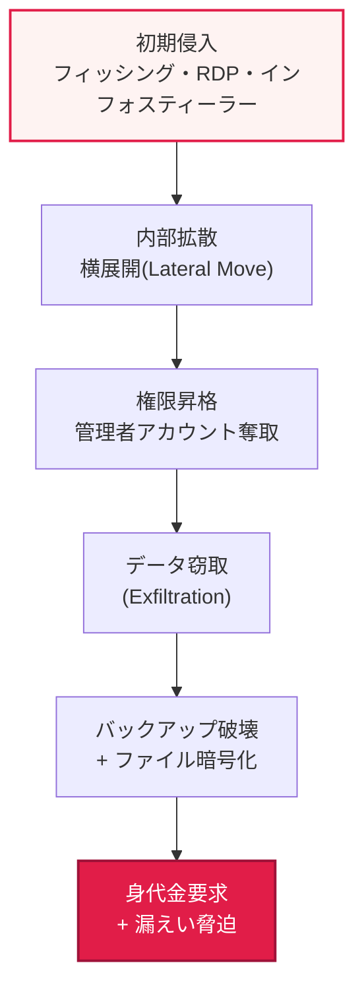

# ランサムウェア（Ransomware）とRaaS（Ransomware as a Service）

## 1. 概要

### A. 定義

> **ランサムウェア（Ransomware）** は、システム・ファイルを**暗号化またはロックして使用不能にしたうえで、復旧の対価として金銭（身代金、ransom）を要求する**マルウェアであり、**RaaS（Ransomware as a Service）** は、ランサムウェアをクラウドサービスのように制作・貸与し、技術を持たない非専門家でも攻撃を実行できるようにした**サブスクリプション型の犯罪ビジネスモデル**である。

ランサムウェアが他のマルウェアよりも特に脅威的である理由は、「**データを人質に取り、被害者から直接金銭を脅し取る**」という構造にある。情報を盗んで第三者に転売するインフォスティーラー（Infostealer）や、密かに潜伏するバックドアとは異なり、ランサムウェアは被害者の業務に直結するデータを即座に暗号化して業務を麻痺させ、その苦痛自体をてこにして身代金を受け取る。被害者はデータがなければ直ちに事業が止まるため支払い圧力が大きく、攻撃者は盗んだデータの買い手を探す必要もなく被害者本人に直接請求できるため、「収益化（monetization）」が最も速い攻撃である。

**RaaSはこの脅威を産業化（industrialization）した点が問題の核心**である。かつては強力な暗号ルーチンと拡散コードを自ら書ける少数の高度なハッカーだけがランサムウェア攻撃を行えた。しかしRaaSは、ランサムウェア開発者（Operator）が「**開発・インフラ運用**」を専任し、実際の侵入・配布は別の攻撃実行者である「**アフィリエイト（Affiliate）**」が担って収益（身代金）を分配する**分業構造**を作り出した。その結果、コーディング能力のない犯罪者でもダークウェブでランサムウェアを借りて攻撃できるようになり、攻撃件数が爆発的に増加し、ソフトウェア産業のSaaSモデルがそのまま地下経済に移植される結果となった。

### B. 登場背景と進化

ランサムウェアが最悪のサイバー脅威として浮上した背景には、三つの促進要因がある。第一に、**暗号資産（ビットコインなど）** の登場により追跡困難な匿名送金が可能となり、身代金の受け取りが容易になった。第二に、**RaaSによって攻撃の参入障壁が劇的に低下し**、供給が急増した。第三に、防御技術がバックアップへと進化すると、攻撃者はデータを暗号化すると同時に**窃取（exfiltration）** したうえで「金を払わなければ公開する」と脅迫する**二重恐喝（Double Extortion）** で対抗した。最近ではこれに**DDoS攻撃・被害企業の顧客への直接脅迫**まで加えた三重・四重恐喝へと圧力手段を増やし続けている。すなわちランサムウェアは静的なマルウェアではなく、防御に合わせて進化する「犯罪エコシステム」として理解すべきである。

## 2. RaaSの分業構造と参加者

### A. 分業構造の概念図

RaaSは一つの組織がすべてを行うのではなく、役割ごとに専門化された参加者が収益を分け合うバリューチェーン形態である。開発者はランサムウェアのバイナリ・暗号鍵管理・交渉ポータル・身代金受領インフラを「サービス」として提供し、アフィリエイトはそれを借りて実際の標的に侵入・配布する。ここに侵入経路（アカウント・VPNアクセス権）を販売する**初期アクセスブローカー（IAB, Initial Access Broker）** まで加わると、分業はさらに細分化される。

```mermaid
flowchart LR
  IAB["初期アクセスブローカー(IAB)<br/>アクセス権販売"] -->|アクセス権限| A
  D["開発者/運営者<br/>(ランサムウェア・インフラ提供)"] -->|サービス貸与| A["アフィリエイト(Affiliate)<br/>(配布・攻撃実行)"]
  A -->|身代金要求| V[被害者]
  V -->|暗号資産で支払い| A
  A -->|収益分配(例: 70:30)| D
  style D fill:#fef3f2,stroke:#e11d48,stroke-width:2px
  style A fill:#fff7ed,stroke:#ea580c,stroke-width:2px
```

**開発者・運営者（Operator）** はこのエコシステムにおける「プラットフォーム事業者」である。強力なハイブリッド暗号（共通鍵でファイルを暗号化し、その鍵を攻撃者の公開鍵で再暗号化）、交渉用ダークウェブポータル、データリークサイト（Leak Site）、身代金受領用ウォレットを備えたインフラを常時運用する。彼らはブランドの評判（復旧保証・交渉マナー）まで管理するが、これは被害者が「金を払えば本当に解除してくれる」と信じなければ支払わないためである。収益分配は一般にアフィリエイト70〜80%、運営者20〜30%程度とされるが、組織ごとに異なる。

**アフィリエイト（Affiliate）** は実際に手を汚す実行者である。フィッシングメールの送信、IABから購入したアカウントでのログイン、公開されたRDP・VPNの脆弱性の悪用などで侵入したのち、内部を掌握してランサムウェアを実行する。コーディング能力が不要なため参入障壁が低く、複数のRaaSブランドを渡り歩いて活動する。

**初期アクセスブローカー（IAB）** は組織ネットワークの「鍵」を専門に販売する仲介業者である。彼らが事前に確保したアクセス権をアフィリエイトが購入して時間を短縮するが、この分業のおかげで侵入から暗号化までにかかる時間が、かつての数週間から数時間単位へと短縮された。このような専門化された分業こそが、ランサムウェアが大量かつ高速に拡散する根本的な原動力である。

### B. 代表事例に見る波及効果

RaaSエコシステムの破壊力は実際の事件で確認できる。2021年、米国最大のパイプライン運営会社**Colonial Pipeline** はDarkSide RaaSのアフィリエイトによる攻撃でパイプラインの運用を停止し、約440万ドルを支払い、米国東部の燃料供給に混乱が生じた。同年、IT管理ソフトウェアのベンダーである**Kaseya** がREvil RaaSにサプライチェーン（supply chain）方式で侵害され、世界中の数千の下流企業が連鎖的に被害を受けた。この二つの事件は、ランサムウェアが個別企業を超えて国家重要インフラ（CI）とサプライチェーン全体を脅かす段階に至ったことを示す代表的な数値・事例である。

## 3. 攻撃段階と恐喝の進化

### A. 攻撃段階（キルチェーン）

ランサムウェア攻撃は場当たり的な暗号化ではなく、**初期侵入 → 内部拡散・権限昇格 → データ窃取 → 暗号化・恐喝** へと続く計画的な侵害プロセスである。このプロセスを理解してこそ、「暗号化される前」の段階で断ち切る防御が可能になる。



攻撃者はまずフィッシング・公開RDP・インフォスティーラーが盗んだ認証情報で1台に侵入（初期侵入）したのち、内部を横方向に移動しながら（横展開）ドメイン管理者権限を奪取する。この管理者権限で**最初に行うのがバックアップ・シャドウコピー（VSS）の破壊**であるが、これは被害者の復旧能力を奪い、支払い以外の選択肢を残さないためである。その後、重要データを外部へ持ち出したのち（窃取）大量暗号化を実行し、身代金要求メモを残す。防御の観点で重要なのは、暗号化が攻撃の「最後」の行動であるという点である。その前の横展開・権限昇格・大量データ転送の段階で異常行為を検知すれば、暗号化以前に遮断できる。

### B. 恐喝モデルの進化

| 類型 | 圧力手段 | バックアップだけで防御可能か |
|---|---|---|
| **単一恐喝** | データ暗号化 → 復旧の対価 | 可能（復元すればよい） |
| **二重恐喝** | 暗号化 + データ漏えい脅迫 | 不可（すでに漏えい済み） |
| **三重恐喝** | + DDoSによる追加圧力 | 不可 |
| **四重恐喝** | + 被害企業の顧客・パートナーへの直接脅迫 | 不可 |

恐喝モデルが単一から多重へと進化したのは、**防御と攻撃の軍拡競争の結果**である。企業がバックアップを整備すると「復元すればよいので金は払わない」という対応が可能になり、これに対して攻撃者はデータを先に盗んでから暗号化する二重恐喝へと転換した。今やバックアップで復旧しても「盗んだ個人情報・営業秘密を公開する」という脅迫が残るため、規制（個人情報漏えいの届出・課徴金）とレピュテーションリスクが新たな支払い圧力となる。したがって二重恐喝以降、バックアップは「万能」ではなく、そもそもデータが外部に出ないようにする予防・検知が同等に重要となった。

## 4. 対応策

ランサムウェア対応には一つの特効薬（銀の弾丸）はなく、**予防 → バックアップ → 検知・隔離 → 対応（IR）** の多層防御（Defense in Depth）として設計しなければならない。各層はそれぞれ異なる攻撃段階を狙う。

| 区分 | 対応 | 狙う段階 |
|---|---|---|
| **予防** | パッチ・脆弱性管理、フィッシング教育、最小権限、MFA | 初期侵入 |
| **バックアップ** | 3-2-1バックアップ（オフライン・イミュータブル）、復旧訓練 | 暗号化後の復旧 |
| **検知・隔離** | EDR/XDRによる異常行為検知、ネットワーク分割 | 拡散・権限昇格 |
| **対応** | インシデント対応（IR）体制、届出、身代金支払いの回避 | 事後収拾 |

中核となる防御の最後の砦は「**信頼できるバックアップ**」である。特に**3-2-1原則**（データを3つ、異なる2種類の媒体に、そのうち1つはオフライン/オフサイト）とあわせて、攻撃者が管理者権限でも削除できない**イミュータブル（Immutable）・エアギャップ（Air-gap）バックアップ**があれば、暗号化されても復元でき、身代金を支払う理由がなくなる。ただし前述のとおり、二重恐喝（漏えい脅迫）にはバックアップだけでは不十分であるため、侵入遮断（MFA・最小権限・パッチ）と異常行為検知（EDR/XDR）、データ漏えい検知（DLP）を必ず併用しなければならない。また、バックアップは「持っていること」ではなく「復旧できること」が重要であるため、定期的な**復旧訓練（Restore Drill）** でRTO・RPOを検証してこそ実効性がある。

各防御層を実務上の統制として具体化すると次のとおりである。これらは、どれか一つが突破されても次の層が攻撃を遅延・遮断するよう重ねて配置する。

- **初期侵入の遮断**: 外部公開RDPの閉鎖またはVPN+MFAの強制、フィッシング対応訓練、インターネット境界資産の迅速なパッチ適用（KEV優先）。
- **アカウント・権限の統制**: 最小権限の原則、管理者アカウントの分離（Tiering）、サービスアカウントの点検、認証情報窃取（インフォスティーラー）の監視。
- **拡散の遮断**: ネットワーク分割・マイクロセグメンテーション、横展開に使われるSMB・RDP・WMI内部通信の制限、ゼロトラストによるアクセス制御。
- **バックアップ・復旧**: 3-2-1 + イミュータブル・エアギャップバックアップ、バックアップ網の隔離、定期的な復旧訓練によるRTO・RPOの実測。
- **検知・対応**: EDR/XDRによる大量暗号化・VSS削除などの異常行為検知、SIEMによる相関分析、IRプレイブック・机上演習（TTX）の常態化。

## 5. 深化 — 最新動向と過去問との関連

最近のランサムウェアエコシステムには、いくつかの顕著な変化が見られる。第一に、**暗号化なしの恐喝（Encryption-less Extortion）** が増えている。データを盗むだけで暗号化は省略し、漏えいの脅迫のみで金銭を要求する方式であり、暗号化に伴う検知・復旧上の問題を回避しつつ圧力は維持する。これは防御の重心が「復旧」から「漏えい防止」へと移りつつあることを意味する。第二に、**サプライチェーン・MSPの標的化**が深刻化し、一度の侵入で多数の下流企業を感染させるてこの効果を狙っている（Kaseyaの事例）。第三に、各国政府が**身代金支払いの禁止・届出の義務化**で対応するなか、支払いがマネーロンダリング・制裁違反となり得るという法的リスクが高まった。

防御技術の面では、AIベースのEDR/XDRによる**異常行為・大量暗号化パターンの検知**、ゼロトラスト（Zero Trust）に基づく横展開の遮断、マイクロセグメンテーション（Micro-segmentation）が重視されている。過去問・類似テーマの観点では、ランサムウェアは**EDR/XDR、ゼロトラスト、バックアップ・災害復旧（DR）、インシデント対応（CERT/CSIRT）、サイバーキルチェーン、ダークウェブ・暗号資産**などと幅広く関連して出題される。答案では「RaaSの分業構造による産業化」と「恐喝モデルの進化（バックアップの無力化）」という二つの軸を押さえ、これに対応する多層防御と「支払わなくてもよい状態をつくる」戦略を提示する構成が説得力を持つ。

## 6. 考慮事項および示唆

1. **バックアップは最後の砦であるが条件がある。** 3-2-1原則とイミュータブル・エアギャップバックアップで復旧能力を確保しつつ、攻撃者が管理者権限でまずバックアップを破壊するという点を考慮し、バックアップインフラを運用網から分離し、復旧訓練でRTO・RPOを実測・検証しなければならない。

2. **二重・三重恐喝には予防・検知が不可欠である。** データ漏えいの脅迫はバックアップでは防げないため、初期侵入の遮断（MFA・最小権限・パッチ）とEDR/XDRによる異常行為検知、DLPによる漏えい検知を併用し、「データが出ていく前に」断ち切る防御へと重心を移すべきである。

3. **身代金の支払いは原則として回避する。** 支払っても完全な復旧は保証されず、再攻撃の標的となり（被害者の再標的化の比率が高いとの報告がある）、制裁対象組織に支払えば法的責任を問われる可能性があり、犯罪エコシステムを存続させることになる。したがって「支払わなくてもよい状態」を事前に作る備え（バックアップ・IR体制）が最善の戦略である。

4. **インシデント対応（IR）体制と訓練を常時整える。** 実際のインシデント発生時に、初動の隔離・証拠保全・届出（個人情報漏えい時は法定期限内）・対外コミュニケーションが混乱なく機能するためには、CSIRT組織・連絡体制・プレイブックと机上演習（TTX）が事前に整備されていなければならない。

5. **RaaSの産業化に対応したエコシステム的アプローチが必要である。** 単一企業の防御を超えて、初期アクセスブローカーが流通させる認証情報窃取（インフォスティーラー）の遮断、脅威インテリジェンス（ダークウェブ監視）の共有、サプライチェーン・MSPへのセキュリティ要求の強化など、バリューチェーン全体を狙った対応へと拡張しなければならない。

## 7. 参考資料

- CISA, #StopRansomware Guide: https://www.cisa.gov/stopransomware
- MITRE ATT&CK, Data Encrypted for Impact(T1486): https://attack.mitre.org/techniques/T1486/
- ENISA Threat Landscape(Ransomware): https://www.enisa.europa.eu/topics/threat-risk-management/threats-and-trends
- No More Ransom Project: https://www.nomoreransom.org/

---

> **一言まとめ**: ランサムウェアは*データを暗号化・窃取して身代金を要求する*マルウェアであり、RaaSは開発者・アフィリエイト・IABの分業によりこれをサービス化した犯罪モデルである。*二重・三重恐喝へと進化*しておりバックアップだけでは不十分なため、*イミュータブルバックアップ（3-2-1）・EDR/XDR検知・最小権限・MFA・IR体制*の多層防御で対応し、身代金の支払いは回避する。
