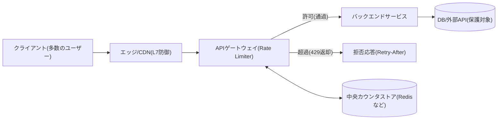

# レート制限（Rate Limiting）とトラフィック制御アルゴリズム

## 1. 概要

### A. 定義

> **レート制限（Rate Limiting）** とは、特定の時間枠（window）内でクライアント・API・リソースが実行できるリクエスト数を事前に定義した上限（quota）で統制し、超過分を遅延・拒否・緩衝することで、システムの安定性と公平性を確保するトラフィック制御手法である。

レート制限は、「どれだけ速く、どれだけ多く」リクエストを許可するかを決定するフロー制御ポリシーである。
ネットワーク層の輻輳制御がエンドツーエンドの転送速度を調整するのとは異なり、レート制限は主にアプリケーション・API層で個々の呼び出し元を識別し、その呼び出し元のリクエスト頻度を規律するという点で関心事が異なる。
すなわち対象はパケットではなく論理的なリクエスト（HTTPリクエスト、RPC呼び出し、メッセージ）であり、識別基準はIP・APIキー・ユーザーアカウント・テナントのようにビジネス上意味のある主体である。

レート制限はしばしば「スロットリング（Throttling）」と混同されるが、性質が異なる。
広く見れば、レート制限は上限超過の有無を判定するポリシーであり、スロットリングは超過が確認されたときにリクエストをどう処理（拒否・遅延・キューイング）するかという実行方式である。
したがって、よく設計されたシステムは「上限の定義（Rate Limiting）」と「超過時の動作（Throttling）」を分離して設計し、超過時の応答としてHTTP `429 Too Many Requests` と `Retry-After` ヘッダを返すことが事実上の標準として定着している。

### B. 登場背景と必要性

現代のサービスは、公開API、オープンバンキング、マイデータ、生成AI APIのように外部へインターフェースを公開する形態へと進化した。
インターフェースが開かれた瞬間、サービスは善意の大量呼び出しと悪意ある濫用に同時に直面する。
例えば、誤って実装されたクライアントがリトライループに陥って毎秒数千件を呼び出したり、クレデンシャルスタッフィング攻撃がログインAPIを毎秒数万件叩いたりすると、正常なユーザーにまで影響するサービス劣化が発生する。
レート制限は、こうした状況で「一人の過剰なユーザーが全体のリソースを独占できないように」隔壁を設ける最小限の防御線である。

第二の必要性は、コストとリソースの有限性にある。
クラウド環境でオートスケーリングが負荷を吸収してくれるとしても、スケーリングには遅延とコストが伴う。
特に生成AIの推論や決済・精算のように呼び出しあたりのコストが大きいバックエンドは無制限に拡張できないため、リクエストの流入段階で上限を設けてダウンストリームを保護しなければならない。
このときレート制限は、サーキットブレーカー・バルクヘッドとともに「負荷遮断（Load Shedding）」を実装する中核手段となる。

第三の必要性は、公平性と収益化である。
SaaS・APIビジネスは、Free・Pro・Enterpriseのように料金プランごとに異なる呼び出し上限を付与することでサービスグレードを差別化する。
例えば、ある商用LLM APIは料金ティアに応じて1分あたりリクエスト数（RPM）と1分あたりトークン数（TPM）を併せて制限しており、これはレート制限が単なる防御を超えて課金・SLA・商品設計の軸となったことを示している。

### C. 適用目標

適用目標は、第一に可用性の保護（暴走・DDoS・リトライストームからのバックエンド防御）、第二に公平なリソース配分（テナント・ユーザー間の分離）、第三にコスト統制（ダウンストリーム呼び出し量の上限）、第四に収益化・SLAの履行（グレード別の差別化上限）、第五に濫用・異常行為検知のための一次シグナルの提供である。
これら五つの目標は互いに相反し得るため、後述するアルゴリズムの選択と分散実装方式は、どの目標を優先するかによって変わる。

## 2. 全体構造と配置位置

レート制限器は、リクエスト経路のどこに配置するかによって精度・性能・運用の複雑さが変わる。
以下の概念図は、クライアントからバックエンドに至るリクエスト経路上で、レート制限がどの地点で介入するかを示している。

最も一般的な配置は **APIゲートウェイ・リバースプロキシ** 層である。
この地点はすべてのリクエストが必ず通過する関門であるため、認証直後に呼び出し元を識別した状態で上限を適用しやすい。
ゲートウェイは複数のバックエンドへ分岐する前にリクエストをふるい分けるため、ダウンストリーム全体を一度に保護できるという利点がある。
一方で、各バックエンドが持つ個別のリソース特性（例: 特定の重いエンドポイント）まで細かく反映することは難しいという限界があるため、ゲートウェイのグローバル上限とサービス内部のローカル上限を階層的に組み合わせる設計が実務でよく用いられる。

第二の配置は **アプリケーションミドルウェア** 層である。
サービスコード内でエンドポイント・機能単位に上限をかけられるため、「決済リクエストは1分あたり5回、照会は1分あたり300回」のようにドメイン特性に合わせた精密な制御が可能である。
ただし、サービスインスタンスが複数台に拡張されると、各インスタンスのローカルカウンタをどう合算するかという分散の問題が生じる。

第三の配置は **エッジ/CDN** 層である。
CDN・WAFレベルでIP・地域・ボットシグナルに基づき大量トラフィックを早期に遮断すれば、オリジンに到達する前にコストを削減し、階層的防御（Defense in Depth）を構成できる。
精度は低いが、最も安価かつ高速な一次防御線の役割を果たす。

## 3. レート制限アルゴリズム

アルゴリズムは「時間とカウントをどう数えるか」によって区別され、それぞれ精度・バースト許容・メモリ・実装難度のトレードオフが異なる。
以下の詳細アーキテクチャ図は、代表的な四つのアルゴリズムの動作原理を対比している。

### A. トークンバケット（Token Bucket）

トークンバケットは、一定の速度（refill rate）でトークンがバケットに補充され、リクエストは処理時にトークンを一つ消費し、トークンがなければ拒否される方式である。
バケットには最大容量（capacity）があり、それ以上トークンは蓄積されない。
この構造の核心的な長所は **バースト（瞬間的な急増）の許容** である。
平常時にリクエストが少なくトークンが容量いっぱいまで溜まっていれば、突然集中したリクエストを一度に処理できる。
例えば、容量100、補充速度毎秒10個のバケットは、平均的には毎秒10件を維持しつつ、アイドル時間に蓄積された100個のトークンで瞬間的に100件まで吸収する。
したがって、ユーザー体感が重要な対話型API（検索・オートコンプリート）に適しており、実際に多くのAPIゲートウェイやクラウドAPIがデフォルトアルゴリズムとして採用している。
短所は、容量と速度という二つのパラメータを併せてチューニングする必要があり、バーストを過度に許容するとダウンストリームが瞬間的な負荷を受け得るという点である。

### B. リーキーバケット（Leaky Bucket）

リーキーバケットは、リクエストをキュー（バケット）に入れ、**一定の速度でのみ取り出して処理（流出）** し、キューが満杯になるとそれ以降のリクエストを破棄する方式である。
トークンバケットが「許容量を事前に積み立てる」発想であるとすれば、リーキーバケットは「出力速度を平坦に固定する」発想である。
したがって出力トラフィックが滑らかに整形（traffic shaping）され、後段が一定の処理率を要求する場合（例: 毎秒決まった件数しか受け付けない外部決済網、メッセージブローカーのコンシューマー）に有利である。
逆にバーストを吸収できないため、アイドル後に集中した正常なリクエストもキュー遅延を受けたり破棄されたりする可能性があり、対話型サービスにはあまり適さない。
実装上、リーキーバケットは事実上、固定容量のFIFOキュー + 定速コンシューマーとして実現され、遅延が蓄積すると応答時間が延びるというトレードオフがある。

### C. 固定ウィンドウカウンタ（Fixed Window Counter）

固定ウィンドウは、「毎分0秒〜59秒」のように境界が固定された時間枠ごとにカウンタを置き、枠が切り替わると0に初期化する最も単純な方式である。
メモリはカウンタ一つで足りるため極めて軽量で、実装も容易である。
しかし **境界バースト（boundary burst）** という致命的な弱点がある。
上限が1分あたり100件のとき、あるユーザーが12:00:59に100件、12:01:00に再び100件を送ると、1秒余りの区間に200件が通過する。
すなわち枠の境界で瞬間的に上限の2倍まで許容され得るため、厳密な上限が必要な決済・認証のような機微なエンドポイントには不適切である。

### D. スライディングウィンドウ（Sliding Window）

スライディングウィンドウは、固定ウィンドウの境界問題を解決するため「現在時刻を基準とした直近N秒」を連続的に評価する。
精密な形態である **スライディングウィンドウログ** は、各リクエストのタイムスタンプを保存し、判定時に直近N秒に属するログの数を数える。
正確であるが、リクエストごとにタイムスタンプを保持しなければならないためメモリ消費が大きい。
実務で広く使われる折衷案である **スライディングウィンドウカウンタ** は、現在の枠と直前の枠のカウンタを加重平均して近似する。
例えば、現在の枠の経過比率が30%であれば `直前枠_カウント × 0.7 + 現在枠_カウント` で推定し、メモリはカウンタ二つで維持しながら境界バーストを大幅に緩和する。
精度とリソースのバランスが良く、大規模トラフィックを扱うCDN・APIゲートウェイが好んで採用している。

以下の表は、四つのアルゴリズムの特性を比較したものである。
表は要約を補助するためのものであり、選択の根拠は上記本文のトレードオフの説明にある。

| アルゴリズム | バースト許容 | 精度 | メモリ | 代表的用途 |
|---|---|---|---|---|
| トークンバケット | 高い（積立分） | 中 | 低い | 対話型API、ゲートウェイのデフォルト |
| リーキーバケット | 低い（平坦化） | 中 | 中 | トラフィックシェーピング、定速消費 |
| 固定ウィンドウ | 境界で過剰 | 低い | 非常に低い | 単純・低リスクの制限 |
| スライディングウィンドウ | 低い | 高い | 中 | 精密な制限、大規模API |

## 4. 分散環境での実装

サービスインスタンスが数十台に拡張されると、「上限はグローバルなのにカウンタは分散している」という根本的な問題が生じる。
各インスタンスがローカルカウンタのみを使うとインスタンス数の分だけ上限が膨らみ、逆に毎リクエストを中央ストアに問い合わせると遅延と負荷が大きくなる。
したがって分散レート制限は、精度と性能の間の折衷設計である。

最も一般的な実装は **中央ストア（Redis）** にカウンタを置く方式である。
Redisのアトミックなコマンド（`INCR`、`EXPIRE`）やLuaスクリプトで「増加と有効期限設定を一度に」処理して競合をなくし、複数のインスタンスが同一のキー（例: `rate:user:1234:minute`）を共有してグローバル上限を強制する。
正確であるが、ストアが単一障害点となり得るため、ストア障害時にリクエストを遮断するか（fail-closed）通過させるか（fail-open）をポリシーとして定めておく必要がある。
可用性が最優先のサービスはしばしばfail-openを選ぶが、認証・決済のように濫用リスクの大きい経路はfail-closedとする。

性能が重要であれば **ローカル近似 + 定期同期** を用いる。
各インスタンスがローカルで高速に判定し、バックグラウンドで使用量を中央へ報告・調整する方式であり、多少の超過を許容する代わりに低遅延を得る。
精密なグローバル上限が不要で、おおまかな保護で十分な場合に適している。

ここで留意すべき実務上のポイントは、レート制限の状態をクライアントに透明に通知することである。
`X-RateLimit-Limit`、`X-RateLimit-Remaining`、`X-RateLimit-Reset` ヘッダで残りの上限を公開し、超過時に `429` と `Retry-After` を返せば、クライアントが指数バックオフで協調できるため、リトライストームを予防できる。

## 5. 深化 — 標準化動向と実務適用事例

レート制限は長らくベンダーごとにヘッダ名や応答形式がばらばらであったため、クライアントの相互運用性が低かった。
これを改善するため、IETFはレート制限情報を標準ヘッダとして公開する仕様（`RateLimit`/`RateLimit-Policy` 系）の標準化作業を進めてきたが、詳細なフィールドは改訂中であるため、実装時には最新のドラフトを確認することが望ましい。
標準化の趣旨は、異なるサービスが同一の形式で残り上限・リセット時刻を通知し、SDKやゲートウェイが一貫してバックオフを行えるようにすることにある。

実務事例としては、第一に公開APIプラットフォームのティア制課金が挙げられる。
クラウド・SaaS事業者は料金プランごとに毎秒・毎分の呼び出し上限を付与し、超過時には429を返すか、追加課金（バーストクレジット）で柔軟に対応する。
第二に、生成AI APIはリクエスト数上限（RPM）とトークン数上限（TPM）を二重に適用する。
同じリクエスト数でもプロンプトの長さによって実際の計算コストが大きく変わるため、リソース消費の実際の単位（トークン）に上限をかけることが合理的であることを示す事例である。
第三に、ログイン・OTP・パスワードリセットのような認証エンドポイントは、IP・アカウントごとに細かいスライディングウィンドウ制限をかけてクレデンシャルスタッフィング・総当たり攻撃を遅らせるが、これはレート制限がセキュリティ統制と直接接する地点である。

今後の方向性としては、静的な上限から **適応型（adaptive）レート制限** への転換が注目される。
バックエンドのリアルタイムな遅延・エラー率・キュー長といった負荷シグナルを観測して上限を動的に調整する方式であり、サーキットブレーカー・負荷遮断・オートスケーリングと組み合わせて、システム自らが安定点を見つけられるようにする。
定率の固定上限よりもリソース利用率を高められるが、制御ループが不安定だと振動（oscillation）が発生し得るため、オブザーバビリティと慎重なチューニングが前提となる。

## 6. 考慮事項および示唆

- **制限対象とキー設計の精密さ**: IP基準はNAT・プロキシの背後にいる多数のユーザーを一まとめにして誤検知を招き、ユーザー・APIキー基準は認証後にしか適用できない。したがって、未認証区間はIP・デバイスフィンガープリントで、認証区間はアカウント・テナントキーで階層化し、エンドポイントの機微度別（照会 vs 決済）に異なる上限を設ける多次元のキー設計が必要である。
- **アルゴリズム・配置のトレードオフの整合**: バースト許容が必要な対話型トラフィックにはトークンバケット、定速処理が必要なダウンストリームにはリーキーバケット、厳密な上限が必要な機微なAPIにはスライディングウィンドウが適している。グローバルな保護はゲートウェイ、精密な制御はサービス内部に分けて、階層的に組み合わせるべきである。
- **障害ポリシー（fail-open vs fail-closed）の明示**: カウンタストアの障害時に何を優先するかを事前に決定しておく必要がある。可用性優先のサービスはfail-open、濫用・コストリスクの大きい経路はfail-closedとし、いずれの場合もアラートとフォールバック（ローカル近似制限）を併せて用意する。
- **オブザーバビリティと濫用検知の連携**: 429発生率、上限に近いユーザー、キー別の消費分布を指標化すれば、キャパシティプランニングと異常行為検知に活用できる。レート制限のログはSIEM・異常検知の有意な入力となり、単なる防御を超えてセキュリティ・運用のシグナル源として機能する。
- **レジリエンスパターンとの結合**: レート制限は単独では完結しない。サーキットブレーカー（障害伝播の遮断）、バルクヘッド（リソース分離）、リトライ・指数バックオフ（協調的リトライ）、負荷遮断（優先度の低いリクエストを優先的に破棄）とともに設計して初めて、暴走と障害に耐えるシステムとなる。

## 参考資料

- IETF, "RateLimit header fields for HTTP" (draft), https://datatracker.ietf.org/doc/draft-ietf-httpapi-ratelimit-headers/
- MDN Web Docs, "429 Too Many Requests", https://developer.mozilla.org/en-US/docs/Web/HTTP/Status/429
- Cloudflare, "What is rate limiting?", https://www.cloudflare.com/learning/bots/what-is-rate-limiting/

---
> **一言まとめ**: レート制限は時間枠内のリクエスト数を上限で統制するトラフィック制御手法であり、トークンバケット・リーキーバケット・固定/スライディングウィンドウのアルゴリズムを状況に応じて選択し、ゲートウェイ・中央ストアで分散実装することで、可用性・公平性・コスト・セキュリティを同時に確保する。
