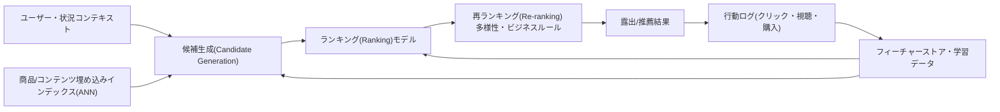
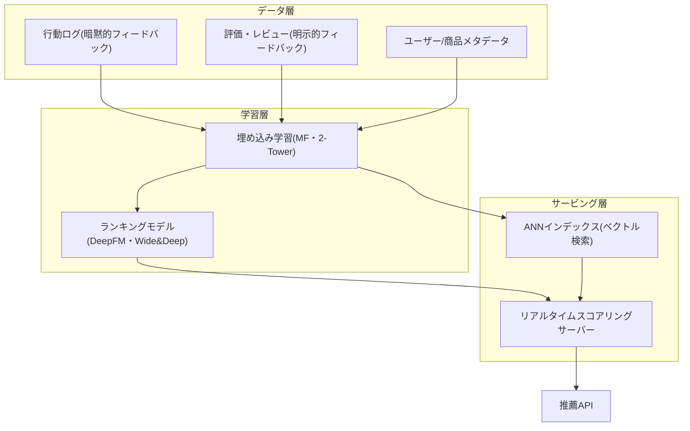

# 推薦システム（Recommendation System）

## 1. 概要

> **定義**: 推薦システムとは、ユーザー・商品・状況に関するデータを学習し、特定のユーザーがまだ接していない項目のうち、好む可能性が高い項目を予測・順位付けして提示する情報フィルタリングシステムである。

情報が爆発的に増加するにつれ、ユーザーが選択肢を一つひとつ探索するコストは負担しきれない水準となった。数千万の商品、数億の動画、無限に更新される投稿を前にして、検索だけでは「何を求めているのかまだわからない」潜在需要を満たすことはできない。推薦システムはこの **情報過多（Information Overload）** 問題を、ユーザーに代わって候補を絞り込むことで解決し、今日ではコマース・メディア・広告・金融の中核的な収益エンジンとなっている。

推薦がビジネス上重要である理由は、消費の偏在構造にある。実店舗は陳列スペースの制約から少数の人気商品しか扱えないが、オンラインは保管・流通コストが低いため、販売量の少ない多数の商品（ロングテール、Long Tail）の合計が相当な売上を形成する。推薦システムはパーソナライゼーションによってこのロングテールを発掘し、多様性と売上を同時に引き上げる。実際にNetflixは視聴の相当部分が推薦に由来すると明らかにしており、Amazonについても売上の大きな割合が推薦に基づく露出と関連しているという分析が繰り返し引用されている。

推薦は検索と対比すると性格がより明確になる。検索はユーザーがクエリ（Query）で意図を明示的に表現する **プル（Pull）** 方式であるのに対し、推薦はユーザーが明示的に要求しなくても文脈と履歴から意図を推定して先に提示する **プッシュ（Push）** 方式である。したがって推薦は「何を求めているのかまだわからない」潜在需要までを狙い、クエリが存在しないため、ユーザーの過去の行動・状況（時間・デバイス・位置）が事実上クエリの役割を代わりに果たす。

技術士の観点から見ると、推薦システムは単なる機械学習モデルではなく、**データ収集（ログ）–候補生成–ランキング–露出–フィードバック** が循環する一つの情報パイプラインであり、サービスアーキテクチャである。精度さえ高ければよいのではなく、応答遅延（数十ms）、新規ユーザー・新規商品のコールドスタート、フィルターバブル・公平性といった社会的副作用、個人情報保護までを併せて設計しなければならないという点で、総合的な判断が求められる。

## 2. 推薦システムの全体構造とパイプライン

推薦システムを一つのアルゴリズムとして理解すると、実務の設計は難しくなる。現代の大規模推薦は、精度とレイテンシを折衷するため **多段階（Multi-stage）パイプライン** で構成される。数百万〜数億の全項目に対していきなり精巧なモデルを適用すると遅延とコストに耐えられないため、安価なモデルで候補を大きく絞り込んだのち、次第に精巧なモデルで絞り込んでいく。

**候補生成（Candidate Generation）** 段階では、全カタログから数百〜数千の候補を高速に抽出する。協調フィルタリング、埋め込みベースの近似最近傍探索（ANN, Approximate Nearest Neighbor）などが用いられ、精度よりも再現率（Recall）と速度が重要である。**ランキング（Ranking）** 段階では、これらの候補についてユーザーごとのクリック・コンバージョン確率を精密に予測して順位を付け、主にディープラーニングベースのCTR予測モデルが使用される。**再ランキング（Re-ranking）** 段階では、上位群に対して多様性・新鮮さ・重複除去・ビジネスルール（品切れ除外、広告挿入、公正な露出）を適用する。

このパイプラインが閉じたループを形成する地点が **フィードバックループ** である。露出された結果に対するユーザー行動（クリック・滞在・購入・離脱）が再びログとして蓄積され、次の学習の正解シグナルとなる。この循環はパーソナライゼーションを強化するが、システムがすでに露出した項目にのみフィードバックが蓄積される **露出バイアス（Exposure Bias）** を生み、フィルターバブルと人気への偏りを深刻化させ得るため、探索（Exploration）を意図的に混ぜる設計が必要である。

以下は、推薦パイプラインを支えるデータ・モデルの観点からアーキテクチャを整理したものである。

運用の観点では、学習・サービングの時間軸も設計対象となる。埋め込み・ランキングモデルの重い学習はバッチ（日/時間単位）で更新しつつ、直前に閲覧した商品・検索語・カートのような即時的なシグナルはリアルタイムフィーチャーとして反映してこそ、推薦が状況に敏感に反応する。このため、バッチとストリーミングを併用するラムダ/カッパ型のデータフローとオンラインフィーチャーストアが、推薦インフラの中核構成要素となる。

データ層で最も重要な区分は、**明示的フィードバック（Explicit Feedback）** と **暗黙的フィードバック（Implicit Feedback）** である。星評価・レビューのようにユーザーが直接表現した明示的シグナルは正確であるが疎であり、クリック・視聴時間・カート追加のような暗黙的シグナルは豊富であるがノイズが大きく、「否定（非選好）」シグナルが明確でない。実務では、データ量が圧倒的に多い暗黙的フィードバックを主に活用しつつ、未露出をそのまま非選好と断定しないよう、重み付け・サンプリングを慎重に設計する。

## 3. 推薦方式の類型

### A. コンテンツベースフィルタリング（Content-based Filtering）

コンテンツベースフィルタリングは、ユーザーが過去に好んだ項目の **属性（特徴）** と類似した項目を推薦する。例えば、ユーザーが「SF・クリストファー・ノーラン・2時間以上」の映画を好んで観ていたなら、同じ特徴ベクトルに近い別の映画を推薦するというものである。項目をTF-IDFや埋め込みでベクトル化し、ユーザープロファイルベクトルとのコサイン類似度で順位を付ける。

この方式の強みは、他のユーザーのデータがなくても動作する点である。したがって、新規項目が追加されても属性さえあれば即座に推薦対象となり得るため、**項目のコールドスタート** に強い。また、「なぜ推薦されたのか」を属性で説明しやすく、説明可能性が高い。

限界は明確である。ユーザーが消費してきた属性の範囲から抜け出しにくく推薦が狭くなる **過剰特化（Over-specialization）** が発生し、思いがけない発見（Serendipity）が不足する。また、属性抽出の品質に性能が大きく左右されるため、画像・映像のように属性タグ付けが難しいドメインでは別途の表現学習が必要となる。ニュース推薦において特定の政治的傾向の記事ばかりが表示され続ける現象が代表的な副作用である。

一つ留意すべき点は、コンテンツベース方式が「ユーザーのコールドスタート」までは解決できないということである。新規項目は属性さえあれば推薦候補になるが、新規ユーザーには選好属性を把握できる履歴がまだないため、プロファイルを作成できない。したがって、オンボーディングアンケートで初期の嗜好を収集するか、人気・トレンドベースの基本推薦から始め、インタラクションが蓄積されたら個人プロファイルへ切り替える段階的な設計を併用しなければならない。

### B. 協調フィルタリング（Collaborative Filtering）

協調フィルタリングは、項目の属性ではなく **ユーザー–項目インタラクション行列（評価/クリック）** そのもののパターンを利用する。「自分と嗜好が似ている人々が好んだものは自分も好むだろう」という集合知の仮定に基づいており、ドメインの属性を知らなくてもよい汎用性が最大の強みである。

メモリベース方式は、さらに **ユーザーベース（User-based）** と **アイテムベース（Item-based）** に分かれる。ユーザーベースは自分と類似した近傍ユーザーを探し、彼らが高く評価した項目を推薦し、アイテムベースは自分が好んだ項目と一緒に消費される項目を推薦する。Amazonが大規模サービスでアイテムベースを採用した理由は、ユーザー数よりも商品数の変動が少ないため類似度行列を事前に計算しておきやすく、スケーラビリティが良いためである。

類似度の計算にはコサイン類似度、ピアソン相関係数、ジャッカード係数などが用いられるが、どの尺度を選択するかが結果を左右する。評価のようにユーザーごとに甘い・辛いという傾向の差（評価バイアス）があるデータでは、ユーザー平均を補正するピアソン相関が有利であり、クリック・購入のような二値のインタラクションではジャッカード・コサインが適している。このように、データの性質と尺度の仮定が合致して初めて近傍が実際に「嗜好が似た」対象となる点が、メモリベース方式の核心的な設計ポイントである。

モデルベース方式の代表は **行列分解（Matrix Factorization, MF）** である。疎なユーザー–項目行列R(m×n)を、ユーザー潜在因子行列P(m×k)と項目潜在因子行列Q(n×k)の積で近似し、観測されていないセルの値を予測する。予測評価は二つの潜在ベクトルの内積 r̂ = pᵤ · qᵢ で計算し、k（潜在因子数）は通常数十〜数百次元である。2006〜2009年のNetflix PrizeでMF系の手法が優勝の鍵となったことで、このアプローチが業界標準として定着した。

行列分解の学習は、観測されたインタラクションに対する予測誤差の二乗和を最小化しつつ、過学習を防ぐために潜在ベクトルの大きさにペナルティを与える **正則化（L2）** 項を併せて置く。最適化には、誤差を少しずつ逆伝播させる確率的勾配降下法（SGD）と、PとQを交互に固定して閉形式解で更新する交互最小二乗法（ALS）が用いられ、ALSは並列化が容易なため分散環境の大規模な暗黙的フィードバックデータに適している。ここにユーザー・項目ごとの評価傾向を吸収するバイアス（bias）項と時間変化を反映する項を加えると予測品質が改善されるが、これは潜在因子だけでは説明できない系統的な偏差を分離してくれるためである。

ただし、協調フィルタリングはインタラクション履歴のない新規ユーザー・項目を扱えない **コールドスタート** と、人気項目への偏り、極端な疎性の問題を抱えている。実際のインタラクション行列は埋まっているセルが全体の1%にも満たないことが多く、疎性が深刻になるほど近傍・潜在因子の推定の信頼性が急激に低下するという点を、設計において常に考慮しなければならない。

### C. ハイブリッド（Hybrid）およびディープラーニングベース

コンテンツベースと協調フィルタリングは互いの弱点を補完するため、実際のサービスのほとんどは両方式を組み合わせた **ハイブリッド** で構成される。組み合わせ方式には、二つのモデルのスコアを加重和する重み付け型、状況に応じてモデルを切り替える切替型、一方のモデルの出力を他方のモデルの入力として使う特徴結合型などがある。例えば、新規ユーザーにはコンテンツベース・人気ベースで開始し、インタラクションが蓄積されたら協調フィルタリングの比重を高める切替戦略が、コールドスタートの緩和に効果的である。

ディープラーニングが協調フィルタリングを超えた根本的な理由は、表現力にある。行列分解はユーザー・項目の潜在ベクトルの線形な内積のみでインタラクションを説明するが、実際の選好は「20代 + 週末 + モバイル + 特定ジャンル」のように複数の特徴が非線形に結合するときに形成される。ニューラルネットワークはこうした高次の特徴インタラクションや、テキスト・画像のような非構造化コンテンツ、行動の順序までを一つの表現として学習できるため、精度とコールドスタートへの対応を同時に引き上げる。

最近ではディープラーニングが主流となった。**2-Tower（Two-Tower）モデル** はユーザータワーと項目タワーをそれぞれ埋め込みとして学習し、その内積で関連度を計算するもので、項目埋め込みを事前にANNインデックスに格納しておけば、大規模な候補生成を数十msで処理できる。ランキング段階では、Wide&Deep、DeepFMのように低次・高次の特徴インタラクションを併せて学習するCTR予測モデルが広く用いられる。ユーザー行動をシーケンスとして捉え、Transformerで次の消費を予測する **シーケンシャル推薦（Sequential Recommendation、例: SASRec・BERT4Rec）**、ユーザー–項目関係をグラフとしてモデル化する **グラフニューラルネットワーク（GNN）推薦** も活発である。さらに、LLMを活用して商品説明・レビューの意味を反映したり、自然言語で推薦理由を生成したりする生成型推薦が新たな潮流として浮上している。

次の表は、三つの方式の核心的な違いを、単なる列挙ではなく強み・弱みが生じる根本的な理由とともに整理したものである。

| 区分 | 根拠データ | コールドスタート | 強み（理由） | 弱み（理由） |
|------|------------|------------|-----------|-----------|
| コンテンツベース | 項目属性 + 個人履歴 | 項目に強い | 新規項目を即時推薦、説明が容易（属性ベース） | 過剰特化・発見性の不足（履歴の範囲に閉じ込められる） |
| 協調フィルタリング | ユーザー–項目インタラクション | 新規ユーザー・項目に弱い | ドメイン非依存・思いがけない発見（集団パターン） | 疎性・コールドスタート・人気偏重（履歴依存） |
| ハイブリッド/ディープラーニング | インタラクション + 属性 + シーケンス | 相対的に強い | 精度・スケーラビリティ・パーソナライゼーションの最大化 | 複雑さ・コスト・解釈難度の増大 |

## 4. 評価と比較 — 精度を超えて

推薦システムの評価は二つの軸で行われる。**オフライン評価** は、過去のログを学習/検証に分割して指標を計算する。評価予測にはRMSE・MAEを、順位品質にはPrecision@K・Recall@K・MAP・NDCG（順位の位置に重みを置く指標）を用いる。例えば、上位5件の推薦のうち実際のクリックが2件であればPrecision@5は0.4である。しかし、オフライン指標が高いからといって実際の売上・満足度が向上する保証はないため、**オンラインA/Bテスト** でクリック率（CTR）・コンバージョン率（CVR）・滞在時間・再訪問などのビジネス指標を必ず検証する。オフラインで優れていたモデルがオンラインで劣ることは珍しくないが、これは露出バイアスとフィードバックループのために、過去のログが将来の露出分布を代表できないためである。

特に暗黙的フィードバックしかないサービスでは、正解（非選好）の定義そのものが曖昧である点が評価を難しくする。露出されたがクリックされなかった項目を「非選好」とみなすか、単に「まだ見ていないもの」とみなすかによって、学習・評価が大きく変わる。そのため実務では、順位ベースの指標（NDCG・MAP）とともに、露出ログを活用した反実仮想（counterfactual）評価やオンライン実験を併用し、オフライン指標の錯覚を補正する。

精度だけを追求するとかえってサービスが悪化し得るという点が、推薦評価の核心的な洞察である。購入することが明らかな商品ばかり推薦すると、指標は良くてもユーザーに新たな価値を提供できない。そのため **多様性（Diversity）、新規性（Novelty）、思いがけない発見（Serendipity）、カバレッジ（Coverage）** を併せて管理する。YouTubeが視聴時間中心の最適化によって刺激的・極端なコンテンツへの偏りという論争を経験した事例は、単一指標の最適化がいかに社会的副作用につながるかを示している。その後、業界は「責任ある推薦」のために、満足度アンケート・多様性制約・健全性シグナルを目的関数に併せて反映する方向へと移行した。

## 5. 深化 — 最新動向と実務適用

推薦技術は三つの方向で急速に進化している。第一に、**生成型・対話型推薦** である。LLMが商品レビュー・説明の意味とユーザーの自然言語による要求（「静かな雰囲気のコスパの良いノートPC」）を理解して候補を生成し、推薦理由を文章で説明する。これはコールドスタートの緩和と説明可能性の向上に有利であるが、ハルシネーション（存在しない商品の推薦）と遅延・コストの問題を統制しなければならない。

第二に、**プライバシー保護推薦** である。個人のインタラクションデータが非常にセンシティブになるにつれ、元のログを中央に集めずに端末で学習する **連合学習（Federated Learning）** と、統計的な保護を提供する **差分プライバシー（Differential Privacy）** を組み合わせたオンデバイス推薦が広がっている。GDPR・個人情報保護法とプロファイリング規制、サードパーティCookie廃止の流れがこれを加速している。

第三に、**バイアス・公平性の緩和と因果推薦** である。露出バイアスを補正するための傾向スコア（IPS, Inverse Propensity Scoring）ベースの不偏学習、人気偏重を減らす再ランキング、販売者・クリエイター間の露出の公平性を保証する制約付き最適化が研究・適用されている。実務事例として、Spotifyの「Discover Weekly」は、協調フィルタリング・オーディオコンテンツ分析・自然言語処理（プレイリスト・レビューテキスト）を組み合わせたハイブリッドで毎週パーソナライズされたプレイリストを生成し、発見性と滞在を同時に引き上げた代表的な成功事例とされる。韓国のNaver・Kakao・Coupangなども、多段階パイプラインの上にディープラーニングによるランキングとリアルタイムフィーチャーストアを組み合わせて、コマース・コンテンツ推薦を運用している。

韓国国内の公共・産業の現場でも推薦は広がっている。電子政府・公共ポータルのカスタマイズされたサービス案内、図書館の図書推薦、教育プラットフォームの学習経路推薦、ヘルスケアのコンテンツ推薦のように、パーソナライゼーションが利用者の便益を大きく高める領域が増えている。ただし、公共領域ではバイアス・差別の防止と説明責任、個人情報の最小収集が民間よりも厳格に求められるため、精度の最大化よりも公平性・透明性・安全性を優先する目的関数の設計が必要である。

予想される出題方向としては、▲協調フィルタリングとコンテンツベースの比較およびハイブリッド設計 ▲コールドスタートの解決策 ▲行列分解の原理とディープラーニング推薦への発展 ▲フィルターバブル・公平性など推薦の社会的問題とその対応、が繰り返し扱われ得る。答案構成時には「精度–多様性–公平性–プライバシー」のトレードオフを軸に据え、多段階パイプラインの観点から記述すると、深化答案としての完成度が高まる。

## 6. 考慮事項および示唆

- **コールドスタート戦略の二元化**: 新規ユーザーには人気・トレンド・オンボーディングアンケート・コンテンツベースで開始し、新規項目にはメタデータ埋め込みと少量露出による探索を併用する。インタラクションが蓄積される時点を基準に、協調フィルタリング・ディープラーニングの比重を段階的に切り替えるハイブリッド設計が実務の標準である。

- **探索–活用（Exploration–Exploitation）のバランス**: 確実に好まれる項目だけを露出（活用）すると、フィルターバブルと人気偏重が深刻化し、データの多様性が枯渇する。多腕バンディット・ε-greedy・Thompson Samplingなどで一定比率の探索を混ぜ、長期的な満足とデータの健全性を確保しなければならない。

- **性能・コスト・遅延の折衷**: リアルタイム推薦は数十ms以内の応答が求められるため、精巧なモデルを全量に適用するよりも、候補生成–ランキング–再ランキングの多段階で計算を配分する。埋め込みの事前計算・ANNインデックス・フィーチャーストア・キャッシュによって、遅延とインフラコストを併せて管理する。

- **公平性・透明性・規制への対応**: 推薦は世論・消費・機会の分配に影響を及ぼすため、露出バイアスの補正、クリエイター・販売者の公正な露出、推薦理由の説明（説明可能性）、プロファイリング拒否権の保障が必要である。個人情報保護法・GDPRとEUデジタルサービス法（DSA）の推薦透明性の要求を、設計段階から反映しなければならない。

- **関連技術との統合**: 推薦は、ベクトルデータベース（ANN）、フィーチャーストア、MLOps/LLMOps、リアルタイムストリーミング（CDC・Kafka）、データガバナンスと密接に結び付いている。モデルドリフトの監視とオンラインA/B実験の体制を整えてこそ、継続的に品質を維持できる。

## 参考資料

- Netflix TechBlog, "Netflix Recommendations: Beyond the 5 stars" — https://netflixtechblog.com/netflix-recommendations-beyond-the-5-stars-part-1-55838468f429
- Google Developers, "Recommendation Systems (ML Crash Course)" — https://developers.google.com/machine-learning/recommendation
- Covington et al., "Deep Neural Networks for YouTube Recommendations" (RecSys 2016) — https://research.google/pubs/pub45530/
- Wikipedia, "Recommender system" — https://en.wikipedia.org/wiki/Recommender_system

---

> **一言まとめ**: 推薦システムは情報過多のなかでユーザーが好む項目を予測・順位付けする情報フィルタリングシステムであり、コンテンツベース・協調フィルタリング・ハイブリッド（ディープラーニング）を候補生成–ランキング–再ランキングの多段階パイプラインで組み合わせ、精度だけでなく多様性・公平性・プライバシー・遅延までを併せて設計しなければならない。
