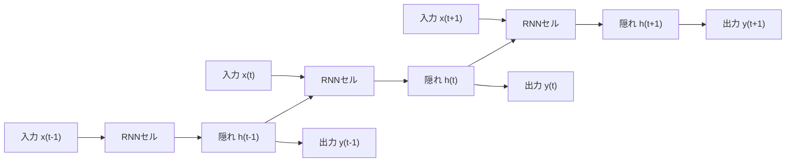
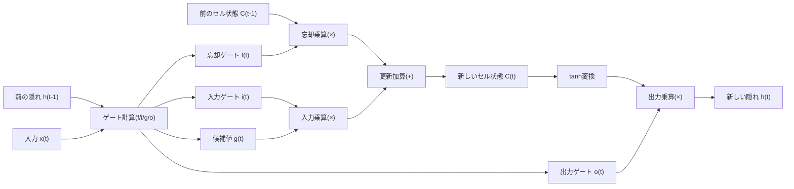

# 再帰型ニューラルネットワーク（RNN）とLSTM・GRU

## 1. 概要

### A. 定義

> **再帰型ニューラルネットワーク（RNN, Recurrent Neural Network）** とは、隠れ状態（Hidden State）を時間軸に沿って次の時点へ受け渡す **再帰結合（Recurrent Connection）** を設けることで、可変長の系列（Sequence）データを処理するように設計されたニューラルネットワークである。すなわち、現在の出力が現在の入力だけでなく **過去の入力の累積的な要約（文脈）** にも依存するようにした構造である。

全結合ニューラルネットワーク（FFNN）や畳み込みニューラルネットワーク（CNN）は、各入力を互いに独立した固定サイズのベクトルとみなす。しかし、言語・音声・株価・センサーログのように **順序そのものが意味を規定するデータ** では、「これまでに何があったか」が次の値を決定する。「私はご飯を___」という文の空欄を埋めるには先行する単語の文脈が必要であり、心電図波形の異常判定には直前数秒のリズムが必要である。RNNの核心的な洞察は、「**系列を一度に見る代わりに一時点ずつ読み進め、それまでに見たものを隠れ状態というメモリに圧縮して更新し続ける**」ことにある。この隠れ状態こそが、ネットワークの短期記憶（working memory）の役割を果たす。

### B. 登場背景と必要性

FFNN・CNNを系列データに適用すると、二つの根本的な限界が現れる。第一は **可変長処理の困難さ** である。文は3単語のこともあれば300単語のこともあるが、全結合層は固定サイズの入力しか受け付けない。無理に最大長に合わせてパディングすれば計算が無駄になり、切り詰めれば情報が失われる。第二は **パラメータ共有と順序情報の欠如** である。入力を単に連結（concatenate）すると、同じ単語でも位置が変わるだけでまったく異なる重みで処理されるため、「パターンはどこに現れても同一である」という時系列の本質を学習できない。

RNNは **すべての時点で同一の重みセットを再利用する** ことで、この二つの問題を同時に解決する。時点の数だけ同じセルを繰り返し適用するため、長さに関係なく一つのパラメータセットで任意長の系列を処理でき、時間に伴うパターンを位置に依存せず汎化する。こうした特性により、RNN系は2010年代前半から中盤にかけて機械翻訳・音声認識・手書き文字認識の事実上の標準となり、現在のTransformerが登場するまで系列モデリングの主流を占めた。Transformerの時代にあっても、オンデバイス音声認識、リアルタイムストリーミング処理、低遅延の組込み推論など、**状態を逐次的に保持しなければならない領域** では依然として実務上の価値が大きい。

| 区分 | FFNN/CNN | 再帰型ニューラルネットワーク（RNN） |
|---|---|---|
| 入力 | 固定サイズ、独立 | 可変長系列、時点間の依存 |
| メモリ | なし（ステートレス） | 隠れ状態で過去の文脈を保持 |
| パラメータ | 層ごとに別個 | 時点間で共有（展開時に反復） |
| 代表的タスク | 画像分類・回帰 | 翻訳・音声認識・時系列予測 |
| 代表的限界 | 順序を表現できない | 長期依存性・勾配消失 |

## 2. 全体構造と動作原理

RNNは、一つのセルを時間軸に沿って「展開（unfold）」してみると理解しやすい。以下の図は、隠れ状態 $h_t$ が前時点の $h_{t-1}$ と現在の入力 $x_t$ から計算されて次の時点へ受け渡される再帰構造と、それを時間軸に沿って展開した様子を併せて示している。

活性化関数としてシグモイドの代わりに $\tanh$ を用いる理由も、この構造に由来する。$\tanh$ は出力が $[-1, 1]$ で0を中心に対称であるため、隠れ状態の値が一方に偏って飽和するのを遅らせ、シグモイドよりも勾配が大きいため学習シグナルが比較的よく伝播する。それでも、反復乗算の構造そのものが消失を引き起こすため、根本的な解決策とはならない。

基本（Vanilla）RNNの順伝播は、次の漸化式で定義される。隠れ状態は $h_t = \tanh(W_{xh} x_t + W_{hh} h_{t-1} + b_h)$ で更新され、出力は $y_t = W_{hy} h_t + b_y$ で算出される。ここで重要なのは、**重み $W_{xh}, W_{hh}, W_{hy}$ がすべての時点で共有される** という点である。隠れ状態 $h_t$ は時点 $t$ までに観測した入力の非線形な要約であり、この要約が次のセルへ再帰的に流れることで文脈が蓄積される。

学習は **通時的誤差逆伝播法（BPTT, Backpropagation Through Time）** によって行われる。系列を時間軸に沿って展開すると非常に深いフィードフォワードネットワークと同型になるため、損失の勾配を最後の時点から最初の時点まで時間をさかのぼって伝播させ、共有重みの勾配を各時点の寄与分として累積する。長い系列では展開の深さが大きくなり計算・メモリの負担が大きいため、実務では一定の長さごとに区切って逆伝播する **打ち切りBPTT（Truncated BPTT）** を用いる。

### A. 勾配消失・爆発問題

基本RNNの致命的な弱点は、**長期依存性（Long-Term Dependency）の学習失敗** である。BPTTでは、勾配が時間軸をさかのぼるたびに再帰重み $W_{hh}$ と活性化関数の微分値が繰り返し乗算される。この積のスペクトル半径が1より小さいと勾配が指数関数的に0へ収束し（**勾配消失, Vanishing Gradient**）、遠い過去の情報が学習に反映されなくなり、1より大きいと指数関数的に発散して（**勾配爆発, Exploding Gradient**）学習が不安定になる。

実務上の含意は明確である。「彼はフランスで育った … （数十語） … だから彼は流暢な___を話す」において空欄（フランス語）を当てるには数十時点前の情報を記憶する必要があるが、基本RNNはおおよそ10時点を超えると前の文脈を事実上忘れてしまう。勾配爆発は勾配クリッピング（Gradient Clipping）で比較的容易に緩和できるが、勾配消失は構造そのものを変えなければ解決できず、これがLSTM・GRUが登場した直接的な動機である。

### B. 系列の入出力類型

RNNは、入力・出力系列の対応関係に応じてさまざまな形態で活用される。**多対一（Many-to-One）** は文全体を読んで感情（肯定/否定）を一つ出力する感情分析に、**一対多（One-to-Many）** は画像1枚から説明文を生成する画像キャプション生成に、**多対多同期型（Many-to-Many、同一長）** は各単語に品詞を付与する固有表現認識に用いられる。特に、入力をまずすべて読んで文脈ベクトルに圧縮したのち出力系列を生成する **エンコーダ-デコーダ（Seq2Seq）** 構造は機械翻訳の基盤となり、ここにアテンション（Attention）が加わることでTransformerへと発展する架け橋となった。

こうした類型の区分は、答案作成時に「**問題の入出力が何対何か**」をまず規定し、それに合った損失関数・デコーディング方式を論じる枠組みを提供する。例えば、多対一の分類は最終時点の隠れ状態のみを分類器に接続して交差エントロピーで学習するが、Seq2Seqによる生成は各時点のソフトマックス出力を前の出力に条件付け（teacher forcing）して学習し、推論時にはビームサーチ（Beam Search）でデコーディングする。同じRNNセルであってもタスクの類型によって学習・推論のパイプラインが異なることを理解するのが、実務設計の出発点である。

### C. 深層RNNと双方向RNN

表現力を高めるために隠れ層を垂直に積み重ねた **深層（Stacked）RNN** は、下位層が低水準（音素・文字）の特徴を、上位層が高水準（単語・構文）の抽象を学習するよう階層的な表現を形成する。ただし、層が深くなるほど学習の難度と演算量が増すため、残差接続・層正規化が併用される。一方、**双方向（Bidirectional）RNN** は順方向と逆方向の二つのRNNを並列に配置し、各時点で過去と未来の文脈を同時に活用する。固有表現認識・品詞タグ付けのように文全体がすでに与えられているオフラインのタスクでは精度を大きく高めるが、未来の入力が必要となるため、リアルタイムストリーミング処理とは構造的に相容れないというトレードオフがある。

## 3. LSTMとGRU — ゲート機構

### A. LSTM（Long Short-Term Memory）

LSTMは勾配消失を解決するため、**セル状態（Cell State）$C_t$ という別個の情報ハイウェイ** と、その上で情報を選択的に消去・追加・出力する **三つのゲート** を導入する。ゲートはシグモイド（0〜1）で各要素の通過比率を決定するバルブである。以下の図は、一つのLSTMセル内部のデータフローを示している。

動作原理を順に見ると次のとおりである。第一に、**忘却ゲート（Forget Gate）$f_t = \sigma(W_f[h_{t-1}, x_t] + b_f)$** は、前のセル状態から何を捨てるかを決定する。例えば、文中で主語の性別が新しい主語に変われば、以前の性別情報を忘れる。第二に、**入力ゲート（Input Gate）$i_t$** とtanhで作られた **候補値 $\tilde{C}_t$** が結合して新たに記憶する情報を決め、セル状態は $C_t = f_t \odot C_{t-1} + i_t \odot \tilde{C}_t$ で更新される。第三に、**出力ゲート（Output Gate）$o_t$** が更新されたセル状態のうち今回の時点で出力する部分を選び、$h_t = o_t \odot \tanh(C_t)$ で隠れ状態を作る。

LSTMには、ゲート計算にセル状態を直接参照させるのぞき穴（Peephole）結合、忘却・入力ゲートを一つにまとめる結合型（coupled）変形など多くの変種があるが、実務では標準の3ゲート構造が安定性と性能のバランスに最も優れているため、デフォルトとして用いられる。

LSTMが長期依存性を学習できる決定的な理由は、セル状態の更新式が **乗算ではなく加算（$+$）中心** だからである。セル状態に沿って勾配が流れるとき、忘却ゲートが1に近ければ勾配はほとんど減衰せずに伝播し、数百時点前の情報にまで学習シグナルが到達する。この「定誤差カルーセル（Constant Error Carousel）」構造が、勾配消失を根本的に緩和する。実際にGoogleは2016年、GNMT（Google Neural Machine Translation）に8層のLSTMエンコーダ・デコーダを適用し、翻訳誤りを従来の統計ベース（PBMT）比で約60%低減したと報告している。

### B. GRU（Gated Recurrent Unit）

GRUは2014年にチョ・ギョンヒョン（Kyunghyun Cho）教授らが提案したLSTMの軽量化変形であり、**セル状態と隠れ状態を一つに統合** し、ゲートを **リセットゲート（Reset Gate）$r_t$** と **更新ゲート（Update Gate）$z_t$** の二つに減らした。更新ゲートはLSTMの忘却+入力ゲートの役割を一つにまとめ、「前の状態をどれだけ維持し、新しい候補でどれだけ置き換えるか」を $h_t = (1-z_t)\odot h_{t-1} + z_t \odot \tilde{h}_t$ で一度に調整する。リセットゲートは、候補状態を計算する際に過去をどれだけ無視するかを決める。

一例として、隠れ次元が512の層において、LSTMはゲート4個分の重みを学習するが、GRUは3個分のみを学習するため、層あたりのパラメータがおよそ4:3の比率で減少する。この差は、層を何層も重ねたり、モバイル・組込み機器に配布したりする際に、メモリ・電力予算に直接的な影響を与える。

ゲートが一つ少なくセル状態もないため、**パラメータが約25%少なく学習が速く、データが少ない場合に過学習の面で有利** である。一方、表現力は理論上LSTMよりやや制限されるため、非常に長く複雑な依存性ではLSTMがわずかに上回る傾向がある。実務では「**データ・演算リソースが十分ならLSTM、軽量で高速な学習が必要ならGRU**」をまず試しつつ、両モデルの性能差はタスクによって逆転するため、検証セットで実測して選択するのが定石である。

| 区分 | Vanilla RNN | LSTM | GRU |
|---|---|---|---|
| ゲート数 | なし | 3個（忘却・入力・出力） | 2個（リセット・更新） |
| 状態 | 隠れ $h_t$ | セル $C_t$ + 隠れ $h_t$ | 隠れ $h_t$ に統合 |
| 長期依存性 | 脆弱（消失） | 強い | 強い |
| パラメータ・演算 | 最小 | 最大 | 中間（LSTMより少ない） |
| 適する状況 | 短い系列 | 長く複雑な依存性 | データ・リソース制約、高速学習 |

## 4. 比較と適用事例

RNN系の実務上の位置付けは、Transformerとの対比で明確になる。Transformerは自己注意（Self-Attention）によって系列内のすべてのトークン対を一度に並列比較するため、GPU上での学習の並列性と超長期依存性の捕捉においてRNNを圧倒する。このため、大規模言語モデル（LLM）・機械翻訳・文書理解は事実上Transformerへと再編された。しかし、Transformerのアテンションは系列長 $n$ に対して $O(n^2)$ の演算・メモリを要求するのに対し、RNNは時点あたり $O(1)$ の状態更新で **長さに線形（$O(n)$）** であり状態が定数サイズであるため、ストリーミング・低遅延・低消費電力の環境で構造的な利点を持つ。

計算量の差を数値で見積もると、選択基準が明確になる。系列長 $n=4{,}000$（例: 長文ログ）において、アテンションはおよそ $n^2 = 1{,}600$万回の対比較を要求するが、RNNは $n=4{,}000$ 回の逐次的な状態更新で十分である。逆に、RNNの逐次性は時点間の依存のためGPUによる並列化が難しく、学習速度が遅いという代償を払う。すなわち「**演算総量はRNNが有利、並列処理速度はTransformerが有利**」という相反する利点が存在し、そのため、バッチ学習はTransformerで、リアルタイムの逐次推論はRNNで使い分けるハイブリッド設計が現実的な折衷案となる。

具体的な産業適用事例を見ると、その含意は明らかである。第一に、**リアルタイム音声認識** では発話が終わる前にフレーム単位で即座にデコーディングしなければならないため、系列全体を集める必要があるアテンションよりも、状態を保持しながら逐次処理するLSTM/GRUがオンデバイスのストリーミングSTTで依然として活用されている。第二に、**産業設備の予知保全** では、振動・温度センサーの時系列をLSTMで学習して正常パターンからの逸脱（異常）を早期に検知するが、数千時点の周期的なリズムを記憶する必要があるため、ゲート構造が効果的である。第三に、**金融時系列予測** では、過去数か月の株価・出来高の推移をGRUで要約して短期的な方向性を予測し、パラメータが少ないため比較的小さなデータセットでも過学習を抑えられる。最近では、こうした線形計算量の利点を継承しつつ並列学習まで可能にした **状態空間モデル（SSM）系（例: Mamba）** がTransformerの代替として注目され、「再帰構造の再浮上」という流れを生み出している。

## 5. 深化 — 最新動向と予想出題方向

RNNを取り巻く最新の流れは、三つに要約される。第一に、**アテンションによる吸収** である。Seq2Seq+Attention（Bahdanau, 2014）がエンコーダの固定文脈ベクトルというボトルネックを解消して翻訳性能を引き上げ、このアテンションが再帰構造を完全に置き換えた結果がTransformer（2017）である。すなわちRNNは「なぜアテンションが必要だったのか」を理解する物語の出発点として依然として重要であり、技術士の答案で「RNNの限界 → アテンション → Transformer」という発展の文脈を結び付けて記述すれば、深さを示すことができる。

第二に、**効率的な長系列モデルの再浮上** である。Transformerの $O(n^2)$ コストが超長文・超長期時系列でボトルネックとなると、S4・Mambaのような選択的状態空間モデルや、RWKV・xLSTMのような「線形アテンション型再帰」アーキテクチャが、RNNの線形計算量・定数メモリという利点を並列学習の可能性と組み合わせ、再び脚光を浴びている。第三に、**エッジ・組込みへの配備** である。TinyMLの流れのなかで、LSTM/GRUは量子化・プルーニングを経て、MCU級デバイスの常時音声ウェイクワード検知、ウェアラブルの心拍異常検知などに搭載されている。

応用手法の面では、入力と出力のアライメント（alignment）が不明確な音声認識・手書き文字認識のために、**CTC（Connectionist Temporal Classification）** 損失がRNNとともに広く用いられている。CTCはブランク（blank）トークンと反復マージ規則により、フレームとラベルのアライメントを明示的なアノテーションなしに学習させ、発話長と書き起こし長が異なる問題をエレガントに解決する。このように、RNNは単独よりもタスク別の損失・デコーディング手法と組み合わせたときに実務性能を発揮するという点を答案で指摘すれば、応用力を示すことができる。

予想される出題方向としては、① 勾配消失の原因をBPTTの数式とともに説明し、LSTMのセル状態がそれを緩和する原理（加算更新・CEC）を論ぜよ、② LSTMとGRUのゲート構造を比較し、選択基準を実務の観点から提示せよ、③ RNNとTransformerの計算量・並列性・適用領域を比較せよ、などがよく扱われる。答案では必ず **数式・ゲート図・計算量比較** を添えて定量的に記述することが、高得点の戦略である。

## 6. 考慮事項および示唆

- **アーキテクチャ選択戦略**: タスクの系列長・遅延要件・データ規模を基準に判断する。超長期依存性・大規模データ・並列学習が鍵であればTransformer、リアルタイムストリーミング・低遅延・低消費電力であればLSTM/GRU、リソース・データが非常に制約されている場合は軽量なGRUを優先的に検討する。断定的な優劣よりも、検証セットでの実測によって決定することが原則である。
- **学習安定化のトレードオフ**: 勾配爆発は勾配クリッピングで抑制し、消失はゲート構造・残差接続（Residual）・適切な初期化で緩和する。双方向（Bidirectional）RNNは文脈の精度を高めるが系列全体が必要となりリアルタイム処理とは相容れないため、オンライン/オフラインの要件に合わせて選択しなければならない。
- **軽量化・配備の展望**: エッジ推論のためには量子化（INT8）・プルーニング・知識蒸留でモデルを圧縮しつつ、ゲートのシグモイド演算の精度低下が長期記憶性能に及ぼす影響を検証しなければならない。TinyML・オンデバイスAIの普及により、再帰モデルの低消費電力という利点は再評価される傾向にある。
- **関連技術とガバナンス**: RNN系はアテンション・Transformer・状態空間モデル（Mamba）・CNN（ハイブリッドCRNN）と組み合わせて活用され、時系列予測の結果を意思決定に用いる際には、説明可能性（XAI）とデータ品質・ドリフト監視を併せて備えてこそ、信頼できるサービスとなる。特に、予測の失敗が安全・財務に直結するドメインでは、不確実性の定量化とヒューマン・イン・ザ・ループによる検証を併用しなければならない。
- **データ・前処理の観点**: 系列モデルの性能は、系列長の分布・正規化・欠損処理といった前処理の品質に敏感である。過度に長い系列は、打ち切りBPTTのウィンドウサイズとパディング戦略によって学習の安定性が変わり、時点間のスケールの偏差が大きいと特定のゲートが早期に飽和する。したがって、標準化・リサンプリング・マスキングをデータパイプラインで標準化しておくことが、再現性と性能安定性の前提となる。

## 参考資料

- Hochreiter & Schmidhuber, "Long Short-Term Memory", Neural Computation, 1997. https://www.bioinf.jku.at/publications/older/2604.pdf
- Cho et al., "Learning Phrase Representations using RNN Encoder-Decoder (GRU)", 2014. https://arxiv.org/abs/1406.1078
- Vaswani et al., "Attention Is All You Need", 2017. https://arxiv.org/abs/1706.03762
- Gu & Dao, "Mamba: Linear-Time Sequence Modeling with Selective State Spaces", 2023. https://arxiv.org/abs/2312.00752

---

> **一言まとめ**: RNNは隠れ状態によって過去の文脈を再帰的に受け渡し、可変長系列を処理するニューラルネットワークであり、勾配消失の限界をゲート（セル状態の加算更新）で克服したLSTM・GRUが長期依存性の学習を可能にし、Transformer・状態空間モデルとの計算量・遅延のトレードオフのなかで、ストリーミング・エッジ領域において依然として有効である。
