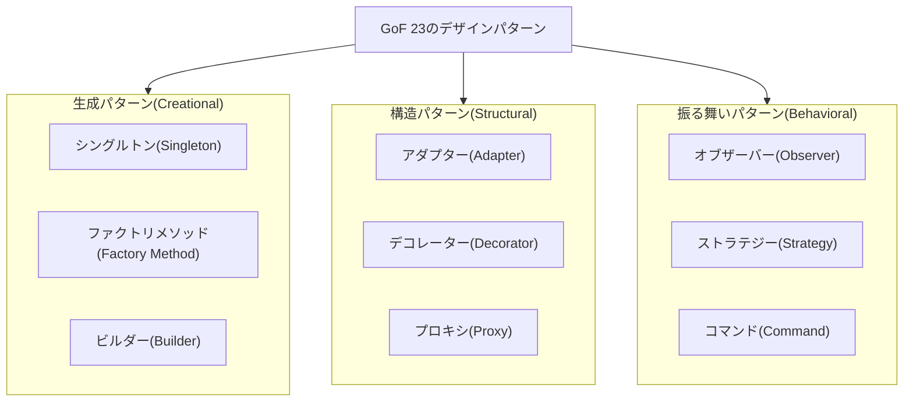
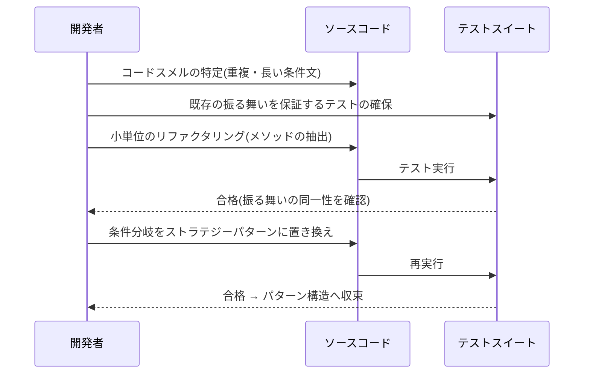

# リファクタリング（Refactoring）とデザインパターン（Design Pattern）

## 1. 概要

### A. 定義
> **リファクタリング（Refactoring）** とは、ソフトウェアの **外部的な振る舞い（機能）はそのまま維持しつつ内部構造を改善** し、理解と修正を容易にする活動であり、**デザインパターン（Design Pattern）** とは、頻繁に繰り返される設計上の問題に対する **検証済みで再利用可能な解決構造（設計テンプレート）** である。

両手法の関係を理解する鍵は、「**リファクタリングは過程（process）、デザインパターンは目標（target）**」という点にある。コードが時間の経過とともに乱雑になり、理解・修正が困難になったとき（すなわちコードスメルが蓄積したとき）、リファクタリングで内部を整理するが、その際に「どのような構造へ改善するか」という方向を示すのがデザインパターンである。マーティン・ファウラー（Martin Fowler）は著書『Refactoring』（1999年、2018年第2版）において、リファクタリングを「観察可能な振る舞いを変えずにソフトウェアの内部構造を変更し、理解しやすく修正コストを下げること」と定義したが、ここでの「振る舞いを変えない」という制約こそが、リファクタリングと一般的なコード修正（機能追加・バグ修正）を分ける決定的な基準である。

リファクタリングを進めるとコードは自然に検証済みのパターン構造へと収束し、逆にパターンを適用する行為そのものがリファクタリングとなる。実際にファウラーの著書の後半は「パターンに向けたリファクタリング（Refactoring Toward Patterns）」という観点を含んでおり、ジョシュア・ケリーエブスキー（Joshua Kerievsky）の『Refactoring to Patterns』（2004）はこのアプローチを体系化した代表的な著作である。両者の共通点はソフトウェア品質（保守性・柔軟性・再利用性）を高めることであり、相違点はリファクタリングが「**行為（改善活動）**」であるのに対し、デザインパターンは「**成果物（解決構造）**」であるという点にある。

### B. 登場背景および必要性
ソフトウェアは要求の変更によって絶えず修正される。レーマン（Lehman）のソフトウェア進化の法則が指摘するように、使用されているソフトウェアは継続的に変更圧力を受け、放置すれば構造が劣化し（software entropyの増大）、保守コストが指数関数的に増加する。新しい機能を一つ追加するたびに、絡み合った依存関係のために予期しない箇所が壊れ、最終的には「手を付けるのが怖いコード（レガシー）」となる。

こうした劣化を防ぐ二つの軸が、リファクタリングとデザインパターンである。リファクタリングは劣化したコードを漸進的に整えて変更コストを低く保つ予防的・継続的な活動であり、デザインパターンは最初から変更に強い構造を設計したり、リファクタリングの目指す方向を提供したりする語彙（vocabulary）である。特にアジャイル・DevOps環境では短いサイクルでリリースを繰り返すため、コードの健全性を常時維持するリファクタリングが継続的インテグレーション（CI）と結び付き、必須のプラクティスとして定着した。

## 2. リファクタリングの原理と手順

### A. 安全なリファクタリングの前提 — テスト
リファクタリングは機能を変えないことが大前提であるため、「機能がそのままであること」をどう保証するかが核心となる。この保証装置こそが **自動化されたテスト** である。テストがなければ、構造を直した後に振る舞いが同一であるかを確認する方法がなく、リファクタリングがそのまま潜在的なバグの混入となる。したがってファウラーは「リファクタリングの前に堅牢なテストを備えよ」と強調しており、この原則はTDD（Test-Driven Development）のRed-Green-**Refactor** サイクルにそのまま組み込まれている。

手順は、「**小さな単位でコードを直し → テストで機能がそのままであるかを確認する**」ことの繰り返しである。一度に大きく変更すると失敗時の原因追跡が難しくリスクも大きくなるため、メソッドの抽出一つ・名前の変更一つのように **原子的（atomic）なステップ** に分割し、各ステップごとにテストを実行する。失敗すれば直前のステップへ即座に戻せるため、安全性が確保される。この点で、リファクタリングはバージョン管理（構成管理）と組み合わせたときに最も効果的である。

### B. リファクタリングを促すシグナル — コードスメル（Code Smell）
リファクタリングが必要な時点を知らせる兆候が **コードスメル** である。これは「直すべき臭いがする」コードであり、それ自体はバグではないが保守を困難にする構造上の問題である。代表的なものとして、**重複コード（Duplicated Code）**、**長いメソッド（Long Method）**、**巨大なクラス（Large Class）**、**長すぎる引数リスト（Long Parameter List）**、**変更の分散（Shotgun Surgery、一つを直すために複数箇所を同時に直さなければならない）**、**機能の横恋慕（Feature Envy、他のクラスのデータを過度に参照する）** などがある。

スメルを認識したからといって、すぐにすべてを直すわけではない。ファウラーが示した実務上の規則は「**三度目に繰り返されたときにリファクタリングせよ（Rule of Three）**」であり、二度までは許容し、重複が三度目に現れたらその時点で整理するという節度あるアプローチである。これは過度な事前の抽象化を戒める実用主義であり、スメルが存在するだけで無条件に手を付けるよりも、変更が実際に頻繁な部分にリファクタリングを集中せよという意味である。

### C. 主なリファクタリング手法
最も頻繁に用いられる手法は **メソッドの抽出（Extract Method/Function）** であり、長いメソッドや重複したロジックを意味のある名前の別メソッドとして切り出す。例えば、複数の画面で重複している税額計算ロジック（コードスメル）を `calculateTax()` 一つにまとめれば、税率が変わっても一箇所だけ直せばよい。このほか、**名前の変更（Rename）** で意図を明らかにし、**クラスの抽出/分割（Extract Class）** で肥大化したクラスを責務単位に分け、**条件記述の単純化（Decompose Conditional, Replace Conditional with Polymorphism）** で複雑な分岐をポリモーフィズムに置き換える。

以下の表は代表的な手法を整理したものであるが、実務で重要なのは「どのスメルにどの手法を対応させるか」という判断である。表は参照用であり、実際にはスメル → 手法 → テストによる検証という流れを身に付けることが鍵である。

| 項目 | 内容 |
|---|---|
| **目的** | 外部的な振る舞いの維持、内部構造の改善（可読性・保守性・柔軟性） |
| **手順** | テストの確保 → 小単位（原子的）の改善 → テストによる検証 → 反復 |
| **主な手法** | メソッドの抽出、名前の変更、クラスの分割、条件記述の単純化、一時変数の除去 |
| **コードスメル** | 重複コード、長いメソッド、巨大なクラス、長すぎる引数リスト、変更の分散/機能の横恋慕 |
| **前提ツール** | 自動化テスト、構成管理（VCS）、IDEの自動リファクタリング機能 |

## 3. デザインパターン（GoF）の分類と原理

デザインパターンは、GoF（Gang of Four; Gamma, Helm, Johnson, Vlissides）が1994年の著書『Design Patterns』で整理した23個が代表的であり、目的に応じて生成・構造・振る舞いパターンに分けられる。この分類は「パターンが何を扱うか」を基準としており、各カテゴリーはそれぞれ異なる設計上の関心事に対応する。

**生成パターン（Creational）** は、オブジェクトをどのように生成・構成するかをカプセル化し、生成ロジックの変更が利用側のコードに波及しないようにする。例えば **シングルトン** はインスタンスが一つだけであることを保証し（設定マネージャー・ログなど）、**ファクトリメソッド** はどの具象クラスを生成するかをサブクラスに委譲して `new` への直接的な依存を取り除く。実務では、決済手段（カード・簡易決済・口座振替）が頻繁に追加されるシステムにおいて、ファクトリで生成部を隔離し、新たな手段の追加時に既存コードの修正を最小化する。

**構造パターン（Structural）** は、クラス・オブジェクトを組み合わせてより大きな構造を作りながら柔軟性を確保する。**アダプター** は互換性のないインターフェースをつなぎ合わせてレガシー・外部ライブラリを再利用できるようにし、**デコレーター** は継承の代わりにオブジェクトを包む（wrapping）ことで機能を動的に追加する。Java標準ライブラリの `BufferedReader(new FileReader(...))` がデコレーターの典型である。

**振る舞いパターン（Behavioral）** は、オブジェクト間の責務の分配と相互作用（アルゴリズム・通信）を扱う。**オブザーバー** は状態の変化を購読者に通知して（イベント・MVCの更新）結合度を下げ、**ストラテジー** は交換可能なアルゴリズムをカプセル化して条件文の代わりにポリモーフィズムで分岐を置き換える。特にストラテジーパターンは、前述の「条件記述をポリモーフィズムに置き換える」リファクタリングの到達点であり、リファクタリングとパターンが交わる地点をよく示している。

| 類型 | 目的 | 代表例 |
|---|---|---|
| **生成パターン** | オブジェクトの生成・構成のカプセル化 | シングルトン、ファクトリメソッド、抽象ファクトリ、ビルダー、プロトタイプ |
| **構造パターン** | オブジェクト・クラスの組み合わせによる構造構成 | アダプター、デコレーター、プロキシ、コンポジット、ファサード |
| **振る舞いパターン** | オブジェクト間の責務・相互作用・アルゴリズム | オブザーバー、ストラテジー、コマンド、ステート、テンプレートメソッド |

## 4. リファクタリングとデザインパターンの関係 — 比較および事例

二つの概念は対立するものではなく、相互に補完し合う。以下の図は、コードスメルから出発し、リファクタリングを経てパターン構造へと収束する流れを示している。

違いを生む核心は「**性格**」と「**時点**」である。リファクタリングはすでに存在するコードを対象とする事後的・連続的な改善 **活動** であり、デザインパターンは設計上の問題に対する静的な **解決構造** である。実務上の含意は次のとおりである。初期設計段階で将来を過度に予測してパターンを事前に埋め込むこと（投機的一般化）は、たいてい過剰設計につながるため、むしろ単純に始め、変更が実際に発生してスメルが表面化したときにリファクタリングで必要なパターンを導入するほうが安全である。すなわちパターンは「事前に入れるもの」ではなく、「リファクタリングによって到達するもの」に近い。

**具体的事例:** ある注文システムが送料を `if (地域 == "離島・山間部") ... else if (重量 > 20) ...` のような長い条件文で計算していたところ、プロモーション・海外配送のルールが増え続け、条件文が40行を超えたとする（長いメソッド + 繰り返される条件のスメル）。開発者はまず計算結果を検証するテストを確保したうえで、各ルールを `ShippingPolicy` インターフェースの実装クラスとして分離する（ストラテジーパターン）。その結果、新しい配送ルールを追加する際には既存の条件文に手を触れず、クラスを追加するだけでよくなり、OCP（開放閉鎖原則）を満たすようになる。この過程全体がリファクタリングであり、到達点がストラテジーパターンである。

| 区分 | リファクタリング | デザインパターン |
|---|---|---|
| **性格** | 行為（改善活動、動詞） | 成果物（解決構造、名詞） |
| **対象** | 既存コードの内部構造 | 繰り返される設計上の問題 |
| **時点** | 事後的・継続的 | 設計の語彙として常時参照 |
| **共通点** | 保守性・柔軟性・再利用性などの品質向上 | （同一） |
| **関係** | パターンを目指す方向として改善 | リファクタリングによって到達・実装 |

## 5. 深化 — 最新動向と実務適用

リファクタリング・パターンは概念そのものは成熟しているが、ツールと開発環境の変化によって実践方法が進化している。第一に、**IDEによる自動リファクタリング** が標準化され、IntelliJ IDEA・Eclipse・Visual Studioなどは名前の変更・メソッドの抽出・シグネチャの変更を安全に（参照を自動更新して）実行する。手作業によるリファクタリングのミスのリスクが大幅に減り、リファクタリングは特別なイベントではなく、コーディング中に常時行うミクロな活動となった。

第二に、**静的解析・品質ゲートとの結合** である。SonarQubeのようなツールはコードスメル・重複度・複雑度（Cyclomatic Complexity）を自動測定し、CIパイプラインの品質ゲートとして統合して、基準未達の場合はマージを遮断する。これにより、「リファクタリングをいつ行うか」という判断がデータ（スメルの指標）に基づくようになった。

第三に、**生成AIコーディングアシスタント（AIコードレビュー・リファクタリング提案）** の登場である。最近のコードアシスタントは関数単位でリファクタリング候補とパターン適用案を提案するが、AIの提案は「外部的な振る舞いの不変性」を自動的に保証できないため、依然として回帰テストがセーフティネットとして不可欠である。すなわちAIはリファクタリングの速度を高めるが、「テストに基づく検証」という原則そのものを置き換えるものではない。

第四に、**アーキテクチャレベルのリファクタリング** へと概念が拡張されている。モノリシックをマイクロサービスへ段階的に分解する際に用いられる **ストラングラーフィグ（Strangler Fig）** パターンは、大規模なリファクタリングを安全に遂行する代表的な戦略であり、既存システムを一度に置き換えるのではなく、機能単位で新しい構造が古い構造を徐々に包み込みながら置き換えていく。これは「小単位・検証の反復」というリファクタリングの原理をシステム規模へと拡張したものである。

## 6. 考慮事項および示唆（技術士の観点）

1. **テストのないリファクタリングは危険（品質のセーフティネットを優先）。** 機能の不変性を保証するには自動化されたテストが前提とならなければならず、TDDのRed-Green-Refactorと組み合わせたときに安全な継続的改善が可能となる。レガシーのようにテストのないコードは、マイケル・フェザーズの仕様化テスト（Characterization Test）で現在の振る舞いを固定してからリファクタリングに着手するのが定石である。

2. **パターンの濫用は過剰設計（節度の原則）。** 問題がないのにパターンを無理に適用すると、間接層が増えるだけで複雑さがかえって増大する。「Rule of Three」に従い、スメルが実際に繰り返されたときに必要なパターンだけを節度をもって導入し、投機的一般化（YAGNI違反）を戒めなければならない。

3. **継続的改善の文化とプロセスへの内在化。** リファクタリングを別途承認が必要な大きな作業ではなく、開発の日常的な習慣（ボーイスカウトの規則:「来たときよりもきれいにして去れ」）として定着させ、CIに静的解析・品質ゲートを統合して技術的負債（Technical Debt）を常時管理する。

4. **コスト・リスクの観点からの優先順位付け（トレードオフ）。** すべてのスメルを直すことはできないため、変更頻度が高く欠陥リスクの大きいホットスポットにリファクタリングを集中し、大規模な構造改善はストラングラーパターンのように漸進的・可逆的な方式で行い、リリースのリスクを統制する。

5. **ガバナンスと測定指標の連携。** リファクタリングの効果（複雑度の低減・欠陥率・リードタイムの改善）を指標として管理して経営陣に正当性を説明し、技術的負債の返済を正規のバックログに組み込んで持続可能なものにする。

## 参考資料
- Martin Fowler, "Refactoring", https://refactoring.com/
- Refactoring Guru — Design Patterns & Refactoring, https://refactoring.guru/
- Martin Fowler, "StranglerFigApplication", https://martinfowler.com/bliki/StranglerFigApplication.html

---

> **一言まとめ**: リファクタリングは*機能を維持しながら内部構造を改善する継続的な活動*、デザインパターンは*検証済みの設計上の解決構造*であり、コードスメルをテストに基づく小単位のリファクタリングで整理し、パターンを目指す方向として品質を高めつつ、パターンの濫用（過剰設計）は節度の原則によって戒めなければならない。
