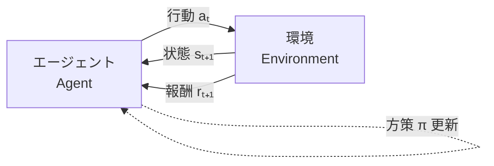
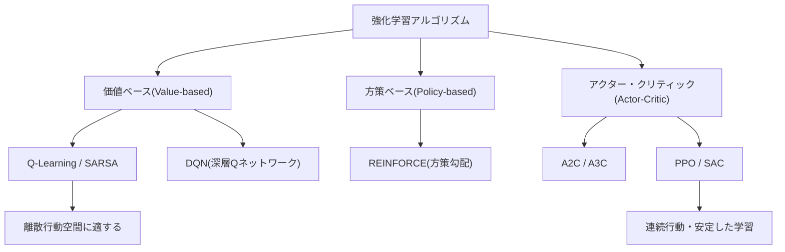

# 強化学習（Reinforcement Learning）

## 1. 概要

> **強化学習（Reinforcement Learning, RL）** とは、エージェント（Agent）が環境（Environment）と相互作用しながら試行錯誤（Trial and Error）を通じて、累積報酬（Cumulative Reward）を最大化する最適方策（Optimal Policy）を自ら学習する機械学習のパラダイムである。

教師あり学習（Supervised Learning）が「正解ラベル」を必要とし、教師なし学習（Unsupervised Learning）が「構造・パターン」を見つけるにとどまるのに対し、現実の多くの問題は、**各瞬間の正解はわからないが、最終結果の良し悪し（報酬）は判断できる** 逐次的意思決定（Sequential Decision Making）問題である。囲碁において一手一手の正解はないが勝敗は明確であり、自動運転において各瞬間の操舵角に正解はないが事故の有無は評価できる。強化学習はまさにこうした問題、すなわち「現在の選択が将来の結果に影響を及ぼす」問題を扱うために登場した。

強化学習の必要性は、大きく三つの背景に由来する。第一に、**ラベリングコストの回避** である。教師あり学習は膨大な正解データを要求するが、強化学習は環境が返す報酬シグナルだけで学習が可能であり、データ構築の負担が小さい。第二に、**動的・逐次的な環境への対応** である。ロボット制御・ゲーム・推薦・トレーディングのように時間とともに状態が変化し、以前の行動がその後の状況を変える問題では、単発の予測ではなく長期的な戦略が必要となる。第三に、**超人的性能の可能性** である。人間の経験という上限に閉じ込められる教師あり学習とは異なり、自己対局（Self-play）などによって人間を超える解を探索できる（AlphaGo・AlphaZero）。最近では大規模言語モデル（LLM）の人間の選好へのアライメント（RLHF）にまで拡張され、その実務上の重要性が急速に高まっている。

## 2. 強化学習の構成要素と相互作用構造

強化学習は **エージェント-環境の相互作用ループ** として定式化される。エージェントは現在の状態（State）を観測して行動（Action）を選択し、環境はその行動に対して次の状態と報酬（Reward）を返す。この循環が繰り返されることで、エージェントは「どの状態でどの行動が長期的に有利か」を蓄積していく。

中核となる概念を文章で説明すると次のとおりである。**状態（State）** は意思決定に必要な環境の状況の要約であり、未来が過去全体ではなく現在の状態のみに依存するという **マルコフ性（Markov Property）** を仮定する。**行動（Action）** はエージェントが取り得る選択肢であり、**報酬（Reward）** は行動の即時的な良し悪しを表すスカラーのシグナルである。ここで重要なのは、即時報酬ではなく将来の報酬を割り引いて合算した **収益（Return, Gₜ = Σ γᵏ rₜ₊ₖ）** を最大化するという点であり、**割引率（γ, 0≤γ≤1）** は将来の報酬を現在価値としてどれだけ重視するかを調整する。

エージェントの頭脳に相当するのが **方策（Policy, π）** であり、状態を行動へ写像する関数である。方策の良し悪しを評価する尺度が **価値関数（Value Function）** であり、状態の長期的価値を表す状態価値V(s)と、状態-行動の組の価値を表す行動価値Q(s,a)に分けられる。これらは **ベルマン方程式（Bellman Equation）**、すなわち「現在の価値 = 即時報酬 + 割り引かれた次状態の価値」という再帰的な関係で結ばれており、これが強化学習アルゴリズムの大半の数学的基盤となる。環境のダイナミクスをモデル化するか否かによって、モデルを学習・活用する **モデルベース（Model-based）** と、経験のみで学習する **モデルフリー（Model-free）** に区分される。

| 構成要素 | 記号 | 意味 | 例（自動運転） |
|---|---|---|---|
| 状態 | s | 環境の状況の要約 | 車線・周辺車両・速度 |
| 行動 | a | 選択可能な操作 | 加速・制動・操舵 |
| 報酬 | r | 即時的な評価シグナル | 車線維持 +1、衝突 −100 |
| 方策 | π(a\|s) | 状態→行動の写像 | 走行戦略 |
| 価値関数 | V(s), Q(s,a) | 長期的な期待収益 | 状況別の安全度評価 |
| 割引率 | γ | 将来報酬の重要度 | 0.99 |

## 3. 学習方式の分類と代表的アルゴリズム

強化学習アルゴリズムは、何を学習対象とするかによって **価値ベース（Value-based）**、**方策ベース（Policy-based）**、そして両者を組み合わせた **アクター・クリティック（Actor-Critic）** に分けられる。この分類を理解することが、すなわち強化学習の全体像を理解することである。

**価値ベースの手法** は、最適価値関数Q(s,a)をまず学習し、各状態で価値が最大となる行動を選択することで間接的に方策を導く。代表的な **Q学習** は、実際に取った行動とは無関係に最適行動を仮定して更新する **方策オフ型（Off-policy）** の手法であり、**SARSA** は実際に取った次の行動で更新する **方策オン型（On-policy）** の手法である。ここに深層ニューラルネットワークでQ関数を近似したのが2015年のDeepMindによる **DQN** であり、経験再生（Experience Replay）とターゲットネットワーク（Target Network）で学習の不安定さを緩和し、Atariのゲームで人間レベルを達成して深層強化学習（Deep RL）の幕を開けた。ただし、価値ベースは行動空間が離散的な場合に有効であり、連続的な行動（ロボット関節のトルクなど）への適用は難しい。

**方策ベースの手法** は、価値関数を経由せずに方策πを直接パラメータ化し、期待収益を高める方向へ勾配上昇（Gradient Ascent）を行う。連続行動空間と確率的方策を自然に扱えるが、勾配推定の分散が大きく学習が不安定になるという短所がある。**アクター・クリティック** はこの両者の長所を組み合わせ、行動を決定するアクター（方策）とその行動を評価するクリティック（価値関数）を併せて学習し、分散を低減する。今日の実務で最も広く用いられている **PPO（Proximal Policy Optimization）** は、方策の更新幅を制限（Clipping）することで安定性と性能をバランスよく確保しており、ChatGPTのRLHFにも採用された。

| 区分 | 価値ベース | 方策ベース | アクター・クリティック |
|---|---|---|---|
| 学習対象 | 価値関数Q | 方策π | 方策 + 価値 |
| 行動空間 | 離散 | 離散・連続 | 離散・連続 |
| 安定性 | 普通 | 低い（高分散） | 高い |
| 代表 | Q-Learning, DQN | REINFORCE | A2C, PPO, SAC |

## 4. 探索と活用のジレンマ、そして教師あり学習との比較

強化学習を貫く根本的な難題は **探索-活用のジレンマ（Exploration-Exploitation Dilemma）** である。エージェントは、すでに知っている良い行動を **活用（Exploitation）** して目先の報酬を得ようとする欲求と、より良い行動があるかを **探索（Exploration）** する必要性との間でバランスを取らなければならない。探索が不足すれば局所最適（Local Optimum）に陥り、過剰であれば学習が非効率になる。これを調整するために、一定確率εでランダムな行動を取る **ε-greedy**、不確実性の大きい行動を優遇する **UCB**、確率的サンプリングに基づく **ボルツマン探索** などが用いられる。例えば、オンライン広告推薦でε=0.1とすれば、90%はクリック率が検証済みの広告を、10%は新しい広告を表示し、長期的な収益を改善する。

強化学習が他の学習パラダイムと本質的に異なる理由は、**フィードバックの性質** にある。教師あり学習は各サンプルに即時的・直接的な正解を受け取るが、強化学習の報酬は **遅延し（Delayed）**、**評価的であり（Evaluative）**、**逐次的な相関（Correlated）** を持つ。特に「どの過去の行動が現在の報酬に寄与したのか」を解明する **信用割当問題（Credit Assignment Problem）** が核心的な難しさであり、ベルマン方程式と割引率がこれを扱う仕組みである。

| 比較軸 | 教師あり学習 | 教師なし学習 | 強化学習 |
|---|---|---|---|
| 学習シグナル | 正解ラベル | なし（構造の発見） | 報酬（遅延・評価的） |
| 目標 | 予測誤差の最小化 | パターン・クラスタリング | 累積報酬の最大化 |
| データ | 固定データセット | 固定データセット | 相互作用によって生成 |
| 代表的問題 | 分類・回帰 | クラスタリング | 逐次的意思決定 |

こうした違いのため、強化学習は **サンプル非効率性（Sample Inefficiency）** が大きいという実務上の弱点を持つ。良い方策を得るまでに数百万〜数億回の相互作用が必要となる場合があり、実際のロボットのように試行錯誤のコストが大きい環境では、シミュレーターで学習したのちに現実へ移す **Sim-to-Real** 手法と、ドメインランダム化（Domain Randomization）で現実とのギャップ（Reality Gap）を縮めるアプローチが併用される。

## 5. 深化: 最新動向と実務適用事例

**RLHFとLLMのアライメント**: 最近の強化学習で最も波及力の大きい適用は、**人間のフィードバックによる強化学習（RLHF, Reinforcement Learning from Human Feedback）** である。人間の選好比較データで報酬モデル（Reward Model）を学習し、これを報酬シグナルとしてPPOでLLMをファインチューニングし、有用性・安全性を高める。ただし、報酬モデルの構築・PPOの学習が複雑であるため、これを簡略化した **DPO（Direct Preference Optimization）** や、ルールベースの報酬を用いる **RLAIF**、検証可能な報酬で推論能力を引き上げる強化学習（数学・コーディングの正解採点に基づく）が活発に研究されている。

**産業適用事例**: Google DeepMindはデータセンターの冷却を強化学習で制御し、冷却エネルギーを約40%削減したと報告しており、物流・製造では在庫補充・工程スケジューリングの最適化に、金融ではポートフォリオのリバランスと注文執行（Execution）に適用されている。自動運転・ロボットマニピュレーションでは把持・歩行制御に、半導体・チップ設計では配置（Floorplanning）の最適化に活用された事例が発表されている。推薦システムでは、クリックのような即時的な指標ではなく、長期的な滞在・再訪問を報酬として持続可能なユーザー価値を学習する方向へと進化している。

**責任ある活用の論点**: 強化学習は「報酬を最大化する」ように設計されるため、報酬設計を誤ると意図しない抜け道を学習する **報酬ハッキング（Reward Hacking）** が発生する。例えば、ゲームでスコアだけを最大化して目標を無視したり、推薦で刺激的なコンテンツによって滞在時間だけを伸ばしたりする副作用が代表的である。したがって報酬関数の設計は、強化学習の成否を左右する工学的・倫理的な中核課題であり、制約条件を明示する **安全な強化学習（Safe RL）** が台頭している。

## 6. 考慮事項および示唆

技術士の観点から、強化学習の導入・活用においては次の点を総合的に考慮しなければならない。

- **問題適合性の判断が先行しなければならない。** 強化学習は逐次的意思決定・遅延報酬・相互作用が可能な環境で強みを持つが、単発の予測や正解データが豊富な問題には教師あり学習のほうが効率的である。「RLは万能」というアプローチを戒め、問題の構造がマルコフ決定過程（MDP）として自然に表現できるかどうかから検討しなければならない。

- **報酬設計とシミュレーターの確保が成否を左右する。** 報酬関数は組織の実際の目標（長期的価値・安全・規制遵守）を正確に反映しなければならず、報酬ハッキングを防ぐための制約・ペナルティの設計が不可欠である。また、現実での試行錯誤コストが大きいドメインでは、高品質なシミュレーターとSim-to-Real戦略、オフライン強化学習（ログデータの活用）の導入を併せて計画しなければならない。

- **サンプル効率と運用コストのトレードオフを管理しなければならない。** 深層強化学習は大規模な演算・データを要求するため、GPUインフラ・学習パイプライン・再現性確保のためのMLOps体制と連携しなければならない。モデルフリー（汎用・高コスト）とモデルベース（サンプル効率・モデル誤差のリスク）の選択は、ドメインの特性に合わせて決定する。

- **安全性・説明可能性・ガバナンスを内在化しなければならない。** 学習された方策の失敗モード（分布外への逸脱、安全違反）を事前に検証し、安全な強化学習・ヒューマン・イン・ザ・ループ（Human-in-the-loop）・ロールバック体制を備えなければならない。特に自動運転・医療・金融などの高リスクドメインでは、AIの信頼性・規制（AI基本法、責任あるAI）の要件と整合するようにガバナンスを設計しなければならない。

- **展望**: 強化学習はRLHFを媒介として生成AIのアライメント・推論強化の中核技術として定着し、オフラインRL・モデルベースRL・マルチエージェント強化学習（MARL）へと適用範囲が拡大している。自律エージェント（Agentic AI）の時代において、「長期目標に向けた自律的な意思決定」能力の根幹として、その戦略的重要性はさらに高まるであろう。

## 参考資料
- Sutton & Barto, *Reinforcement Learning: An Introduction*, 2nd ed. — http://incompleteideas.net/book/the-book-2nd.html
- OpenAI, *Spinning Up in Deep RL* — https://spinningup.openai.com/

---

> **一言まとめ**: 強化学習は、エージェントが環境との試行錯誤を通じて遅延的・評価的な報酬の累積を最大化する最適方策を学習するパラダイムであり、価値・方策・アクター・クリティック系と探索-活用のバランスを軸とし、RLHFを通じて生成AIのアライメントの中核技術として台頭している。
